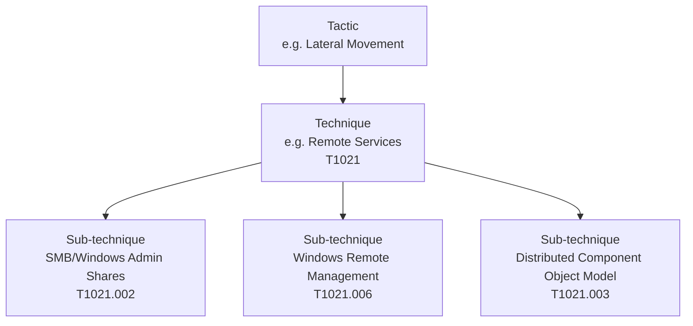
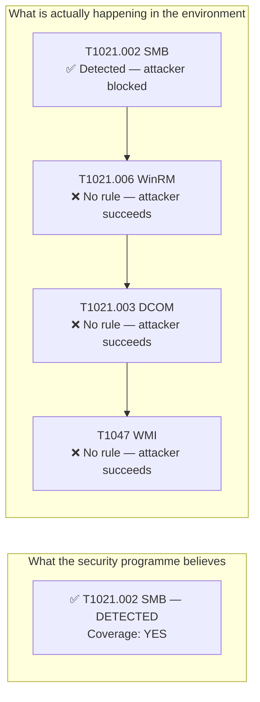
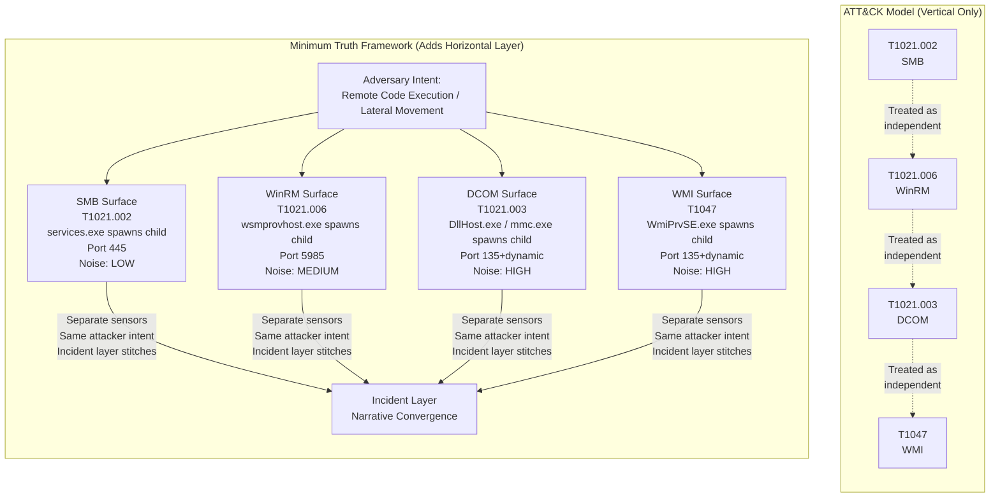
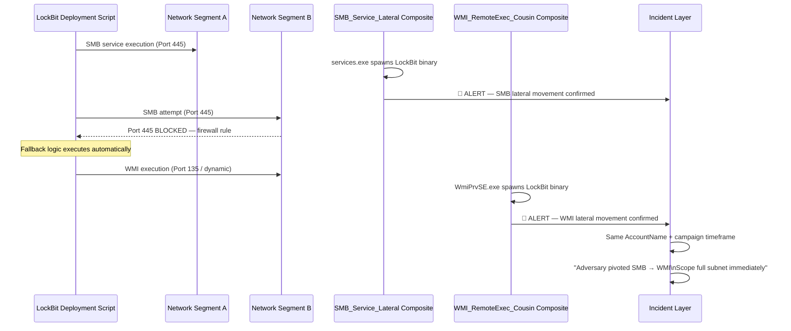
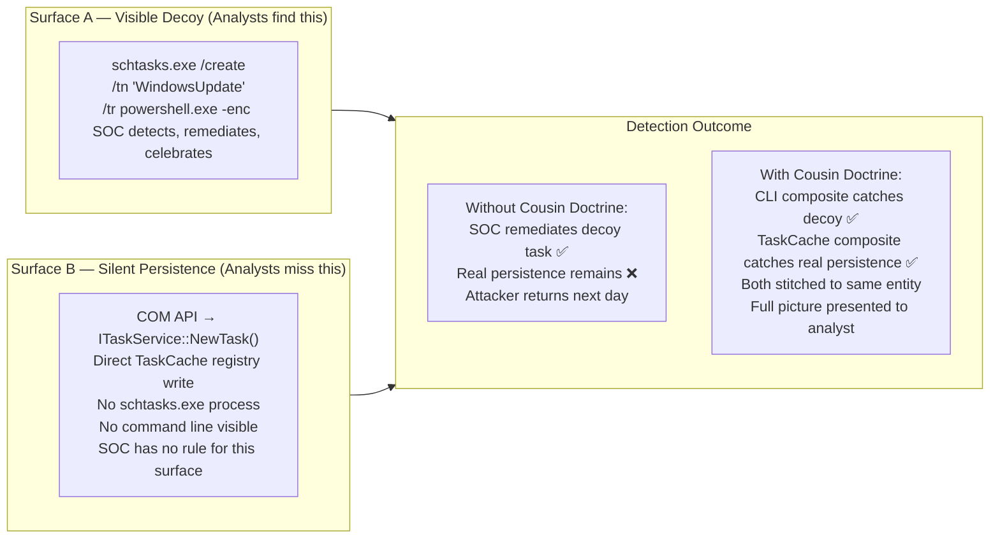
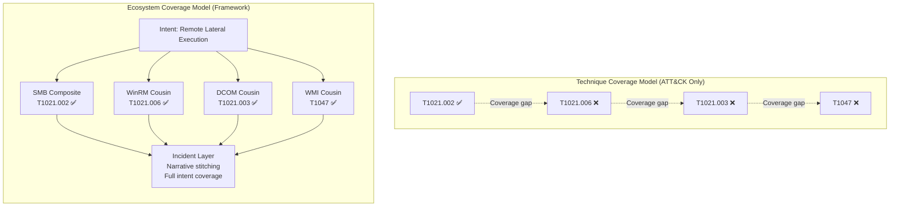
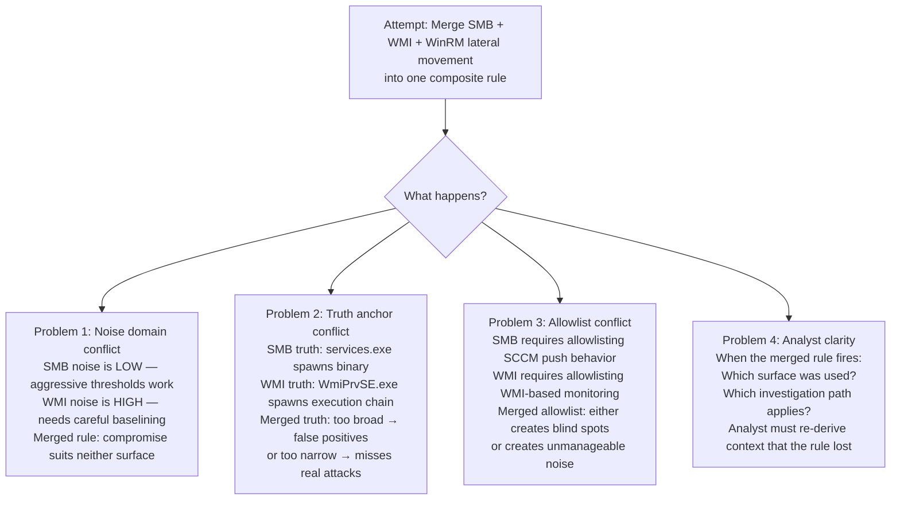
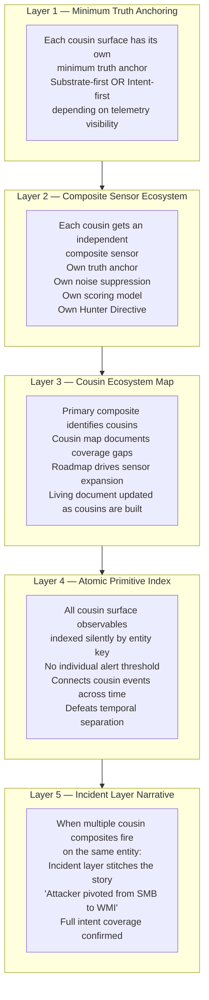
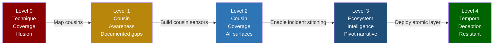

# ATT&CK Substrate Adjacency — Detection Coverage Beyond Technique Taxonomy
### *Minimum Truth Detection Framework — Foundational Doctrine*

**Author:** Ala Dabat | [github.com/azdabat](https://github.com/azdabat)  
**Framework:** Minimum Truth Detection Framework  
**Concept:** Substrate Adjacency · Cousin Technique Doctrine  
**License:** [CC BY-NC-SA 4.0](https://creativecommons.org/licenses/by-nc-sa/4.0/legalcode)  

---

> *"ATT&CK tells you what technique the attacker used.*  
> *Substrate Adjacency tells you which three techniques they will pivot to when you detect the first one."*

---

## Table of Contents

- [The Structural Gap in ATT&CK](#the-structural-gap-in-attck)
- [The Coverage Illusion](#the-coverage-illusion)
- [Substrate Adjacency — The Missing Layer](#substrate-adjacency--the-missing-layer)
- [Cousin Technique Doctrine](#cousin-technique-doctrine)
- [Real-World Adversary Pivot Behaviour](#real-world-adversary-pivot-behaviour)
- [Ecosystem Detection vs Technique Detection](#ecosystem-detection-vs-technique-detection)
- [Substrate Adjacency Across MITRE Ecosystems](#substrate-adjacency-across-mitre-ecosystems)
- [Detection Engineering Impact](#detection-engineering-impact)
- [Integration with the Minimum Truth Framework](#integration-with-the-minimum-truth-framework)
- [Coverage Maturity Model](#coverage-maturity-model)

---

## The Structural Gap in ATT&CK

MITRE ATT&CK is the most widely adopted adversary behaviour framework in enterprise security.
It provides a consistent taxonomy of techniques, maps to real threat actor behaviour, and
gives detection engineers a shared language for describing attacker actions.

But it has a structural limitation that creates systematic detection blind spots in real
enterprise environments.

**ATT&CK models attacker behaviour vertically.**



Each sub-technique is modelled as an independent unit. ATT&CK documents what attackers do on
each surface. What it does not document is the **operational relationship between surfaces** —
the reality that an adversary pivots between T1021.002, T1021.006, and T1021.003 dynamically
during the same intrusion, based on which surface their target's defences happen to block.

**ATT&CK describes techniques in isolation. Attackers exploit them as a connected ecosystem.**

---

## The Coverage Illusion

This structural gap produces what the Minimum Truth Detection Framework calls the
**Coverage Illusion** — the false confidence that detecting one technique in a family
means the attacker intent is covered.



The security programme marks lateral movement as covered. The attacker pivots through
three undetected cousin surfaces and achieves their objective.

This is not a theoretical failure mode. It is standard adversary operating procedure.
LockBit's automated deployment scripts contain explicit fallback logic — SMB first, WMI on
failure, DCOM as tertiary. Impacket operators shift between `psexec.py`, `wmiexec.py`, and
`dcomexec.py` against the same target, probing for the weakest detection baseline.

**The Coverage Illusion is the gap that sophisticated attackers are designed to exploit.**

---

## Substrate Adjacency — The Missing Layer

The Minimum Truth Detection Framework introduces **Substrate Adjacency** as the missing
horizontal layer that sits on top of ATT&CK's vertical taxonomy.

### Definition

> Substrate adjacency describes the operational reality that a single adversary objective
> can manifest across multiple operating system mechanisms — substrates — that are technically
> distinct but functionally equivalent from the attacker's perspective.

A **substrate** is the execution mechanism, protocol, or OS surface through which an
attacker achieves a goal. Different substrates for the same goal share:

- The same adversary intent
- The same MITRE tactic
- Often related MITRE techniques
- But completely different telemetry tables, noise profiles, and detection logic



---

## Cousin Technique Doctrine

Within the Minimum Truth Detection Framework, substrate-adjacent techniques are formalised
as **Cousin Techniques** — a structured concept with specific architectural implications for
how detection rules are built, organised, and deployed.

### Definition

> Cousin techniques are ATT&CK techniques or sub-techniques that represent the same
> adversary intent executed on different system substrates. They share an attack goal
> but differ in their telemetry surface, noise domain, and truth anchor — requiring
> separate, purpose-built detection sensors.

### The Three Properties of a Cousin Relationship

**Property 1 — Shared Intent, Different Surface**

The adversary goal is identical. The execution mechanism is different. An attacker who
achieves lateral movement via WMI has accomplished exactly the same thing as an attacker
who used SMB. The defensive outcome is the same. The detection logic is completely different.

**Property 2 — Different Noise Domain**

Each cousin surface has a distinct operational noise profile in enterprise environments.
`services.exe` spawning child processes is relatively rare — this surface can support
aggressive detection thresholds. `WmiPrvSE.exe` spawning processes is common in managed
environments — this surface requires careful baselining and higher reinforcement requirements.

Merging cousins into one rule forces a compromise between the noise profiles of both surfaces.
The result is either too noisy to use or too restrictive to catch real attacks.

**Property 3 — Different Truth Anchors**

Each cousin surface requires a different minimum truth anchor — the non-negotiable baseline
event that confirms the technique is real on that surface.

| Surface | Minimum Truth Anchor | Table |
|---------|---------------------|-------|
| SMB lateral movement | `services.exe` spawning an uncommon child binary | DeviceProcessEvents |
| WinRM lateral movement | `wsmprovhost.exe` spawning a command interpreter | DeviceProcessEvents |
| DCOM lateral movement | `DllHost.exe` or `mmc.exe` spawning anomalous child | DeviceProcessEvents |
| WMI lateral movement | `WmiPrvSE.exe` spawning execution chain | DeviceProcessEvents |
| TaskCache persistence | `RegistryValueSet` under `Schedule\TaskCache` | DeviceRegistryEvents |
| CLI task persistence | `schtasks.exe /create` with dangerous `/tr` | DeviceProcessEvents |

These are not the same event. They cannot share a truth anchor. They cannot be one rule.

---

## Real-World Adversary Pivot Behaviour

Cousin technique exploitation is not theoretical — it is standard operating procedure for
sophisticated threat actors. The following case studies demonstrate observed adversary
behaviour that the Cousin Technique Doctrine is specifically designed to address.

### Case Study 1 — LockBit Lateral Movement Fallback Chain



**What a monolithic rule produces:**

A rule requiring `services.exe spawn + inbound SMB` fires on Segment A and goes completely
silent on Segment B when LockBit's fallback loop switches to WMI. The attacker achieves
full fleet deployment on Segment B with zero detection.

**What the Cousin Technique Doctrine produces:**

Two independent sensors fire on their respective truth anchors. The incident layer stitches
both to the same `AccountName` and timeframe. The narrative becomes: *"Adversary attempted
SMB lateral movement, encountered resistance, pivoted to WMI cousin surface."* The pivot
is not a defence — it is a data point.

### Case Study 2 — Hafnium Silent Persistence Chain

Hafnium used two cousin persistence surfaces simultaneously during Exchange server
operations — visible CLI task creation as a decoy mechanism alongside silent TaskCache
registry manipulation as the actual persistence:



### Case Study 3 — Cobalt Strike Credential Access Fallback

```
Attempt 1: LSASS memory dump via comsvcs.dll
  → MDE blocks memory access → Alert fires
  → Attacker abandons surface

Attempt 2: DCSync via replication rights abuse
  → No LSASS touched → Different telemetry surface
  → Legacy rules based on LSASS access: SILENT

Attempt 3: Kerberoasting via TGS request volume
  → No LSASS, no replication → Third telemetry surface
  → Rules anchored on previous surfaces: SILENT
```

Three techniques. Same credential access goal. The attacker succeeds on the second or third
attempt because detections are anchored on technique rather than intent.

---

## Ecosystem Detection vs Technique Detection

This is the central architectural shift that substrate adjacency enables.

```
Traditional detection engineering asks:
  "Do we detect T1021.002?"

Ecosystem detection asks:
  "Do we detect the intent of lateral remote code execution
   across all surfaces an attacker might use?"
```



**The shift in measurement:**

| Model | Coverage Metric | Attacker Response |
|-------|----------------|------------------|
| Technique coverage | "We detect T1021.002" | Pivot to T1021.006 |
| Ecosystem coverage | "We detect lateral movement intent across all surfaces" | No undetected pivot available |

---

## Substrate Adjacency Across MITRE Ecosystems

The following table maps the major MITRE attack ecosystems to their substrate-adjacent
cousin techniques. This is the practical output of applying the Cousin Technique Doctrine
to ATT&CK — a horizontal layer that sits on top of the vertical taxonomy.

### Lateral Movement Ecosystem

| Primary Surface | MITRE | Cousin Surfaces | MITRE | Shared Intent |
|----------------|-------|-----------------|-------|---------------|
| SMB Admin Share | T1021.002 | WinRM, DCOM, WMI | T1021.006, T1021.003, T1047 | Remote code execution |
| PsExec / SC Remote | T1021.002 | AT Scheduler, Scheduled Task | T1053.005 | Remote execution + persistence |
| Pass-the-Hash | T1550.002 | Pass-the-Ticket, Overpass-the-Hash | T1550.003 | Credential replay |

### Persistence Ecosystem

| Primary Surface | MITRE | Cousin Surfaces | MITRE | Shared Intent |
|----------------|-------|-----------------|-------|---------------|
| schtasks.exe CLI | T1053.005 | TaskCache COM API, Register-ScheduledTask | T1053.005 | Persistent execution |
| Registry Run Key | T1547.001 | ActiveSetup, AppInit DLLs, Winlogon | T1547.014, T1546.010 | Logon persistence |
| SC.exe Service | T1543.003 | Registry ImagePath API, PowerShell New-Service | T1543.003 | Service persistence |
| WMI Subscription | T1546.003 | COM Hijack, IFEO, DLL Sideload | T1546.015, T1546.012 | Execution persistence |

### Execution Ecosystem

| Primary Surface | MITRE | Cousin Surfaces | MITRE | Shared Intent |
|----------------|-------|-----------------|-------|---------------|
| PowerShell -enc | T1059.001 | mshta VBScript, WScript JScript, cscript | T1059.005, T1059.007 | Script execution |
| rundll32 proxy | T1218.011 | regsvr32, mshta, certutil, bitsadmin | T1218.010, T1218.005 | LOLBin execution |
| WMI fileless | T1546.003 | PowerShell ScriptBlock, DCOM execution | T1059.001, T1021.003 | Fileless execution |

### Credential Access Ecosystem

| Primary Surface | MITRE | Cousin Surfaces | MITRE | Shared Intent |
|----------------|-------|-----------------|-------|---------------|
| LSASS dump | T1003.001 | DCSync replication, SAM extract | T1003.006, T1003.002 | Credential harvest |
| Kerberoasting | T1558.003 | AS-REP Roasting, Silver Ticket | T1558.004, T1558.002 | Kerberos abuse |
| NTDS extract | T1003.003 | VSS shadow copy, reg save SYSTEM | T1003.003, T1003.002 | Domain credential harvest |

### Defense Evasion Ecosystem

| Primary Surface | MITRE | Cousin Surfaces | MITRE | Shared Intent |
|----------------|-------|-----------------|-------|---------------|
| fltmc minifilter unload | T1562.001 | WinDefend stop, Sense stop, exclusion add | T1562.001 | EDR blinding |
| BYOVD driver | T1068, T1543.003 | Process injection into EDR, token impersonation | T1055, T1134 | Security product defeat |
| AMSI bypass | T1562.001 | ETW patching, script block bypass | T1562.001 | Detection evasion |

---

## Detection Engineering Impact

### The Four Questions Every Composite Rule Must Answer

The Cousin Technique Doctrine mandates that every detection composite explicitly answers
four questions before it is published:

```
1. What is the attack surface being detected?
   (The substrate — SMB, WinRM, TaskCache, etc.)

2. What is the minimum truth anchor on this surface?
   (The non-negotiable event that proves the technique exists here)

3. What cousin surfaces share the same adversary intent?
   (The adjacent surfaces the attacker will pivot to)

4. What cousin composites must exist to cover those surfaces?
   (The detection gap that must be addressed next)
```

Failure to answer Question 4 means the detection programme has a known blind spot. The
Cousin Technique Doctrine makes that blind spot explicit and trackable rather than invisible.

### Why Cousins Cannot Be Merged

A common engineering instinct is to combine cousin detection into a single "catch-all" rule.
This always fails for one or more of the following reasons:



**The architectural principle:**

> One truth anchor per rule. One noise domain per rule. One investigation path per rule.
> Cousins are separate sensors. The incident layer provides the unified story.

---

## Integration with the Minimum Truth Framework

Substrate adjacency is not a standalone concept — it is architecturally integrated across
every layer of the Minimum Truth Detection Framework.



### How the Framework Extends ATT&CK

```
ATT&CK provides:     Technique taxonomy → "What did the attacker do?"
Framework adds:      Substrate adjacency → "What will the attacker do next?"
Framework adds:      Cousin detection   → "Are we covered when they pivot?"
Framework adds:      Ecosystem coverage → "Is our intent coverage complete?"
Framework adds:      Narrative layer    → "What is the full attack story?"
```

ATT&CK and the Minimum Truth Detection Framework are **complementary, not competing**.
ATT&CK is the behaviour catalogue. The framework is the coverage architecture that sits
on top of it.

---

## Coverage Maturity Model

The following maturity model provides a measurable framework for assessing detection
coverage quality at the ecosystem level rather than the technique level.

### Levels

**Level 0 — Technique Coverage**  
Individual technique detections exist. No cousin mapping. Coverage confidence is an illusion.
Attackers pivot freely between adjacent surfaces.

**Level 1 — Cousin Awareness**  
Cousin techniques are identified and documented. Primary composites exist. Cousin gaps are
known. Coverage is partially real — primary surface caught, cousins still blind spots.

**Level 2 — Cousin Coverage**  
Primary composites AND cousin composites are deployed. All major surfaces in each ecosystem
have independent sensors. Attacker pivots produce alerts. Coverage confidence is real.

**Level 3 — Ecosystem Intelligence**  
Cousin composites fire independently and stitch through the incident layer. Attacker pivot
behaviour surfaces as a narrative: *"Adversary pivoted from SMB to WMI."* The pivot is
detected and documented. Coverage is adversary-intent complete.

**Level 4 — Temporal Deception Resistance**  
Atomic primitive index captures cousin observables across 30 days. Patient attacker
behaviour that separates cousin technique usage across days or weeks is connected at the
incident layer. No time-windowed technique correlation can defeat this coverage.



---

## Summary

```
ATT&CK models attacker behaviour vertically:
  Tactic → Technique → Sub-technique

The Coverage Illusion occurs when:
  One technique is detected → tactic marked as covered
  Adjacent cousin techniques remain blind spots

Substrate Adjacency adds horizontal modelling:
  Same adversary intent → multiple execution surfaces
  Each surface is a substrate cousin

The Cousin Technique Doctrine requires:
  Separate sensors per cousin surface
  Explicit cousin gap documentation
  Incident layer narrative stitching

The result:
  Detection coverage measured by adversary intent
  Not by technique taxonomy
  No undetected pivot surfaces available
  Attacker agility matched by framework agility
```

> **ATT&CK answers:** *"What techniques do attackers use?"*  
> **Substrate Adjacency answers:** *"What adjacent surfaces will they pivot to when detected?"*  
> **Cousin Technique Doctrine answers:** *"Are our sensors deployed on every surface they can pivot to?"*  
> **Ecosystem Detection answers:** *"Is our coverage adversary-intent complete?"*

---

**Full living cousin discovery journal:**  
[Cousin_Discovery_Log.md](https://github.com/azdabat/Production-READY-Composite-Threat-Hunting-Rules/blob/main/Cousin_Discovery_Log.md)

**Full ecosystem roadmap and MITRE coverage matrix:**  
[Live MITRE Coverage Matrix](https://azdabat.github.io/Minimum-Truth-Detection-Framework-ADX-Validated-Composite-Rules/MITRE-MATRIX.html)

**Full detection architecture doctrine:**  
[Architecture Doctrine](https://github.com/azdabat/Minimum-Truth-Detection-Framework-ADX-Validated-Composite-Rules/blob/main/ARCHITECTURE_DOCTRINE.md)

---

*Part of the Minimum Truth Detection Framework*  
*Author: Ala Dabat | [github.com/azdabat](https://github.com/azdabat)*  
*Licensed under [CC BY-NC-SA 4.0](https://creativecommons.org/licenses/by-nc-sa/4.0/legalcode)*
