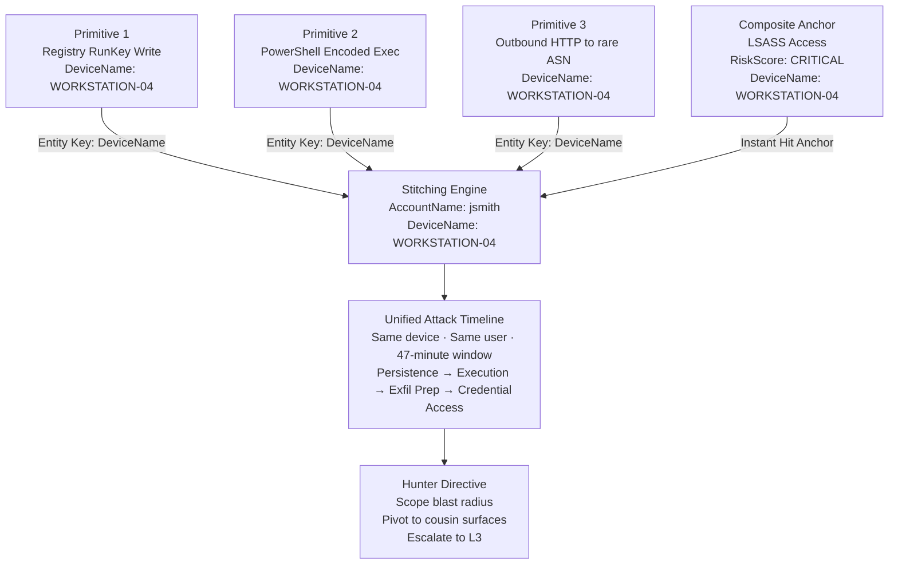
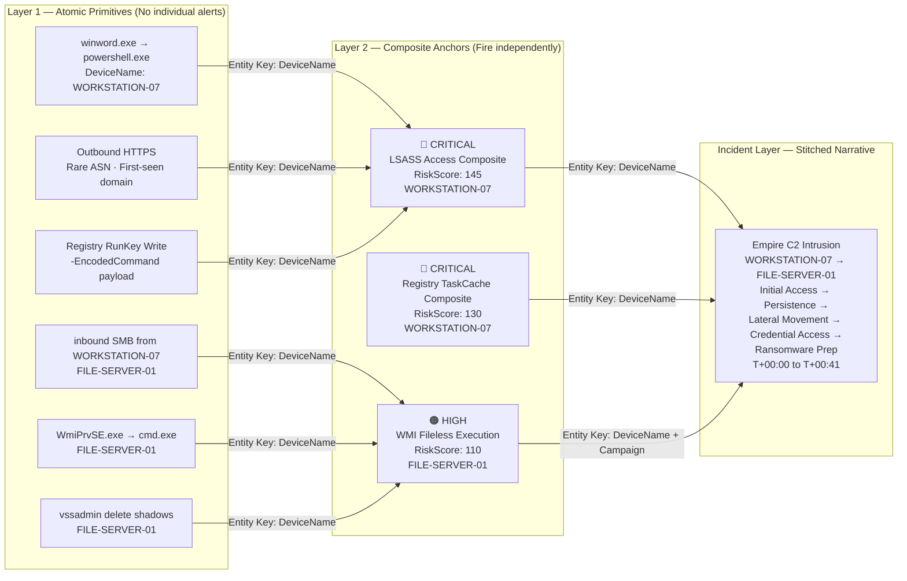
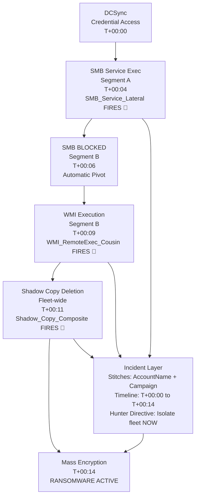
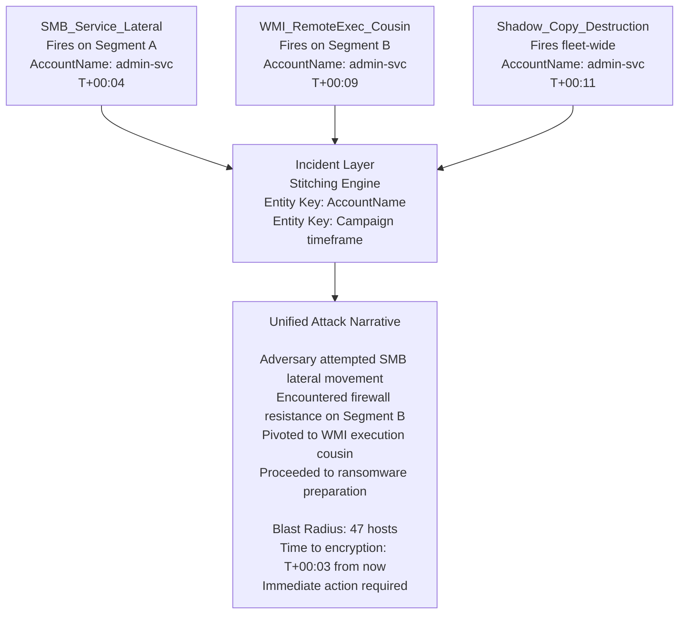

# Attack Ecosystem Intelligence — Primitive Stitching & Incident Narrative Architecture

> **"The rule is the sensor. The incident is the narrative."**
>
> This document completes the Minimum Truth Detection Framework by formalising how atomic primitives
> stitch into attack stories, how cousin surfaces are exploited by real threat actors, and how
> the framework mirrors adversary agility to build a Tier 3 Fusion SOC architecture.

---

## Table of Contents

- [The Two-Layer Fusion Architecture](#the-two-layer-fusion-architecture)
- [Primitive Stitching — How Sensors Build Attack Stories](#primitive-stitching--how-sensors-build-attack-stories)
- [Entity Keys — The Stitching Mechanism](#entity-keys--the-stitching-mechanism)
- [Attack Story Walkthrough — Empire C2 Lateral Movement](#attack-story-walkthrough--empire-c2-lateral-movement)
- [Attack Story Walkthrough — LockBit Ransomware Deployment](#attack-story-walkthrough--lockbit-ransomware-deployment)
- [Cousin Surface Exploitation — Real-World Threat Actor Behaviour](#cousin-surface-exploitation--real-world-threat-actor-behaviour)
- [Why Monolithic Kill-Chain Rules Fail Against This](#why-monolithic-kill-chain-rules-fail-against-this)
- [How the Framework Counters Adversary Agility](#how-the-framework-counters-adversary-agility)

---

## The Two-Layer Fusion Architecture

The Minimum Truth Detection Framework operates across two structurally distinct but
complementary layers. Together they form a complete Tier 3 Fusion SOC architecture.

```
┌─────────────────────────────────────────────────────────────────────────────┐
│                     FUSION SOC ARCHITECTURE                                 │
├──────────────────────────────┬──────────────────────────────────────────────┤
│   LAYER 1                    │   LAYER 2                                    │
│   Atomic Sentinel Layer      │   Behavioural Composite Layer                │
│   (Primitive Stitching)      │   (Narrative Anchor)                         │
├──────────────────────────────┼──────────────────────────────────────────────┤
│  Wide, low-cost sensors      │  Deep, high-fidelity composites              │
│  Do not alert individually   │  Validate Minimum Truth + score context      │
│  Indexed by Entity Key       │  Fire as Instant Hit Anchors                 │
│  Build automated timelines   │  Trigger active threat hunting               │
│  Catch what composites miss  │  Anchor the narrative                        │
└──────────────────────────────┴──────────────────────────────────────────────┘
```

### Layer 1 — The Atomic Sentinel Layer

Atomic primitives are **wide, low-noise, low-cost sensors** that do not individually justify
an alert. They observe single-surface behavioural events and index them against an entity key.

They answer one question: **did this observable exist?**

Individually they are noise. Collectively — mapped to the same entity across time — they
become an undeniable attack timeline.

### Layer 2 — The Behavioural Composite Layer

Behavioural composites are **deep, high-fidelity detections** built on Minimum Truth anchors.
When a composite fires, it acts as an **Instant Hit Anchor** — a confirmed, scored, actionable
signal that a specific attack technique is structurally real.

The composite anchor triggers the hunter to pivot outward into the atomic primitive timeline
surrounding it, sweeping cousin attack surfaces and reconstructing the full attack story.

> **The composite proves the technique.**
> **The primitives tell the story around it.**

---

## Primitive Stitching — How Sensors Build Attack Stories

### What Is a Primitive?

A primitive is the **smallest observable unit of attacker behaviour** — a single telemetric
event that, in isolation, carries insufficient signal to alert. Primitives only gain meaning
when stitched together across time, entity, and attack surface.

```
Primitive alone     →  Too noisy to alert
Primitive + Anchor  →  Context unlocked
Primitive + Primitive + Anchor  →  Attack story emerging
Multiple Primitives + Composite Anchor  →  Incident confirmed
```

### Primitive Types

| Primitive Type | Example Event | Table | Signal Alone |
|----------------|---------------|-------|--------------|
| Execution Primitive | `powershell.exe` spawned | `DeviceProcessEvents` | Low |
| Persistence Primitive | Registry key written under `\Run` | `DeviceRegistryEvents` | Low |
| Network Primitive | Outbound connection to rare ASN | `DeviceNetworkEvents` | Low |
| Identity Primitive | Sign-in from new country | `SigninLogs` | Medium |
| File Primitive | Executable dropped to `\AppData\` | `DeviceFileEvents` | Low |
| Credential Primitive | LSASS opened by non-AV process | `DeviceEvents` | High |

> A credential primitive touching LSASS is the exception — it is high enough signal to surface
> alone. Most primitives are not. The framework treats them accordingly.

---

## Entity Keys — The Stitching Mechanism

Primitives are stitched into narratives using **Entity Keys** — shared identifiers that allow
the correlation engine to map events from different telemetry surfaces to the same attacker
session or campaign.

### Primary Entity Keys

```
DeviceName          →  Host-level stitching
AccountName         →  Identity-level stitching
DeviceId            →  Hardware-level stitching
InitiatingProcessId →  Process-level stitching (PID)
SHA256              →  Artefact-level stitching (file hash)
RemoteIP / ASN      →  Infrastructure-level stitching
```

### How Stitching Works in Practice



### The KQL Stitching Pattern

This is how atomic primitives are collected and surfaced as a unified timeline:

```kql
// ATOMIC PRIMITIVE COLLECTOR — Entity Key: DeviceName + AccountName
// Surfaces low-signal events that individually do not alert
// Designed to feed the narrative layer, not to fire independently

let EntityKey_Device   = "WORKSTATION-04";     // Injected from composite anchor context
let EntityKey_Account  = "jsmith";             // Injected from composite anchor context
let StitchWindow       = 2h;                   // Lookback window from composite anchor timestamp
let AnchorTime         = datetime(2026-05-20T10:32:00Z);  // Composite anchor timestamp

// --- PRIMITIVE 1: Execution Surface ---
let P_Execution =
    DeviceProcessEvents
    | where Timestamp between ((AnchorTime - StitchWindow) .. (AnchorTime + 30m))
    | where DeviceName =~ EntityKey_Device or AccountName =~ EntityKey_Account
    | where FileName in~ ("powershell.exe","pwsh.exe","cmd.exe","wscript.exe","cscript.exe","mshta.exe","rundll32.exe")
    | project Timestamp, Layer="Execution", DeviceName, AccountName,
              Event = strcat(FileName, " → ", ProcessCommandLine),
              MITRE = "T1059/T1218";

// --- PRIMITIVE 2: Persistence Surface ---
let P_Persistence =
    DeviceRegistryEvents
    | where Timestamp between ((AnchorTime - StitchWindow) .. (AnchorTime + 30m))
    | where DeviceName =~ EntityKey_Device or AccountName =~ EntityKey_Account
    | where RegistryKey has_any (@"\Run", @"\RunOnce", @"Schedule\TaskCache", @"CurrentControlSet\Services")
    | project Timestamp, Layer="Persistence", DeviceName, AccountName,
              Event = strcat("RegWrite: ", RegistryKey, " → ", RegistryValueData),
              MITRE = "T1547/T1053";

// --- PRIMITIVE 3: Network Surface ---
let P_Network =
    DeviceNetworkEvents
    | where Timestamp between ((AnchorTime - StitchWindow) .. (AnchorTime + 30m))
    | where DeviceName =~ EntityKey_Device
    | where RemoteIPType == "Public"
    | where InitiatingProcessFileName in~ ("powershell.exe","pwsh.exe","cmd.exe","rundll32.exe","mshta.exe")
    | project Timestamp, Layer="Network", DeviceName, AccountName,
              Event = strcat(InitiatingProcessFileName, " → ", RemoteIP, ":", RemotePort),
              MITRE = "TA0011";

// --- PRIMITIVE 4: File Surface ---
let P_File =
    DeviceFileEvents
    | where Timestamp between ((AnchorTime - StitchWindow) .. (AnchorTime + 30m))
    | where DeviceName =~ EntityKey_Device or AccountName =~ EntityKey_Account
    | where FolderPath matches regex @"(?i)\\(AppData|Temp|Public|ProgramData)\\"
    | where FileName endswith_cs ".exe" or FileName endswith_cs ".dll" or FileName endswith_cs ".ps1"
    | project Timestamp, Layer="File Drop", DeviceName, AccountName,
              Event = strcat("Drop: ", FolderPath, "\\", FileName),
              MITRE = "T1105";

// --- STITCH AND SURFACE THE TIMELINE ---
union P_Execution, P_Persistence, P_Network, P_File
| order by Timestamp asc
| project Timestamp, Layer, DeviceName, AccountName, Event, MITRE
```

> This pattern is deliberately **not an alert**. It is an automated hunting pivot — executed
> by the analyst the moment a composite anchor fires, to reconstruct the attack story
> surrounding the confirmed technique.

---

## Attack Story Walkthrough — Empire C2 Lateral Movement

### Scenario

Empire C2 operator compromises a user workstation via a phishing document, establishes
persistence, moves laterally to a file server, and attempts credential harvesting.

### The Attack Timeline

```
T+00:00  Phishing document opened — winword.exe spawns powershell.exe
T+00:03  PowerShell encodes and executes Empire stager via -EncodedCommand
T+00:05  Empire beacon established — outbound HTTPS to rare ASN (first-seen domain)
T+00:12  Registry RunKey written — persistence established silently
T+00:18  SMB lateral movement attempted to FILE-SERVER-01 via services.exe
T+00:22  LSASS memory accessed by Empire process — credential harvest
T+00:31  Encoded PowerShell blocked on FILE-SERVER-01 — attacker pivots to WMI
T+00:34  WmiPrvSE.exe spawns cmd.exe on FILE-SERVER-01 — WMI execution cousin
T+00:41  Shadow copy deletion attempted — ransomware prep signal
```

### How the Framework Catches This



### What Each Layer Contributed

| Layer | What Fired | What It Proved |
|-------|-----------|----------------|
| Primitive | `winword.exe → powershell.exe` | Suspicious parent chain (not an alert alone) |
| Primitive | Outbound HTTPS to rare ASN | Possible C2 beacon (not an alert alone) |
| **Composite** | **LSASS Access — CRITICAL** | **Credential access structurally confirmed** |
| **Composite** | **Registry TaskCache — CRITICAL** | **Silent persistence structurally confirmed** |
| Primitive | `vssadmin delete shadows` | Ransomware prep enrichment |
| **Composite** | **WMI Fileless — HIGH** | **Cousin execution surface confirmed** |
| **Incident** | **Stitched narrative across both hosts** | **Full intrusion timeline reconstructed** |

> The attacker pivoted from SMB to WMI when they hit detection resistance.
> Because both cousin sensors fired independently, the framework caught both.
> A monolithic kill-chain rule anchored on SMB would have gone silent at `T+00:31`.

---

## Attack Story Walkthrough — LockBit Ransomware Deployment

### Scenario

LockBit operator uses automated deployment scripts with built-in cousin surface fallback.
SMB service execution is attempted first. Upon hitting firewall resistance, the script
automatically pivots to WMI execution. Ransomware payload reaches the fleet.

### The Cousin Pivot Sequence

```
T+00:00  Domain admin credentials obtained via DCSync
T+00:04  LockBit deployment script executed — SMB service exec attempted (Port 445)
T+00:06  SMB blocked on Segment B hosts — deployment script detects failure
T+00:07  Script automatically pivots — WMI execution loop initiated (Port 135)
T+00:09  WmiPrvSE.exe spawns LockBit payload on Segment B hosts
T+00:11  vssadmin delete shadows /all — executed across fleet
T+00:12  bcdedit /set recoveryenabled No — executed across fleet
T+00:14  Mass file encryption begins — ransomware active
```

### Why Legacy Rules Fail Here

```
❌  Legacy monolithic rule:
    services.exe spawns uncommon binary
    AND inbound SMB from lateral source
    AND file drop to writable path
    → REQUIRED: all three conditions on same host

    When LockBit pivots to WMI on Segment B:
    services.exe condition → NOT MET
    Rule score → NULL
    Detection → MISSED
```

```
✅  Minimum Truth Framework:
    SMB_Service_Lateral composite  →  Fires on Segment A hosts
    WMI_RemoteExec_Cousin          →  Fires independently on Segment B hosts
    Shadow_Copy_Destruction        →  Fires fleet-wide
    Incident layer stitches:       →  Same AccountName, same timeframe, cousin surfaces
    Hunter Directive:              →  "Adversary pivoted from SMB to WMI — scope blast radius"
```

### The Incident Narrative



---

## Cousin Surface Exploitation — Real-World Threat Actor Behaviour

Adversaries use cousin attack surfaces for two primary strategic reasons:

```
1. Defense Redundancy    — If one surface is blocked, execution continues via cousin
2. Execution Segmentation — Different techniques deployed across different network tiers
```

They rarely fire cousin surfaces simultaneously on the same host. Instead they deploy them
**sequentially** or **across different architectural tiers**, ensuring that if one defensive
control isolates one sensor substrate, operational access survives elsewhere.

---

### Cousin Pair 1 — Persistence: Silent TaskCache vs CLI Scheduled Tasks

**Surfaces:** `Registry TaskCache Write (COM/API)` vs `schtasks.exe /create (CLI)`

**How It Happens in the Wild**

Advanced loaders drop primary persistence directly via Registry TaskCache keys using native
API manipulation — leaving no command-line trail. Legacy SOC teams monitoring `schtasks.exe`
see nothing.

As a backup or verification mechanism, the malware spawns a noisy secondary standard
Scheduled Task via CLI on a separate low-value staging machine. If analysts find and delete
the obvious CLI task, they celebrate a successful remediation — completely missing the silent
TaskCache persistence on the primary server.

**Real-World Threat Actors**

| Actor / Malware | Behaviour |
|----------------|-----------|
| **Hafnium (APT)** | Direct registry manipulation to create silent TaskCache persistence on Exchange servers while using standard tasks for staging |
| **GootLoader** | Registry key modification for hidden execution surfaces combined with native scheduled tasks for secondary script block triggering |

**Framework Response**

```
Registry_Persistence_Background_Service_TaskCache  →  Catches the silent COM persistence
ScheduledTask_CLI_Execution composite              →  Catches the noisy CLI cousin
Incident layer stitches on AccountName + DeviceName →  Both surfaces mapped to same actor
Hunter Directive: "Silent persistence confirmed — CLI task was the decoy"
```

---

### Cousin Pair 2 — Lateral Movement: SMB Service Exec vs WMI Remote Process

**Surfaces:** `services.exe (PsExec/RPC over 445)` vs `WmiPrvSE.exe (WMI over 135/Dynamic)`

**How It Happens in the Wild**

During active intrusion, threat actors attempt lateral movement via SMB service creation
(PsExec-style). They encounter segment-level firewall rules blocking Port 445, or high-fidelity
behavioural rules targeting `services.exe` spawning uncommon binaries. They instantly pivot
to the cousin execution substrate — WMI execution via `wmic process call create` or WinRM.

The core malicious intent is identical. The telemetry anchor shifts entirely from
`DeviceProcessEvents` targeting service installation keys to WMI subscription and
remote process creation schemas.

**Real-World Threat Actors**

| Actor / Malware | Behaviour |
|----------------|-----------|
| **LockBit & BlackCat (ALPHV)** | Automated deployment scripts with explicit fallback logic — SMB first, WMI on failure, DCOM as tertiary |
| **Impacket Framework** | Operators shift seamlessly from `psexec.py` to `wmiexec.py` or `dcomexec.py` against the same target to probe which substrate has weaker detection baseline |

**Framework Response**

```
SMB_Service_Lateral composite     →  Fires when SMB execution succeeds
WMI_RemoteExec_Cousin composite   →  Fires independently when WMI cousin activates
WinRM_Exec_Cousin composite       →  Fires if tertiary cousin is used
Incident layer stitches on AccountName + timeframe →  Full lateral movement story
Hunter Directive: "Adversary pivoted through cousin surfaces — scope full subnet"
```

---

### Cousin Pair 3 — Execution: PowerShell Intent vs LOLBin Proxy Chains

**Surfaces:** `powershell.exe -enc` vs `rundll32.exe / regsvr32.exe / mshta.exe`

**How It Happens in the Wild**

A malicious loader script attempts to spin up an in-memory PowerShell execution chain. Local
AMSI controls or block rules targeting encoded PowerShell command lines trip local sensors.
The malware switches to a trusted Windows binary as an execution proxy — wrapping the payload
into a DLL and invoking it via `rundll32.exe` or parsing a remote script via `mshta.exe`.

The underlying intent is identical: execute a remote stager. The noise domain shifts from
script engine telemetry to trusted system binary proxy telemetry.

**Real-World Threat Actors**

| Actor / Malware | Behaviour |
|----------------|-----------|
| **Qakbot / IcedID** | Attachment macros attempt command-line interpreter execution, then immediately pass to tangled `rundll32.exe`, `regsvr32.exe`, `mshta.exe` chains splitting telemetric visibility |
| **Cobalt Strike Beacon** | Native substrate-switching architecture — PowerShell cradle, service-wrapped binary, DLL side-load, or process injection thread switched on the fly based on encountered defences |

**Framework Response**

```
PowerShell_Intent_Composite       →  Catches encoded/IEX/WebRequest primitives
TrustedParent_LOLBin_Chain        →  Catches the cousin LOLBin execution surface
Both share intent: remote stager execution
Incident layer stitches on DeviceName + timeframe →  Unified execution story
Hunter Directive: "AMSI evasion detected — pivot to process injection surface"
```

---

### Cousin Pair 4 — Credential Access: LSASS Dump vs DCSync vs Kerberoasting

**Surfaces:** `LSASS memory access` vs `Replication rights abuse` vs `TGS ticket requests`

**How It Happens in the Wild**

An operator attempts LSASS credential harvesting using Mimikatz. MDE blocks the suspicious
memory read. The operator pivots to DCSync — abusing replication rights to pull domain hashes
without touching LSASS at all. If DCSync triggers on anomalous replication from a non-DC,
they fall back to Kerberoasting — requesting service ticket hashes offline.

Three completely different telemetry anchors, same adversary goal: domain credential access.

**Real-World Threat Actors**

| Actor / Malware | Behaviour |
|----------------|-----------|
| **APT29 / Cozy Bear** | Documented use of all three credential access surfaces across different phases of the same campaign, rotating based on defensive resistance encountered |
| **Mimikatz / Rubeus** | Toolkits explicitly designed to switch credential extraction method based on available privileges and observed defensive controls |

**Framework Response**

```
LSASS_Access_Composite         →  Fires on memory access attempt
DCSync_Replication_Composite   →  Fires on non-DC replication request
Kerberoasting_TGS_Composite    →  Fires on unusual RC4 TGS requests
All map to same identity entity →  AccountName / DeviceName
Incident layer: credential access ecosystem fully covered regardless of pivot
```

---

## Why Monolithic Kill-Chain Rules Fail Against This

```
❌  The monolithic approach forces attackers to follow your script:

    "Attack must include:
     → SMB file drop
     → service.exe creation
     → process execution from dropped path
     → all within 15 minutes
     → on the same host"

    When LockBit pivots to WMI at step 2:
    Rule dependency broken → Score: NULL → Detection: MISSED
    When Cobalt Strike switches from PowerShell to rundll32:
    Rule dependency broken → Score: NULL → Detection: MISSED
    When attacker moves LSASS access to DCSync:
    Rule dependency broken → Score: NULL → Detection: MISSED
```

Monolithic rules create **structural blind spots** that sophisticated actors deliberately exploit.
Their deployment toolkits contain cousin-surface fallback logic for exactly this reason.

---

## How the Framework Counters Adversary Agility

The Minimum Truth Detection Framework mirrors the exact behavioural agility of a human
attacker rather than forcing them to follow a static vendor script.

### Ecosystem-Pure Isolation

Each composite is deployed as a **clean, independent sensor**:

```
SMB_Service_Lateral        →  Truth anchor: services.exe spawning uncommon binary
WMI_RemoteExec_Cousin      →  Truth anchor: WmiPrvSE.exe spawning execution chain
WinRM_Exec_Cousin          →  Truth anchor: wsmprovhost.exe spawning execution chain
```

These sensors **do not share brittle query logic**. They remain highly focused on their
individual truth anchors. When an attacker executes a cousin fallback sequence, both distinct
sensors fire independently.

### The Incident Layer Delivers the Story



### The Structural Superiority

```
Legacy rule thinks in:    SEQUENCE  (A then B then C on same host)
Attacker operates in:     SURFACES  (A or B or C across any reachable host)

Minimum Truth thinks in:  TRUTH     (what must be structurally real on ANY surface)
Cousin doctrine covers:   INTENT    (same goal, different substrate, separate sensor)
Incident layer stitches:  NARRATIVE (same actor, multiple surfaces, unified story)
```

> Because threat groups and malware frameworks actively use cousin attack domains as fallback
> layers, hardcoded join-dependent kill chains fail completely.
>
> The Minimum Truth Framework counters this through ecosystem-pure isolation — each cousin
> surface has its own clean sensor, its own truth anchor, and its own scoring logic.
> When an attacker pivots, a different sensor catches them.
> The incident layer maps both to the same entity and builds the story regardless of which
> surfaces were used.

---

## Summary

```
Atomic Primitive    =  Single observable unit — indexed, not alerted
Composite Anchor    =  Confirmed technique truth — scored, alerted, directs hunting
Entity Key          =  The stitching mechanism — maps events to the same actor
Cousin Surface      =  Adjacent execution substrate — same intent, separate sensor
Incident Layer      =  Narrative engine — stitches primitives and composites into story
```

**The attacker is agile. The framework is agile.**
**The attacker switches surfaces. The framework has a sensor on every surface.**
**The attacker tries to break your kill chain. The framework has no kill chain to break.**

---

*Part of the Minimum Truth Detection Framework*
*Author: Ala Dabat | [github.com/azdabat](https://github.com/azdabat)*
*Licensed under [CC BY-NC-SA 4.0](https://creativecommons.org/licenses/by-nc-sa/4.0/legalcode)*
