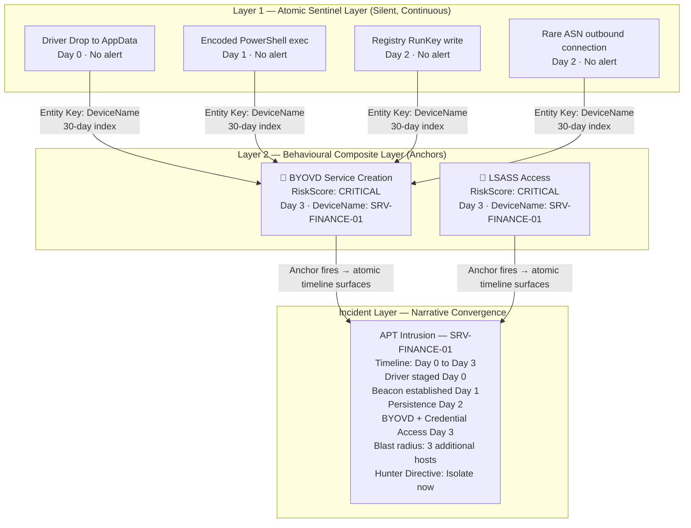
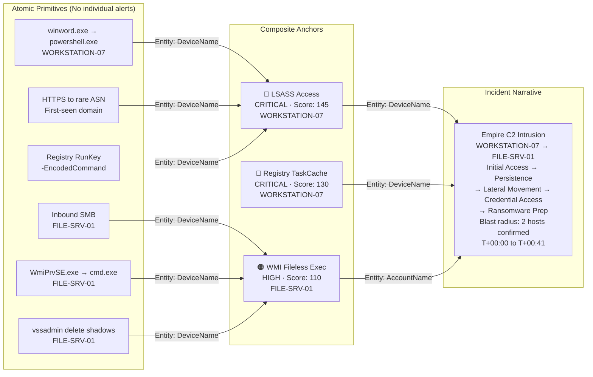
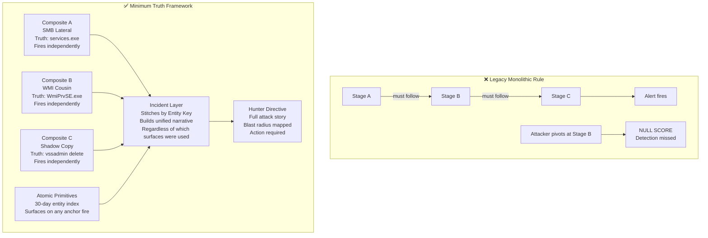

# Minimum Truth Detection Framework — Architecture Doctrine

**Author:** Ala Dabat | [github.com/azdabat](https://github.com/azdabat)  
**License:** [CC BY-NC-SA 4.0](https://creativecommons.org/licenses/by-nc-sa/4.0/legalcode)  
**Validated Against:** ADX-Docker · Empire C2 Telemetry · Atomic Red Team  

---

> *"The rule is the sensor. The incident is the narrative.*  
> *The framework has no kill chain to break — because it never built one."*

---

## Table of Contents

- [Executive Summary — The Plight of the Monolithic Query](#executive-summary--the-plight-of-the-monolithic-query)
- [Core Doctrine — The Minimum Truth Funnel](#core-doctrine--the-minimum-truth-funnel)
- [Defeating Temporal Deception — The Hybrid Architecture](#defeating-temporal-deception--the-hybrid-architecture)
- [The Two-Layer Fusion Architecture](#the-two-layer-fusion-architecture)
- [Primitive Stitching — How Sensors Build Attack Stories](#primitive-stitching--how-sensors-build-attack-stories)
- [Entity Keys — The Stitching Mechanism](#entity-keys--the-stitching-mechanism)
- [Attack Story — Empire C2 Lateral Movement](#attack-story--empire-c2-lateral-movement)
- [Attack Story — LockBit Ransomware Cousin Pivot](#attack-story--lockbit-ransomware-cousin-pivot)
- [BYOVD Deep Dive — SilverFox / ValleyRat as a Composite Example](#byovd-deep-dive--silverfox--valleyrat-as-a-composite-example)
- [Cousin Surface Exploitation — Real-World Threat Actor Behaviour](#cousin-surface-exploitation--real-world-threat-actor-behaviour)
- [Why Monolithic Kill-Chain Rules Fail](#why-monolithic-kill-chain-rules-fail)
- [How the Framework Counters Adversary Agility](#how-the-framework-counters-adversary-agility)

---

## Executive Summary — The Plight of the Monolithic Query

### The Problem That Built This Framework

Most detection engineers write rules the same way. They identify an attack chain, model each
stage as a join condition, and wire the stages together inside a single query. The result is
a Monolithic Kill-Chain Rule — and it is fundamentally broken at scale.

Here is what happens in production:

```
Traditional monolithic query structure:

  SELECT *
  FROM raw_telemetry
  WHERE stage_A occurs
    AND stage_B follows within 15 minutes
    AND stage_C follows stage_B within 10 minutes
    AND all events share the same host

Reality:
  → 100,000 endpoint estate
  → DeviceProcessEvents: 500M+ rows per day
  → Cross-table joins on raw data → query timeout
  → Attacker delays stage_B by 3 days → join window missed → null result
  → Attacker switches from SMB to WMI → join condition broken → null result
  → Detection: missed
```

The industry's standard response is to clone the rule — one variant per execution surface,
one variant per time window, one variant per attacker tool. The rule library grows. The noise
grows with it. Analyst trust collapses.

### The Three Root Causes of Failure

**Sequence Dependency.** Monolithic rules require attackers to follow a specific order of
operations. Real adversaries do not. They probe defences, encounter resistance, and adapt.
A lateral movement rule that expects SMB then service creation then process execution produces
a null score the moment the attacker pivots to WMI.

**Temporal Dependency.** Rules that force events to occur within a fixed time window fail
against adversaries who deliberately weaponise time. C2 frameworks implement jitter — random
delays between beacon callbacks that ensure no two hosts produce identical timing patterns.
BYOVD staging is deliberately split across days: the vulnerable driver is dropped quietly,
the service is created much later after the environment has been verified safe.

**Scale Dependency.** Joining raw telemetry tables at enterprise scale destroys query
performance. A join between `DeviceProcessEvents` and `DeviceNetworkEvents` on a 100,000
endpoint estate consumes enormous compute and frequently times out — leaving the detection
infrastructure silent precisely when it needs to fire.

### The Solution This Framework Provides

Filter before you join. Enrich natively. Score contextually. Separate sensors from narratives.

```
Monolithic rule:  one query, many dependencies, fails when any condition is missing
Minimum Truth:    one truth per sensor, scored independently, stitched at the incident layer
```

The framework replaces sequence dependency with **truth anchoring**. It replaces temporal
dependency with **hybrid layer architecture**. It replaces scale dependency with **zero-join
enrichment and pre-summarised safe joins**.

---

## Core Doctrine — The Minimum Truth Funnel

### The Central Principle

Every attack technique has a non-negotiable baseline event — the single thing that must
structurally be true for the attack to be possible. If that condition is not met, the attack
is not real. This is the Minimum Truth.

```
Minimum Truth → Reinforcement → Scoring → Hunter Directive
```

The Minimum Truth is not the full detection. It is the irreducible anchor on which the
detection is built. Everything else is reinforcement — optional signals that increase
confidence and score. Reinforcement strengthens truth. It does not define it.

### The Two Anchoring Strategies

#### Substrate-First Minimum Truth

A detection anchored on the execution substrate itself — without requiring proof of
malicious intent at the minimum truth layer.

> *"Did this execution surface exist?"*

Substrate-first is the correct strategy when the execution infrastructure itself is the
signal — when there is no command-line argument to inspect, no file path to evaluate, no
intent visible at the observable layer. The substrate IS the minimum truth.

**The canonical example is WMI fileless execution.**

In a WMI Permanent Event Subscription attack, an adversary registers a malicious
`ActiveScriptEventConsumer`. When triggered, `scrcons.exe` loads a script engine DLL —
`vbscript.dll`, `jscript.dll`, or `scrobj.dll` — directly into process memory. There is no
child process. There is no command-line argument. There is no file written to disk.

The only observable truth is:

```kql
DeviceImageLoadEvents
| where InitiatingProcessFileName =~ "scrcons.exe"
| where FileName in~ ("vbscript.dll", "jscript.dll", "scrobj.dll")
```

`scrcons.exe` loading a script engine DLL is the irreducible minimum. You cannot go further
left in the kill chain. Attempting to anchor on intent before the substrate is confirmed
produces either a ghost chain or a missed detection. **Substrate first. Reinforcement second.**

**A second example: VirtualAlloc in PowerShell script block logging.**

```kql
DeviceEvents
| where ActionType == "PowerShellScriptBlock"
| where AdditionalFields has "VirtualAlloc"
```

`VirtualAlloc` called inside a PowerShell script block is the minimum truth that in-memory
execution capability is being prepared. The payload may be encoded, obfuscated, or remotely
sourced — intent is not yet visible. The substrate execution is the only reliable anchor.

#### Intent-First Minimum Truth

A detection anchored on a malicious execution primitive — a specific action that structurally
implies attacker capability, not merely the presence of the execution surface.

> *"Did this substrate perform an action that implies attacker capability?"*

```kql
// PowerShell intent-first — the primitive implies capability
DeviceProcessEvents
| where FileName in~ ("powershell.exe", "pwsh.exe")
| where ProcessCommandLine has_any (
    "Invoke-WebRequest", "DownloadString", "FromBase64String",
    "IEX", "Add-Type", "-EncodedCommand"
)
```

PowerShell execution is common. PowerShell performing in-memory execution, payload decoding,
or remote retrieval is not. The primitive implies capability — raising base confidence before
any reinforcement is applied.

| | Substrate-First | Intent-First |
|---|---|---|
| **Anchor** | Execution surface | Malicious primitive |
| **When to use** | No visible intent (WMI, BYOVD, injection) | High-volume substrate with clear capability signals |
| **Noise** | Higher — requires reinforcement | Lower — primitive raises base confidence |
| **Tier** | L1 Sensor / Atomic | L2 Composite |

### The Three Pillars of the Minimum Truth Funnel

**Filter Before You Join.**  
Never join two raw tables. Reduce the primary table to its most critical subset — the truth —
before asking for any context. A query that filters `DeviceRegistryEvents` to three specific
key paths before joining a pre-summarised prevalence table runs in seconds on a 100k estate.
The same query joining raw `DeviceProcessEvents` times out.

**Native Enrichment Over Joins.**  
Modern EDR schemas contain implicit context. `DeviceRegistryEvents` already carries
`InitiatingProcessFileName`, `InitiatingProcessSHA256`, `InitiatingProcessSigner`, and
`InitiatingProcessVersionInfoCompanyName`. Mapping these native fields eliminates the need
for a `DeviceProcessEvents` join entirely — zero memory pressure, full process context.

**Contextual Scoring, Not Binary Alerts.**  
Once truth is established, route surviving data through a convergence matrix. Assign a
cumulative risk score. Never alert on a binary threshold. This prevents dangerous truths
from being suppressed when a safe signal is present and prevents noise from being elevated
when a dangerous signal is absent.

```
BaseScore (Truth Anchor)      =  55
+ TaskCache Artefact          = +25
+ Dangerous Primitive         = +25
+ Base64 Payload              = +20
+ User-Writable Path          = +15
+ Untrusted Writer            = +10
+ Rare Writer (Prevalence)    = +10
─────────────────────────────────
FinalScore                    = 160  →  CRITICAL
```

---

## Defeating Temporal Deception — The Hybrid Architecture

### How Adversaries Weaponise Time

Sophisticated threat actors understand that detection rules have time windows. They exploit
this deliberately — separating attack stages across time to ensure no single detection window
captures the full chain.

**C2 Jitter and Beacon Randomisation**

C2 frameworks implement sleep jitter — random delays applied to beacon callback intervals.
A Cobalt Strike beacon configured with 60-second sleep and 50% jitter produces callback
intervals between 30 and 90 seconds. Across a fleet of 50 compromised hosts, no two hosts
produce identical timing signatures. Rules that look for consistent beaconing patterns produce
false negatives by design.

More critically: an operator conducting hands-on-keyboard activity on a compromised host may
go silent for 12, 24, or 72 hours between activity bursts. A composite rule with a 2-hour
correlation window misses the connection between the initial access event and the lateral
movement that follows three days later.

**Delayed BYOVD Staging**

Bring Your Own Vulnerable Driver attacks are deliberately staged across multiple sessions:

```
Session 1 (Day 0):
  → Malicious loader drops vulnerable .sys driver to AppData path
  → No service created. No execution. Quiet.
  → Composite rule: 48h window — nothing to correlate against

Session 2 (Day 3):
  → Operator returns, verifies environment is clean
  → Service created for vulnerable driver
  → BYOVD rootkit activated — security product tampered
  → Credential harvest begins

Monolithic kill-chain rule requires Day 0 + Day 3 events in same window:
  → Window: missed
  → Detection: null
```

The driver drop on Day 0 is the primitive. The service creation on Day 3 is the composite
anchor. Without a layer that silently indexes the Day 0 event against the entity key, the
composite fires with no historical context and the connection to the initial staging is lost.

### The Hybrid Architecture Solution

The framework addresses temporal deception through two complementary layers that operate
simultaneously and independently.

```
┌─────────────────────────────────────────────────────────────────────────────────┐
│                       HYBRID DETECTION ARCHITECTURE                             │
├────────────────────────────────────┬────────────────────────────────────────────┤
│  LAYER 1: ATOMIC SENTINEL          │  LAYER 2: BEHAVIOURAL COMPOSITE            │
│  (The Net)                         │  (The Anchor)                              │
├────────────────────────────────────┼────────────────────────────────────────────┤
│  Continuous silent logging         │  High-fidelity minimum truth detection     │
│  No individual alert threshold     │  Fires as Instant Hit Anchor               │
│  30-day rolling entity index       │  Immediate triage playbook output          │
│  Catches what composites miss      │  Triggers pivot into atomic timeline       │
│  Temporal deception resistant      │  Localized time window (2h–48h)            │
│  Full Atomic Red Team corpus       │  Scored convergence model                  │
└────────────────────────────────────┴────────────────────────────────────────────┘

When composite fires:
  → Analyst receives HunterDirective + RiskScore
  → Atomic layer surfaces 30-day entity timeline automatically
  → Slow-rolling APT staging artefacts become visible
  → Connection between Day 0 driver drop and Day 3 rootkit activation confirmed
```

**Why both layers are required:**

A composite alone misses the Day 0 staging — it has no context for what happened before the
trigger window. An atomic layer alone produces too much noise to act on — no anchor to
determine which entity timelines matter. Together, the composite provides the anchor and the
atomic layer provides the story around it.

---

## The Two-Layer Fusion Architecture



---

## Primitive Stitching — How Sensors Build Attack Stories

### What Is a Primitive?

A primitive is the smallest observable unit of attacker behaviour — a single telemetric event
that carries insufficient signal to alert in isolation. Primitives gain meaning only when
stitched together across time, entity, and attack surface against a composite anchor.

```
Primitive alone                      →  Too noisy to alert on
Primitive + Composite Anchor         →  Context unlocked — investigate
Multiple Primitives + Anchor         →  Attack story emerging
Multiple Primitives + Multiple Anchors →  Incident confirmed — act now
```

### Primitive Types

| Primitive Type | Example Event | Telemetry Table | Signal Alone |
|----------------|---------------|-----------------|--------------|
| Execution | `powershell.exe` spawned by `winword.exe` | `DeviceProcessEvents` | Low |
| Persistence | Registry `\Run` key written | `DeviceRegistryEvents` | Low |
| Network | Outbound to first-seen ASN | `DeviceNetworkEvents` | Low |
| Identity | Sign-in from new country | `SigninLogs` | Medium |
| File | Executable dropped to `\AppData\` | `DeviceFileEvents` | Low |
| Driver Staging | `.sys` file written to writable path | `DeviceFileEvents` | Medium |
| Credential | LSASS accessed by non-AV process | `DeviceEvents` | High |
| Image Load | Script engine DLL loaded into `scrcons.exe` | `DeviceImageLoadEvents` | High |

> The credential and image load primitives carry sufficient signal to surface alone in most
> environments. Most primitives do not. The framework treats them accordingly — indexing them
> silently until a composite anchor provides the context to make them meaningful.

---

## Entity Keys — The Stitching Mechanism

Primitives are stitched into narratives using **Entity Keys** — shared identifiers that allow
the correlation engine to map events across different telemetry surfaces to the same attacker
session or campaign.

### Primary Entity Keys

```
DeviceName          →  Host-level stitching
AccountName         →  Identity-level stitching
DeviceId            →  Hardware-level stitching (tamper-resistant)
InitiatingProcessId →  Process-session stitching (PID — use with caution, reuse risk)
SHA256              →  Artefact-level stitching (file / binary identity)
RemoteIP / ASN      →  Infrastructure-level stitching (C2 attribution)
```

### The KQL Primitive Collector

This pattern is the atomic layer in action — executed automatically when a composite fires,
to reconstruct the entity timeline surrounding the confirmed technique:

```kql
// ATOMIC PRIMITIVE COLLECTOR
// Triggered by composite anchor context injection
// Not an alert — a hunting pivot that surfaces the surrounding story

let EntityKey_Device  = "SRV-FINANCE-01";           // Injected from composite anchor
let EntityKey_Account = "svc-backup";               // Injected from composite anchor
let AnchorTimestamp   = datetime(2026-05-20T14:22:00Z); // Composite fire time
let LookbackWindow    = 30d;                        // Full atomic history
let ForwardWindow     = 2h;                         // Post-anchor activity

// --- Execution Primitives ---
let P_Execution =
    DeviceProcessEvents
    | where Timestamp between ((AnchorTimestamp - LookbackWindow) .. (AnchorTimestamp + ForwardWindow))
    | where DeviceName =~ EntityKey_Device or AccountName =~ EntityKey_Account
    | where FileName in~ ("powershell.exe","pwsh.exe","cmd.exe","wscript.exe",
                          "cscript.exe","mshta.exe","rundll32.exe","regsvr32.exe")
    | project Timestamp, Layer="Execution",
              Event = strcat(FileName, " | parent: ", InitiatingProcessFileName, " | ", ProcessCommandLine),
              MITRE = "T1059/T1218";

// --- Persistence Primitives ---
let P_Persistence =
    DeviceRegistryEvents
    | where Timestamp between ((AnchorTimestamp - LookbackWindow) .. (AnchorTimestamp + ForwardWindow))
    | where DeviceName =~ EntityKey_Device
    | where RegistryKey has_any (@"\Run", @"\RunOnce", @"Schedule\TaskCache",
                                  @"CurrentControlSet\Services")
    | project Timestamp, Layer="Persistence",
              Event = strcat("RegWrite: ", RegistryKey, " → ", RegistryValueData),
              MITRE = "T1547/T1053";

// --- Driver Staging Primitives (BYOVD) ---
let P_DriverStaging =
    DeviceFileEvents
    | where Timestamp between ((AnchorTimestamp - LookbackWindow) .. (AnchorTimestamp + ForwardWindow))
    | where DeviceName =~ EntityKey_Device
    | where FileName endswith ".sys" or FileName endswith ".dat"
    | where FolderPath matches regex @"(?i)\\(AppData|Temp|Public|ProgramData|Users)\\"
    | project Timestamp, Layer="Driver Staging (BYOVD)",
              Event = strcat("Drop: ", FolderPath, "\\", FileName, " | by: ", InitiatingProcessFileName),
              MITRE = "T1543.003/T1068";

// --- Network Primitives ---
let P_Network =
    DeviceNetworkEvents
    | where Timestamp between ((AnchorTimestamp - LookbackWindow) .. (AnchorTimestamp + ForwardWindow))
    | where DeviceName =~ EntityKey_Device
    | where RemoteIPType == "Public"
    | where InitiatingProcessFileName in~ ("powershell.exe","pwsh.exe","rundll32.exe","mshta.exe","svchost.exe")
    | project Timestamp, Layer="Network",
              Event = strcat(InitiatingProcessFileName, " → ", RemoteIP, ":", RemotePort, " (", RemoteUrl, ")"),
              MITRE = "TA0011";

// --- File Drop Primitives ---
let P_FileDrop =
    DeviceFileEvents
    | where Timestamp between ((AnchorTimestamp - LookbackWindow) .. (AnchorTimestamp + ForwardWindow))
    | where DeviceName =~ EntityKey_Device
    | where FolderPath matches regex @"(?i)\\(AppData|Temp|Public|ProgramData)\\"
    | where FileName endswith ".exe" or FileName endswith ".dll" or FileName endswith ".ps1"
    | project Timestamp, Layer="File Drop",
              Event = strcat("Drop: ", FolderPath, "\\", FileName, " SHA256: ", SHA256),
              MITRE = "T1105";

// --- STITCH AND SURFACE THE UNIFIED TIMELINE ---
union P_Execution, P_Persistence, P_DriverStaging, P_Network, P_FileDrop
| order by Timestamp asc
| project Timestamp, Layer, Event, MITRE
```

> This query is not an alert. It is an automated hunting pivot — executed the moment a
> composite anchor fires, to reconstruct the full entity story around the confirmed technique.

---

## Attack Story — Empire C2 Lateral Movement

### Scenario

Empire C2 operator compromises a user workstation via a phishing document, establishes
persistence, moves laterally to a file server, and harvests credentials.

### The Attack Timeline

```
T+00:00  winword.exe spawns powershell.exe — phishing document executes
T+00:03  PowerShell -EncodedCommand → Empire stager loaded in memory
T+00:05  Beacon established — outbound HTTPS to first-seen domain / rare ASN
T+00:12  Registry RunKey written — persistence established silently
T+00:18  SMB lateral movement → services.exe creates remote service on FILE-SRV-01
T+00:22  LSASS memory accessed by Empire process on WORKSTATION-07
T+00:31  Encoded PowerShell blocked on FILE-SRV-01 — attacker pivots
T+00:34  WmiPrvSE.exe spawns cmd.exe on FILE-SRV-01 — WMI execution cousin
T+00:41  vssadmin delete shadows — ransomware preparation signal
```

### Framework Detection Map



> At T+00:31 the attacker pivoted from SMB to WMI. A monolithic kill-chain rule anchored on
> SMB service creation went silent. The WMI cousin composite fired independently and the
> incident layer stitched both surfaces to the same actor. The pivot was not a defence — it
> was a data point.

---

## Attack Story — LockBit Ransomware Cousin Pivot

### Scenario

LockBit automated deployment script attempts SMB service execution, encounters firewall
resistance on a network segment, and automatically pivots to WMI execution.

### The Pivot Sequence

```
T+00:00  Domain admin credentials obtained via DCSync
T+00:04  LockBit script initiates — SMB service exec across fleet (Port 445)
T+00:06  Port 445 blocked on Segment B — deployment script detects failure code
T+00:07  Script automatically executes WMI fallback loop (Port 135/dynamic)
T+00:09  WmiPrvSE.exe spawns LockBit payload across Segment B
T+00:11  vssadmin delete shadows /all — fleet-wide
T+00:12  bcdedit /set recoveryenabled No — fleet-wide
T+00:14  Mass encryption begins
```

### Why the Monolithic Rule Failed

```
❌  Legacy rule requires:
      services.exe spawns uncommon binary (Segment B)
      AND inbound SMB from lateral source
      AND file drop to writable path

    LockBit pivots to WMI at T+00:07:
      services.exe condition → NOT MET on Segment B
      Rule score → NULL
      Detection → MISSED
      Encryption begins undetected
```

### Why the Framework Succeeded

```
✅  SMB_Service_Lateral composite      → Fires on Segment A hosts (Port 445 succeeded)
    WMI_RemoteExec_Cousin composite    → Fires independently on Segment B hosts
    Shadow_Copy_Destruction composite  → Fires fleet-wide
    Incident layer stitches on AccountName + campaign timeframe:

    "Adversary attempted SMB lateral movement (Segment A confirmed).
     Encountered firewall resistance on Segment B.
     Pivoted to WMI execution cousin.
     Ransomware preparation now fleet-wide.
     Blast radius: 47 hosts.
     Estimated time to encryption: 3 minutes.
     IMMEDIATE ISOLATION REQUIRED."
```

---

## BYOVD Deep Dive — SilverFox / ValleyRat as a Composite Example

### What BYOVD Is and Why It Requires Special Treatment

Bring Your Own Vulnerable Driver (BYOVD) is one of the most technically sophisticated
persistence and defence evasion strategies in the current threat landscape. It works by
dropping a legitimately signed but intentionally vulnerable kernel driver, creating a service
to load it, and then exploiting the known vulnerability to gain kernel-level execution —
bypassing endpoint protection products entirely.

The challenge for detection engineering is temporal separation. BYOVD attacks deliberately
split across multiple sessions:

```
Session 1:  Signed loader binary dropped to writable path — no execution, no alert
            Vulnerable .sys driver dropped alongside loader — quiet staging
            Attacker goes silent

Session 2 (hours or days later):
            Service created for vulnerable driver — rootkit activated
            Security product tampered — fltmc unload / WinDefend stopped
            Credential harvest begins
            Exfiltration staging
```

A composite rule with a 48h window catches the same-session case. The atomic primitive layer
catches the cross-session case — the Day 0 driver staging surfaces when the Day 3 service
creation composite fires.

### The Original Rule and Its Structural Problem

The original SilverFox/ValleyRat hunt (see repository) was written as a multi-join monolithic
query. It works correctly in controlled lab telemetry. Against a live sophisticated actor, it
has three vulnerabilities:

```
Problem 1: Time window dependency
  All joins are bounded within 1h–4h of the initial sideload event.
  An actor who stages the driver on Day 0 and activates on Day 3 produces a null result.

Problem 2: Sequence dependency
  The rule requires sideloading to be the entry point that all other events join against.
  An actor who activates via a different initial vector and then performs DLL sideloading
  is missed entirely.

Problem 3: Single-table truth mixing
  Execution, file, registry, and process events are all joined against the same sideload
  anchor — creating a monolithic dependency chain rather than independent sensors.
```

### The Framework-Compliant Refactored Architecture

The SilverFox/ValleyRat kill chain should be split into three independent composites, each
with its own minimum truth anchor, plus one atomic primitive collector for temporal stitching.

```
Composite 1:  DLL_Sideload_SignedLoader     →  Truth: signed binary loaded DLL from writable path
Composite 2:  BYOVD_Driver_Activation       →  Truth: .sys service created + loaded from writable path
Composite 3:  DefenseEvasion_Tamper         →  Truth: security product control modified
Atomic Layer: SilverFox_Primitive_Collector →  Silent 30-day index for temporal bridging
```

---

### Composite 1 — DLL Sideload via Signed Loader

**Minimum Truth:** A legitimately signed binary loaded a DLL from a user-writable path.  
This is the irreducible structural requirement for DLL sideloading to exist. The signed binary
provides the trust bypass. The writable path provides the attacker-controlled DLL. Without
both, the technique cannot function.

```kql
// ============================================================================
// COMPOSITE (L2): DLL_Sideload_SignedLoader
// Author: Ala Dabat
// Platform: Microsoft Defender XDR Advanced Hunting
// Table: DeviceImageLoadEvents (primary) · DeviceFileEvents (prevalence join)
// MITRE: T1574.002 (DLL Side-Loading)
// Minimum Truth: Signed binary loaded DLL from user-writable path
// ============================================================================

let Lookback  = 7d;
let RarityLB  = 30d;

let WritablePaths = dynamic([
    @"\AppData\", @"\Temp\", @"\ProgramData\",
    @"\Public\", @"\Desktop\", @"\Downloads\", @"\Users\"
]);

// --- PRE-SUMMARISED PREVALENCE TABLE (safe join only) ---
let OrgPrevalence =
    DeviceFileEvents
    | where Timestamp >= ago(RarityLB)
    | where FileName endswith ".dll"
    | summarize DllSeenDevices = dcount(DeviceId) by SHA256;

// --- MINIMUM TRUTH ANCHOR ---
// Signed binary loaded DLL from a user-writable path
let SideloadTruth =
    DeviceImageLoadEvents
    | where Timestamp >= ago(Lookback)
    | where FileName endswith ".dll"
    | where InitiatingProcessSignatureStatus == "Signed"
    // DLL must be in attacker-controlled writable path (the anomaly)
    | where FolderPath has_any (WritablePaths)
    // Loader must be running from user path OR Program Files (SilverFox pattern)
    | where InitiatingProcessFolderPath has_any (WritablePaths)
       or InitiatingProcessFolderPath has "Program Files"
    | extend
        LoaderFile    = tostring(InitiatingProcessFileName),
        LoaderPath    = tostring(InitiatingProcessFolderPath),
        LoaderSHA     = tostring(InitiatingProcessSHA256),
        LoaderSigner  = tostring(InitiatingProcessSigner),
        LoadedDll     = tostring(FileName),
        LoadedDllPath = tostring(FolderPath)
    | join kind=leftouter OrgPrevalence on $left.SHA256 == $right.SHA256
    | extend
        DllIsRare     = toint(coalesce(DllSeenDevices, 0) <= 3),
        LoaderTrusted = toint(isnotempty(LoaderSigner));

// --- CONVERGENCE SCORING ---
SideloadTruth
| extend
    // Reinforcement signals
    KnownLoaderAbused = toint(LoaderFile in~ (
        "vmnat.exe","vmpipe.exe","OneDriveSetup.exe","teams.exe",
        "SearchIndexer.exe","MsMpEng.exe","wsqmcons.exe"
    )),
    WritableSystemPath = toint(
        LoadedDllPath matches regex @"(?i)\\(Windows\\Temp|ProgramData\\Microsoft)"
    ),
    // Scoring
    BaseScore     = 60,
    RiskScore     = 60
                  + (20 * DllIsRare)
                  + (15 * KnownLoaderAbused)
                  + (10 * WritableSystemPath)
                  + (10 * LoaderTrusted),
    RiskLevel     = case(RiskScore >= 100, "CRITICAL",
                         RiskScore >= 80,  "HIGH",
                         RiskScore >= 65,  "MEDIUM", "LOW")
| where RiskLevel in ("MEDIUM", "HIGH", "CRITICAL")
| extend HunterDirective = case(
    RiskLevel == "CRITICAL",
        strcat("CRITICAL: Known-abused signed loader (", LoaderFile, ") sideloaded rare DLL from ",
               LoadedDllPath, ". High-confidence SilverFox/BYOVD staging pattern. ",
               "Check for .sys drops on same device. Run atomic primitive collector immediately."),
    RiskLevel == "HIGH",
        strcat("HIGH: Signed binary (", LoaderFile, ") loaded DLL from writable path ",
               LoadedDllPath, ". Validate DLL hash and signer. Check for driver staging activity."),
        strcat("MEDIUM: Sideload pattern detected. Loader: ", LoaderFile,
               " DLL: ", LoadedDll, " Path: ", LoadedDllPath,
               ". Verify if legitimate portable application.")
)
| project Timestamp, DeviceName, RiskScore, RiskLevel,
          LoaderFile, LoaderPath, LoaderSigner, LoadedDll, LoadedDllPath, DllIsRare,
          HunterDirective
| order by RiskScore desc, Timestamp desc
```

---

### Composite 2 — BYOVD Driver Service Activation

**Minimum Truth:** A service was created pointing to a `.sys` binary in a user-writable path.  
Driver service creation from a writable path is the structural requirement for BYOVD
activation. Legitimate kernel drivers are installed to `System32\drivers`. A service
pointing to `AppData` or `Temp` is not a legitimate driver installation.

```kql
// ============================================================================
// COMPOSITE (L2): BYOVD_Driver_Service_Activation
// Author: Ala Dabat
// Platform: Microsoft Defender XDR Advanced Hunting
// Tables: DeviceProcessEvents · DeviceRegistryEvents
// MITRE: T1543.003 (Create or Modify System Process: Windows Service)
//        T1068 (Exploitation for Privilege Escalation)
// Minimum Truth: Service created for .sys binary in user-writable path
// ============================================================================

let Lookback = 7d;

let WritablePaths = dynamic([
    @"\AppData\", @"\Temp\", @"\ProgramData\",
    @"\Public\", @"\Desktop\", @"\Downloads\"
]);

let TrustedInstallers = dynamic([
    "msiexec.exe", "trustedinstaller.exe", "setuphost.exe",
    "drvinst.exe", "pnputil.exe"
]);

// --- MINIMUM TRUTH ANCHOR ---
// Service creation pointing to .sys in writable path
// Captured via both process execution and registry (cousin truth surfaces)
let ServiceViaCLI =
    DeviceProcessEvents
    | where Timestamp >= ago(Lookback)
    | where FileName in~ ("sc.exe", "pnputil.exe")
    | where ProcessCommandLine has_any (WritablePaths)
    | where ProcessCommandLine has ".sys"
    | extend TruthMethod = "CLI", SvcCmd = ProcessCommandLine,
             WriterFile = InitiatingProcessFileName,
             WriterSHA  = InitiatingProcessSHA256;

let ServiceViaRegistry =
    DeviceRegistryEvents
    | where Timestamp >= ago(Lookback)
    | where RegistryKey has @"CurrentControlSet\Services"
    | where RegistryValueName =~ "ImagePath"
    | where RegistryValueData has_any (WritablePaths)
    | where RegistryValueData has ".sys"
    | extend TruthMethod = "Registry", SvcCmd = RegistryValueData,
             WriterFile = InitiatingProcessFileName,
             WriterSHA  = InitiatingProcessSHA256;

// --- CONVERGENCE SCORING ---
union ServiceViaCLI, ServiceViaRegistry
| extend
    UntrustedInstaller = toint(not(WriterFile in~ (TrustedInstallers))),
    BaseScore          = 70,
    RiskScore          = 70
                       + (20 * UntrustedInstaller)
                       + (10 * toint(SvcCmd has "-enc"))
                       + (10 * toint(TruthMethod == "Registry")),
    RiskLevel          = case(RiskScore >= 100, "CRITICAL",
                              RiskScore >= 80,  "HIGH", "MEDIUM")
| where RiskLevel in ("MEDIUM", "HIGH", "CRITICAL")
| extend HunterDirective = case(
    RiskLevel == "CRITICAL",
        strcat("CRITICAL: BYOVD service activation from writable path. Binary: ", SvcCmd,
               ". Installed by untrusted process: ", WriterFile,
               ". Kernel-level rootkit likely active. Isolate immediately. ",
               "Check for fltmc unload / WinDefend tamper activity."),
    RiskLevel == "HIGH",
        strcat("HIGH: Driver service created from non-standard path: ", SvcCmd,
               ". Validate driver legitimacy and signer. Check for paired sideload event."),
        "MEDIUM: Service pointing to non-system .sys path. Verify installation context."
)
| project Timestamp, DeviceName, RiskScore, RiskLevel,
          TruthMethod, SvcCmd, WriterFile, UntrustedInstaller,
          HunterDirective
| order by RiskScore desc, Timestamp desc
```

---

### Composite 3 — Security Product Tampering

**Minimum Truth:** A security product filter driver was unloaded or a security service was stopped.  
Legitimate operations do not unload security product filter drivers. `fltmc.exe unload` of a
known AV minifilter, or stopping `WinDefend` / `Sense` via PowerShell, is an adversary action.

```kql
// ============================================================================
// COMPOSITE (L2): DefenseEvasion_SecurityProduct_Tamper
// Author: Ala Dabat
// Platform: Microsoft Defender XDR Advanced Hunting
// Table: DeviceProcessEvents
// MITRE: T1562.001 (Impair Defenses: Disable or Modify Tools)
// Minimum Truth: Security product control interface invoked with disable/unload intent
// ============================================================================

let Lookback = 7d;

let TamperPrimitives = dynamic([
    "fltmc", "unload", "Stop-Service", "WinDefend", "MsMpEng",
    "Sense", "SenseCncProxy", "Add-MpPreference", "-ExclusionPath",
    "-ExclusionExtension", "Set-MpPreference", "DisableRealtimeMonitoring"
]);

let HighRiskParents = dynamic([
    "powershell.exe", "pwsh.exe", "cmd.exe", "wscript.exe",
    "cscript.exe", "mshta.exe", "rundll32.exe"
]);

DeviceProcessEvents
| where Timestamp >= ago(Lookback)
| where ProcessCommandLine has_any (TamperPrimitives)
// Exclude legitimate admin tools running from trusted paths
| where not(InitiatingProcessFolderPath has_any (
    @"c:\windows\system32", @"c:\program files\windows defender"
  ) and InitiatingProcessAccountName has "SYSTEM")
| extend
    IsHighRiskParent = toint(InitiatingProcessFileName in~ (HighRiskParents)),
    IsFltmcUnload    = toint(ProcessCommandLine has "fltmc" and ProcessCommandLine has "unload"),
    IsDefenderStop   = toint(ProcessCommandLine has_any ("WinDefend","MsMpEng","Sense")),
    BaseScore        = 75,
    RiskScore        = 75
                     + (25 * IsFltmcUnload)
                     + (20 * IsDefenderStop)
                     + (15 * IsHighRiskParent),
    RiskLevel        = case(RiskScore >= 110, "CRITICAL",
                            RiskScore >= 90,  "HIGH", "MEDIUM")
| where RiskLevel in ("MEDIUM", "HIGH", "CRITICAL")
| extend HunterDirective = case(
    IsFltmcUnload == 1,
        strcat("CRITICAL: Security product minifilter driver unloaded via fltmc. Command: ",
               ProcessCommandLine, ". Active BYOVD rootkit likely present. ",
               "Endpoint protection may now be blind. Emergency isolation recommended."),
    IsDefenderStop == 1,
        strcat("CRITICAL: Windows Defender / MDE sensor stop attempted. Command: ",
               ProcessCommandLine, ". Active hands-on-keyboard intrusion in progress."),
        strcat("HIGH: Security product tamper attempt detected. Command: ",
               ProcessCommandLine, ". Validate if authorised administrative action.")
)
| project Timestamp, DeviceName, AccountName, RiskScore, RiskLevel,
          ProcessCommandLine, InitiatingProcessFileName, HunterDirective
| order by RiskScore desc, Timestamp desc
```

---

### How the Three Composites Stitch Together

When any of the three composites fires, the atomic primitive collector is executed against
the same `DeviceName` entity. On a slow-staged BYOVD attack, the resulting timeline looks
like this:

```
Atomic Primitive Timeline (surfaces automatically on first composite fire):

  Day 0 - 09:14  [File Drop]     SilverFox_loader.exe dropped to \AppData\Roaming\
  Day 0 - 09:15  [File Drop]     malicious_driver.sys dropped to \AppData\Roaming\
  Day 0 - 09:16  [Execution]     SilverFox_loader.exe executed — no child process
  Day 0 - 09:18  [Network]       Outbound HTTPS to 185.220.x.x (rare ASN, first-seen)

  --- 3 days of silence ---

  Day 3 - 02:31  [Composite 1]   🔴 DLL Sideload CRITICAL — RiskScore: 115
  Day 3 - 02:33  [Composite 2]   🔴 BYOVD Service Activation CRITICAL — RiskScore: 100
  Day 3 - 02:35  [Composite 3]   🔴 Security Tamper CRITICAL — fltmc unload WdFilter

Incident Layer Narrative:
  "SilverFox/BYOVD APT Intrusion confirmed on HOSTNAME.
   Staging artefacts identified 3 days prior to activation.
   Loader + driver staged Day 0. Environment verified by operator. Rootkit activated Day 3.
   Security product now blind.
   Credential harvest likely imminent.
   IMMEDIATE ISOLATION REQUIRED."
```

> This is the hybrid architecture defeating temporal deception. The composites provide the
> anchors. The atomic layer provides the 3-day staging history that confirms it is not a
> false positive — it is a patient APT actor who thought they had the time to be quiet.

---

## Cousin Surface Exploitation — Real-World Threat Actor Behaviour

Adversaries use cousin attack surfaces for two primary strategic reasons:

- **Defence Redundancy** — if one surface is blocked, execution continues via a cousin
- **Execution Segmentation** — different techniques deployed across different network tiers

They rarely fire cousin surfaces simultaneously on the same host. They deploy sequentially or
across different network tiers, ensuring that if one control isolates one sensor substrate,
operational access survives elsewhere.

### Cousin Pair 1 — Silent TaskCache vs CLI Scheduled Tasks

**Surfaces:** Registry TaskCache Write (COM/API) vs `schtasks.exe /create` (CLI)

Advanced loaders drop primary persistence directly via Registry TaskCache using native API
manipulation — no command-line trail. As a backup, malware spawns a noisy CLI Scheduled Task
on a low-value staging machine. Analysts find the obvious CLI task, call it remediated, and
miss the silent TaskCache persistence on the primary server.

| Threat Actor | Behaviour |
|---|---|
| **Hafnium (APT)** | Direct registry manipulation for silent TaskCache persistence on Exchange servers; standard tasks for brief staging |
| **GootLoader** | Registry key modification for hidden execution; native scheduled tasks for secondary script block triggering |

**Framework Response:**  
`Registry_Persistence_Background_Service_TaskCache` catches the silent COM persistence.  
`ScheduledTask_CLI_Execution` catches the noisy CLI cousin.  
Incident layer stitches on `AccountName + DeviceName` — both surfaces mapped to same actor.

---

### Cousin Pair 2 — SMB Service Exec vs WMI Remote Process

**Surfaces:** `services.exe` (PsExec/RPC over 445) vs `WmiPrvSE.exe` (WMI over 135/dynamic)

Actors attempt lateral movement via SMB. They encounter Port 445 blocks or high-fidelity
rules targeting `services.exe`. They instantly pivot to WMI execution — identical intent,
completely different telemetry anchor.

| Threat Actor | Behaviour |
|---|---|
| **LockBit / BlackCat** | Automated deployment scripts with explicit SMB → WMI → DCOM fallback logic |
| **Impacket Framework** | Operators shift between `psexec.py`, `wmiexec.py`, `dcomexec.py` against the same target to probe detection baseline |

**Framework Response:**  
`SMB_Service_Lateral` fires when SMB succeeds.  
`WMI_RemoteExec_Cousin` fires independently when WMI cousin activates.  
`WinRM_Exec_Cousin` fires if tertiary surface is used.  
Incident layer: "Adversary pivoted through cousin surfaces — scope full subnet."

---

### Cousin Pair 3 — PowerShell Intent vs LOLBin Proxy Chains

**Surfaces:** `powershell.exe -enc` vs `rundll32.exe / regsvr32.exe / mshta.exe`

AMSI controls or encoded PowerShell block rules trip local sensors. Malware switches to a
trusted Windows binary as execution proxy — identical intent, noise domain shifts from script
engine telemetry to trusted system binary proxy telemetry.

| Threat Actor | Behaviour |
|---|---|
| **Qakbot / IcedID** | Attachment macros attempt CLI interpreter, immediately pivot to `rundll32`, `regsvr32`, `mshta` chains to split telemetric visibility |
| **Cobalt Strike Beacon** | Native substrate-switching architecture — PowerShell cradle, service-wrapped binary, DLL side-load, or process injection switched on the fly |

---

### Cousin Pair 4 — LSASS Dump vs DCSync vs Kerberoasting

**Surfaces:** LSASS memory access vs Replication rights abuse vs TGS ticket requests

MDE blocks suspicious LSASS memory read. Operator pivots to DCSync — replication rights
abused to pull domain hashes without touching LSASS. If DCSync triggers, fall back to
Kerberoasting — service ticket hashes requested offline.

| Threat Actor | Behaviour |
|---|---|
| **APT29 / Cozy Bear** | All three credential access surfaces used across different phases of the same campaign |
| **Mimikatz / Rubeus** | Explicitly designed to switch credential extraction method based on privileges and observed defensive controls |

---

## Why Monolithic Kill-Chain Rules Fail

```
❌  The monolithic approach forces attackers to follow your script:

    Rule expects:
      Stage A on host X within time window
      AND Stage B follows A within 15 minutes
      AND Stage C follows B within 10 minutes

    Attacker response:
      Delay Stage B by 72 hours          → Time window missed → NULL
      Pivot from SMB to WMI at Stage B   → Join condition broken → NULL
      Move LSASS to DCSync               → Anchor event missing → NULL
      Stage BYOVD across two sessions    → Temporal gap breaks join → NULL
```

Monolithic rules create structural blind spots that sophisticated actors deliberately
exploit. Automated deployment toolkits contain cousin-surface fallback logic for exactly
this reason. The detection engineering industry has spent years building more elaborate
chains when the solution was to abandon them entirely.

---

## How the Framework Counters Adversary Agility



### Structural Superiority

```
Legacy rule thinks in:    SEQUENCE  (A then B then C — all must fire)
Attacker operates in:     SURFACES  (A or B or C — whichever works)

Minimum Truth thinks in:  TRUTH     (what must structurally be real on ANY surface)
Cousin doctrine covers:   INTENT    (same goal, different substrate, separate sensor)
Atomic layer covers:      TIME      (30-day index defeats temporal deception)
Incident layer stitches:  NARRATIVE (same actor, any surfaces, unified story)
```

> The attacker switches surfaces. The framework has a sensor on every surface.  
> The attacker weaponises time. The framework indexes across 30 days.  
> The attacker breaks your kill chain. The framework has no kill chain to break.

---

## Summary

```
Minimum Truth      =  The non-negotiable anchor — if absent, attack is not real
Substrate-First    =  Execution surface as anchor (WMI, BYOVD, injection)
Intent-First       =  Malicious primitive as anchor (encoded PowerShell, OAuth scope)
Reinforcement      =  Confidence builders — strengthen truth, never define it
Composite          =  High-fidelity sensor — fires as Instant Hit Anchor
Atomic Primitive   =  Silent index — no alert, feeds the narrative on composite fire
Entity Key         =  Stitching mechanism — maps events to the same actor across time
Cousin Surface     =  Adjacent substrate — same intent, separate sensor, catches the pivot
Incident Layer     =  Narrative engine — stitches primitives and composites into story
Temporal Deception =  Defeated by the 30-day atomic index — time is no longer a weapon
```

**The attacker is agile. The framework is agile.**  
**The attacker separates stages in time. The framework indexes across 30 days.**  
**The attacker pivots between surfaces. The framework has a sensor on every surface.**  
**The attacker tries to break your kill chain. The framework has no kill chain to break.**

---

*Part of the Minimum Truth Detection Framework*  
*Author: Ala Dabat | [github.com/azdabat](https://github.com/azdabat)*  
*Licensed under [CC BY-NC-SA 4.0](https://creativecommons.org/licenses/by-nc-sa/4.0/legalcode)*
