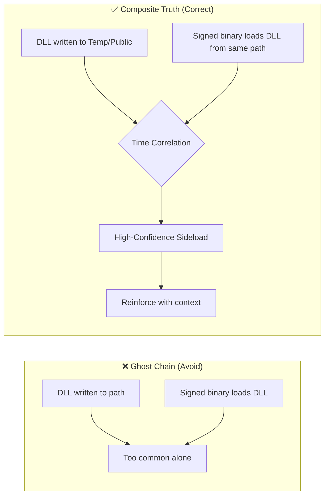

Minimum Truth Detection Framework
Detection Engineering from First Principles
Author: Ala Dabat | github.com/azdabat
License: CC BY-NC-SA 4.0
Validated: ADX-Docker · Empire C2 Telemetry · Atomic Red Team
---
> **"Start with the minimum truth required for the attack to exist.**
> **Everything else is reinforcement — not dependency."**
---
Why This Framework Exists
Most SOCs don't fail because they lack detections.
They fail because their detections are:
Over-engineered — monolithic queries that collapse under production load
Ghost-chained — events stitched together into fake kill-chain certainty
Noise-saturated — alerts that cry wolf until analysts stop listening
Assumption-driven — rules that model what engineers think attackers do, not what must structurally be true
This framework exists to solve that problem at the architectural level — not by patching it with more rules.
---
Core Doctrine
The Minimum Truth Principle
Every attack technique has a non-negotiable baseline event — the single thing that must structurally be true for the attack to be possible.
If that condition is not met, the attack is not real.
```
Minimum Truth → Reinforcement → Scoring → Hunter Directive
```
Layer	Role	Key Principle
Minimum Truth	The unavoidable attack anchor	If it's absent, the detection doesn't exist
Reinforcement	Confidence builders	Increases score — never redefines truth
Scoring	Cumulative severity	Not binary — contextual and weighted
Hunter Directive	SOC-ready output	What fired, why it matters, what to do next
> **The detection rule is the sensor.**
> **The incident is the narrative.**
---
The Two Anchoring Strategies
Substrate-First Minimum Truth
Anchors on the execution surface itself — without requiring proof of malicious intent.
> *"Did this execution surface exist?"*
```kql
// Example: PowerShell substrate truth
DeviceProcessEvents
| where FileName in~ ("powershell.exe", "pwsh.exe")
```
This is a signal generator, not an alert.
Substrate-first truths require reinforcement before they become actionable.
When to use: L1 sensor logic, broad coverage, WMI fileless execution (where substrate IS the only observable truth).
---
Intent-First Minimum Truth
Anchors on a malicious execution primitive — a specific action that implies attacker capability.
> *"Did this substrate do something that implies capability?"*
```kql
// Example: PowerShell intent truth
DeviceProcessEvents
| where FileName in~ ("powershell.exe", "pwsh.exe")
| where ProcessCommandLine has_any (
    "Invoke-WebRequest", "DownloadString", "FromBase64String",
    "IEX", "Add-Type", "-EncodedCommand"
)
```
Why intent-first is stronger: PowerShell running is common. PowerShell performing in-memory execution, payload decoding, or remote retrieval is not. The primitive implies capability — raising base confidence before any reinforcement.
When to use: L2/L2.5 composite hunts, higher-confidence anchors.
	Substrate-First	Intent-First
Anchor	Execution surface	Malicious primitive
Noise	Higher	Lower
Reinforcement dependency	High	Moderate
Tier	L1 / Sensor	L2 / Composite
---
Reinforcement
Once minimum truth is established, reinforcement increases confidence.
Reinforcement is evidence, not dependency.
```
Reinforcement signals may cross telemetry surfaces
as long as they remain optional and do not replace the baseline truth.
```
Examples:
Suspicious parent process (`winword.exe → powershell.exe`)
Dangerous command-line primitives (`-enc`, `IEX`, `rundll32`)
User-writable execution paths (`AppData`, `Temp`, `Public`)
External network egress shortly after execution
TaskCache registry artefacts
Rare writer process (org prevalence)
> Reinforcement increases score.
> Reinforcement **never** redefines truth.
---
Noise Suppression
Noise is not removed through hard exclusions.
Hard exclusions create blind spots:
```kql
// ❌ Never do this
| where InitiatingProcessFileName != "ccmexec.exe"
```
Instead, noise is measured, profiled, and down-scored through contextual weighting:
```kql
// ✅ Soft-allow scoring model
let Penalty_ManagedLineage = -25;
let Penalty_InternalNet    = -10;
let Penalty_HighBurst      = -20;
```
Management automation reduces risk — it does not eliminate telemetry visibility.
Noise Suppression Principles
Principle	Implementation
No brittle allowlists	Contextual score reduction
Measure before suppressing	Empirical baseline extraction first
Convergence required	Multiple reinforcement layers needed for escalation
Prevalence modifies urgency	Never suppresses alerts
Burst modelling	Differentiates mass automation from targeted intrusion
---
Organisational Prevalence
Prevalence is a prioritisation amplifier — not a detection trigger.
> **If the minimum truth is not satisfied, prevalence is irrelevant.**
> **If it is satisfied, prevalence determines urgency.**
Three Safe Applications
1. Behavioural Rarity
How many hosts exhibit this exact behaviour?
1–2 devices → targeted activity → escalate
200+ devices → likely admin tooling → deprioritise (but never suppress)
2. Actor/Parent Context
Who normally performs this action in this environment?
`rundll32.exe` launched by `winword.exe` → anomalous actor context
Service account accessing sensitive data outside role → privilege anomaly
3. Burst/Radius
How fast and wide did this spread?
Single host → targeted persistence
Domain-wide in minutes → ransomware precursor or automation abuse
> **Prevalence decides how fast we respond — not whether we respond.**
> **High-risk truths are always surfaced, regardless of prevalence.**
---
Composite Scoring Model
Detections output a cumulative risk score, not a binary alert.
```
BaseScore (Truth Anchor)      =  55
+ TaskCache Artefact          = +25
+ Dangerous Primitive         = +25
+ Base64 Payload              = +20
+ User-Writable Path          = +15
+ Network Indicator           = +10
+ Untrusted Writer            = +10
+ Rare Writer (Org Prev.)     = +10
─────────────────────────────────────
FinalScore                    = 170  →  CRITICAL
```
Score Range	Severity
≥ 120	CRITICAL
90–119	HIGH
70–89	MEDIUM
< 70	LOW
This prevents alert fatigue from brittle yes/no thresholds and ensures contextually dangerous activity is never buried.
---
Correlation vs Ghost Chains
> **Correlation is only valid when the attack cannot exist without multiple linked events.**
What Is a Ghost Chain?
A ghost chain occurs when unrelated events are stitched together into fake kill-chain certainty:
```kql
// ❌ Ghost chain — forces false narrative
RegistryValueSet
| join NetworkConnection on DeviceId
| join ProcessInjection on DeviceId
| where all within 10 minutes
```
Why this fails:
Persistence may be set today, executed tomorrow
Network traffic may be completely unrelated
Injection may never occur
The result is high-severity alerts with low analyst trust, breaking triage and hiding real attacks.
The Correct Architecture
```kql
// ✅ Composite Rule 1: Persistence Sensor
DeviceRegistryEvents
| where RegistryKey has "\Run"
| where RegistryValueData has "powershell"
// Truth: persistence exists.

// ✅ Composite Rule 2: Runtime Loader Sensor
DeviceEvents
| where ActionType == "PowerShellScriptBlock"
| where AdditionalFields has "VirtualAlloc"
// Truth: in-memory execution intent exists.
```
Incident-level correlation happens outside individual rules — at the case layer, where Sentinel/MDE correlates same device, same user, same timeframe across multiple firing truths.
When Correlation IS Required
Correlation is mandatory only when no single event proves the technique.

DLL sideloading is the canonical example — neither event alone proves the attack. Together, correlated within a time window, they do.
---
Cousin Technique Doctrine
MITRE ATT&CK models techniques as independent units. It does not model substrate adjacency — the reality that many techniques represent the same adversary intent executed across different execution surfaces.
> Lateral movement via **SMB (T1021.002)**, **DCOM (T1021.003)**, and **WinRM (T1021.006)** are operationally interchangeable.
> An attacker pivots dynamically based on firewall rules, privileges, and endpoint controls.
> Detecting one while missing the others creates a **false sense of coverage.**
Cousin Rule Definition
A cousin rule is the paired counterpart in the same attack ecosystem that:
Represents a different execution surface
Shares the same attack intent
Lives in a different noise domain
Maintains separate truth anchors
Provides ecosystem coverage without diluting rule fidelity
Lateral Movement Ecosystem (Example)
Primary	Cousin 1	Cousin 2	Cousin 3
SMB Service Execution	Scheduled Task Execution	WMI Remote Execution	WinRM Execution
T1021.002	T1053.005	T1021.003	T1021.006
Key principle: Cousin rules are separate but paired. Never mix truth anchors across cousins — this breaks noise suppression and dilutes fidelity.
---
Router Rules vs Ecosystem Rules
This framework contains two distinct composite classes:
Type 1 — Ecosystem Truth Rules (Deep Composites)
Answer: "Is this specific attack mechanism real?"
Anchor to a single ecosystem
Prove a minimum truth artefact
High-fidelity, ecosystem-pure
Type 2 — Router / Surface Rules
Answer: "Is persistence being attempted anywhere, and where do we pivot?"
Sit above ecosystems
Detect broad intent across multiple persistence surfaces
Directional sensors — not final truth
```
Router Rule fires → Surface detected → Directive: pivot to ecosystem composite
Ecosystem Composite fires → Mechanism confirmed → Truth established
```
> **Router rules detect intent.**
> **Ecosystem rules confirm truth.**
---
The Four Rules of Detection Architecture
Rule 1 — Split when the Minimum Truth changes
If the non-negotiable baseline event requires a schema change, telemetry change, or mechanism change — SPLIT.
Split When	Example
Host execution → Identity log	Endpoint truth ≠ Sign-in truth
SMB lateral movement → WMI	Different execution mechanism
Named pipe C2 → HTTP beaconing	Different transport truth
Rule 2 — Split when the noise domain changes
If the rule requires a completely different allowlist/baseline strategy — SPLIT.
Rule 3 — Split when the telemetry surface changes
`DeviceProcessEvents ≠ DeviceRegistryEvents ≠ SigninLogs ≠ DeviceNetworkEvents`
Different tables = different sensors.
Rule 4 — Keep composite when you're refining context
Classification, scoring, enrichment, and reinforcement belong inside the rule when the minimum truth stays the same.
---
The Rule Factory Checklist
Before publishing any composite hunt:
Requirement	Check
Minimum Truth is one clear anchor	✅
Reinforcement signals are optional (2–4 max)	✅
Convergence window is defined	✅
Noise suppression is explicit	✅
Org prevalence is scoring only — never a hard filter	✅
Severity is cumulative	✅
Output is SOC-actionable with Hunter Directive	✅
> **The Golden Rule: If you cannot explain the hunt in 60 seconds, it is too complex.**
---
Composite Rule Template
```kql
// ============================================================
// COMPOSITE HUNT — [TECHNIQUE NAME]
// Author: Ala Dabat
// Platform: Microsoft Defender XDR / Sentinel
// MITRE: [T####.###]
// Minimum Truth: [One sentence describing the non-negotiable anchor]
// ============================================================

let lookback   = 7d;
let RarityLB   = 30d;

// --- NOISE SUPPRESSION LISTS ---
let TrustedPublishers  = dynamic(["Microsoft Corporation", "Microsoft Windows"]);
let TrustedInitiators  = dynamic(["msiexec.exe", "trustedinstaller.exe"]);

// --- PREVALENCE TABLE (Pre-summarised — small table join only) ---
let OrgPrevalence =
    DeviceFileEvents
    | where Timestamp >= ago(RarityLB)
    | summarize WriterDeviceCount = dcount(DeviceId) by SHA256;

// --- MINIMUM TRUTH ANCHOR ---
let Raw =
    DeviceProcessEvents                         // ← Primary telemetry surface
    | where Timestamp >= ago(lookback)
    | where [[ MINIMUM TRUTH CONDITION ]];      // ← Non-negotiable baseline event

// --- ENRICHMENT (Zero-join where possible) ---
let Enriched =
    Raw
    | extend
        WriterFile    = tostring(InitiatingProcessFileName),
        WriterCL      = tostring(InitiatingProcessCommandLine),
        WriterSHA     = tostring(InitiatingProcessSHA256),
        WriterCompany = tostring(InitiatingProcessVersionInfoCompanyName)
    | join kind=leftouter OrgPrevalence on $left.WriterSHA == $right.SHA256
    | extend
        WriterIsRare         = toint(coalesce(WriterDeviceCount, 0) <= 2),
        WriterTrusted        = toint(WriterCompany in (TrustedPublishers));

// --- CONVERGENCE SCORING ---
Enriched
| extend
    HasDangerPrimitive = toint([[ DANGEROUS COMMAND CONDITION ]]),
    HasNetIndicator    = toint([[ NETWORK INDICATOR CONDITION ]]),
    IsWritablePath     = toint([[ WRITABLE PATH CONDITION ]]),
    UntrustedWriter    = toint(WriterTrusted == 0)
// Noise suppression gates
| where not(WriterTrusted == 1 and HasDangerPrimitive == 0 and HasNetIndicator == 0)
// Score
| extend
    BaseScore    = 55,
    RiskScore    = BaseScore
                 + (25 * HasDangerPrimitive)
                 + (15 * IsWritablePath)
                 + (10 * HasNetIndicator)
                 + (10 * UntrustedWriter)
                 + (10 * WriterIsRare),
    RiskLevel    = case(RiskScore >= 120, "CRITICAL",
                        RiskScore >= 90,  "HIGH",
                        RiskScore >= 70,  "MEDIUM", "LOW")
// --- ACTIONABLE OUTPUT ---
| where RiskLevel in ("MEDIUM", "HIGH", "CRITICAL")
| extend HunterDirective = case(
    RiskLevel == "CRITICAL", "CRITICAL: [Directive for critical path]",
    RiskLevel == "HIGH",     "HIGH: [Directive for high path]",
                             "MEDIUM: [Directive for medium path]"
)
| project Timestamp, DeviceName, RiskScore, RiskLevel, HunterDirective
| order by RiskScore desc, Timestamp desc
```
---
Framework Architecture Summary
```
┌─────────────────────────────────────────────────────────────────┐
│                   MINIMUM TRUTH ECOSYSTEM                       │
├─────────────────────────────────────────────────────────────────┤
│  ROUTER LAYER        →  Surface intent detection                │
│  (Broad, cheap, directional)                                    │
├─────────────────────────────────────────────────────────────────┤
│  ECOSYSTEM LAYER     →  Mechanism truth confirmation            │
│  Tier 1: Enterprise mandatory baselines (always-on)             │
│  Tier 2: Composite correlation (senior hunting layer)           │
│  Tier 3: Novel tradecraft POCs (research sensors)               │
├─────────────────────────────────────────────────────────────────┤
│  INCIDENT LAYER      →  Narrative stitching across sensors      │
│  (SIEM / case correlation — not inside individual rules)        │
└─────────────────────────────────────────────────────────────────┘
```
Truth Anchor = Sensor
Reinforcement = Evidence
Cousins = Adjacent sensors
Incident = Story stitching
---
Repository Structure
Repository	Role
`Minimum-Truth-Detection-Framework-ADX-Validated-Composite-Rules`	Tier 1/2 deployable composites — ADX validated
`ATLAS-ATTACK-ECOSYSTEM`	Strategic ecosystem map — Cousin relationships, coverage gaps
`Production-READY-Composite-Threat-Hunting-Rules`	Production-hardened hunting rules with receipts
`THREAT-MODELLING-SOP-Behavioural-Patch-Resistant-TTPs`	Architectural doctrine + design SOPs
🗺️ View the Live MITRE Coverage Matrix
🏛️ Enter the ATLAS — Strategic Ecosystem Map
---
Operational Notes
> [!NOTE]
> **Validation Standard**
> Every rule in this framework is considered **untested** unless accompanied by ADX-Docker Empire telemetry results and dedicated documentation. This is a record of engineering work — not a script collection. Baselines, noise tuning, and allow-listing require specific tenant telemetry context before production deployment.
> [!IMPORTANT]
> **This is not plug-and-play.**
> This framework teaches a method for **generating** detection logic — not a static answer library. The goal is engineering freedom through architectural simplicity. As anyone who has been in the trenches knows: clarity, not complexity, is where real detection lives.
---
Final Principle
```
Substrate answers:      Did the execution surface exist?
Intent answers:         Was attacker capability created?
Reinforcement answers:  Is this contextually malicious?
Scoring answers:        How urgent is this?
Narrative convergence:  Is this an incident?
```
Minimum Truth defines the attack.
Reinforcement increases confidence.
Prevalence scales triage.
The rule is the sensor. The incident is the story.
---
Copyright (c) 2026 Ala Dabat. Licensed under CC BY-NC-SA 4.0 — Attribution required. Non-commercial use only. ShareAlike.
