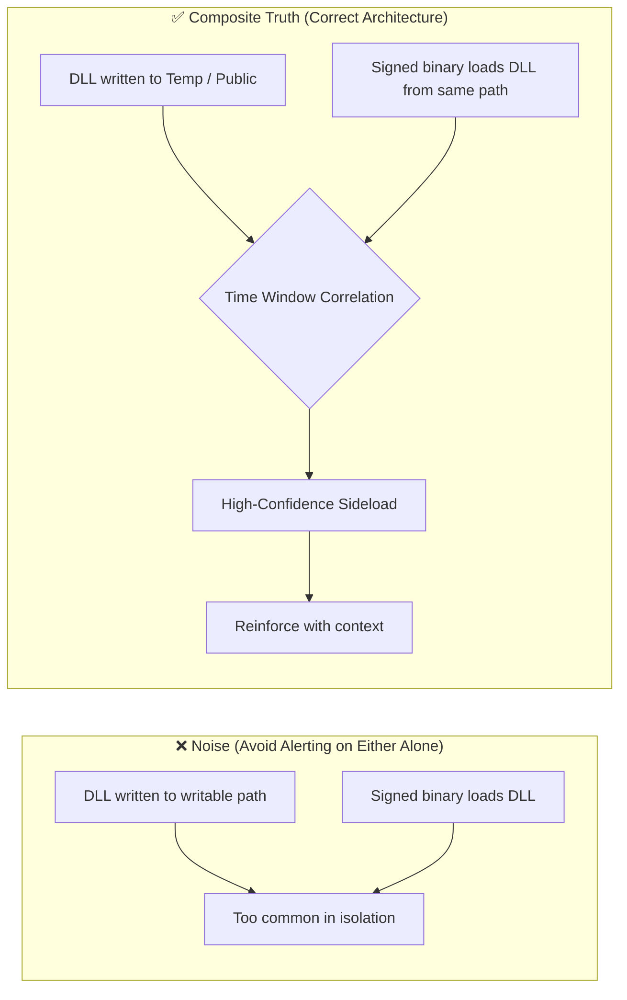

Minimum Truth Detection Framework
Adversary-Informed Detection Engineering from First Principles
Author: Ala Dabat | github.com/azdabat
License: CC BY-NC-SA 4.0
Validated Against: ADX-Docker · Empire C2 Telemetry · Atomic Red Team
---
> **"Start with the minimum truth required for the attack to exist.**
> **Everything else is reinforcement — not dependency.**
> **If the baseline truth is not met, the attack is not real."**
---
Why This Framework Exists
Most SOCs don't fail because they lack detections.
They fail because their detections are:
Over-engineered — monolithic queries that collapse under real production telemetry load
Ghost-chained — unrelated events stitched into fake kill-chain certainty
Noise-saturated — alert fatigue disguised as intelligence
Assumption-driven — rules that model what engineers think attackers do, not what must structurally be true
This repository documents a deliberate, operationally grounded methodology for threat hunting and detection engineering that:
Scales to real SOC teams under real load
Preserves signal fidelity without brittle allowlists
Reduces analyst fatigue
Applies behavioural correlation only when the attack requires it
Remains adversary-informed, not tool-dependent
> **This is Detection-As-Code in its purest form.**
> *(Fully automated CI/CD pipeline section currently under development)*
---
Operational Calibration & Testing
> [!NOTE]
> These detection rules are architected for **logical correctness** and **high-fidelity signal extraction**. Validation was performed in an isolated **ADX-Docker** environment to ensure attack-truth and logic integrity using Empire threat telemetry & Atomic Red Team.
>
> Please note:
> - **Baselines:** Final noise tuning and allow-listing require specific tenant telemetry and administrative context.
> - **Syntax:** Minor syntax variances (e.g., path escaping) may exist due to the difference between Docker-hosted Kusto and live Cloud schemas.
> [!IMPORTANT]
> **Operational Readiness & Integrity**
>
> - **Not "Plug-and-Play":** This is not a copy-paste production repository. Every rule here is considered **untested** unless accompanied by "receipts" — specifically ADX-Docker Empire telemetry results and dedicated documentation.
> - **Engineering vs. Scripting:** This is a record of engineering work, not a basic KQL collection. It represents the iterative process of testing, tuning, and refining logic from scratch.
> - **The Evolution:** While legacy POC repositories contain the "brittle monoliths" of early-career detection, this composite section represents the philosophy of true detection engineering.
> - **Originality:** Nothing in this repository is copied; nothing has been borrowed. This documentation is designed to teach a way of thinking.
> - **The Goal:** As anyone who has been in the trenches knows: engineering freedom is only found when architecture becomes simple, reductive, and easy to understand.
---
Engineering Notes — Common Implementation Errors
During validation of the Minimum Truth Detection Framework composite rule set, several recurring implementation pitfalls were identified while stress-testing multiple KQL detections.
These issues do not affect the detection doctrine itself (Minimum Truth → Reinforcement → Scoring → Hunter Directive), but arise from common KQL engineering edge cases, including:
Prevalence window overlap
Incorrect `leftouter` join handling
SHA256 rarity edge cases
Non-deterministic `any()` summarization
Negative composite score behaviour
To ensure these problems are not repeated across future detection rules, the findings were documented in a dedicated engineering reference:
KQL Detection Engineering — Common Implementation Errors
This document acts as an engineering reference and lint guide for KQL detection development, capturing the bug classes discovered during composite rule validation. Its purpose is to ensure the framework remains deterministic, reliable, and production-safe as additional detection logic is developed.
---
Detection Engineering Lifecycle & Real-World Adaptation Model
> [!IMPORTANT]
> This framework is complemented by a dedicated **Detection Engineering Lifecycle model**, which defines how composite detections are **validated, tuned, scored, and governed in real SOC environments**.
>
> While the core doctrine establishes *how detections should be architected*, this lifecycle formalises **how they survive production reality** — including telemetry constraints, noise modelling, performance trade-offs, and continuous refinement.
>
> It captures the transition from **theoretical correctness → operational reliability**, ensuring every rule is not only logically sound, but **measurably effective and SOC-safe over time**.
>
> **Read the full lifecycle model here:**
> https://github.com/azdabat/Minimum-Truth-Detection-Framework-ADX-Validated-Composite-Rules/blob/main/Detection_Engineering_Lifecycle.md
---
ATT&CK Substrate Adjacency — Detection Coverage Beyond Technique Taxonomy
ATT&CK Substrate Adjacency — Detection Coverage Beyond Technique Taxonomy
MITRE ATT&CK provides a taxonomy of adversary techniques, describing what attackers do during an intrusion. However, ATT&CK primarily models techniques as independent units with vertical depth (technique → sub-technique). What it does not model is substrate adjacency — the reality that many ATT&CK techniques represent the same adversary intent executed across different operating system substrates.
For example, lateral movement techniques such as SMB (T1021.002), DCOM (T1021.003), and WinRM (T1021.006) are often operationally interchangeable for attackers. An adversary may pivot dynamically between them depending on firewall restrictions, privileges, or endpoint controls. Treating these techniques as independent can create a false sense of detection coverage.
The Minimum Truth Detection Framework introduces a Cousin Technique Doctrine, which models these adjacent techniques as part of a shared attack ecosystem. This layer sits on top of ATT&CK and helps detection engineers reason about coverage gaps between related substrates, enabling detection strategies that target adversary intent rather than isolated technique identifiers.
---
Core Detection Philosophy
Focus: Practical, adversary-informed threat hunting for real SOC environments
Audience: L2 / L2.5 Threat Hunters, Detection Engineers, Security Leads
---
Detection Maturity Model
1. Reductive Baseline (Truth First)
Every attack technique has a minimum condition that must be true.
If that condition is not met, the detection should not exist.
Examples:
LSASS credential theft → LSASS must be accessed
Kerberoasting → Service tickets must be requested using weak encryption
OAuth abuse → A cloud app must request high-risk scopes
This prevents speculative or assumption-driven hunting.
---
2. Composite L2 / L2.5 Hunts (Default)
Most attacks do not require full behavioural chains.
This repository focuses on Composite Hunts that:
Group related high-signal indicators
Prefer single telemetry sources where possible
Use minimal joins only when unavoidable
This is where most effective threat hunting lives.
---
3. Reinforcement (Confidence, Not Dependency)
Once baseline truth is met, confidence is increased using:
Parent / child execution context
Suspicious paths or arguments
Network proximity
Rarity / prevalence
Reinforcement:
Improves fidelity
Reduces noise
Never defines the attack
---
4. Behavioural Chains (Used Sparingly)
Behavioural correlation is used only when the attack cannot exist without it.
Example: DLL sideloading
A DLL drop alone is benign.
A DLL load alone is benign.
The attack is only true when both occur together.
---
Substrate-First vs Intent-First Minimum Truth
Why This Distinction Matters
In composite detection engineering, the Minimum Truth defines the non-negotiable event that must exist for malicious behaviour to be possible.
There are two valid anchoring strategies:
Substrate-First Minimum Truth
Intent-First Minimum Truth
Explicitly separating these completes the framework and prevents:
Over-broad noisy rules
Over-fitted brittle intent assumptions
Confusion between observability and attacker intent
---
Substrate-First Minimum Truth
Definition: A detection anchored on the execution substrate itself, without requiring proof of malicious intent at the minimum truth layer.
> *"Did the execution surface exist?"*
Example — PowerShell Substrate-First:
```kql
DeviceProcessEvents
| where FileName in~ ("powershell.exe", "pwsh.exe")
```
That is the substrate. Nothing more.
Characteristics:
High observability
Broad coverage
Requires reinforcement to gain confidence
Suitable for L1 / atomic sensor logic
Ideal for correlation-driven architectures
Reinforcement Examples (required for confidence):
```kql
// Suspicious parent relationship
| where InitiatingProcessFileName in~ ("winword.exe","excel.exe","outlook.exe","wscript.exe","cscript.exe")
```
```kql
// External egress shortly after execution
DeviceNetworkEvents
| where InitiatingProcessFileName in~ ("powershell.exe","pwsh.exe")
| where RemoteIPType == "Public"
```
> Substrate-first truths are not alerts. They are signal generators.
---
Why WMI Fileless Execution Is a Prime Example of Substrate-First
WMI fileless execution is the canonical case where substrate-first is not just valid — it is the only correct anchoring strategy.
Here is why:
In a WMI Permanent Event Subscription attack, the adversary creates a malicious `ActiveScriptEventConsumer` or `CommandLineEventConsumer` that executes a script payload entirely within the WMI subsystem. When triggered, Windows Script Host (`scrcons.exe`) loads a script engine DLL — `vbscript.dll`, `jscript.dll`, or `scrobj.dll` — directly into its process memory.
There is no child process. There is no command-line argument. There is no file written to disk. The payload executes as a DLL loaded into a trusted Windows process.
The only observable substrate truth is:
```kql
DeviceImageLoadEvents
| where InitiatingProcessFileName =~ "scrcons.exe"
| where FileName in~ ("vbscript.dll", "jscript.dll", "scrobj.dll")
```
`scrcons.exe` loading a script engine DLL is the irreducible minimum. You cannot go further left in the kill chain. There is no process execution event. There is no command-line to parse for dangerous primitives. The substrate IS the signal.
This is precisely why intent-first anchoring fails here — there is no attacker-controlled command-line visible at the DLL load layer. Attempting to anchor on intent before the substrate is confirmed produces either a ghost chain or a missed detection entirely.
Substrate first. Reinforcement second. Always.
Reinforcement then adds confidence:
Near-time outbound HTTP/HTTPS from `scrcons.exe` → network reinforcement
DLL loaded from a non-system path → path anomaly reinforcement
First-time behaviour on this device in the last 30 days → prevalence reinforcement
---
A Second Example: Process Injection via `VirtualAlloc`
A less obvious but equally important substrate-first case is detecting in-memory process injection through `DeviceEvents` script block logging.
The substrate truth is simple:
```kql
DeviceEvents
| where ActionType == "PowerShellScriptBlock"
| where AdditionalFields has "VirtualAlloc"
```
`VirtualAlloc` called inside a PowerShell script block is the minimum truth that in-memory execution capability exists. The script engine is the substrate. `VirtualAlloc` is the execution surface being prepared.
You cannot skip to intent (what payload will run) because at this stage the payload may be encoded, obfuscated, or pulled dynamically from a remote source. The substrate — PowerShell executing a memory allocation primitive — is the only reliable anchor.
Reinforcement then determines whether this is a legitimate process (e.g., a security tool) or a threat:
Parent process context
Encoded command line presence
External network contact proximity
Org prevalence of this script block hash
---
Intent-First Minimum Truth
Definition: A detection anchored on a malicious execution primitive — not just the substrate.
> *"Did this substrate perform an action that implies attacker capability?"*
Example — PowerShell Intent-First:
```kql
DeviceProcessEvents
| where FileName in~ ("powershell.exe","pwsh.exe")
| where ProcessCommandLine has_any (
    "Invoke-WebRequest",
    "DownloadString",
    "FromBase64String",
    "IEX",
    "Add-Type",
    "-EncodedCommand"
)
```
Here, execution alone is not sufficient. The primitive implies capability.
Why Intent-First Is Stronger (When Applicable)
PowerShell execution is common. PowerShell performing:
In-memory execution
Payload decoding
Remote retrieval
Direct code execution
...is not common in normal enterprise workflows. Intent-first anchoring raises base confidence before any reinforcement is applied.
---
Comparative Model
Feature	Substrate-First	Intent-First
Anchor	Execution surface	Malicious primitive
Noise	Higher	Lower
Reinforcement dependency	High	Moderate
Coverage	Broad	Focused
Tier suitability	L1 / Sensor	L2 / Composite
When required	WMI fileless, injection	PowerShell abuse, LOLBins
---
Composite Framework Integration — Layered Model
Sensor Layer (Substrate-First)
```kql
DeviceProcessEvents
| where FileName in~ ("powershell.exe","pwsh.exe")
```
Purpose: Generate execution visibility.
Intent Layer (Intent-First)
```kql
DeviceProcessEvents
| where FileName in~ ("powershell.exe","pwsh.exe")
| where ProcessCommandLine has_any ("Invoke-WebRequest","DownloadString","IEX")
```
Purpose: Anchor malicious capability.
Reinforcement Layer
Suspicious parent
Rare command-line fingerprint
External egress
Privileged user context
Scoring Layer
Substrate truth = low base score
Intent truth = higher base score
Reinforcement = additive
Safe overlays = subtractive
High-risk floor logic prevents score burial
---
Final Principle
```
Substrate enables execution.
Intent reveals capability.
Reinforcement confirms context.
Scoring determines priority.
Narrative convergence defines incident reality.
```
> Substrate-first truth observes *where* execution occurred.
> Intent-first truth observes *what* was done with it.
> Both are valid. The engineer chooses the tier intentionally.
---
Applying Substrate vs Intent Anchoring to OAuth Consent Abuse
Unlike endpoint execution, OAuth abuse is identity-driven and user-mediated. Therefore, the distinction between substrate-first and intent-first becomes operationally critical.
OAuth Substrate-First Minimum Truth
A successful OAuth consent grant occurred.
```kql
AuditLogs
| where OperationName in~ (
    "Consent to application",
    "Add delegated permission grant",
    "Add app role assignment grant to service principal"
)
| where Result =~ "success"
```
This confirms:
A trust boundary changed
An application was granted permissions
A new execution surface was created
It does not imply malicious intent. This is substrate truth.
Characteristics:
Consent events are common
Many are legitimate
Noise potential is high
Requires strong reinforcement layers
Substrate-first OAuth detection is appropriate when:
Building tenant visibility
Feeding narrative convergence models
Measuring consent velocity or anomalies
---
OAuth Intent-First Minimum Truth
Intent-first in OAuth is not "consent happened." It is: high-risk permission capability was granted.
```kql
AuditLogs
| where OperationName in~ (
    "Consent to application",
    "Add delegated permission grant",
    "Add app role assignment grant to service principal"
)
| where Result =~ "success"
| mv-expand TargetResources[0].modifiedProperties
| where tostring(TargetResources[0].modifiedProperties.newValue) has_any (
    "Mail.ReadWrite",
    "Directory.ReadWrite.All",
    "AppRoleAssignment.ReadWrite.All",
    "RoleManagement.ReadWrite.Directory",
    "Files.ReadWrite.All",
    "Sites.FullControl.All"
)
```
Now the anchor is:
Capability to access mail
Capability to modify directory
Capability to assign roles
Capability to read/write files
This is attacker intent expressed through a permission grant.
Why OAuth Must Use Intent Anchoring
OAuth consent is not inherently malicious. But:
High-risk permissions imply data access capability
Admin consent implies tenant-wide blast radius
Rare AppId implies anomaly
Scripted UA implies automation
Intent-first anchoring stabilizes the detection. Without it, the rule behaves like phishing tuning — endless refinement with no reliable anchor.
Composite Integration Model
```
Sensor Layer (Substrate-First) → Visibility, telemetry measurement, baseline modelling
Intent Layer (Intent-First)    → Anchor malicious capability
Reinforcement Layer            → Admin consent, suspicious UA, FirstSeen AppId, rare AppId, privileged user
```
Scoring Philosophy:
Substrate consent = low base score
High-risk permission = primary weight
Admin consent = escalator
Rarity/newness = anomaly boost
Known-good AppId = discount (never bypass)
High-risk floor prevents score burial
---
Noise Model & Suppression Strategy
Core Principle
Noise is not removed through blind exclusions. Noise is measured, profiled, and down-scored through contextual weighting.
```kql
// ❌ Never do this — creates blind spots
| where InitiatingProcessFileName != "ccmexec.exe"
```
```kql
// ✅ Soft-allow scoring model instead
let Penalty_ManagedLineage = -25;
let Penalty_InternalNet    = -10;
let Penalty_HighBurst      = -20;
```
Management automation reduces risk — it does not eliminate telemetry visibility.
---
1. Empirical Noise Baseline (Pre-Tuning Requirement)
Before suppression logic is applied, extract dominant operational patterns:
```kql
DeviceProcessEvents
| where FileName =~ "powershell.exe"
| summarize
    Count   = count(),
    Devices = dcount(DeviceId)
  by InitiatingProcessFileName,
     InitiatingProcessAccountName,
     bin(Timestamp, 1h)
| order by Count desc
```
Objectives:
Identify dominant parent processes
Identify recurring service accounts
Identify patch-window execution bursts
Identify common automation command-line fragments
Identify recurring execution paths
> **Noise suppression begins with measurement — not assumptions.**
---
2. Soft-Allow Scoring (Never Hard Exclusion)
Conceptual Scoring Model:
```kql
let Score_EncodedPrimitive = 40;
let Score_SuspiciousParent = 30;
let Score_WritablePath     = 20;
let Score_ExternalNetwork  = 25;
let Score_RareExecution    = 15;

let Penalty_ManagedLineage = -25;
let Penalty_InternalNet    = -10;
let Penalty_HighBurst      = -20;
```
---
3. Managed Execution Context Modelling
Instead of static allowlists, detect behavioural automation traits. Indicators of managed activity may include:
SYSTEM or service account execution
Parent lineage including management agents
High-volume execution during known patch windows
Repeated execution across large device groups
Consistent working directories (agent cache paths)
```kql
DeviceProcessEvents
| where FileName =~ "powershell.exe"
| summarize count() by InitiatingProcessFileName
| order by count_ desc
```
Management parents are not excluded — they are down-scored.
---
4. Convergence Over Single Indicators
Encoded PowerShell alone is insufficient. Require convergence of:
Encoded or runtime execution primitive
Suspicious parent (Office, browser, LOLBin chain)
User-writable staging path
External network contact
Low organisational prevalence
Only convergence elevates severity. Single noisy signals remain low priority.
---
5. Prevalence as Prioritisation (Never Suppression)
```kql
DeviceProcessEvents
| where FileName =~ "powershell.exe"
| summarize DeviceCount = dcount(DeviceId)
  by ProcessCommandLine
```
Seen on 1–2 devices → high priority
Seen on 500 devices simultaneously → likely automation
Prevalence modifies response velocity — not alert visibility.
---
6. Burst Modelling
```kql
DeviceProcessEvents
| where FileName =~ "powershell.exe"
| summarize BurstCount = dcount(DeviceId)
  by bin(Timestamp, 10m)
| order by BurstCount desc
```
High-volume simultaneous execution → patch deployment / configuration push
Low-volume isolated execution → targeted intrusion / lateral staging
Burst patterns reduce score — they do not suppress detection.
---
7. Tenant Configuration Overlay (Optional)
```kql
let TrustedAutomationParents =
datatable(ProcessName:string)
[
  "ccmexec.exe",
  "intunemanagementextension.exe",
  "taniumclient.exe"
];
```
Config-driven tuning keeps logic portable and tenant-adjustable.
---
Architectural Summary
Principle	Implementation
No brittle allowlists	Score reduction instead of exclusion
Measure first	Empirical baseline extraction
Convergence required	Multiple reinforcement layers
Prevalence modifies urgency	Never suppresses alerts
Burst modelling	Differentiates automation from intrusion
Config-driven tuning	Avoids hard-coded exclusions
---
Rarity & Organisational Prevalence
> **Rarity is not a detection trigger. It is a prioritisation and confidence amplifier.**
Detection is driven by attack truth — not by how uncommon an event is. Organisational prevalence is applied only after the baseline condition of an attack has been met.
> **If the minimum truth is not satisfied, rarity is irrelevant.**
> **If the minimum truth is satisfied, rarity helps decide urgency and scope.**
Three Safe Applications
1. Command / Behaviour Prevalence
How many hosts in this organisation perform this exact behaviour?
Low prevalence (1–2 hosts) → likely targeted activity → prioritise
High prevalence (many hosts) → possible tooling / deployment / admin activity
2. Parent / Actor Prevalence
Who normally performs this action in this environment?
LOLBins launched by unusual parents (e.g. Office, WMI, script engines)
Privileged actions executed by unexpected users or service accounts
3. Burst / Radius Prevalence
How widely and how fast did this appear?
Single host → targeted intrusion
Multiple hosts in a short window → automation, lateral movement, or policy abuse
What Rarity Is Not Used For
❌ Rarity is never a hard filter
❌ Rarity does not determine whether an alert exists
❌ Dangerous actions (e.g. LSASS access, illicit OAuth grants) are always surfaced, regardless of prevalence
> **Rarity decides how fast we respond — not whether we respond.**
Example — Scheduled Task Persistence with Prevalence Reinforcement:
```kql
// Minimum Truth
RegistryValueData has "powershell"
and RegistryValueData has "\\users\\public\\"
// That is already persistence.

// Prevalence reinforcement applied AFTER truth
| summarize DeviceCount = dcount(DeviceId) by TaskFingerprint
| extend IsRare = DeviceCount <= 2
```
1 device → likely intrusion → escalate
300 devices → likely software deployment → investigate differently
The detection does not disappear. The response priority changes.
---
Correlation vs Ghost Chains
> **Correlation is only valid when the attack cannot exist without multiple linked events.**
What Is a Ghost Chain?
A ghost chain occurs when a detection query stitches together unrelated activity into a fake kill-chain story:
```kql
// ❌ Ghost chain — forces false narrative
RegistryValueSet
| join NetworkConnection on DeviceId
| join ProcessInjection on DeviceId
| where all within 10 minutes
```
Why this fails:
Persistence may be set today, executed tomorrow
Network traffic may be completely unrelated
Injection may never occur
The result: high-severity alerts, low analyst trust, broken triage, and real attacks hiding nearby.
The Framework Rule
> **The Detection Rule is the sensor.**
> **The Incident is the narrative.**
Clean sensors are deployed independently. Correlation happens at the case/incident layer.
When Correlation IS Required (True Composite Truth)
Correlation is mandatory only when no single event proves the technique.
DLL Sideloading — the canonical example:
A DLL drop alone is benign.
A DLL load alone is benign.
The attack is only true when both occur together.

When Correlation Is NOT Required (Ghost Risk)
Registry Persistence — already a complete truth:
```kql
// If a registry Run key is set to:
// powershell.exe -enc <payload>
// That is ALREADY persistence. Full stop.
```
You do not need to join this with network events, unrelated PowerShell execution, scheduled task execution, or lateral movement. Those may happen later — they are not required for truth. Forcing them creates ghost chains.
Correct Architecture — Three Separate Sensors
```kql
// Composite Rule 1: Persistence Sensor
DeviceRegistryEvents
| where RegistryKey has "\\Run"
| where RegistryValueData has "powershell"
// Truth: persistence exists.

// Composite Rule 2: Runtime Loader Sensor
DeviceEvents
| where ActionType == "PowerShellScriptBlock"
| where AdditionalFields has "VirtualAlloc"
// Truth: in-memory execution intent exists.

// Composite Rule 3: Silent Task Sensor
DeviceRegistryEvents
| where RegistryKey has "\\Schedule\\TaskCache"
| where RegistryValueData has "-enc"
// Truth: task persistence exists.
```
Incident-Level Correlation (Narrative Layer)
Sentinel/MDE now correlates:
Same device
Same user
Same timeframe
Multiple truths firing
This builds the attack story correctly — without ghost chains.
Operational Rule of Thumb
Correlate inside a rule only when:
The technique cannot exist without both events
The telemetry sources are stable
The join reduces ambiguity, not increases complexity
Split into sibling composites when:
The truth surface changes
The noise domain changes
The attacker method is optional
The timing may vary
---
Composite Threat Hunt Portfolio
Tier-1 Baseline Pack (Enterprise Mandatory Ecosystems)
Full Roadmap: https://azdabat.github.io/Minimum-Truth-Detection-Framework-ADX-Validated-Composite-Rules/MITRE-MATRIX.html
> Always-on coverage. High-value truths. SOC-safe baselines.
Ecosystem	Minimum Truth Sensor (Baseline)	Composite Hunt Built	Reinforcement Tuned	Atomic Validated	Maturity
PowerShell Execution & Abuse	Script execution + encoded/runtime intent	✅ Yes	⚠️ Partial	⚠️ In Progress	MED
Registry Autoruns (Run/RunOnce)	RegistryValueSet on logon trigger keys	✅ Yes	✅ Strong	✅ Tested	HIGH
Scheduled Tasks (CLI Creation)	`schtasks.exe /create` process truth	✅ Yes	✅ Strong	✅ Tested	HIGH
Scheduled Tasks (Silent TaskCache)	TaskCache persistence without schtasks.exe	✅ Yes	⚠️ Needs Noise Calibration	⚠️ In Progress	MED
Service Persistence (ImagePath)	Service registry ImagePath modification	⚠️ Partial	❌ Not Tuned	❌ Not Yet	LOW
Credential Access (LSASS Surface)	LSASS access/dump behavioural truth	✅ Yes	⚠️ Partial	⚠️ In Progress	MED
NTDS / SAM Extraction	Hive/NTDS interaction truth	✅ Yes	⚠️ Partial	❌ Not Yet	MED
LOLBins Proxy Execution Core	Signed binary misuse surface	✅ Yes	⚠️ Needs Baselines	❌ Not Yet	MED
Cloud Identity Persistence (OAuth Consent)	High-risk scope grant baseline truth	✅ Yes	✅ Strong	⚠️ Tenant Validation Needed	HIGH
---
Tier-2 Composite Correlation Pack (Senior Threat Hunting Layer)
Tier-2 introduces:
Multi-surface joins
Prevalence reinforcement
Kill-chain convergence
Noise suppression through context
Ecosystem	Minimum Truth Anchor	Composite Reinforcement Layer	Status	Maturity
Registry Hijacks (IFEO/COM/AppInit)	Execution interception registry truth	Writable DLL + rare writer + untrusted signer	⚠️ Partial	MED
WMI Persistence + Execution	Subscription + anomalous consumer truth	Parent lineage break + script consumer scoring	✅ Built	HIGH
Lateral Movement (SMB Service Exec / PsExec)	Remote service creation truth	File drop + inbound 445 + rare service binary	⚠️ Partial	MED
Defense Evasion (Signed LOLBin Chains)	Trusted parent → LOLBin baseline	Injection + ghost module + beacon reinforcement	⚠️ POC → Composite	MED
Session / Token Misuse (Post-Consent)	Token replay baseline truth	ASN+UA divergence + weak auth reinforcement	✅ Built	HIGH
Ingress Tool Transfer	Writable staging drop truth	Followed by execution + outbound comms	⚠️ In Progress	MED
Shadow Copy Destruction (Ransomware Prep)	vssadmin/wmic delete truth	Multi-tool convergence scoring	❌ Missing	LOW
Archive Staging + Exfil Prep	7z/rar bulk staging truth	Large volume + outbound correlation	❌ Missing	LOW
---
Tier-3 Research & Novel Threat Ecosystems (POC + Emerging Tradecraft)
These are not always-on detections — they are attack research sensors.
Threat Ecosystem	Research Truth Anchor	Status	Notes
React2Shell / IIS Exploit Chains	Web process → CLR abuse → injection	✅ Modelled	Requires telemetry hardening
EtherRAT / Blockchain C2	RPC beaconing + low-prevalence infra	✅ Documented	Network correlation expansion needed
SilverFox / ValleyRAT BYOVD	Signed loader → sideload → driver load truth	⚠️ Advanced Composite	Needs DriverLoadEvent validation
Pulsar RAT Injection + Tasks	Trusted parent → LOLBin → memory exec	🟡 Parked POC	Awaiting confirmed ecosystem truth
Kernel Driver Abuse (BYOVD)	Driver service creation + load event	⚠️ Partial	High impact, tuning required
Supply Chain Behaviour Modelling	Signed update → anomaly divergence	✅ Threat Modelled	Tier-2 rule ownership pending
---
Cousin Rules & Attack Ecosystem Coverage
> When a high-fidelity composite is created for one execution surface in an attack ecosystem, its *cousin* is the adjacent execution surface that shares the same adversary goal but lives in a different **noise domain**.
> Cousin rules are **separate but paired** — they do not mix truth anchors with noisy signals that dilute fidelity.
Cousin Rule Definition
For any given detection composite, a cousin rule is the paired counterpart in the same attacker ecosystem that:
Represents a different execution/persistence surface
Shares the same attack intent
Requires stricter noise gating
Is structured as a twin detection module
Improves ecosystem coverage without breaking rule fidelity
Cousin Ecosystem Discovery (Empirical Validation)
This framework is not built on theoretical MITRE grouping — it is built on empirically discovered cousin ecosystems, validated through:
ADX-Docker simulation
Empire-style telemetry
Repeated convergence across persistence + execution surfaces
Full living discovery journal:
Cousin_Discovery_Log.md → https://github.com/azdabat/Production-READY-Composite-Threat-Hunting-Rules/blob/main/Cousin_Discovery_Log.md
---
Ecosystem Table — Composites + Cousins (Roadmap)
Live Roadmap: https://azdabat.github.io/Minimum-Truth-Detection-Framework-ADX-Validated-Composite-Rules/MITRE-MATRIX.html
Ecosystem	Primary Composite	MITRE	Cousin Composite (Planned/POC)	MITRE	Notes
Registry Persistence	`Registry_Persistence_Background_Service_TaskCache`	T1543.003, T1053.005	Registry Persistence (Alternate Anchors)	T1543, T1053	e.g., HKEY_CLUSTER_SERVICE, COM task persistence
	`Registry_Persistence_Hijack_Interception`	T1546.*	Registry Hijack Cousins	T1546.*	e.g., Winlogon handler, shell open interception
	`Registry_Persistence_Userland_Autoruns`	T1547.001/014/004	Userland Autoruns Cousin	T1547.*	e.g., Policies RunOnce, ActiveSetup deep variants
Scheduled Task Execution	(covered by TaskCache + Registry pers.)	T1053.005	`ScheduledTask_Execution_TwinRule`	T1053.005	svchost/taskeng based exec (no schtasks.exe)
Service Execution	`SMB_Service_Execution`	T1021.002 / T1543.003	`Service_Exec_ScheduleTask_Cousin`	T1053.005	svchost scheduler execution surface
Lateral Movement	`SMB_Service_Lateral`	T1021.002	`WMI_RemoteExec_Cousin`	T1021.006	Remote process via WMI
			`WinRM_Exec_Cousin`	T1021.004	PowerShell/WinRM lateral
Execution (LOLBins/Proxy)	`TrustedParent_LOLBin_InMemoryInjection_Chain`	T1218 / T1055	`TaskExec_LOLBin_Injection_Cousin`	T1218/T1055	LOLBin launched from Scheduled Task surface
Credential Access	(existing rule needed)	T1003	`LSASS_Access_Cousin`	T1003.001	DCSync / NTLM Harvest twin
Identity Abuse (OAuth/Token)	(MITRE coverage from threat model SOP)	T1621 / T1078.004	`Identity_ConsentGrant_Cousin`	T1621	Token replay vs lateral token misuse
Persistence (File/Driver)	(POC/Research)	T1547 / T1543	`Driver_Persistence_Cousin`	T1543.008	KMDF/Driver load surface
---
Framework Logic Behind Cousin Pairing
1. Different Noise Domain
Each cousin lives in a parallel surface with a different operational noise profile:
`services.exe` service exec rule — low noise → can be aggressive
`svchost.exe` scheduled task exec — high noise → needs strict anchors
Both cover lateral movement, but the host process and noise pattern differ fundamentally.
2. Separate Truth Anchors
Never mix truth anchors across cousins.
Service rule anchors on:
```
services.exe spawning an uncommon child (baseline truth)
```
Scheduled Task cousin anchors on:
```
Explicit task create/exec signals
AND/OR Task XML drops/TaskCache registry writes
```
These are logically adjacent — but structurally different anchors.
3. Composite Isolation
Coupling them in one rule breaks:
Noise suppression
Operational fidelity
Analyst clarity
Keeping them separate maintains precision.
4. Ecosystem Continuity
Every primary composite should answer four questions:
What is the attack surface?
What is the minimum truth anchor?
What adjacent surfaces share intent?
What cousin composites must exist to cover those surfaces?
---
Architectural Strategy: When to Split vs. Composite
> We do not group rules by *MITRE Tactic* ("all Persistence in one query").
> We group rules by **Attack Surface Ecosystem** — the operational domain where the same kind of truth is observable.
> **The detection rule is the sensor.**
> **The incident/case is the narrative that stitches sensors into an attack story.**
---
The Four Rules of Detection Architecture
Rule 1 — Split when the Minimum Truth changes
If the non-negotiable baseline event requires a schema change, telemetry change, or mechanism change — SPLIT.
Minimum Truth Shift	Split Required
Host process execution → Identity log transaction	✂️ SPLIT
API call telemetry → Artifact registry/file telemetry	✂️ SPLIT
SMB/Service lateral movement → WMI/DCOM lateral movement	✂️ SPLIT
DNS protocol telemetry → HTTP protocol telemetry	✂️ SPLIT
Caveat: Split only when the anchor mechanism changes. Reinforcement signals may cross telemetry surfaces as long as they remain optional and do not replace the baseline truth.
```
Do NOT split when reinforcement crosses tables:
- Baseline truth  = svchost(schedule) spawning suspicious child
- Reinforcement   = TaskCache registry artifacts        ← optional cross-table
- Reinforcement   = Task XML drops                      ← optional cross-table
- Reinforcement   = Org prevalence rarity               ← optional cross-table

The truth anchor remains execution — registry is supporting evidence, not the trigger.
```
Rule 2 — Split when the noise domain changes
If the rule would require a completely different allowlist/baseline strategy — SPLIT.
Rule 3 — Split when the telemetry surface changes
`DeviceProcessEvents ≠ DeviceRegistryEvents ≠ SigninLogs ≠ DeviceNetworkEvents`
Different primary tables = different sensors.
Rule 4 — Keep composite when refining context
Classification, scoring, enrichment, and reinforcement belong inside the rule when the Minimum Truth stays the same.
Examples:
Same process surface: different LOLBins doing the same intent
Same network surface: different URIs/headers to the same destination category
Same persistence surface: create vs change using the same tool and schema
---
Decision Matrix: Split vs. Keep
Threat Ecosystem	Comparison Scenario	Decision	Architectural Reason
Persistence: Scheduled Tasks	`schtasks.exe /create` vs `Register-ScheduledTask` (PowerShell)	✂️ SPLIT	Different truth surface: CLI process execution vs API/script abstraction
Persistence: Scheduled Tasks	`schtasks.exe /create` vs `schtasks.exe /change`	✅ KEEP	Same truth domain: same binary + schema
Persistence: Scheduled Tasks	Task creation vs task execution telemetry	✂️ SPLIT	"Creation" truth ≠ "Execution" truth
---
Essential Framework Reminders
```
Truth Anchor  = Sensor
Reinforcement = Evidence
Cousins       = Adjacent sensors
Incident      = Story stitching

Truth defines the rule. Reinforcement strengthens it.
```
---
Architecture Doctrine — The "Minimum Truth" Framework at Scale
The Core Problem
In enterprise-scale environments (100k+ endpoints), traditional Detection Engineering fails at the database layer. The standard industry approach relies on "Monolithic Queries" — massive, multi-table `join` operations executed across raw telemetry. This results in query timeouts, extreme compute costs, and what this framework defines as "Bleak Outcomes."
The Minimum Truth framework flips this paradigm. Instead of asking the database to correlate everything at once, it forces the query to establish the absolute minimum baseline of malicious truth first, discard the rest of the noise, and only then enrich the surviving data.
The Three Pillars
Filter Before You Join: Never join two raw tables. Reduce the primary table to its most critical subset (the "Truth") before asking for context.
Native Enrichment Over Joins: Modern EDR schemas (like `DeviceRegistryEvents`) often contain implicit context (e.g., `InitiatingProcessFileName`). Extract and map these native fields to avoid costly `DeviceProcessEvents` joins entirely.
Contextual Scoring, Not Binary Alerts: Once truth is established, route surviving data through a convergence matrix to assign a mathematical Risk Score based on behavioural context.
---
Case Study: Registry Persistence (TaskCache)
Advanced adversaries bypass standard `schtasks.exe` monitoring by interacting directly with the Registry TaskCache via COM/API. Tracking this requires querying `DeviceRegistryEvents` — one of the noisiest tables in any SIEM. A traditional join to find the responsible process would crash the tenant.
Here is how the Minimum Truth framework solves this gracefully:
Phase 1: Establish the Minimum Truth (The Funnel)
Immediately restrict the dataset to specific high-value keys and define "Danger" and "Safe" parameters dynamically.
Phase 2: The "Zero-Join" Process Mapping
Instead of executing a heavy `join` to `DeviceProcessEvents` to find who wrote to the registry, extract `InitiatingProcess*` fields natively present in the optimised schema. This eliminates massive memory pressure.
Phase 3: The "Safe Join" (Prevalence)
The only `join` permitted is an optimised, pre-summarised join. Summarise `DeviceFileEvents` down to a tiny `OrgPrevalence` table first, then `leftouter` join it to the already-filtered Registry events. Small table joined to small table.
Phase 4: Convergence Scoring
The remnant data is evaluated against a scoring matrix and outputted with a direct, context-rich directive for the SOC analyst.
```kusto
// ============================================================================
// COMPOSITE HUNT (L3): Registry_Persistence_Background_Service_TaskCache
// TRUTH DOMAIN: DeviceRegistryEvents (Optimised Schema)
// MINIMUM TRUTH: RegistryValueSet under Services OR Schedule TaskCache (Tree/Tasks)
// ============================================================================

let lookback = 14d;

// 1. DYNAMIC LISTS & NOISE SUPPRESSION RULES
let TrustedPublishers  = dynamic(["Microsoft Corporation","Microsoft Windows","Google LLC","Mozilla Corporation"]);
let TrustedInitiators  = dynamic(["msiexec.exe","trustedinstaller.exe","sppsvc.exe","intunemanagementextension.exe","updateinstaller.exe"]);

let BackgroundKeys = dynamic([
  @"system\currentcontrolset\services",
  @"software\microsoft\windows nt\currentversion\schedule\taskcache\tree",
  @"software\microsoft\windows nt\currentversion\schedule\taskcache\tasks"
]);

let UserWritableRx  = @"(?i)^[a-z]:\\(users|public|programdata|temp|downloads|appdata)\\";
let Base64ChunkedRx = @"(?:[A-Za-z0-9+/]{20,}={0,2})(?:\s+[A-Za-z0-9+/]{20,}={0,2})+";
let IPv4Rx          = @"\b(?:(?:25[0-5]|2[0-4]\d|1?\d?\d)\.){3}(?:25[0-5]|2[0-4]\d|1?\d?\d)\b";
let DomainRx        = @"\b([a-z0-9][a-z0-9-]{1,62}\.)+[a-z]{2,}\b";
let UrlRx           = @"https?://[^\s'""<>]+";

let DangerTokens = dynamic([
  "powershell","pwsh","cmd.exe","mshta","rundll32","regsvr32","wscript","cscript",
  "certutil","bitsadmin","curl","-enc","-encodedcommand","frombase64string","http:","https:"
]);

let SafePathAnchors    = dynamic([@"c:\program files",@"c:\program files (x86)",@"c:\windows\system32",@"c:\windows\syswow64"]);
let SafeVendorKeywords = dynamic(["windows update","microsoft","google","edge","mozilla","firefox","onedrive","teams","intel","nvidia","amd","realtek","adobe","citrix"]);

let PayloadSizeThreshold = 500;

// 2. PRE-SUMMARISED JOIN TABLE (Optimisation)
let OrgPrevalence =
  DeviceFileEvents
  | where Timestamp >= ago(30d)
  | summarize WriterDeviceCount = dcount(DeviceId) by SHA256;

// 3. ESTABLISHING MINIMUM TRUTH
let Raw =
  DeviceRegistryEvents
  | where Timestamp >= ago(lookback)
  | where ActionType == "RegistryValueSet"
  | extend RK  = tolower(tostring(RegistryKey)),
           RVN = tolower(tostring(RegistryValueName)),
           RVD = tolower(tostring(RegistryValueData))
  | where RK has_any (BackgroundKeys);

// 4. ZERO-JOIN ENRICHMENT & SAFE JOIN
let Enriched =
  Raw
  | extend
      WriterFile    = tostring(InitiatingProcessFileName),
      WriterCL      = tostring(InitiatingProcessCommandLine),
      WriterSHA     = tostring(InitiatingProcessSHA256),
      WriterSigner  = tostring(InitiatingProcessSigner),
      WriterCompany = tostring(InitiatingProcessVersionInfoCompanyName),
      WriterUser    = tostring(InitiatingProcessAccountName)
  | extend
      WriterFileL            = tolower(coalesce(WriterFile,"")),
      WriterCLL              = tolower(coalesce(WriterCL,"")),
      WriterTrustedPublisher = toint(WriterCompany in (TrustedPublishers) or WriterSigner in (TrustedPublishers)),
      WriterTrustedInitiator = toint(WriterFileL in (TrustedInitiators))
  | join kind=leftouter OrgPrevalence on $left.WriterSHA == $right.SHA256
  | extend
      WriterDeviceCount = coalesce(WriterDeviceCount, 0),
      WriterIsRare      = toint(WriterDeviceCount <= 2);

// 5. CONVERGENCE SCORING & FILTERING
Enriched
| extend
    IsService             = toint(RK has "system\\currentcontrolset\\services"),
    IsTaskCache           = toint(RK has "schedule\\taskcache"),
    ServiceImagePathWrite = toint(IsService==1 and (RVN == "imagepath" or RVN has "imagepath")),
    HasDanger             = toint(RVD has_any (DangerTokens) or WriterCLL has_any (DangerTokens)),
    HasBase64             = toint(RVD matches regex Base64ChunkedRx or WriterCLL matches regex Base64ChunkedRx),
    HasNet                = toint(RVD matches regex UrlRx or RVD matches regex IPv4Rx or RVD matches regex DomainRx),
    PointsWritable        = toint(RVD matches regex UserWritableRx),
    IsLargeBlob           = toint(strlen(RVD) > PayloadSizeThreshold),
    IsSafePath            = toint(RVD has_any (SafePathAnchors)),
    IsSafeVendor          = toint(RVD has_any (SafeVendorKeywords) or RVN has_any (SafeVendorKeywords)),
    UntrustedWriter       = toint(WriterTrustedPublisher == 0)
// Enforce Minimum Truth
| where (IsService==1 or IsTaskCache==1)
| where (IsTaskCache==1) or (ServiceImagePathWrite==1) or (HasDanger==1) or (PointsWritable==1) or (IsLargeBlob==1)
// Enforce Noise Suppression
| where not(IsSafePath==1 and IsSafeVendor==1 and HasDanger==0 and HasBase64==0 and HasNet==0 and PointsWritable==0 and IsLargeBlob==0)
| where not(WriterTrustedInitiator==1 and (HasDanger + HasBase64 + HasNet + PointsWritable + IsLargeBlob) == 0)
// Calculate Risk
| extend
    BaseScore             = 55,
    Score_TaskCache       = 25 * IsTaskCache,
    Score_Service         = 20 * ServiceImagePathWrite,
    Score_Danger          = 25 * HasDanger,
    Score_Base64          = 20 * HasBase64,
    Score_Net             = 10 * HasNet,
    Score_Writable        = 15 * PointsWritable,
    Score_Blob            = 25 * IsLargeBlob,
    Score_UntrustedWriter = 10 * UntrustedWriter,
    Score_RareWriter      = 10 * WriterIsRare,
    RiskScore             = BaseScore + Score_TaskCache + Score_Service + Score_Danger + Score_Base64 + Score_Net + Score_Writable + Score_Blob + Score_UntrustedWriter + Score_RareWriter,
    RiskLevel             = case(RiskScore >= 120, "CRITICAL", RiskScore >= 90, "HIGH", RiskScore >= 70, "MEDIUM", "LOW")
// 6. ACTIONABLE OUTPUT
| where RiskLevel in ("MEDIUM","HIGH","CRITICAL")
| extend DecodedPayload = base64_decode_string(tostring(extract(@"([A-Za-z0-9+/]{40,})", 1, RegistryValueData)))
| project
    Timestamp, DeviceName, DecodedPayload,
    AccountName      = coalesce(WriterUser, tostring(AccountName)),
    RegistryKey, RegistryValueName, RegistryValueData,
    PersistenceClass = case(IsTaskCache==1,"TaskCache(SilentTask)", ServiceImagePathWrite==1,"Service(ImagePath)", "Background(Other)"),
    WriterProcess    = WriterFile, WriterCommandLine = WriterCL, WriterCompany, WriterSigner, WriterSHA, WriterDeviceCount,
    RiskScore, RiskLevel
| extend HunterDirective = case(
    RiskLevel=="CRITICAL" and PersistenceClass startswith "TaskCache",
        "CRITICAL: Silent Scheduled Task persistence via TaskCache (API/COM). Pull task definition, isolate if unauthorised.",
    RiskLevel=="CRITICAL" and PersistenceClass startswith "Service",
        "CRITICAL: Service persistence set (ImagePath) with strong indicators. Validate service name + binary path.",
    RiskLevel=="HIGH",
        "HIGH: Background persistence registry artifact. Pivot to writer ancestry.",
    "MEDIUM: Background persistence signal. Validate if approved updater/agent; if not, escalate."
)
| order by RiskScore desc, Timestamp desc
```
---
Hunter Directives (Non-Negotiable)
Every composite hunt produces guidance alongside results — not after.
Each rule outputs a `HunterDirective` that answers:
Why this fired (baseline truth)
What reinforces confidence
What to do next
Example:
> *HIGH: LSASS accessed by non-AV process using dump-related command line.*
> *Action: Validate tool legitimacy, scope for lateral movement, escalate to L3.*
---
The Rule Factory Checklist
Before publishing any composite hunt:
Requirement	Present?
Minimum Truth is 1 clear anchor	✅
Reinforcement is limited (2–4 max)	✅
Convergence window exists	✅
Noise suppression is explicit	✅
Org prevalence is optional scoring only	✅
Severity is cumulative	✅
Output is SOC actionable	✅
> **The Golden Rule: If you cannot explain the hunt in 60 seconds, it is too complex.**
> **Composite engineering is clarity, not bloat.**
---
Router Rules — Rules That Sit Outside Ecosystems
Not every Composite Hunt belongs inside a single attack ecosystem. In production, there is a second class of rules: Router Rules (Surface Aggregators).
These are not deep ecosystem truths. They are wide, low-cost detectors that identify persistence intent across multiple surfaces, then route the analyst into the correct ecosystem composite.
Type 1 — Ecosystem Truth Rules (Deep Composites)
Answer: "Is this specific attack mechanism real?"
Anchor to a single ecosystem
Prove a minimum truth artefact
High-fidelity, ecosystem-pure
Examples:
Scheduled Task Ecosystem → Task creation + payload execution path
Registry RunKey Ecosystem → Run/RunOnce write + writer context
WMI Permanent Subscription Ecosystem → scrcons substrate + consumer/binding artefacts
Type 2 — Router / Surface Rules
Answer: "Is persistence being attempted anywhere, and where should we pivot next?"
Sit above ecosystems
Detect broad intent across multiple persistence surfaces
Directional sensors — not final truth
Example Flow:
```
Router Rule fires:
  schtasks.exe /create ... powershell -enc ...
  → Surface detected: Scheduled Task persistence intent
  → Severity: HIGH
  → Directive: Pivot into ScheduledTask_Abuse composite

Ecosystem Composite confirms:
  → /tr payload path
  → rundll32/script engine abuse
  → Writable directory staging
  → Rarity + reinforcement
  → Persistence truth confirmed
```
> **Router rules detect intent.**
> **Ecosystem rules confirm truth.**
> **Router composites sit outside ecosystems by design.**
---
Repository Architecture Alignment
Repository	Role in Framework
ADX-Tested-Composite-Threat-Hunting-Rules	Tier-1/Tier-2 deployable composites
Attack-Ecosystems-and-POC	Tier-3 novel threats + emerging tradecraft
THREAT-MODELLING-SOP-Behavioural-Patch-Resistant-TTPs	Architectural doctrine + design rules
---
Next Step: The Attack Ecosystem ATLAS
While this repository provides the tactical sensors (KQL code and logic), understanding how these sensors fit together requires a strategic map.
The architectural blueprints, ecosystem mappings, and Cousin Rule relationships live in a dedicated strategic repository: The ATLAS.
Why You Need The ATLAS
The Framework provides the Micro-View (Rule Logic):
How do I detect Scheduled Task abuse?
What is the Minimum Truth for a Run Key?
The ATLAS provides the Macro-View (Ecosystem Strategy):
How does the Scheduled Task rule relate to its Cousin in Registry Persistence?
Which rules form the complete "Lateral Movement" ecosystem?
How do I deploy these composites to cover an entire attack surface without gaps?
Enter The ATLAS: The Strategic Map of Attack Ecosystems
> *Refer specifically to the [Simplified Ecosystem Map](https://github.com/azdabat/ATLAS-ATTACK-ECOSSYSTEM/blob/main/Simplified_ATLAS_Attack_Ecosystems.md) for the high-level architecture.*
---
Final Principle
```
Substrate answers:          Did the execution surface exist?
Intent answers:             Was attacker capability created?
Reinforcement answers:      Is this contextually malicious?
Scoring answers:            How urgent is this?
Narrative convergence:      Is this an incident?
```
Minimum Truth defines the attack.
Reinforcement increases confidence.
Prevalence scales triage.
The rule is the sensor. The incident is the story.
---
Copyright (c) 2026 Ala Dabat. All Rights Reserved.
Licensed under CC BY-NC-SA 4.0 — Attribution required. Non-commercial use only. ShareAlike.
