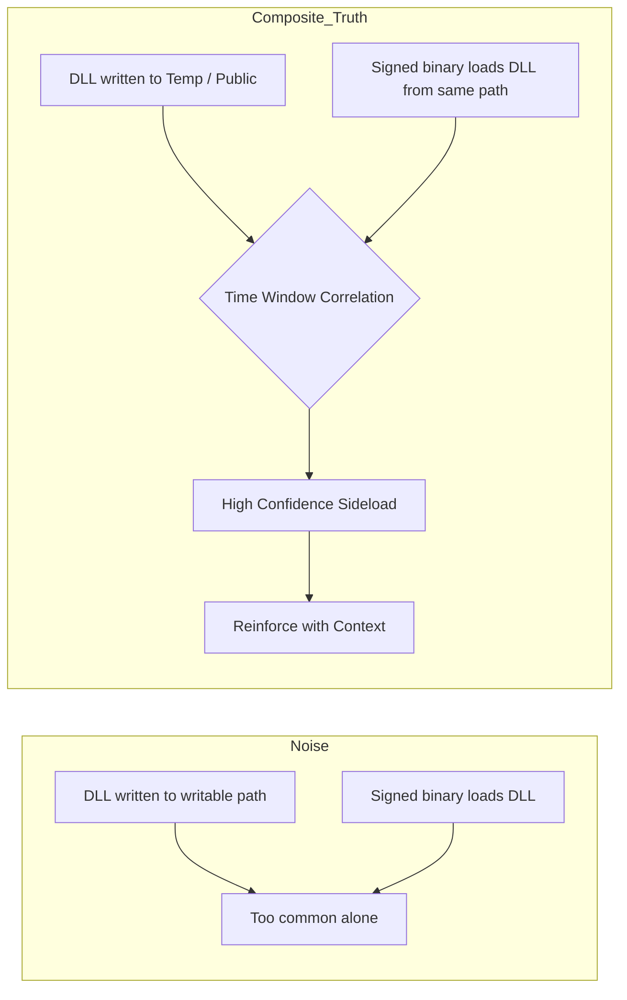
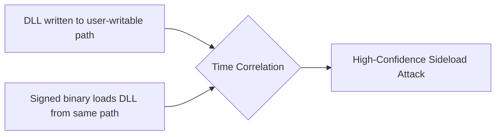

# ATTRIBUTION-NONCOMMERCIAL-SHAREALIKE 4.0 INTERNATIONAL (CC BY-NC-SA 4.0)

Copyright (c) 2026 Ala Dabat. All Rights Reserved.

This work (including all KQL queries, detection logic, documentation, and the "Minimum Truth" Framework architecture) is licensed under the Creative Commons Attribution-NonCommercial-ShareAlike 4.0 International License.

## You are free to:
* **Share** — copy and redistribute the material in any medium or format.
* **Adapt** — remix, transform, and build upon the material.

## Under the following terms:
* **Attribution** — You must give appropriate credit to **Ala Dabat**, provide a link to the license, and indicate if changes were made. You may do so in any reasonable manner, but not in any way that suggests the licensor endorses you or your use.
* **NonCommercial** — You may **NOT** use the material for commercial purposes (e.g., selling these rules, including them in a paid product, or putting them behind a paywall).
* **ShareAlike** — If you remix, transform, or build upon the material, you must distribute your contributions under the same license as the original.

---
**View the full Legal Code here:** https://creativecommons.org/licenses/by-nc-sa/4.0/legalcode


> [!NOTE]
> **Operational Calibration & Testing**
>
> These detection rules are architected for **logical correctness** and **high-fidelity signal extraction**. Validation was performed in an isolated **ADX-Docker** environment to ensure attack-truth and logic integrity using Empire threat telemetry & Atomic Red-Team.
>
> Please note:
> * **Baselines:** Final noise tuning and allow-listing require specific tenant telemetry and administrative context.
> * **Syntax:** Minor syntax variances (e.g., path escaping) may exist due to the difference between Docker-hosted Kusto and live Cloud schemas.
> [!IMPORTANT]
> **Operational Readiness & Integrity**
>
> * **Not "Plug-and-Play":** This is not a copy-paste production repository. Every rule here is considered **untested** unless accompanied by "receipts"—specifically ADX-Docker Empire telemetry results and dedicated documentation.
> * **Engineering vs. Scripting:** This is a record of engineering work, not a basic KQL collection. It represents the iterative process of testing, tuning, and refining logic from scratch.
> * **The Evolution:** While my legacy POC repositories contain the "brittle monoliths" of my early career, this composite section represents the philosophy of true detection engineering.
> * **Originality:** Nothing in this repository is copied; nothing has been borrowed. This documentation is designed to teach a way of thinking. 
> * **The Goal:** As anyone who has been in the trenches knows: engineering freedom is only found when architecture becomes simple, reductive, and easy to understand.
> 
> **This is "Detection-As-Code" in its purest form.** (Fully automated CI/CD pipeline section currently under development)

# Threat Hunting Philosophy & Detection Design

**Author:** Ala Dabat - This is a framework and a methadology I myself have created from hard earned trial and error. </br>
**Focus:** Practical, adversary-informed threat hunting for real SOC environments  
**Audience:** L2 / L2.5 Threat Hunters, Detection Engineers, Security Leads  


---

## Why This Repository Exists

Most SOCs struggle with threat hunting not because they lack tools, but because:

- Detections are **over-engineered**
- Behavioural chains are **forced where they are not required**
- Analysts are overwhelmed by **noise disguised as intelligence**
- Rules are written without regard for **SOC operating reality**

This repository documents a **deliberate, operationally grounded methodology** for threat hunting that:

- Scales to real SOC teams
- Preserves signal fidelity
- Reduces analyst fatigue
- Applies behavioural correlation **only when the attack requires it**
# Substrate-First vs Intent-First Minimum Truth  
## Refining the Minimum Truth Layer in Composite Detection Engineering

**Author:** Ala Dabat  
**Framework Alignment:** Minimum Truth → Reinforcement → Scoring → Narrative Convergence  
**Purpose:** Formalize the distinction between *substrate-first* and *intent-first* minimum truth anchoring within detection engineering using PowerShell as the reference substrate.

---

# 1. Why This Matters

In composite detection engineering, the **Minimum Truth** defines the non-negotiable event that must exist for malicious behavior to be possible.

There are two valid anchoring strategies:

- **Substrate-First Minimum Truth**
- **Intent-First Minimum Truth**

Explicitly separating these completes the framework and prevents:

- Over-broad noisy rules  
- Over-fitted brittle intent assumptions  
- Confusion between observability and attacker intent  

---

# 2. Substrate-First Minimum Truth

## Definition

A detection anchored on the **execution substrate itself**, without requiring proof of malicious intent at the minimum truth layer.

It answers:

> “Did the execution surface exist?”

---

## Example: PowerShell Substrate-First

### Minimum Truth

PowerShell execution occurred.

```kql
DeviceProcessEvents
| where FileName in~ ("powershell.exe", "pwsh.exe")
```

That is the substrate. Nothing more.

---

## Characteristics

- High observability  
- Broad coverage  
- Requires reinforcement to gain confidence  
- Suitable for L1 / atomic sensor logic  
- Ideal for correlation-driven architectures  

---

## Reinforcement Examples (Required for Confidence)

```kql
// Suspicious parent relationship
| where InitiatingProcessFileName in~ ("winword.exe","excel.exe","outlook.exe","wscript.exe","cscript.exe")
```

```kql
// External egress shortly after execution
DeviceNetworkEvents
| where InitiatingProcessFileName in~ ("powershell.exe","pwsh.exe")
| where RemoteIPType == "Public"
```

Substrate-first truths are not alerts.  
They are signal generators.

---

# 3. Intent-First Minimum Truth

## Definition

A detection anchored on a **malicious execution primitive**, not just the substrate.

It answers:

> “Did this substrate perform an action that implies attacker capability?”

---

## Example: PowerShell Intent-First

### Minimum Truth

PowerShell executed a high-risk primitive.

```kql
DeviceProcessEvents
| where FileName in~ ("powershell.exe","pwsh.exe")
| where ProcessCommandLine has_any (
    "Invoke-WebRequest",
    "DownloadString",
    "FromBase64String",
    "IEX",
    "Add-Type",
    "-EncodedCommand"
)
```

Here, execution alone is not sufficient.  
The primitive implies capability.

---

## Why Intent-First Is Stronger

PowerShell execution is common.

PowerShell performing:

- In-memory execution  
- Payload decoding  
- Remote retrieval  
- Direct code execution  

is not common in normal enterprise workflows.

Intent-first anchoring raises base confidence.

---

# 4. Comparative Model

| Feature | Substrate-First | Intent-First |
|----------|----------------|--------------|
| Anchor | Execution surface | Malicious primitive |
| Noise | Higher | Lower |
| Reinforcement dependency | High | Moderate |
| Coverage | Broad | Focused |
| Tier suitability | L1 / Sensor | L2 / Composite |

---

# 5. Composite Framework Integration

Your framework becomes structurally complete when both are explicitly defined.

### Layered Model

#### Sensor Layer (Substrate-First)

```kql
DeviceProcessEvents
| where FileName in~ ("powershell.exe","pwsh.exe")
```

Purpose: Generate execution visibility.

---

#### Intent Layer (Intent-First)

```kql
DeviceProcessEvents
| where FileName in~ ("powershell.exe","pwsh.exe")
| where ProcessCommandLine has_any ("Invoke-WebRequest","DownloadString","IEX")
```

Purpose: Anchor malicious capability.

---

#### Reinforcement Layer

- Suspicious parent  
- Rare command-line fingerprint  
- External egress  
- Privileged user context  

---

#### Scoring Layer

- Substrate truth = low base score  
- Intent truth = higher base score  
- Reinforcement = additive  
- Safe overlays = subtractive  
- High-risk floor logic prevents score burial  

---

# 6. Final Principle

Substrate enables execution.  
Intent reveals capability.  
Reinforcement confirms context.  
Scoring determines priority.  
Narrative convergence defines incident reality.

---

# 7. One-Sentence Summary

Substrate-first truth observes *where* execution occurred.  
Intent-first truth observes *what* was done with it.  

Both are valid.  
The engineer chooses the tier intentionally.
---

## Core Philosophy (TL;DR)

> **Start with the minimum truth required for the attack to exist.**  
> Everything else is reinforcement — not dependency.

If the baseline truth is not met, the attack **is not real**.


---

## Detection Maturity Model Used

### 1. Reductive Baseline (Truth First)

Every attack technique has a **minimum condition that must be true**.

If that condition is not met, the detection should not exist.

**Examples:**
- LSASS credential theft → *LSASS must be accessed*
- Kerberoasting → *Service tickets must be requested using weak encryption*
- OAuth abuse → *A cloud app must request high-risk scopes*

This prevents speculative or assumption-driven hunting.

---

### 2. Composite L2 / L2.5 Hunts (Default)

Most attacks do **not** require full behavioural chains.

Instead, this repository focuses on **Composite Hunts** that:
- Group **related high-signal indicators**
- Prefer **single telemetry sources** where possible
- Use minimal joins only when unavoidable

This is where **most effective threat hunting lives**.

---

### 3. Reinforcement (Confidence, Not Dependency)

Once baseline truth is met, confidence is increased using:
- parent / child execution context
- suspicious paths or arguments
- network proximity
- rarity / prevalence

Reinforcement:
- improves fidelity
- reduces noise
- **never defines the attack**

---

### 4. Behavioural Chains (Used Sparingly)

Behavioural correlation is used **only when the attack cannot exist without it**.

**Example:** DLL sideloading  
A DLL drop alone is benign.  
A DLL load alone is benign.  
The attack is only true when **both occur together**.

---

## Composite Threat Hunt Portfolio


##  Tier-1 Baseline Pack (Enterprise Mandatory Ecosystems) - SAMPLE

These are the **minimum required behavioural ecosystems** for any regulated enterprise (finance, insurance, gov).

> Always-on coverage. High-value truths. SOC-safe baselines.

| Ecosystem | Minimum Truth Sensor (Baseline) | Composite Hunt Built | Reinforcement Tuned | Atomic Validated | Maturity |
|----------|--------------------------------|----------------------|---------------------|------------------|----------|
| **PowerShell Execution & Abuse** | Script execution + encoded/runtime intent | ✅ Yes | ⚠️ Partial | ⚠️ In Progress | MED |
| **Registry Autoruns (Run/RunOnce)** | RegistryValueSet on logon trigger keys | ✅ Yes | ✅ Strong | ✅ Tested | HIGH |
| **Scheduled Tasks (CLI Creation)** | `schtasks.exe /create` process truth | ✅ Yes | ✅ Strong | ✅ Tested | HIGH |
| **Scheduled Tasks (Silent TaskCache)** | TaskCache persistence without schtasks.exe | ✅ Yes | ⚠️ Needs Noise Calibration | ⚠️ In Progress | MED |
| **Service Persistence (ImagePath)** | Service registry ImagePath modification | ⚠️ Partial | ❌ Not Tuned | ❌ Not Yet | LOW |
| **Credential Access (LSASS Surface)** | LSASS access/dump behavioural truth | ✅ Yes | ⚠️ Partial | ⚠️ In Progress | MED |
| **NTDS / SAM Extraction** | Hive/NTDS interaction truth | ✅ Yes | ⚠️ Partial | ❌ Not Yet | MED |
| **LOLBins Proxy Execution Core** | Signed binary misuse surface | ✅ Yes | ⚠️ Needs Baselines | ❌ Not Yet | MED |
| **Cloud Identity Persistence (OAuth Consent)** | High-risk scope grant baseline truth | ✅ Yes | ✅ Strong | ⚠️ Tenant Validation Needed | HIGH |

---

##  Tier-2 Composite Correlation Pack (Senior Threat Hunting Layer)

Tier-2 introduces:

- Multi-surface joins  
- Prevalence reinforcement  
- Kill-chain convergence  
- Noise suppression through context  

These are **SOC-safe composites** built on Tier-1 truths.(SAMPLE)

| Ecosystem | Minimum Truth Anchor | Composite Reinforcement Layer | Status | Maturity |
|----------|----------------------|------------------------------|--------|----------|
| **Registry Hijacks (IFEO/COM/AppInit)** | Execution interception registry truth | Writable DLL + rare writer + untrusted signer | ⚠️ Partial | MED |
| **WMI Persistence + Execution** | Subscription + anomalous consumer truth | Parent lineage break + script consumer scoring | ✅ Built | HIGH |
| **Lateral Movement (SMB Service Exec / PsExec)** | Remote service creation truth | File drop + inbound 445 + rare service binary | ⚠️ Partial | MED |
| **Defense Evasion (Signed LOLBin Chains)** | Trusted parent → LOLBin baseline | Injection + ghost module + beacon reinforcement | ⚠️ POC → Composite | MED |
| **Session / Token Misuse (Post-Consent)** | Token replay baseline truth | ASN+UA divergence + weak auth reinforcement | ✅ Built | HIGH |
| **Ingress Tool Transfer** | Writable staging drop truth | Followed by execution + outbound comms | ⚠️ In Progress | MED |
| **Shadow Copy Destruction (Ransomware Prep)** | vssadmin/wmic delete truth | Multi-tool convergence scoring | ❌ Missing | LOW |
| **Archive Staging + Exfil Prep** | 7z/rar bulk staging truth | Large volume + outbound correlation | ❌ Missing | LOW |

---

##  Tier-3 Research & Novel Threat Ecosystems (POC + Emerging Tradecraft) - SAMPLE

Tier-3 covers:

- Emerging malware ecosystems  
- Patch-resistant persistence chains  
- Novel attacker innovation  

These are not always-on detections yet — they are **attack research sensors**.

| Threat Ecosystem | Research Truth Anchor | Status | Notes |
|-----------------|----------------------|--------|------|
| **React2Shell / IIS Exploit Chains** | Web process → CLR abuse → injection | ✅ Modelled | Requires telemetry hardening |
| **EtherRAT / Blockchain C2** | RPC beaconing + low-prevalence infra | ✅ Documented | Network correlation expansion needed |
| **SilverFox / ValleyRAT BYOVD** | Signed loader → sideload → driver load truth | ⚠️ Advanced Composite | Needs DriverLoadEvent validation |
| **Pulsar RAT Injection + Tasks** | Trusted parent → LOLBin → memory exec | 🟡 Parked POC | Awaiting confirmed ecosystem truth |
| **Kernel Driver Abuse (BYOVD)** | Driver service creation + load event | ⚠️ Partial | High impact, tuning required |
| **Supply Chain Behaviour Modelling** | Signed update → anomaly divergence | ✅ Threat Modelled | Tier-2 rule ownership pending |

---

#  Repository Architecture Alignment

This ecosystem model maps directly into the GitHub structure:

| Repository | Role in Framework |
|-----------|------------------|
| **ADX-Tested-Composite-Threat-Hunting-Rules** | Tier-1/Tier-2 deployable composites |
| **Attack-Ecosystems-and-POC** | Tier-3 novel threats + emerging tradecraft |
| **THREAT-MODELLING-SOP-Behavioural-Patch-Resistant-TTPs** | Architectural doctrine + design rules |

---

## Built-In Hunter Directives (Non-Negotiable)

Every composite hunt produces **guidance alongside results**, not after.

Each rule outputs a `HunterDirective` (or equivalent) that answers:

1. **Why** this fired (baseline truth)
2. **What** reinforces confidence
3. **What** to do next

**Example:**
> *HIGH: LSASS accessed by non-AV process using dump-related command line.  
> Action: Validate tool legitimacy, scope for lateral movement, escalate to L3.*

---

## Why Composite Hunts Matter (Example)

DLL sideloading is a technique that **cannot be confirmed from a single event**.



# Architectural Strategy: When to Split vs. Composite  
## Decision Framework: The **Minimum Truth** Doctrine

This repository follows a strict architectural rule for defining the boundaries of a **Composite Detection**:

- We **do not** group rules by *MITRE Tactic* (“all Persistence in one query”).
- We group rules by **Attack Surface Ecosystem** (the operational domain where the *same kind* of truth is observable).

A **Composite Rule** enforces context around a **single coherent stream of activity** (same mechanism, same telemetry surface, same “truth”).  
If the logic must jump across **different execution mediums**, **schemas**, or **transport mechanisms**, the rule is **split** into a sibling hunt.

> **Mental model:**  
> **The detection rule is the sensor.**  
> **The incident/case is the narrative that stitches sensors into an attack story.**

---

##  Cousin Rules & Attack Ecosystem Coverage

Part of this framework’s power is the **Cousin Rule Concept**:

> When a high−fidelity composite is created for one execution surface in an attack ecosystem, its *cousin* is the adjacent execution surface that shares the same adversary goal but lives in a different **noise domain**.  
> Cousin rules are **separate but paired** — they do not mix truth anchors with noisy signals that dilute fidelity.

### Definition

**Cousin Rules:**  
For any given detection composite, a cousin rule is the *paired counterpart* in the same attacker ecosystem that:

- Represents a **different execution/persistence surface**
- Shares the same **attack intent**
- Requires **stricter noise gating**
- Is structured as a **twin detection module**
- Improves **ecosystem coverage** without breaking rule fidelity

This table maps your composites to ecosystems and their cousins, with MITRE technique groupings.

---

## Cousin Ecosystem Discovery (Empirical Validation)

This framework is not built on theoretical MITRE grouping — it is built on **empirically discovered cousin ecosystems**.

Cousin rules represent:

- adjacent attack surfaces
- the same attacker capability expressed through different telemetry anchors
- reinforcement without monolithic kill-chain correlation

All cousin relationships in this repository are validated through:

- **ADX-Docker simulation**
- **Empire-style telemetry**
- repeated convergence across persistence + execution surfaces

 Full living discovery journal here:  
**Cousin_Discovery_Log.md** → https://github.com/azdabat/Production-READY-Composite-Threat-Hunting-Rules/blob/main/Cousin_Discovery_Log.md

---

## Ecosystem Table — Composites + Cousins (Roadmap)

| Ecosystem | Primary Composite | MITRE Technique | Cousin Composite (Planned/POC) | MITRE | Notes |
|-----------|------------------|------------------|-------------------------------|-------|-------|
| **Registry Persistence** | `Registry_Persistence_Background_Service_TaskCache` | T1543.003, T1053.005 | *Registry Persistence (Alternate Anchors)* | T1543, T1053 | e.g., HKEY_CLUSTER_SERVICE, COM task persistence |
| | `Registry_Persistence_Hijack_Interception` | T1546.* (IFEO/COM/AppInit) | *Registry Hijack Cousins* | T1546.* | e.g., Winlogon handler, shell open interception |
| | `Registry_Persistence_Userland_Autoruns` | T1547.001/014/004 | *Userland Autoruns Cousin* | T1547.* | e.g., Policies RunOnce, ActiveSetup deep variants |
| **Scheduled Task Execution** | *(covered by TaskCache + Registry pers.)* | T1053.005 | `ScheduledTask_Execution_TwinRule` | T1053.005 | svchost/taskeng based exec (no schtasks.exe) |
| **Service Execution** | `SMB_Service_Execution` | T1021.002 / T1543.003 | `Service_Exec_ScheduleTask_Cousin` | T1053.005 | svchost scheduler execution surface |
| **Lateral Movement** | `SMB_Service_Lateral` | T1021.002 | `WMI_RemoteExec_Cousin` | T1021.006 | remote process via WMI |
| |  |  | `WinRM_Exec_Cousin` | T1021.004 | PowerShell/WinRM lateral |
| **Execution (LOLBins/Proxy)** | `TrustedParent_LOLBin_InMemoryInjection_Chain` | T1218 / T1055 | `TaskExec_LOLBin_Injection_Cousin` | T1218/T1055 | LOLBin launched from Scheduled Task surface |
| **Credential Access** | *(existing rule needed)* | T1003 | `LSASS_Access_Cousin` | T1003.001 | DCSync / NTLM Harvest twin |
| **Identity Abuse (OAuth/Token)** | *(MITRE coverage from threat model SOP)* | T1621 / T1078.004 | `Identity_ConsentGrant_Cousin` | T1621 | Token replay vs lateral token misuse |
| **Persistence (File/Driver)** | *(POC/Research)* | T1547 / T1543 | `Driver_Persistence_Cousin` | T1543.008 | KMDF/Driver load surface |
---

## Ecosystem Design & Architecture (Where the “Cousins” Concept Lives)

This repository isn’t a random collection of hunts — it’s organised as **ecosystem coverage**.

Each rule is built as a **clean sensor** using the same doctrine:

- **Minimum Truth** (the non-negotiable anchor that proves the technique exists)
- **Reinforcement** (confidence boosters, not dependencies)
- **Noise Suppression** (tenant reality: allowlists/baselines)
- **Hunter Directives** (SOC-ready next steps + pivots)

Some ecosystems are **attack-surface ecosystems** (same surface, many variants), while others are **cousin-based ecosystems** (same attacker intent, different truth surfaces — separate sensors by design).

Full design doctrine, naming strategy, and the complete ecosystem model (including cousin mapping and split/keep rules) lives here:

https://github.com/azdabat/Production-READY-Composite-Threat-Hunting-Rules/blob/main/Ecosystem_Deaign_Architecture.md

--- 

## Framework Logic Behind Cousin Pairing

The cousin concept is not just “another rule.” It is based on these principles:

### 1. **Different Noise Domain**
Each cousin lives in a parallel surface that has a *different operational noise profile*.

Example:
- `services.exe` service exec rule — low noise → can be aggressive  
- `svchost.exe` scheduled task exec — high noise → needs strict anchors

Both cover lateral movement, but the host process and noise pattern differ.

---

### 2. **Separate Truth Anchors**
Never mix truth anchors across cousins.

Your Service rule anchors on:
```
services.exe spawning an uncommon child (baseline truth)
```
Your Scheduled Task cousin anchors on:
```
Explicit task create/exec signals
AND/OR Task XML drops/TaskCache registry writes
```

These are logically adjacent, but not the same anchor.

---

### 3. **Composite Isolation**
Coupling them in one rule breaks:
- noise suppression
- operational fidelity
- analyst clarity

Keeping them **separate maintains precision**.

---

### 4. **Ecosystem Continuity**
Every primary composite should answer four questions:

1. **What is the attack surface?**  
2. **What is the minimum truth anchor?**  
3. **What adjacent surfaces share intent?**  
4. **What cousin composites must exist to cover those surfaces?**

This ensures coverage without noise dilution.

---

## Roadmap Example — From Primary to Cousin

###  Registry Persistence Ecosystem
- Primary: Background/Service/TaskCache writes  
- Cousin 1: Registry interception (IFEO/COM/AppInit)  
- Cousin 2: Extended run keys (Policies/Explorer/ActiveSetup)  
- Cousin 3: Shell/Handler persistence

###  Lateral Movement Ecosystem
- Primary: SMB service execution  
- Cousin 1: Scheduled Task execution  
- Cousin 2: WMI remote execution  
- Cousin 3: WinRM remote execution  
(*add based on telemetry available*)

###  Execution / Injection Ecosystem
- Primary: Trusted parent → LOLBin → injection  
- Cousin 1: Task-spawned LOLBin → injection  
- Cousin 2: PSExec/Impacket injection path

###  Identity Ecosystem
- Primary: Consent grants (persistence)  
- Cousin 1: Token replay events  
- Cousin 2: Conditional Access bypass indicators

---

##  How to Use these Tables

When you build a composite rule:
1. Locate the ecosystem (e.g., Persistence, Lateral, Execution)
2. Identify primary rule anchor
3. Populate known cousins in the same ecosystem
4. For each cousin:
   - Define a distinct **Minimum Truth** anchor
   - Add **Reinforcement signals**
   - Enforce **Noise suppression**
   - Produce a **HunterDirective**
5. Test cousin rule in ADX / lab
6. Document in GitHub with screenshots

---

##  Why This Section Matters

- Avoids **unstructured rule proliferation**
- Ensures **systematic coverage**
- Helps you **plan a roadmap**
- Provides clarity for future reviewers
- Builds a **repeatable ecosystem matrix**

---

## How to Expand

You can later add columns for:

- Risk Score ranges  
- Known false positives suppressed  
- Required telemetry  
- Prevalence thresholds

---

## 1) The Four Rules of Detection Architecture

###  Rule 1 — Split when the **Minimum Truth** changes
If the non-negotiable baseline event (“truth”) requires a fundamental **schema change**, **telemetry change**, or **mechanism change**, **SPLIT**.

**Examples of “Minimum Truth” shifts**
- Host process execution → identity log transaction  
- API call telemetry → artifact registry/file telemetry  
- SMB/Service lateral movement → WMI/DCOM lateral movement  
- DNS protocol telemetry → HTTP protocol telemetry
   
### Caveats For when we - Split only when the **Minimum Truth Anchor** changes

Split a composite when the *non-negotiable baseline event* changes in mechanism.

The **Minimum Truth Anchor** is the single unavoidable attacker action the rule is built on.

 Reinforcement signals may cross telemetry surfaces (process, registry, file, network)  
**as long as they remain optional and do not replace the baseline truth.**

---

#### Split when the anchor mechanism changes:

- `services.exe` execution truth → `svchost(schedule)` execution truth  
- SMB lateral movement truth → WMI/DCOM lateral movement truth  
- Endpoint execution truth → Identity sign-in truth  
- Named pipe C2 truth → HTTP beaconing truth  

These are different ecosystems and require separate rules.

---

#### Do NOT split when reinforcement crosses tables:

Example:

- Baseline truth = `svchost(schedule)` spawning suspicious child  
- Reinforcement = TaskCache registry artifacts  
- Reinforcement = Task XML drops  
- Reinforcement = Org prevalence rarity

The truth anchor remains execution — registry is supporting evidence, not the trigger.

---
## Essential To Remember

1) Truth Anchor = Sensor
2) Reinforcement = Evidence
3) Cousins = Adjacent sensors
4) Incident = Story stitching

**Truth defines the rule. Reinforcement strengthens it.**

---

###  Rule 2 — Split when the **noise domain** changes
If the rule would require a completely different allowlist/baseline strategy (e.g., SCCM vs developer automation vs DC replication), **SPLIT**.

---

###  Rule 3 — Split when the **telemetry surface** changes
Different primary tables/log sources = different sensors.

**Examples**
- `DeviceProcessEvents` ≠ `DeviceRegistryEvents` ≠ `SigninLogs` ≠ `DeviceNetworkEvents`

---

###  Rule 4 — Keep composite when you’re only refining **context**
Classification, scoring, enrichment, and “reinforcement” belong **inside** the rule *when the Minimum Truth stays the same*.

**Examples**
- Same process surface: different LOLBins doing the same intent
- Same network surface: different URIs/headers to the same destination category
- Same persistence surface: create vs change using the same tool and schema

---

## 2) Common Attack Ecosystems: Split vs. Keep Matrix (Comprehensive)

This matrix shows **real-world architectural decisions** across the **most common enterprise attack ecosystems**.

### Decision Matrix: Split vs. Keep

| Threat Ecosystem | Comparison Scenario | Decision | Architectural “Why” |
|---|---|---:|---|
| **Persistence: Scheduled Tasks** | `schtasks.exe /create` vs `Register-ScheduledTask` (PowerShell) | ✂️ SPLIT | Different truth surface: CLI process execution vs API/script abstraction. Different parsing + baselining. |
| **Persistence: Scheduled Tasks** | `schtasks.exe /create` vs `schtasks.exe /change` | ✅ KEEP | Same truth domain: same binary + schema. Intent differs but telemetry aligns. |
| **Persistence: Scheduled Tasks** | Task creation vs task execution telemetry | ✂️ SPLIT | “Creation” truth ≠ “Execution” truth. Separate
****

## Rarity & Organisational Prevalence (Used Correctly)

Rarity is **not** a detection trigger.  
It is a **prioritisation and confidence amplifier**.

In this methodology, **detection is driven by attack truth**, not by how uncommon an event is.  
Organisational prevalence is applied **only after** the baseline condition of an attack has been met.

> **If the minimum truth of the attack is not satisfied, rarity is irrelevant.**  
> **If the minimum truth *is* satisfied, rarity helps decide urgency and scope.**

### How Rarity Is Applied

Rarity is used in three safe, SOC-real ways:

### 1. Command / Behaviour Prevalence  
**Question:** *How many hosts in this organisation perform this exact behaviour?*

- Low prevalence (1–2 hosts) → likely targeted activity  
- High prevalence (many hosts) → possible tooling, deployment, or admin activity  

This is used to **prioritise triage**, not suppress alerts.

### 2. Parent / Actor Prevalence  
**Question:** *Who normally performs this action in this environment?*

- LOLBins launched by unusual parents (e.g. Office, WMI, script engines)  
- Privileged actions executed by unexpected users or service accounts  

This often surfaces **contextual malice** even when the binary itself is common.

### 3. Burst / Radius Prevalence  
**Question:** *How widely and how fast did this appear?*

- Single host → targeted intrusion  
- Multiple hosts in a short window → automation, lateral movement, or policy abuse  

This is especially effective for persistence, service creation, and credential access.

### What Rarity Is *Not* Used For

- Rarity is **never** a hard filter  
- Rarity does **not** determine whether an alert exists  
- Dangerous actions (e.g. LSASS access, illicit OAuth grants) are **always surfaced**, regardless of prevalence  

### Design Principle

> **Rarity decides how fast we respond — not whether we respond.**

This ensures:
- High-risk behaviour is never suppressed
- Analysts are not flooded with low-value noise
- Targeted attacks stand out without brittle logic

Rarity strengthens detection — it never replaces understanding.

---

## Organisational Prevalence (Used Correctly)

Organisational prevalence is one of the most misunderstood concepts in threat detection.

Many SOCs apply prevalence incorrectly as a blunt filter:

- “If it’s common, ignore it.”
- “If it’s rare, alert on it.”

This repository does **not** use prevalence that way.

---

### Core Principle

> **Prevalence is not a detection trigger.**  
> It is a *reinforcement and prioritisation amplifier* applied only after attack truth exists.

If the **Minimum Truth** is not satisfied, prevalence is irrelevant.

If the **Minimum Truth *is* satisfied**, prevalence helps determine urgency, scope, and analyst focus.

---

## Why Prevalence Exists in This Framework

Prevalence answers one operational question:

> **How normal is this behaviour in *this* organisation?**

Attack techniques do not exist in a vacuum.

The same command can be:

- benign in one environment  
- catastrophic in another  

Prevalence allows detection logic to remain behavioural, while still adapting to SOC reality.

---

## When Prevalence Should Be Applied

Prevalence is used only in three safe, SOC-real ways:

---

### 1. Behavioural Rarity (After Truth)

**Question:**  
How many endpoints exhibit this exact behaviour?

Example behaviours:

- PowerShell staging with suspicious parent  
- Registry persistence pointing to a user-writable path  
- Confirmed DLL sideload chain  

If only **1–2 devices** show this behaviour:

- likely targeted intrusion  
- deserves escalation  

If **200 devices** show it:

- may be tooling, deployment, or admin automation  

Prevalence helps prioritise — not suppress.

---

### 2. Actor / Parent Context Prevalence

**Question:**  
Who normally performs this action here?

Example:

- `rundll32.exe` launched by `winword.exe`
- Scheduled task created by a normal user account
- LSASS access by a non-security process

The binary may be common.

The **actor and execution context** may not be.

This is where prevalence becomes true reinforcement.

---

### 3. Burst / Radius Prevalence

**Question:**  
How fast and how widely did this appear?

- Single host → targeted persistence  
- Multiple hosts in minutes → lateral movement or automation  
- Domain-wide spread → ransomware precursor  

Prevalence here becomes an incident-shaping signal.

---

## What Prevalence Is *Not* Used For

This methodology explicitly avoids dangerous prevalence misuse:

- ❌ Rarity is never a standalone alert condition  
- ❌ Common ≠ safe  
- ❌ Rare ≠ malicious  
- ❌ High-risk truths are never suppressed  

Example:

- LSASS access is always surfaced  
- OAuth illicit consent is always surfaced  
- Silent scheduled task persistence is always surfaced  

Regardless of prevalence.

---

## Simple Example (Clear as Day)

### Scenario: Scheduled Task Persistence

**Minimum Truth (Attack Exists):**

A task is registered that launches PowerShell from a suspicious location:

```kql
RegistryValueData has "powershell"
and RegistryValueData has "\\users\\public\\"
```

- That is already persistence.
- Now prevalence is applied after this truth.


## Organisational Prevalence Reinforcement

```kql
| summarize DeviceCount = dcount(DeviceId) by TaskFingerprint
| extend IsRare = DeviceCount <= 2
```

Interpretation:

a) If this persistence appears on 1 device → likely intrusion
b) If it appears on 300 devices → likely software deployment or misconfigured IT script
c) The detection does not disappear.
d) The response priority changes.
e) Detection Engineering Rule

**Prevalence decides how fast we respond — not whether we respond.**

This ensures:

1) High-risk attack truths are never hidden
2) Analysts are not flooded with background noise
3) Targeted tradecraft stands out naturally

**Composite hunts remain operationally grounded**

- Prevalence strengthens detection.
- It never replaces understanding.

# Summary

Minimum Truth defines the attack.
Reinforcement increases confidence.
Prevalence scales triage.

---

## Correlation vs. Ghost Chains (When Joins Become Fragile)

Correlation is one of the most powerful tools in behavioural detection.

It is also one of the easiest ways to destroy signal quality.

Most SOCs do not fail because they lack correlation.

They fail because they correlate *everything*.

This framework treats correlation as a scalpel, not a net.

---

## Core Principle

> **Correlation is only valid when the attack cannot exist without multiple linked events.**

If the technique is already true from one event stream,  
forcing joins creates noise, brittleness, and false narratives.

---

## What Is a “Ghost Chain”?

A **Ghost Chain** is when a detection query stitches together unrelated activity
into a fake kill-chain story.

This happens when:

- events are common background noise  
- time windows are arbitrary  
- joins are used to “make it look advanced”  
- the attacker does not actually need all stages  

The result is:

- high severity alerts  
- low analyst trust  
- broken triage  
- missed real attacks hiding nearby  

---

## Why Ghost Chains Are Dangerous

Correlation introduces **dependency**:

- If one telemetry source is missing → detection fails  
- If events happen outside the window → detection fails  
- If normal activity overlaps → false chain forms  

This is why monolithic “kill-chain mega rules” collapse in production.

---

## The Framework Rule

> **The Detection Rule is the sensor.  
> The Incident is the narrative.**

We do not force one query to tell the whole story.

We deploy clean sensors, then correlate at the case/incident level.

---

## When Correlation IS Required (True Composite Truth)

Correlation is mandatory when:

> No single event proves the technique.

### Example: DLL Sideloading

A DLL drop alone is benign.  
A DLL load alone is benign.  

The attack is only true when both occur together.



## When Correlation Is NOT Required (Ghost Risk)

**Example: Registry Persistence**

If a registry Run key is set to:

```
powershell.exe -enc <payload>
```


That is already persistence.

You do not need to join it with:
- network events
- unrelated PowerShell execution
- scheduled task execution
- lateral movement

**Those may happen later, but they are not required for truth.**

Forcing them creates ghost chains.

Simple Example (Clear as Day)
❌ Bad Correlation (Ghost Chain)
// Registry persistence
RegistryValueSet
| join NetworkConnection
| join ProcessInjection
| where all within 10 minutes


Why this fails:

- persistence may be set today
- execution may happen tomorrow
- network traffic may be unrelated
- injection may never occur

This produces fake kill-chain certainty.

Correct Architecture (Truth First)

## Composite Rule 1: Persistence Sensor
```kql
DeviceRegistryEvents
| where RegistryKey has "\\Run"
| where RegistryValueData has "powershell"
```


Truth: persistence exists.

Composite Rule 2: Runtime Loader Sensor

```kql
DeviceEvents
| where ActionType == "PowerShellScriptBlock"
| where AdditionalFields has "VirtualAlloc"
```
Truth: in-memory execution intent exists.


##Composite Rule 3: Silent Task Sensor

```kql
DeviceRegistryEvents
| where RegistryKey has "\\Schedule\\TaskCache"
| where RegistryValueData has "-enc"#
```

Truth: task persistence exists.

Incident-Level Correlation (Narrative Layer)

Now Sentinel/MDE correlates:
a) same device
b) same user
c) same timeframe
d) multiple truths firing

This builds the attack story correctly.

## Operational Rule of Thumb

Correlate inside a rule only when:

-the technique cannot exist without both events
- the telemetry sources are stable
- the join reduces ambiguity, not increases complexity

Split into sibling composites when:

1) the truth surface changes
2) the noise domain changes
3) the attacker method is optional
4) the timing may vary

# Summary

Correlation is not sophistication.
Correlation is dependency.

Use it only when:

- The attack truth structurally requires convergence.

Otherwise:

- detect the truth
- reinforce confidence
- correlate at the incident layer
- This prevents ghost chains and keeps hunts operational.

- # Composite Rule Template v1.0 (Minimum Truth → Reinforcement → Convergence)

This is the fixed structure I use for all production-grade behavioural detections.

It prevents “runaway hunts”, keeps rules explainable, and ensures every detection is anchored in a single observable truth.

---

## 1. Minimum Truth (Baseline Anchor)

Every composite hunt begins with **one non-negotiable behavioural truth**:

> The one event that *must* exist if the technique is happening.

Examples:

| Ecosystem | Minimum Truth Anchor |
|----------|----------------------|
| Scheduled Task Abuse | `svchost.exe (Schedule)` spawning abnormal child |
| Service Lateral Movement | `services.exe` spawning uncommon binary |
| Registry Persistence | `RegistryValueSet` in autorun/hijack keys |
| OAuth Consent Abuse | High-risk scope grant event |
| Named Pipe C2 | Rare pipe creation matching implant family |

**Minimum Truth is necessary — but never sufficient.**

By itself, it is often noisy.

---

## 2. Why Truth Alone Is Noisy

A baseline anchor is usually observable in benign operations:

- Windows maintenance tasks  
- Installer behaviour  
- Admin activity  
- Software updates  
- Background services  

So we never alert on truth alone.

Truth is only the starting point.

---

## 3. Reinforcement (Confidence Builders)

Reinforcement answers:

> “What makes this baseline *depart from normal*?”

These are **secondary signals**, not new anchors.

Examples:

- Dangerous command-line primitives (`-enc`, `iex`, `rundll32`)
- User-writable execution targets (`AppData`, `Temp`)
- TaskCache registry artefacts
- Inbound SMB before execution
- Rare writer process (Org Prevalence)
- Suspicious parent process (Office → LOLBin)

Reinforcement increases score — it does not redefine truth.

---

## 4. Convergence (Where Noise Becomes Threat)

A detection becomes high-confidence when:

> Multiple reinforcements intersect within a time window.

This is **Convergence**:

Minimum Truth
Reinforcement A
Reinforcement B
Context Window = Behavioural Threat
Example:

- `svchost.exe (Schedule)` spawns PowerShell  
- AND inbound SMB happened within 20 minutes  
- AND TaskCache artefacts exist  
→ Empire-style lateral movement

That intersection is where malicious behaviour begins.

---

## 5. Noise Suppression (Do Not Dilute Fidelity)

Noise suppression is not optional.

Every rule must suppress:

- Safe vendor binaries
- Known update processes
- Common task/service children
- Background OS churn

Rules should remain:

- quiet
- high-fidelity
- behaviour-first

If suppression breaks the hunt, the baseline is wrong.

---

## 6. Org Prevalence (Rarity Reinforcement)

Org prevalence is a prioritisation multiplier:

> “How common is this binary or behaviour across the estate?”

Example:

- Writer SHA seen on 1 host → targeted attack likelihood ↑  
- Writer SHA seen on 300 hosts → admin tool likelihood ↑  

Prevalence is never truth.

It is reinforcement.

---

## 7. Scoring Model (Cumulative, Not Binary)

All composites output a severity score:

- Baseline truth = fixed base score
- Reinforcements add weight
- Rare behaviours add weight
- Safe baselines subtract weight

Example:

BaseScore (Truth)         = 60
TaskCache Artefact        = +20
Dangerous Primitive       = +20
File Drop Reinforcement   = +15
Rare Writer               = +10
FinalScore                = 125 (CRITICAL)


This prevents brittle yes/no alerting.

---

## 8. Hunter Directives (Operational Output)

Every rule ends with:

- What this means
- What to pivot into next
- How to scope blast radius
- When to escalate immediately

Rules are not just detections.

They are SOC-ready playbooks.

---

# ✅ The Rule Factory Checklist

Before publishing any hunt, I confirm:

| Requirement | Present? |
|------------|----------|
| Minimum Truth is 1 clear anchor | ✅ |
| Reinforcement is limited (2–4 max) | ✅ |
| Convergence window exists | ✅ |
| Noise suppression is explicit | ✅ |
| Org prevalence is optional scoring only | ✅ |
| Severity is cumulative | ✅ |
| Output is SOC actionable | ✅ |

---

# The Golden Rule

> If I cannot explain the hunt in 60 seconds, it is too complex.

Composite engineering is clarity, not bloat.

---

## Operationalising This Framework (Production Deployment)

This repository is not a collection of isolated hunts — it is designed to run as a **Minimum Truth sensor ecosystem** in production.

Each Composite Rule is deployed as an always-on detection **sensor**:

- **Truth Anchor** defines the technique
- **Reinforcement** increases confidence (not dependency)
- **Cousin Rules** provide adjacent surface parity
- **Attack Ecosystem chaining** creates incidents without monolithic kill-chain queries

### Production Model (Two-Layer Correlation Only)

Operational correlation happens **outside** individual rules:

1. **Cousin Confirmation**  
   Multiple cousins firing = capability confirmed at higher confidence  
   (e.g., TaskCache persistence + schtasks classifier)

2. **Attack Story Chaining**  
   Multiple attack-stage truths converging = intrusion incident  
   (Ingress → Execution → Persistence)

### Full Deployment Specification

The complete operational correlation + Sentinel engineering model lives here:

 **Operational Correlation & Deployment Guide**  
https://github.com/azdabat/Production-READY-Composite-Threat-Hunting-Rules/blob/main/Operational_Correlation_Deployment.md

This is how Tier-1 composite truths become Tier-2 incidents — **without monoliths, without ghost chains, and without noise collapse.**

---

## Rules That Sit *Outside* Ecosystems (Router / Surface Composites)
**The final piece of the Puzzle**

Not every Composite Hunt belongs inside a single attack ecosystem.

In production, there is a second class of rules:

> **Router Rules** (Surface Aggregators)

These are *not* deep ecosystem truths.  
They are wide, low-cost detectors that identify **persistence intent across multiple surfaces**, then route the analyst into the correct ecosystem composite.

---

### Two Rule Types in This Framework

This framework contains **two distinct composite classes**:

---

### Type 1 — Ecosystem Truth Rules (Deep Composites)

These rules anchor to a single ecosystem and prove a minimum truth artifact.

They answer:

> “Is this specific attack mechanism real?”

Examples:

- **Scheduled Task Ecosystem**
  - Minimum truth: Task creation + payload execution path

- **Registry RunKey Ecosystem**
  - Minimum truth: Run/RunOnce write + writer context

- **WMI Permanent Subscription Ecosystem**
  - Minimum truth: scrcons substrate + consumer/binding artifacts

These rules are high-fidelity and ecosystem-pure.

---

### Type 2 — Router / Surface Rules (Outside Ecosystems)

These rules sit *above* ecosystems.

They do not prove one mechanism.

They answer:

> “Is persistence being attempted anywhere, and where should we pivot next?”

They detect broad intent across multiple persistence surfaces:

- Tasks  
- Services  
- Run keys  
- WMIC adjacencies  
- PowerShell persistence creation  

They are **directional sensors**, not final truth.

---

## Clear-as-Day Example

### Router Rule Fires:

> `schtasks.exe /create ... powershell -enc ...`

Router output:

- Surface detected: Scheduled Task persistence intent  
- Severity: HIGH  
- Directive: Pivot into ScheduledTask_Abuse composite

This is not the full ecosystem truth yet.  
It is a persistence entry vector.

---

### Ecosystem Composite Confirms:

ScheduledTask_Abuse then proves:

- `/tr` payload path
- rundll32/script engine abuse
- writable directory staging
- rarity + reinforcement

Now persistence truth is confirmed.

---

## Why Router Rules Exist

Router rules solve the real SOC problem:

- Attackers do not stay in one ecosystem
- Analysts cannot run 12 deep composites manually
- Engineering teams need early surface visibility

Router rules provide:

- Fast detection
- Cheap scanning
- Correct ecosystem routing
- Consistent HunterDirectives

---

## Correct Deployment Model

### Step 1 — Deploy Router Sensors

Example:

- Persistence_Surface_Router_CorePlus.kql

Purpose:

- Flag persistence intent early
- Route analysts into the correct cousin ecosystem

---

### Step 2 — Ecosystem Composites Provide Truth

Examples:

- Scheduled_Task_Abuse.kql
- Registry_Persistence_Userland_Autoruns.kql
- WMI_Permanent_Subscription_Persistence.kql

These confirm the mechanism.

---

## Key Framework Rule

**Router rules detect intent.**  
**Ecosystem rules confirm truth.**

Router composites sit outside ecosystems by design.

This prevents monoliths while keeping full surface coverage.

---

# Architecture Doctrine: The "Minimum Truth" Framework

## 1. The Core Philosophy
In enterprise-scale environments (100k+ endpoints), traditional Detection Engineering fails at the database layer. The standard industry approach relies on "Monolithic Queries"—massive, multi-table `join` operations executed across raw telemetry. This results in query timeouts, extreme compute costs, and what we define as **"Bleak Outcomes."**

The **"Minimum Truth"** framework flips this paradigm. 

Instead of asking the database to correlate everything at once, we force the query to establish the absolute minimum baseline of malicious truth *first*, discard the rest of the noise, and only then enrich the surviving data.

### The Three Pillars of Minimum Truth:
1. **Filter Before You Join:** Never join two raw tables. Reduce the primary table to its most critical subset (the "Truth") before asking for context.
2. **Native Enrichment Over Joins:** Modern EDR schemas (like `DeviceRegistryEvents`) often contain implicit context (e.g., `InitiatingProcessFileName`). We extract and map these native fields to avoid costly `DeviceProcessEvents` joins entirely.
3. **Contextual Scoring, Not Binary Alerts:** Once the truth is established, we do not alert immediately. We route the surviving data through a convergence matrix to assign a mathematical Risk Score based on behavioral context.

---

## . Case Study: Registry Persistence (TaskCache)
To demonstrate this doctrine in production, we examine the `Registry_Persistence_Background_Service_TaskCache` rule. 

Advanced adversaries bypass standard `schtasks.exe` monitoring by interacting directly with the Registry TaskCache via COM/API. Tracking this requires querying `DeviceRegistryEvents`—one of the noisiest tables in any SIEM. A traditional join to find the process responsible would crash the tenant. 

Here is how the Minimum Truth framework solves this gracefully.

### Phase 1: Establish the Minimum Truth (The Funnel)
Instead of looking at all registry events, we immediately restrict the dataset to specific high-value keys and define our "Danger" and "Safe" parameters dynamically.

### Phase 2: The "Zero-Join" Process Mapping
*Notice the optimization in the code below.* Instead of executing a heavy `join` to `DeviceProcessEvents` to find out *who* wrote to the registry, we extract the `InitiatingProcess*` fields natively present in the optimized schema. This eliminates massive memory pressure.

### Phase 3: The "Safe Join" (Prevalence)
The only `join` permitted in this framework is an optimized, pre-summarized join. We summarize `DeviceFileEvents` down to a tiny `OrgPrevalence` table *first*, and then `leftouter` join it to our already-filtered Registry events. **Small table joined to small table.**

### Phase 4: Convergence Scoring
The remnant data is evaluated against a matrix (Is it a large blob? Is it base64? Is the writer rare?). It is scored and outputted with a direct, context-rich directive for the SOC analyst.

---

## 3. The Code Execution

```kusto
// ============================================================================
// COMPOSITE HUNT (L3): Registry_Persistence_Background_Service_TaskCache
// TRUTH DOMAIN: DeviceRegistryEvents (Optimized Schema)
// MINIMUM TRUTH: RegistryValueSet under Services OR Schedule TaskCache (Tree/Tasks).
// ============================================================================

let lookback = 14d;

// 1. DYNAMIC LISTS & NOISE SUPPRESSION RULES
let TrustedPublishers = dynamic(["Microsoft Corporation","Microsoft Windows","Google LLC","Mozilla Corporation"]);
let TrustedInitiators = dynamic(["msiexec.exe","trustedinstaller.exe","sppsvc.exe","intunemanagementextension.exe","updateinstaller.exe"]);

let BackgroundKeys = dynamic([
  @"system\currentcontrolset\services",
  @"software\microsoft\windows nt\currentversion\schedule\taskcache\tree",
  @"software\microsoft\windows nt\currentversion\schedule\taskcache\tasks"
]);

let UserWritableRx   = @"(?i)^[a-z]:\\(users|public|programdata|temp|downloads|appdata)\\";
let Base64ChunkedRx  = @"(?:[A-Za-z0-9+/]{20,}={0,2})(?:\s+[A-Za-z0-9+/]{20,}={0,2})+";
let IPv4Rx           = @"\b(?:(?:25[0-5]|2[0-4]\d|1?\d?\d)\.){3}(?:25[0-5]|2[0-4]\d|1?\d?\d)\b";
let DomainRx         = @"\b([a-z0-9][a-z0-9-]{1,62}\.)+[a-z]{2,}\b";
let UrlRx            = @"https?://[^\s'""<>]+";

let DangerTokens = dynamic([
  "powershell","pwsh","cmd.exe","mshta","rundll32","regsvr32","wscript","cscript",
  "certutil","bitsadmin","curl","-enc","-encodedcommand","frombase64string","http:","https:"
]);

let SafePathAnchors = dynamic([@"c:\program files", @"c:\program files (x86)", @"c:\windows\system32", @"c:\windows\syswow64"]);
let SafeVendorKeywords = dynamic(["windows update","microsoft","google","edge","mozilla","firefox","onedrive","teams","intel","nvidia","amd","realtek","adobe","citrix"]);

let PayloadSizeThreshold = 500;

// 2. THE PRE-SUMMARIZED JOIN TABLE (Optimization)
let OrgPrevalence =
  DeviceFileEvents
  | where Timestamp >= ago(30d)
  | summarize WriterDeviceCount = dcount(DeviceId) by SHA256;

// 3. ESTABLISHING MINIMUM TRUTH
let Raw =
  DeviceRegistryEvents
  | where Timestamp >= ago(lookback)
  | where ActionType == "RegistryValueSet"
  | extend RK = tolower(tostring(RegistryKey)),
           RVN = tolower(tostring(RegistryValueName)),
           RVD = tolower(tostring(RegistryValueData))
  | where RK has_any (BackgroundKeys);

// 4. THE ZERO-JOIN ENRICHMENT & SAFE JOIN
// Mapping InitiatingProcess* fields directly to Writer* variables to bypass DeviceProcessEvents join.
let Enriched =
  Raw
  | extend
      WriterFile    = tostring(InitiatingProcessFileName),
      WriterCL      = tostring(InitiatingProcessCommandLine),
      WriterSHA     = tostring(InitiatingProcessSHA256),
      WriterSigner  = tostring(InitiatingProcessSigner), 
      WriterCompany = tostring(InitiatingProcessVersionInfoCompanyName),
      WriterUser    = tostring(InitiatingProcessAccountName)
  | extend
      WriterFileL = tolower(coalesce(WriterFile,"")),
      WriterCLL   = tolower(coalesce(WriterCL,"")),
      WriterTrustedPublisher = toint(WriterCompany in (TrustedPublishers) or WriterSigner in (TrustedPublishers)),
      WriterTrustedInitiator = toint(WriterFileL in (TrustedInitiators))
  // Safe Join: Joining our summarized table to our strictly filtered 'Raw' dataset
  | join kind=leftouter OrgPrevalence on $left.WriterSHA == $right.SHA256
  | extend WriterDeviceCount = coalesce(WriterDeviceCount, 0),
           WriterIsRare = toint(WriterDeviceCount <= 2);

// 5. CONVERGENCE SCORING & FILTERING
Enriched
| extend
    IsService = toint(RK has "system\\currentcontrolset\\services"),
    IsTaskCache = toint(RK has "schedule\\taskcache"),
    ServiceImagePathWrite = toint(IsService==1 and (RVN == "imagepath" or RVN has "imagepath")),
    HasDanger = toint(RVD has_any (DangerTokens) or WriterCLL has_any (DangerTokens)),
    HasBase64 = toint(RVD matches regex Base64ChunkedRx or WriterCLL matches regex Base64ChunkedRx),
    HasNet    = toint(RVD matches regex UrlRx or RVD matches regex IPv4Rx or RVD matches regex DomainRx),
    PointsWritable = toint(RVD matches regex UserWritableRx),
    IsLargeBlob = toint(strlen(RVD) > PayloadSizeThreshold),
    IsSafePath = toint(RVD has_any (SafePathAnchors)),
    IsSafeVendor = toint(RVD has_any (SafeVendorKeywords) or RVN has_any (SafeVendorKeywords)),
    UntrustedWriter = toint(WriterTrustedPublisher == 0);

// Enforce Minimum Truth
| where (IsService==1 or IsTaskCache==1)
| where (IsTaskCache==1) or (ServiceImagePathWrite==1) or (HasDanger==1) or (PointsWritable==1) or (IsLargeBlob==1)

// Enforce Noise Suppression
| where not(IsSafePath==1 and IsSafeVendor==1 and HasDanger==0 and HasBase64==0 and HasNet==0 and PointsWritable==0 and IsLargeBlob==0)
| where not(WriterTrustedInitiator==1 and (HasDanger + HasBase64 + HasNet + PointsWritable + IsLargeBlob) == 0)

// Calculate Risk
| extend
    BaseScore = 55,
    Score_TaskCache = 25 * IsTaskCache,
    Score_Service   = 20 * ServiceImagePathWrite,
    Score_Danger    = 25 * HasDanger,
    Score_Base64    = 20 * HasBase64,
    Score_Net       = 10 * HasNet,
    Score_Writable  = 15 * PointsWritable,
    Score_Blob      = 25 * IsLargeBlob,
    Score_UntrustedWriter = 10 * UntrustedWriter,
    Score_RareWriter = 10 * WriterIsRare,
    RiskScore = BaseScore + Score_TaskCache + Score_Service + Score_Danger + Score_Base64 + Score_Net + Score_Writable + Score_Blob + Score_UntrustedWriter + Score_RareWriter,
    RiskLevel = case(RiskScore >= 120, "CRITICAL", RiskScore >= 90, "HIGH", RiskScore >= 70, "MEDIUM", "LOW")

// 6. ACTIONABLE OUTPUT
| where RiskLevel in ("MEDIUM","HIGH","CRITICAL")
| extend DecodedPayload = base64_decode_string(tostring(extract(@"([A-Za-z0-9+/]{40,})", 1, RegistryValueData)))
| project
    Timestamp, DeviceName, DecodedPayload, AccountName = coalesce(WriterUser, tostring(AccountName)),
    RegistryKey, RegistryValueName, RegistryValueData,
    PersistenceClass = case(IsTaskCache==1,"TaskCache(SilentTask)", ServiceImagePathWrite==1,"Service(ImagePath)", "Background(Other)"),
    WriterProcess = WriterFile, WriterCommandLine = WriterCL, WriterCompany, WriterSigner, WriterSHA, WriterDeviceCount,
    RiskScore, RiskLevel
| extend HunterDirective = case(
    RiskLevel=="CRITICAL" and PersistenceClass startswith "TaskCache", "CRITICAL: Silent Scheduled Task persistence via TaskCache (API/COM). Pull task definition, isolate if unauthorized.",
    RiskLevel=="CRITICAL" and PersistenceClass startswith "Service", "CRITICAL: Service persistence set (ImagePath) with strong indicators. Validate service name + binary path.",
    RiskLevel=="HIGH", "HIGH: Background persistence registry artifact. Pivot to writer ancestry.",
    "MEDIUM: Background persistence signal. Validate if approved updater/agent; if not, escalate."
)
| order by RiskScore desc, Timestamp desc
```

# Noise Model & Suppression Strategy  
## PowerShell Execution Composite (Production-Tuning Doctrine)

This section defines how enterprise-grade noise suppression is engineered **without brittle static allowlists**, while preserving high-confidence malicious convergence.

This doctrine applies to:

- SCCM deployments  
- Intune remediation scripts  
- Blue team automation  
- DevOps CI/CD execution  
- Internal enterprise management tooling  

The objective:

> Preserve high-confidence malicious convergence  
> Suppress operational noise  
> Avoid hard-coded exclusions  
> Maintain portability across tenants  

---

# Core Principle

Noise is not removed through blind exclusions.  
Noise is measured, profiled, and **down-scored through contextual weighting**.

We do not hardcode trust.  
We model operational behavior.

---

# 1. Empirical Noise Baseline (Pre-Tuning Requirement)

Before suppression logic is applied, extract dominant operational patterns:

```kql
DeviceProcessEvents
| where FileName =~ "powershell.exe"
| summarize 
    Count = count(),
    Devices = dcount(DeviceId)
  by InitiatingProcessFileName,
     InitiatingProcessAccountName,
     bin(Timestamp, 1h)
| order by Count desc
```

Objectives:

- Identify dominant parent processes  
- Identify recurring service accounts  
- Identify patch-window bursts  
- Identify common automation command-line fragments  
- Identify recurring execution paths  

Noise suppression begins with measurement — not assumptions.

---

# 2. Soft-Allow Scoring (Never Hard Exclusion)

Avoid brittle exclusions such as:

```kql
| where InitiatingProcessFileName != "ccmexec.exe"
```

Hard exclusions create blind spots.

Instead, apply contextual score adjustments.

### Conceptual Scoring Model

```kql
let Score_EncodedPrimitive = 40;
let Score_SuspiciousParent = 30;
let Score_WritablePath     = 20;
let Score_ExternalNetwork  = 25;
let Score_RareExecution    = 15;

let Penalty_ManagedLineage = -25;
let Penalty_InternalNet    = -10;
let Penalty_HighBurst      = -20;
```

Managed automation reduces risk — it does not eliminate telemetry.

This preserves detection integrity.

---

# 3. Managed Execution Context Modeling

Instead of static allowlists, detect behavioral automation traits.

Indicators of managed activity may include:

- SYSTEM or service account execution  
- Parent lineage including management agents  
- High-volume execution during known patch windows  
- Repeated execution across large device groups  
- Consistent working directories (agent cache paths)  

Example lineage exploration:

```kql
DeviceProcessEvents
| where FileName =~ "powershell.exe"
| summarize count() by InitiatingProcessFileName
| order by count_ desc
```

Management parents are not excluded — they are down-scored.

---

# 4. Convergence Over Single Indicators

Encoded PowerShell alone is insufficient.

Require convergence of:

- Encoded or runtime execution primitive  
- Suspicious parent (Office, browser, LOLBin chain)  
- User-writable staging path  
- External network contact  
- Low organizational prevalence  

Only convergence elevates severity.

Single noisy signals remain low priority.

---

# 5. Prevalence as Prioritisation (Never Suppression)

Organizational prevalence influences urgency — not existence.

Example prevalence modeling:

```kql
DeviceProcessEvents
| where FileName =~ "powershell.exe"
| summarize DeviceCount = dcount(DeviceId) 
  by ProcessCommandLine
```

Interpretation:

- Seen on 1–2 devices → high priority  
- Seen on 500 devices simultaneously → likely automation  

Prevalence modifies response velocity, not alert visibility.

---

# 6. Burst Modeling

High-volume simultaneous execution across many hosts typically indicates:

- Patch deployment  
- Configuration push  
- Remediation task  

Low-volume isolated execution suggests:

- Targeted intrusion  
- Lateral staging  
- Operator activity  

Burst detection example:

```kql
DeviceProcessEvents
| where FileName =~ "powershell.exe"
| summarize BurstCount = dcount(DeviceId) 
  by bin(Timestamp, 10m)
| order by BurstCount desc
```

Burst patterns reduce score — they do not suppress detection.

---

# 7. Tenant Configuration Overlay (Optional)

Instead of hardcoding trusted parents, use a configuration table:

```kql
let TrustedAutomationParents = 
datatable(ProcessName:string)
[
  "ccmexec.exe",
  "intunemanagementextension.exe",
  "taniumclient.exe"
];
```

Then apply soft scoring logic referencing this dataset.

This keeps logic portable and tenant-adjustable.

---

# Architectural Summary

| Principle | Implementation |
|-----------|----------------|
| No brittle allowlists | Score reduction instead of exclusion |
| Measure first | Empirical baseline extraction |
| Convergence required | Multiple reinforcement layers |
| Prevalence modifies urgency | Never suppresses alerts |
| Burst modeling | Differentiates automation from intrusion |
| Config-driven tuning | Avoid hard-coded exclusions |

---

# Final Doctrine

Detection engineering is not about eliminating noise.

It is about:

1. Anchoring truth  
2. Reinforcing intent  
3. Modeling operational behavior  
4. Scoring convergence  
5. Preserving visibility  

Noise suppression must never create blind spots.

Confidence must emerge from convergence — not exclusion.

#  Next Step: The Attack Ecosystem ATLAS

While this repository provides the **tactical sensors** (the KQL code and logic), understanding how these sensors fit together requires a strategic map.

We have moved the architectural blueprints, ecosystem mappings, and "Cousin Rule" relationships into a dedicated strategic repository: **The ATLAS**.

### Why You Need The ATLAS
The Framework provides the **Micro-View** (Rule Logic):
* *How do I detect Scheduled Task abuse?*
* *What is the Minimum Truth for a Run Key?*

The ATLAS provides the **Macro-View** (Ecosystem Strategy):
* *How does the Scheduled Task rule relates to its "Cousin" in Registry Persistence?*
* *Which rules form the complete "Lateral Movement" ecosystem?*
* *How do I deploy these composites to cover an entire attack surface without gaps?*

###  Access The ATLAS
To visualize the relationships between these rules and see the full "Periodic Table" of Composite Hunts, proceed to the ATLAS:

**[ Enter The ATLAS: The Strategic Map of Attack Ecosystems](https://github.com/azdabat/ATLAS-ATTACK-ECOSSYSTEM)**

> *Refer specifically to the [Simplified Ecosystem Map](https://github.com/azdabat/ATLAS-ATTACK-ECOSSYSTEM/blob/main/Simplified_ATLAS_Attack_Ecosystems.md) for the high-level architecture.*

---

This template is the backbone of my Tier-1 Enterprise Attack Ecosystem coverage.

