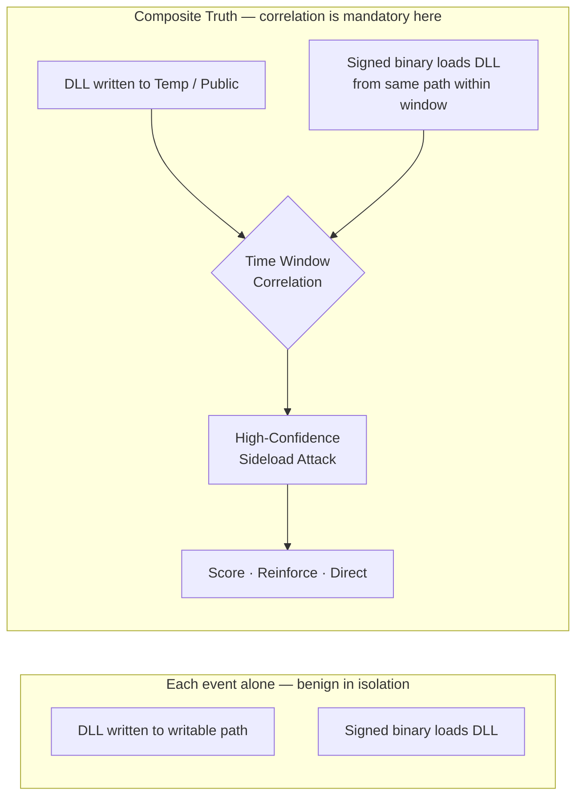
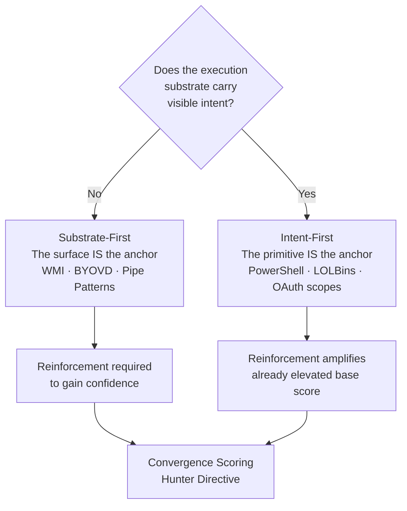
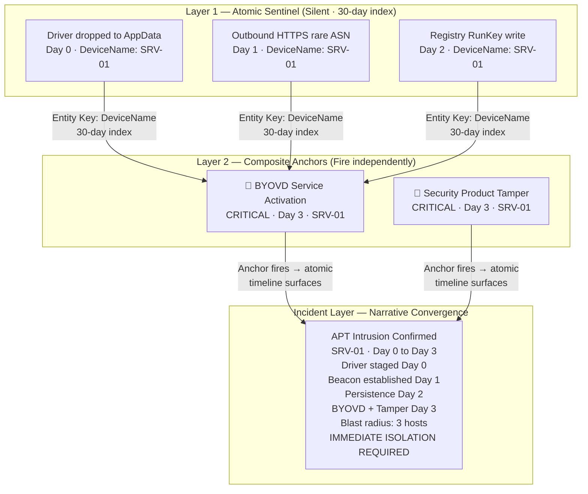
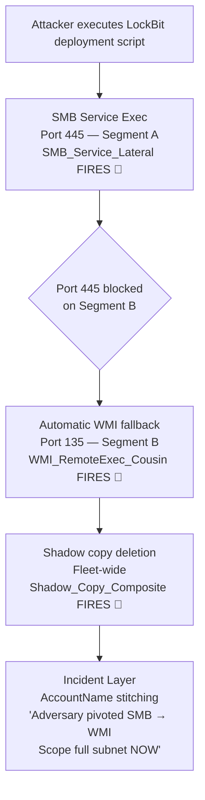

# Minimum Truth Detection Framework
### *Adversary-Informed Detection Engineering from First Principles*

**Author:** Ala Dabat | [github.com/azdabat](https://github.com/azdabat)  
**License:** [CC BY-NC-SA 4.0](https://creativecommons.org/licenses/by-nc-sa/4.0/legalcode)  
**Validated:** ADX-Docker · Empire C2 Telemetry · Atomic Red Team  

---

> *"Start with the minimum truth required for the attack to exist.*  
> *Everything else is reinforcement — not dependency.*  
> *If the baseline truth is not met, the attack is not real."*

---

```
╔══════════════════════════════════════════════════════════════════════════════╗
║                    MINIMUM TRUTH DETECTION FRAMEWORK                         ║
║                                                                              ║
║    Minimum Truth  ──▶  Reinforcement  ──▶  Scoring  ──▶  Hunter Directive  ║
║                                                                              ║
║    Truth Anchor = Sensor       Reinforcement = Evidence                      ║
║    Cousins = Adjacent Sensors  Incident = Story Stitching                    ║
║                                                                              ║
║    The rule is the sensor. The incident is the narrative.                    ║
╚══════════════════════════════════════════════════════════════════════════════╝
```

---

## Table of Contents

- [Operational Calibration & Testing](#operational-calibration--testing)
- [Engineering Notes](#engineering-notes)
- [Detection Engineering Lifecycle](#detection-engineering-lifecycle)
- [ATT&CK Substrate Adjacency](#attck-substrate-adjacency)
- [Attack Ecosystem Intelligence](#attack-ecosystem-intelligence--defeating-temporal-deception)
- [Why This Repository Exists](#why-this-repository-exists)
- [Detection Maturity Model](#detection-maturity-model)
- [Core Doctrine — The Minimum Truth Funnel](#core-doctrine--the-minimum-truth-funnel)
- [Substrate-First vs Intent-First](#substrate-first-vs-intent-first-minimum-truth)
- [MITRE Ecosystem Coverage — Minimum Truth Anchors & Cousins](#mitre-ecosystem-coverage--minimum-truth-anchors--cousins)
- [OAuth Consent Abuse — Applying Both Anchoring Strategies](#oauth-consent-abuse--applying-both-anchoring-strategies)
- [Noise Model & Suppression Strategy](#noise-model--suppression-strategy)
- [Rarity & Organisational Prevalence](#rarity--organisational-prevalence)
- [Correlation vs Ghost Chains](#correlation-vs-ghost-chains)
- [Primitive Stitching & Incident Narrative Architecture](#primitive-stitching--incident-narrative-architecture)
- [Composite Threat Hunt Portfolio](#composite-threat-hunt-portfolio)
- [Architecture Doctrine — At Scale](#architecture-doctrine--at-scale)
- [Composite Rule Template](#composite-rule-template--registry-persistence-taskcache)
- [Hunter Directives](#hunter-directives)
- [The Rule Factory Checklist](#the-rule-factory-checklist)
- [Architectural Strategy — Split vs Composite](#architectural-strategy--split-vs-composite)
- [Cousin Rules & Attack Ecosystem Coverage](#cousin-rules--attack-ecosystem-coverage)
- [Router Rules](#router-rules--rules-that-sit-outside-ecosystems)
- [Production Deployment](#production-deployment)
- [The ATLAS](#the-attack-ecosystem-atlas)

---

## Operational Calibration & Testing

> [!NOTE]
> These detection rules are architected for **logical correctness** and **high-fidelity signal extraction**. Validation was performed in an isolated **ADX-Docker** environment to ensure attack-truth and logic integrity using Empire threat telemetry & Atomic Red Team.
>
> - **Baselines:** Final noise tuning and allow-listing require specific tenant telemetry and administrative context.
> - **Syntax:** Minor syntax variances (e.g., path escaping) may exist due to the difference between Docker-hosted Kusto and live Cloud schemas.

> [!IMPORTANT]
> **Operational Readiness & Integrity**
>
> - **Not "Plug-and-Play":** This is not a copy-paste production repository. Every rule here is considered **untested** unless accompanied by "receipts" — specifically ADX-Docker Empire telemetry results and dedicated documentation.
> - **Engineering vs. Scripting:** This is a record of engineering work, not a basic KQL collection. It represents the iterative process of testing, tuning, and refining logic from scratch.
> - **The Evolution:** While legacy POC repositories contain the "brittle monoliths" of early-career detection, this composite section represents the philosophy of true detection engineering.
> - **Originality:** Nothing in this repository is copied; nothing has been borrowed. This documentation is designed to teach a way of thinking.
> - **The Goal:** As anyone who has been in the trenches knows: engineering freedom is only found when architecture becomes simple, reductive, and easy to understand.
>
> **This is Detection-As-Code in its purest form.** *(Fully automated CI/CD pipeline section currently under development)*

---

## Engineering Notes

During validation of the Minimum Truth Detection Framework composite rule set, several recurring implementation pitfalls were identified while stress-testing multiple KQL detections.

These issues do **not affect the detection doctrine itself** (*Minimum Truth → Reinforcement → Scoring → Hunter Directive*), but arise from common **KQL engineering edge cases** including:

- Prevalence window overlap
- Incorrect `leftouter` join handling
- SHA256 rarity edge cases
- Non-deterministic `any()` summarization
- Negative composite score behaviour

**[KQL Detection Engineering — Common Implementation Errors](https://github.com/azdabat/Minimum-Truth-Detection-Framework-ADX-Validated-Composite-Rules/blob/main/KQL%20Detection%20Engineering%20%E2%80%94%20Common%20Implementation%20Errors.md)**

This document acts as an engineering reference and lint guide for KQL detection development, capturing the bug classes discovered during composite rule validation. Its purpose is to ensure the framework remains **deterministic, reliable, and production-safe** as additional detection logic is developed.

---

## Detection Engineering Lifecycle

> [!IMPORTANT]
> This framework is complemented by a dedicated **Detection Engineering Lifecycle model**, which defines how composite detections are **validated, tuned, scored, and governed in real SOC environments**.
>
> While the core doctrine establishes *how detections should be architected*, this lifecycle formalises **how they survive production reality** — including telemetry constraints, noise modelling, performance trade-offs, and continuous refinement.
>
> It captures the transition from **theoretical correctness → operational reliability**, ensuring every rule is not only logically sound, but **measurably effective and SOC-safe over time**.
>
> **Read the full lifecycle model here:**
> https://github.com/azdabat/Minimum-Truth-Detection-Framework-ADX-Validated-Composite-Rules/blob/main/Detection_Engineering_Lifecycle.md

---

## ATT&CK Substrate Adjacency

**[ATT&CK Substrate Adjacency — Full Document](https://github.com/azdabat/Minimum-Truth-Detection-Framework-ADX-Validated-Composite-Rules/blob/main/ATT%26CK_Substrate_Adjacency.md)**

MITRE ATT&CK models techniques as independent units with vertical depth (technique → sub-technique). What it does not model is **substrate adjacency** — the reality that many techniques represent the same adversary intent executed across different operating system substrates.

Lateral movement via **SMB (T1021.002)**, **DCOM (T1021.003)**, and **WinRM (T1021.006)** are operationally interchangeable. An adversary pivots dynamically between them based on firewall restrictions, privileges, and endpoint controls. Treating these as independent creates a **false sense of detection coverage**.

The Minimum Truth Detection Framework introduces a **Cousin Technique Doctrine** — modelling adjacent techniques as part of a shared attack ecosystem. This layer sits on top of ATT&CK and enables detection strategies that target **adversary intent** rather than isolated technique identifiers.

---

## Attack Ecosystem Intelligence — Defeating Temporal Deception

Modern adversary tradecraft relies heavily on **Temporal Deception** — staggered C2 jitter, delayed BYOVD kernel exploitation, and automated script loops that pivot dynamically across parallel execution boundaries (Cousin Techniques).

When defensive units rely on monolithic, join-dependent kill chains, they face catastrophic query timeouts or miss intrusions entirely due to sequence fracturing over time.

This framework formalises a **hybrid architecture**: deploying optimised, single-surface Behavioural Composites to deliver immediate high-confidence alerts (*Hunter Directives*), while concurrently running a silent Incident-Layer Stitching Engine mapped to common entity keys (`DeviceName`, `AccountName`).

By separating the sensor architecture from chronological storytelling, this framework achieves true scale-safe efficiency — forcing immediate narrative convergence the exact second an attacker touches an un-bypassable telemetric substrate choke point.

> [!NOTE]
> **Operational Architecture Reference**
>
> For the complete engineering breakdown of this hybrid strategy, behavioural convergence modelling, and specific mitigation protocols against staggered tactics, refer to:
>
> 👉 **[Attack Ecosystem Intelligence Blueprints](https://github.com/azdabat/Minimum-Truth-Detection-Framework-ADX-Validated-Composite-Rules/blob/main/Attack%20Ecosystem%20Intelligence.md)**

---

## Why This Repository Exists

Most SOCs struggle with threat hunting not because they lack tools, but because:

- Detections are **over-engineered** — monolithic queries that collapse under production load
- Behavioural chains are **forced where they are not required** — ghost chains producing false certainty
- Analysts are overwhelmed by **noise disguised as intelligence**
- Rules are written without regard for **SOC operating reality**

This repository documents a **deliberate, operationally grounded methodology** for threat hunting that:

- Scales to real SOC teams under real enterprise load
- Preserves signal fidelity without brittle allowlists
- Reduces analyst fatigue through contextual scoring
- Applies behavioural correlation **only when the attack structurally requires it**

**Focus:** Practical, adversary-informed threat hunting for real SOC environments  
**Audience:** L2 / L2.5 Threat Hunters, Detection Engineers, Security Leads

---

## Detection Maturity Model

### Reductive Baseline — Truth First

Every attack technique has a **minimum condition that must be true**. If that condition is not met, the detection should not exist. This prevents speculative or assumption-driven hunting.

### Composite L2 / L2.5 Hunts

Most attacks do **not** require full behavioural chains. This repository focuses on Composite Hunts that group related high-signal indicators, prefer single telemetry sources, and use minimal joins only when unavoidable. This is where **most effective threat hunting lives**.

### Reinforcement — Confidence, Not Dependency

Once baseline truth is met, confidence is increased using parent/child execution context, suspicious paths, network proximity, and rarity/prevalence. Reinforcement improves fidelity. Reinforcement reduces noise. **Reinforcement never defines the attack.**

### Behavioural Chains — Used Sparingly

Correlation is used **only when the attack cannot exist without multiple linked events**. DLL sideloading is the canonical example — neither the DLL drop nor the binary load alone proves the technique. Only together, correlated within a time window, do they constitute truth.



---

## Core Doctrine — The Minimum Truth Funnel

### The Problem at Enterprise Scale

In environments of 100,000+ endpoints, traditional detection fails at the database layer. Standard SIEM rules rely on monolithic queries — massive, multi-table `join` operations executed across raw telemetry — producing query timeouts, extreme compute costs, and what this framework defines as **Bleak Outcomes**: high-confidence intrusions missed entirely because the query never completed.

```
Traditional monolithic rule:
  Stage A  AND  Stage B within 15 minutes  AND  Stage C on same host
  → 100k endpoints → DeviceProcessEvents 500M+ rows/day
  → Cross-table join on raw data → TIMEOUT
  → Attacker delays Stage B by 72 hours → TIME WINDOW MISSED
  → Attacker pivots from SMB to WMI → JOIN CONDITION BROKEN
  → Detection: NULL
```

### The Three Pillars

**Filter Before You Join.** Never join two raw tables. Reduce the primary table to its most critical subset — the truth — before asking for context. A query filtering `DeviceRegistryEvents` to three specific key paths before a pre-summarised prevalence join runs in seconds on a 100k estate. The same query joining raw `DeviceProcessEvents` times out.

**Native Enrichment Over Joins.** Modern EDR schemas carry implicit context. `DeviceRegistryEvents` already contains `InitiatingProcessFileName`, `InitiatingProcessSHA256`, `InitiatingProcessSigner`, and `InitiatingProcessVersionInfoCompanyName`. Mapping these native fields eliminates the `DeviceProcessEvents` join entirely — zero memory pressure, full process context.

**Contextual Scoring, Not Binary Alerts.** Once truth is established, route surviving data through a convergence matrix. A cumulative risk score prevents dangerous truths from being suppressed when a safe signal is present, and prevents noise from being elevated when a dangerous signal is absent.

```
BaseScore (Truth Anchor)      =  55
+ TaskCache Artefact          = +25
+ Dangerous Primitive         = +25
+ Base64 Payload              = +20
+ User-Writable Path          = +15
+ Untrusted Writer            = +10
+ Rare Writer (Prevalence)    = +10
──────────────────────────────────────
FinalScore                    = 160  →  CRITICAL
```

---

## Substrate-First vs Intent-First Minimum Truth

### The Architectural Decision

Every detection begins with a choice: anchor on the **execution substrate itself**, or anchor on a **malicious primitive** performed by that substrate. Choosing the wrong strategy is a primary cause of detection failure at scale.

```
┌─────────────────────────────────────────┬───────────────────────────────────────────┐
│  SUBSTRATE-FIRST                        │  INTENT-FIRST                             │
│                                         │                                           │
│  "Did this execution surface exist?"    │  "Did this substrate perform an action    │
│                                         │   that implies attacker capability?"      │
├─────────────────────────────────────────┼───────────────────────────────────────────┤
│  Anchor: execution surface              │  Anchor: malicious primitive              │
│  Use when: no visible intent            │  Use when: substrate is common but        │
│  (WMI fileless, BYOVD, injection)       │  primitive implies capability             │
│  Noise: higher, reinforcement required  │  Noise: lower, base confidence raised     │
│  Tier: L1 sensor / atomic              │  Tier: L2 composite                       │
└─────────────────────────────────────────┴───────────────────────────────────────────┘
```



### Substrate-First — The Canonical Case: WMI Fileless Execution

In a WMI Permanent Event Subscription attack, an adversary registers a malicious `ActiveScriptEventConsumer`. When triggered, Windows Script Host (`scrcons.exe`) loads a script engine DLL — `vbscript.dll`, `jscript.dll`, or `scrobj.dll` — directly into process memory.

**There is no child process. No command-line argument. No file written to disk.**

The payload executes as a DLL loaded into a trusted Windows process. Attempting to anchor on intent fails here — there is no attacker-controlled command-line visible at the DLL load layer. The substrate IS the signal.

```kql
// Minimum Truth — WMI Fileless Execution (T1546.003)
DeviceImageLoadEvents
| where InitiatingProcessFileName =~ "scrcons.exe"
| where FileName in~ ("vbscript.dll", "jscript.dll", "scrobj.dll")
// This is the irreducible minimum. You cannot go further left in the kill chain.
```

Reinforcement adds confidence after truth is confirmed:

```kql
// R1: Near-time network egress from scrcons.exe → C2 beacon signal
DeviceNetworkEvents
| where InitiatingProcessFileName =~ "scrcons.exe"
| where RemoteIPType == "Public" and RemotePort in (80, 443)

// R2: DLL loaded from non-system path → staging artefact
// R3: First-time behaviour on this device in 30 days → prevalence anomaly
```

> **Substrate first. Reinforcement second. Always.**

### Substrate-First — BYOVD Driver Staging (Temporal Case)

BYOVD attacks exploit time. A vulnerable `.sys` driver is dropped quietly on Day 0. A service is created days later. The driver drop is the only observable primitive at the time it occurs — no execution, no intent visible.

```kql
// Minimum Truth — BYOVD Driver Staging (T1543.003 / T1068)
DeviceFileEvents
| where FileName endswith ".sys"
| where FolderPath matches regex @"(?i)\\(AppData|Temp|Public|ProgramData|Users)\\"
| where InitiatingProcessSignatureStatus != "Signed"
   or InitiatingProcessFolderPath matches regex @"(?i)\\(AppData|Temp|Public)\\"
// A .sys file dropped to a writable path by an anomalously located binary
// is the substrate truth. The driver is passive. The substrate IS the signal.
```

The 30-day atomic primitive index connects the Day 0 staging to the Day 3 activation — defeating temporal deception that no time-windowed composite rule can address alone.

### Intent-First — The Primitive Implies Capability

When the execution substrate is ubiquitous, the only reliable anchor is a specific action on that substrate that structurally implies attacker capability. The primitive is the anchor, not the binary.

```kql
// Minimum Truth — PowerShell Intent (T1059.001)
DeviceProcessEvents
| where FileName in~ ("powershell.exe", "pwsh.exe")
| where ProcessCommandLine has_any (
    "Invoke-WebRequest", "DownloadString",   // Remote retrieval
    "FromBase64String", "IEX",              // Payload decoding + in-memory exec
    "Add-Type", "-EncodedCommand",          // .NET loading + obfuscated exec
    "VirtualAlloc", "OpenProcess"           // Memory allocation / injection primitives
)
```

PowerShell running is common. PowerShell performing remote retrieval, payload decoding, or memory allocation is not common in legitimate enterprise workflows. The primitive raises base confidence before any reinforcement is applied.

---

## MITRE Ecosystem Coverage — Minimum Truth Anchors & Cousins

This table maps the core MITRE attack ecosystems to their minimum truth anchors, the anchoring strategy that applies, and the cousin techniques that must be covered to eliminate false coverage gaps.

```mermaid
graph LR
    subgraph MITRE_Ecosystems["Core MITRE Attack Ecosystems"]
        P[Persistence\nT1053 · T1547 · T1543 · T1546]
        LM[Lateral Movement\nT1021 · T1570]
        CA[Credential Access\nT1003 · T1558 · T1621]
        EX[Execution\nT1059 · T1218 · T1546]
        DE[Defense Evasion\nT1562 · T1055 · T1036]
        C2[Command & Control\nT1071 · T1095]
        EF[Exfiltration\nT1041 · T1567 · T1048]
    end
    subgraph Framework["Framework Response"]
        CS[Cousin Sensors\nCovering adjacent substrates]
        MT[Minimum Truth Anchors\nSubstrate-First or Intent-First]
        IL[Incident Layer\nNarrative stitching]
    end
    MITRE_Ecosystems --> MT --> CS --> IL
```



### Persistence Ecosystem

| Technique | Minimum Truth Anchor | Anchoring Strategy | MITRE | Cousin Techniques | Cousin MITRE |
|-----------|---------------------|--------------------|-------|-------------------|--------------|
| Silent TaskCache Persistence | `RegistryValueSet` under `Schedule\TaskCache` | Substrate-First | T1053.005 | CLI `schtasks.exe /create` | T1053.005 |
| Registry Run Key Persistence | `RegistryValueSet` under `\Run` or `\RunOnce` | Intent-First (writable + payload) | T1547.001 | ActiveSetup · AppInit · Winlogon | T1547.014 · T1546.010 |
| Service Persistence (ImagePath) | `RegistryValueSet` on `ImagePath` in `Services` | Intent-First (path + signer) | T1543.003 | BYOVD Driver Service | T1543.003 · T1068 |
| WMI Permanent Subscription | `scrcons.exe` loads script engine DLL | Substrate-First | T1546.003 | COM Hijacking · IFEO | T1546.015 · T1546.012 |

### Lateral Movement Ecosystem

| Technique | Minimum Truth Anchor | Anchoring Strategy | MITRE | Cousin Techniques | Cousin MITRE |
|-----------|---------------------|--------------------|-------|-------------------|--------------|
| SMB Service Execution | `services.exe` spawning uncommon child binary | Intent-First | T1021.002 | WMI Remote Exec · WinRM · DCOM | T1021.003 · T1021.006 · T1021.003 |
| WMI Remote Execution | `WmiPrvSE.exe` spawning cmd/powershell | Substrate-First | T1021.003 | PsExec · AT Scheduler · WMIC | T1021.002 · T1053.005 |
| Pass-the-Hash | Network logon type 3 without interactive logon | Substrate-First | T1550.002 | Pass-the-Ticket · Overpass-the-Hash | T1550.003 · T1550.002 |

### Credential Access Ecosystem

| Technique | Minimum Truth Anchor | Anchoring Strategy | MITRE | Cousin Techniques | Cousin MITRE |
|-----------|---------------------|--------------------|-------|-------------------|--------------|
| LSASS Memory Dump | Non-AV process opens LSASS with ReadProcessMemory rights | Substrate-First | T1003.001 | DCSync Replication · SAM Extract | T1003.006 · T1003.002 |
| DCSync | Non-DC account performs `GetChanges` replication rights request | Substrate-First | T1003.006 | NTDS.dit Volume Shadow Copy extract | T1003.003 |
| Kerberoasting | Unusual volume of TGS requests using RC4 encryption from non-admin | Intent-First | T1558.003 | AS-REP Roasting (no preauth) | T1558.004 |

### Execution Ecosystem

| Technique | Minimum Truth Anchor | Anchoring Strategy | MITRE | Cousin Techniques | Cousin MITRE |
|-----------|---------------------|--------------------|-------|-------------------|--------------|
| PowerShell Abuse | `-enc` / `IEX` / `VirtualAlloc` primitives | Intent-First | T1059.001 | WScript · CScript · mshta execution | T1059.005 · T1218.005 |
| mshta.exe Proxy Exec | `mshta.exe` with `http://` or `vbscript:` argument | Intent-First | T1218.005 | regsvr32 Squiblydoo · rundll32 | T1218.010 · T1218.011 |
| certutil.exe Decode | `certutil.exe -decode` or `-urlcache` invocation | Intent-First | T1140 | bitsadmin · curl · PowerShell WebRequest | T1197 · T1059.001 |
| DLL Sideloading | Signed binary loads DLL from user-writable path | Substrate-First (correlation required) | T1574.002 | DLL Search Order Hijack · Phantom DLL | T1574.001 · T1574.002 |

### Defense Evasion Ecosystem

| Technique | Minimum Truth Anchor | Anchoring Strategy | MITRE | Cousin Techniques | Cousin MITRE |
|-----------|---------------------|--------------------|-------|-------------------|--------------|
| Security Product Tamper | `fltmc.exe unload` or `WinDefend` stop primitives | Intent-First | T1562.001 | Exclusion path addition (`Add-MpPreference`) | T1562.001 |
| BYOVD Rootkit Activation | Service created pointing to `.sys` in writable path | Substrate-First | T1068 · T1543.003 | Kernel Callback Modification | T1014 |
| Process Injection | `VirtualAlloc` in PowerShell script block or via LOLBin | Substrate-First | T1055 | Process Hollowing · Thread Hijack | T1055.012 · T1055.003 |

### Command & Control Ecosystem

| Technique | Minimum Truth Anchor | Anchoring Strategy | MITRE | Cousin Techniques | Cousin MITRE |
|-----------|---------------------|--------------------|-------|-------------------|--------------|
| Named Pipe C2 | Pipe creation matching known implant naming pattern | Substrate-First | T1071 | HTTP/S Beaconing to rare ASN | T1071.001 |
| Encrypted C2 (HTTPS Jitter) | Low-volume outbound HTTPS to first-seen domain by LOLBin | Intent-First | T1071.001 | DNS Tunnelling · ICMP C2 | T1071.004 · T1095 |

### Exfiltration Ecosystem

| Technique | Minimum Truth Anchor | Anchoring Strategy | MITRE | Cousin Techniques | Cousin MITRE |
|-----------|---------------------|--------------------|-------|-------------------|--------------|
| LOLBin Exfiltration | `bitsadmin /transfer` or `certutil -urlcache` to external | Intent-First | T1197 · T1041 | PowerShell `Invoke-WebRequest` POST | T1059.001 |
| Cloud Storage Exfil | Bulk OneDrive/SharePoint download spike vs user baseline | Substrate-First (deviation) | T1567.002 | Archive staging before exfil (`7z`/`rar`) | T1560.001 |

---

## OAuth Consent Abuse — Applying Both Anchoring Strategies

Unlike endpoint execution, OAuth abuse is identity-driven and user-mediated. The distinction between substrate-first and intent-first becomes operationally critical here.

### OAuth Substrate-First

A successful consent grant occurred. A trust boundary changed. This does not imply malicious intent — it is substrate truth appropriate for tenant visibility and baseline modelling.

```kql
AuditLogs
| where OperationName in~ (
    "Consent to application",
    "Add delegated permission grant",
    "Add app role assignment grant to service principal"
)
| where Result =~ "success"
```

### OAuth Intent-First

Intent-first in OAuth is not "consent happened." It is: **high-risk permission capability was granted.**

```kql
AuditLogs
| where OperationName in~ (
    "Consent to application",
    "Add delegated permission grant",
    "Add app role assignment grant to service principal"
)
| where Result =~ "success"
| mv-expand TargetResources[0].modifiedProperties
| where tostring(TargetResources[0].modifiedProperties.newValue) has_any (
    "Mail.ReadWrite",
    "Directory.ReadWrite.All",
    "AppRoleAssignment.ReadWrite.All",
    "RoleManagement.ReadWrite.Directory",
    "Files.ReadWrite.All",
    "Sites.FullControl.All"
)
```

The scope grant is the primitive that implies capability — it is the intent anchor that makes the detection stable. Without it, the rule requires endless tuning against thousands of legitimate application consent events.

### OAuth Composite Integration

```
Sensor Layer  (Substrate-First) →  Visibility · baseline modelling · consent velocity
Intent Layer  (Intent-First)    →  High-risk scope capability granted
Reinforcement                   →  Admin consent (OnBehalfOfAll == true)
                                    Suspicious User-Agent · FirstSeen AppId
                                    Rare AppId in tenant · Privileged user
Scoring                         →  Substrate consent = low base score
                                    High-risk permission = primary weight
                                    Admin consent = escalator
                                    Rarity/newness = anomaly boost
                                    Known-good AppId = discount (never bypass)
                                    High-risk floor prevents score burial
```

> **PowerShell clarified the substrate/intent distinction.**
> **OAuth made it operationally necessary.**
>
> The framework is now internally consistent across: endpoint execution, cloud identity abuse, service persistence, privilege escalation, lateral movement, and exfiltration.

---

## Noise Model & Suppression Strategy

### Core Principle

Noise is not removed through blind exclusions. It is **measured, profiled, and down-scored** through contextual weighting.

```kql
// ❌ Hard exclusion — creates structural blind spots
| where InitiatingProcessFileName != "ccmexec.exe"

// ✅ Soft-allow scoring model
let Penalty_ManagedLineage = -25;
let Penalty_InternalNet    = -10;
let Penalty_HighBurst      = -20;
```

Management automation reduces risk. It does not eliminate telemetry visibility.

### Empirical Noise Baseline — Pre-Tuning Requirement

Before suppression logic is applied, extract dominant operational patterns:

```kql
DeviceProcessEvents
| where FileName =~ "powershell.exe"
| summarize
    Count   = count(),
    Devices = dcount(DeviceId)
  by InitiatingProcessFileName,
     InitiatingProcessAccountName,
     bin(Timestamp, 1h)
| order by Count desc
```

> **Noise suppression begins with measurement — not assumptions.**

### Scoring Model for Suppression

```kql
let Score_EncodedPrimitive = 40;
let Score_SuspiciousParent = 30;
let Score_WritablePath     = 20;
let Score_ExternalNetwork  = 25;
let Score_RareExecution    = 15;

let Penalty_ManagedLineage = -25;  // SCCM, Intune, Tanium lineage
let Penalty_InternalNet    = -10;  // Internal IP egress only
let Penalty_HighBurst      = -20;  // 50+ hosts in 10 minutes
```

Tenant-portable suppression uses configuration tables rather than hardcoded values:

```kql
let TrustedAutomationParents =
datatable(ProcessName:string)
[
    "ccmexec.exe",
    "intunemanagementextension.exe",
    "taniumclient.exe"
];
```

### Burst Modelling

```kql
DeviceProcessEvents
| where FileName =~ "powershell.exe"
| summarize BurstCount = dcount(DeviceId)
  by bin(Timestamp, 10m)
| order by BurstCount desc
// High volume simultaneous → patch deployment → down-score
// Low volume isolated → targeted intrusion → escalate
```

### Architectural Summary

| Principle | Implementation |
|-----------|----------------|
| No brittle allowlists | Score reduction instead of exclusion |
| Measure before suppressing | Empirical baseline extraction first |
| Convergence required | Multiple reinforcement layers needed for escalation |
| Prevalence modifies urgency | Never suppresses alerts |
| Burst modelling | Differentiates mass automation from targeted intrusion |
| Config-driven tuning | Avoids hard-coded exclusions across tenants |

> **Detection engineering is not about eliminating noise.**  
> **It is about anchoring truth, reinforcing intent, modelling behaviour, scoring convergence, and preserving visibility.**  
> **Noise suppression must never create blind spots.**

---

## Rarity & Organisational Prevalence

> **Rarity is not a detection trigger. It is a prioritisation and confidence amplifier.**  
> **If the minimum truth is not satisfied, rarity is irrelevant.**  
> **If the minimum truth is satisfied, rarity decides urgency and scope.**

### Three Safe Applications

**Command / Behaviour Prevalence**  
How many hosts exhibit this exact behaviour?
- 1–2 hosts → likely targeted intrusion → escalate
- 200+ hosts → likely IT automation → deprioritise (never suppress)

**Actor / Parent Context Prevalence**  
Who normally performs this action in this environment?
- `rundll32.exe` spawned by `winword.exe` → anomalous execution context
- Service account accessing data outside its role → privilege anomaly

**Burst / Radius Prevalence**  
How fast and how widely did this appear?
- Single host → targeted persistence
- Domain-wide in under 10 minutes → ransomware precursor

### What Prevalence Is NOT Used For

| Wrong | Right |
|-------|-------|
| Rarity as standalone alert trigger | Rarity as reinforcement signal after truth |
| Common = safe | Common = lower urgency, not lower visibility |
| Rare = malicious | Rare = higher priority, not automatic alert |
| Suppress LSASS access on AV hosts | Surface always — score urgency by actor context |

> **Rarity decides how fast we respond — not whether we respond.**

**Example — Prevalence Applied After Truth:**

```kql
// Minimum Truth already established — persistence exists:
RegistryValueData has "powershell" and RegistryValueData has "\\users\\public\\"

// Prevalence reinforcement applied AFTER truth confirmation:
| summarize DeviceCount = dcount(DeviceId) by TaskFingerprint
| extend IsRare = DeviceCount <= 2
// 1 device  → likely intrusion     → CRITICAL urgency
// 300 devices → likely IT script  → MEDIUM urgency
// The detection never disappears. The response priority changes.
```

**Minimum Truth defines the attack. Reinforcement increases confidence. Prevalence scales triage.**

---

## Correlation vs Ghost Chains

> **Correlation is only valid when the attack cannot exist without multiple linked events.**

### What Is a Ghost Chain?

A ghost chain stitches together unrelated events into fake kill-chain certainty:

```kql
// ❌ Ghost chain — forces false narrative
RegistryValueSet
| join NetworkConnection on DeviceId
| join ProcessInjection on DeviceId
| where all within 10 minutes
// Persistence may be set today, executed tomorrow → time window MISSED
// Network traffic is unrelated → FALSE POSITIVE
// Injection never occurs → NULL SCORE on real intrusion
```

### The Correct Architecture — Independent Sensors

```kql
// Sensor 1: Persistence truth
DeviceRegistryEvents
| where RegistryKey has "\\Run"
| where RegistryValueData has "powershell"
// Truth: persistence exists. Do not join this. Do not extend this. Alert on this.

// Sensor 2: In-memory execution truth
DeviceEvents
| where ActionType == "PowerShellScriptBlock"
| where AdditionalFields has "VirtualAlloc"
// Truth: in-memory execution capability is being prepared.

// Sensor 3: Silent task persistence truth
DeviceRegistryEvents
| where RegistryKey has "\\Schedule\\TaskCache"
| where RegistryValueData has "-enc"
// Truth: silent scheduled task persistence exists.
```

**Incident-Level Correlation:** The SIEM correlates same device + same user + same timeframe + multiple truths firing. This builds the attack story correctly — without ghost chains inside individual rules.

### Correlation vs Ghost Chains — Decision

```
Correlate inside a rule ONLY when:
  → The technique cannot exist without both events
  → Telemetry sources are stable and reliable
  → The join reduces ambiguity, not increases complexity

Split into sibling composites when:
  → The truth surface changes
  → The noise domain changes
  → The attacker method is optional
  → The timing may vary across sessions or days
```

> **Correlation is not sophistication. Correlation is dependency.**

---

## Primitive Stitching & Incident Narrative Architecture

### The Two-Layer Fusion Architecture

```
┌──────────────────────────────────┬────────────────────────────────────────────┐
│  LAYER 1: ATOMIC SENTINEL        │  LAYER 2: BEHAVIOURAL COMPOSITE            │
│  (The Net)                       │  (The Anchor)                              │
├──────────────────────────────────┼────────────────────────────────────────────┤
│  Continuous silent logging       │  High-fidelity minimum truth detection     │
│  No individual alert threshold   │  Fires as Instant Hit Anchor               │
│  30-day rolling entity index     │  Immediate HunterDirective output          │
│  Catches what composites miss    │  Triggers pivot into atomic timeline       │
│  Defeats temporal deception      │  Localized time window (2h–48h)            │
└──────────────────────────────────┴────────────────────────────────────────────┘

When a Composite fires:
  → Analyst receives HunterDirective + RiskScore
  → Atomic layer surfaces full 30-day entity timeline
  → Slow-rolling APT staging artefacts become visible
  → Day 0 BYOVD driver drop connects to Day 3 rootkit activation
```



### Entity Keys — The Stitching Mechanism

| Entity Key | Stitching Context |
|------------|------------------|
| `DeviceName` | Host-level — connects all events to one machine |
| `AccountName` | Identity-level — connects to same actor across hosts |
| `DeviceId` | Hardware-level — tamper-resistant stitching |
| `SHA256` | Artefact-level — connects binary drops across time |
| `RemoteIP / ASN` | Infrastructure-level — C2 attribution across hosts |

### The KQL Primitive Collector

Executed automatically when a composite fires — reconstructing the full entity timeline:

```kql
// ATOMIC PRIMITIVE COLLECTOR
// Triggered by composite anchor — not an alert, a hunting pivot

let EntityKey_Device = "SRV-01";                              // Injected from composite
let AnchorTime       = datetime(2026-05-20T14:22:00Z);        // Composite fire timestamp
let LookbackWindow   = 30d;
let ForwardWindow    = 2h;

let P_Execution =
    DeviceProcessEvents
    | where Timestamp between ((AnchorTime - LookbackWindow) .. (AnchorTime + ForwardWindow))
    | where DeviceName =~ EntityKey_Device
    | where FileName in~ ("powershell.exe","cmd.exe","mshta.exe","rundll32.exe","certutil.exe","regsvr32.exe")
    | project Timestamp, Layer="Execution",
              Event = strcat(FileName, " | ", InitiatingProcessFileName, " | ", ProcessCommandLine),
              MITRE = "T1059/T1218";

let P_Persistence =
    DeviceRegistryEvents
    | where Timestamp between ((AnchorTime - LookbackWindow) .. (AnchorTime + ForwardWindow))
    | where DeviceName =~ EntityKey_Device
    | where RegistryKey has_any (@"\Run",@"\RunOnce",@"Schedule\TaskCache",@"CurrentControlSet\Services")
    | project Timestamp, Layer="Persistence",
              Event = strcat("RegWrite: ", RegistryKey, " → ", RegistryValueData),
              MITRE = "T1547/T1053";

let P_DriverStaging =
    DeviceFileEvents
    | where Timestamp between ((AnchorTime - LookbackWindow) .. (AnchorTime + ForwardWindow))
    | where DeviceName =~ EntityKey_Device
    | where FileName endswith ".sys"
    | where FolderPath matches regex @"(?i)\\(AppData|Temp|Public|ProgramData)\\"
    | project Timestamp, Layer="BYOVD Driver Staging",
              Event = strcat("Drop: ", FolderPath, "\\", FileName, " by: ", InitiatingProcessFileName),
              MITRE = "T1543.003/T1068";

let P_Network =
    DeviceNetworkEvents
    | where Timestamp between ((AnchorTime - LookbackWindow) .. (AnchorTime + ForwardWindow))
    | where DeviceName =~ EntityKey_Device
    | where RemoteIPType == "Public"
    | where InitiatingProcessFileName in~ ("powershell.exe","rundll32.exe","mshta.exe","svchost.exe")
    | project Timestamp, Layer="Network",
              Event = strcat(InitiatingProcessFileName, " → ", RemoteIP, ":", RemotePort),
              MITRE = "TA0011";

union P_Execution, P_Persistence, P_DriverStaging, P_Network
| order by Timestamp asc
| project Timestamp, Layer, Event, MITRE
```

---

## Composite Threat Hunt Portfolio

### Tier-1 Baseline Pack — Enterprise Mandatory Ecosystems

**Live MITRE Coverage Matrix:** https://azdabat.github.io/Minimum-Truth-Detection-Framework-ADX-Validated-Composite-Rules/MITRE-MATRIX.html

> Always-on coverage. High-value truths. SOC-safe baselines for any regulated enterprise.

| Ecosystem | Minimum Truth Sensor | Composite Built | Reinforcement Tuned | Atomic Validated | Maturity |
|-----------|----------------------|-----------------|---------------------|------------------|----------|
| **PowerShell Execution & Abuse** | Script execution + encoded/runtime intent | ✅ Yes | ⚠️ Partial | ⚠️ In Progress | MED |
| **Registry Autoruns (Run/RunOnce)** | RegistryValueSet on logon trigger keys | ✅ Yes | ✅ Strong | ✅ Tested | HIGH |
| **Scheduled Tasks (CLI Creation)** | `schtasks.exe /create` process truth | ✅ Yes | ✅ Strong | ✅ Tested | HIGH |
| **Scheduled Tasks (Silent TaskCache)** | TaskCache persistence without schtasks.exe | ✅ Yes | ⚠️ Needs Noise Calibration | ⚠️ In Progress | MED |
| **Service Persistence (ImagePath)** | Service registry ImagePath modification | ⚠️ Partial | ❌ Not Tuned | ❌ Not Yet | LOW |
| **Credential Access (LSASS Surface)** | LSASS access/dump behavioural truth | ✅ Yes | ⚠️ Partial | ⚠️ In Progress | MED |
| **NTDS / SAM Extraction** | Hive/NTDS interaction truth | ✅ Yes | ⚠️ Partial | ❌ Not Yet | MED |
| **LOLBins Proxy Execution Core** | Signed binary misuse surface | ✅ Yes | ⚠️ Needs Baselines | ❌ Not Yet | MED |
| **Cloud Identity Persistence (OAuth Consent)** | High-risk scope grant baseline truth | ✅ Yes | ✅ Strong | ⚠️ Tenant Validation Needed | HIGH |

### Tier-2 Composite Correlation Pack — Senior Threat Hunting Layer

Tier-2 introduces multi-surface joins, prevalence reinforcement, kill-chain convergence, and noise suppression through context.

| Ecosystem | Minimum Truth Anchor | Composite Reinforcement Layer | Status | Maturity |
|-----------|----------------------|-------------------------------|--------|----------|
| **Registry Hijacks (IFEO/COM/AppInit)** | Execution interception registry truth | Writable DLL + rare writer + untrusted signer | ⚠️ Partial | MED |
| **WMI Persistence + Execution** | Subscription + anomalous consumer truth | Parent lineage break + script consumer scoring | ✅ Built | HIGH |
| **Lateral Movement (SMB Service / PsExec)** | Remote service creation truth | File drop + inbound 445 + rare service binary | ⚠️ Partial | MED |
| **Defense Evasion (Signed LOLBin Chains)** | Trusted parent → LOLBin baseline | Injection + ghost module + beacon reinforcement | ⚠️ POC → Composite | MED |
| **Session / Token Misuse (Post-Consent)** | Token replay baseline truth | ASN+UA divergence + weak auth reinforcement | ✅ Built | HIGH |
| **Ingress Tool Transfer** | Writable staging drop truth | Followed by execution + outbound comms | ⚠️ In Progress | MED |
| **Shadow Copy Destruction (Ransomware Prep)** | vssadmin/wmic delete truth | Multi-tool convergence scoring | ❌ Missing | LOW |
| **Archive Staging + Exfil Prep** | 7z/rar bulk staging truth | Large volume + outbound correlation | ❌ Missing | LOW |

### Tier-3 Research & Novel Threat Ecosystems

These are not always-on detections — they are **attack research sensors** for emerging tradecraft.

| Threat Ecosystem | Research Truth Anchor | Status | Notes |
|-----------------|----------------------|--------|-------|
| **React2Shell / IIS Exploit Chains** | Web process → CLR abuse → injection | ✅ Modelled | Requires telemetry hardening |
| **EtherRAT / Blockchain C2** | RPC beaconing + low-prevalence infra | ✅ Documented | Network correlation expansion needed |
| **SilverFox / ValleyRAT BYOVD** | Signed loader → sideload → driver load truth | ⚠️ Advanced Composite | Needs DriverLoadEvent validation |
| **Pulsar RAT Injection + Tasks** | Trusted parent → LOLBin → memory exec | 🟡 Parked POC | Awaiting confirmed ecosystem truth |
| **Kernel Driver Abuse (BYOVD)** | Driver service creation + load event | ⚠️ Partial | High impact, tuning required |
| **Supply Chain Behaviour Modelling** | Signed update → anomaly divergence | ✅ Threat Modelled | Tier-2 rule ownership pending |

---

## Architecture Doctrine — At Scale

### Why This Matters

In enterprise-scale environments (100k+ endpoints), traditional Detection Engineering fails at the database layer. The Minimum Truth framework flips the paradigm: instead of asking the database to correlate everything at once, it forces the query to establish the absolute minimum baseline of malicious truth *first*, discard the rest of the noise, and only then enrich the surviving data.

### Phase 1 — Establish Minimum Truth (The Funnel)

Immediately restrict the dataset to specific high-value keys. Define Danger and Safe parameters dynamically — never hardcoded.

### Phase 2 — Zero-Join Native Enrichment

Extract `InitiatingProcess*` fields natively present in the optimised EDR schema. This eliminates the heavyweight `DeviceProcessEvents` join entirely. Zero memory pressure. Full process context.

### Phase 3 — The Safe Join (Prevalence Only)

The only join permitted is a **pre-summarised join**. Summarise `DeviceFileEvents` to a tiny `OrgPrevalence` table first, then `leftouter` join it to the already-filtered registry events. **Small table joined to small table.**

### Phase 4 — Convergence Scoring

Score the remnant data against a contextual matrix and output with a SOC-ready Hunter Directive. Not a binary alert. A contextual story.

---

## Composite Rule Template — Registry Persistence TaskCache

The full production-grade implementation of the framework's canonical case study:

```kusto
// ============================================================================
// COMPOSITE HUNT (L3): Registry_Persistence_Background_Service_TaskCache
// Author: Ala Dabat
// Platform: Microsoft Defender XDR / Sentinel Advanced Hunting
// Truth Domain: DeviceRegistryEvents (Optimised Schema)
// Minimum Truth: RegistryValueSet under Services OR Schedule TaskCache
// MITRE: T1543.003, T1053.005
// Zero-join enrichment · Safe pre-summarised prevalence join · Convergence scoring
// ============================================================================

let lookback = 14d;

let TrustedPublishers  = dynamic(["Microsoft Corporation","Microsoft Windows","Google LLC","Mozilla Corporation"]);
let TrustedInitiators  = dynamic(["msiexec.exe","trustedinstaller.exe","sppsvc.exe","intunemanagementextension.exe","updateinstaller.exe"]);
let BackgroundKeys     = dynamic([
    @"system\currentcontrolset\services",
    @"software\microsoft\windows nt\currentversion\schedule\taskcache\tree",
    @"software\microsoft\windows nt\currentversion\schedule\taskcache\tasks"
]);
let UserWritableRx     = @"(?i)^[a-z]:\\(users|public|programdata|temp|downloads|appdata)\\";
let Base64ChunkedRx    = @"(?:[A-Za-z0-9+/]{20,}={0,2})(?:\s+[A-Za-z0-9+/]{20,}={0,2})+";
let IPv4Rx             = @"\b(?:(?:25[0-5]|2[0-4]\d|1?\d?\d)\.){3}(?:25[0-5]|2[0-4]\d|1?\d?\d)\b";
let DomainRx           = @"\b([a-z0-9][a-z0-9-]{1,62}\.)+[a-z]{2,}\b";
let UrlRx              = @"https?://[^\s'""<>]+";
let DangerTokens       = dynamic([
    "powershell","pwsh","cmd.exe","mshta","rundll32","regsvr32","wscript","cscript",
    "certutil","bitsadmin","curl","-enc","-encodedcommand","frombase64string","http:","https:"
]);
let SafePathAnchors    = dynamic([@"c:\program files",@"c:\program files (x86)",@"c:\windows\system32",@"c:\windows\syswow64"]);
let SafeVendorKeywords = dynamic(["windows update","microsoft","google","edge","mozilla","firefox","onedrive","teams","intel","nvidia","amd","realtek","adobe","citrix"]);
let PayloadSizeThreshold = 500;

// PHASE 2: PRE-SUMMARISED PREVALENCE TABLE
let OrgPrevalence =
    DeviceFileEvents
    | where Timestamp >= ago(30d)
    | summarize WriterDeviceCount = dcount(DeviceId) by SHA256;

// PHASE 1: MINIMUM TRUTH
let Raw =
    DeviceRegistryEvents
    | where Timestamp >= ago(lookback)
    | where ActionType == "RegistryValueSet"
    | extend RK  = tolower(tostring(RegistryKey)),
             RVN = tolower(tostring(RegistryValueName)),
             RVD = tolower(tostring(RegistryValueData))
    | where RK has_any (BackgroundKeys);

// PHASE 2: ZERO-JOIN NATIVE ENRICHMENT + SAFE JOIN
let Enriched =
    Raw
    | extend
        WriterFile    = tostring(InitiatingProcessFileName),
        WriterCL      = tostring(InitiatingProcessCommandLine),
        WriterSHA     = tostring(InitiatingProcessSHA256),
        WriterSigner  = tostring(InitiatingProcessSigner),
        WriterCompany = tostring(InitiatingProcessVersionInfoCompanyName),
        WriterUser    = tostring(InitiatingProcessAccountName)
    | extend
        WriterFileL            = tolower(coalesce(WriterFile,"")),
        WriterCLL              = tolower(coalesce(WriterCL,"")),
        WriterTrustedPublisher = toint(WriterCompany in (TrustedPublishers) or WriterSigner in (TrustedPublishers)),
        WriterTrustedInitiator = toint(WriterFileL in (TrustedInitiators))
    | join kind=leftouter OrgPrevalence on $left.WriterSHA == $right.SHA256
    | extend
        WriterDeviceCount = coalesce(WriterDeviceCount, 0),
        WriterIsRare      = toint(WriterDeviceCount <= 2);

// PHASE 3: CONVERGENCE SCORING & FILTERING
Enriched
| extend
    IsService             = toint(RK has "system\\currentcontrolset\\services"),
    IsTaskCache           = toint(RK has "schedule\\taskcache"),
    ServiceImagePathWrite = toint(IsService==1 and (RVN == "imagepath" or RVN has "imagepath")),
    HasDanger             = toint(RVD has_any (DangerTokens) or WriterCLL has_any (DangerTokens)),
    HasBase64             = toint(RVD matches regex Base64ChunkedRx or WriterCLL matches regex Base64ChunkedRx),
    HasNet                = toint(RVD matches regex UrlRx or RVD matches regex IPv4Rx or RVD matches regex DomainRx),
    PointsWritable        = toint(RVD matches regex UserWritableRx),
    IsLargeBlob           = toint(strlen(RVD) > PayloadSizeThreshold),
    IsSafePath            = toint(RVD has_any (SafePathAnchors)),
    IsSafeVendor          = toint(RVD has_any (SafeVendorKeywords) or RVN has_any (SafeVendorKeywords)),
    UntrustedWriter       = toint(WriterTrustedPublisher == 0)
| where (IsService==1 or IsTaskCache==1)
| where (IsTaskCache==1) or (ServiceImagePathWrite==1) or (HasDanger==1) or (PointsWritable==1) or (IsLargeBlob==1)
| where not(IsSafePath==1 and IsSafeVendor==1 and HasDanger==0 and HasBase64==0 and HasNet==0 and PointsWritable==0 and IsLargeBlob==0)
| where not(WriterTrustedInitiator==1 and (HasDanger + HasBase64 + HasNet + PointsWritable + IsLargeBlob) == 0)
| extend
    RiskScore = 55
              + (25 * IsTaskCache)
              + (20 * ServiceImagePathWrite)
              + (25 * HasDanger)
              + (20 * HasBase64)
              + (10 * HasNet)
              + (15 * PointsWritable)
              + (25 * IsLargeBlob)
              + (10 * UntrustedWriter)
              + (10 * WriterIsRare),
    RiskLevel = case(RiskScore >= 120, "CRITICAL",
                     RiskScore >= 90,  "HIGH",
                     RiskScore >= 70,  "MEDIUM", "LOW")
| where RiskLevel in ("MEDIUM","HIGH","CRITICAL")
| extend DecodedPayload = base64_decode_string(tostring(extract(@"([A-Za-z0-9+/]{40,})", 1, RegistryValueData)))
| project
    Timestamp, DeviceName, DecodedPayload,
    AccountName      = coalesce(WriterUser, tostring(AccountName)),
    RegistryKey, RegistryValueName, RegistryValueData,
    PersistenceClass = case(IsTaskCache==1,"TaskCache(SilentTask)",
                            ServiceImagePathWrite==1,"Service(ImagePath)","Background(Other)"),
    WriterProcess    = WriterFile, WriterCommandLine = WriterCL,
    WriterCompany, WriterSigner, WriterSHA, WriterDeviceCount,
    RiskScore, RiskLevel
| extend HunterDirective = case(
    RiskLevel=="CRITICAL" and PersistenceClass startswith "TaskCache",
        "CRITICAL: Silent Scheduled Task persistence via TaskCache (API/COM). Pull task definition, isolate if unauthorised.",
    RiskLevel=="CRITICAL" and PersistenceClass startswith "Service",
        "CRITICAL: Service persistence set (ImagePath) with strong indicators. Validate service name + binary path.",
    RiskLevel=="HIGH",
        "HIGH: Background persistence registry artefact. Pivot to writer ancestry.",
        "MEDIUM: Background persistence signal. Validate if approved updater/agent; if not, escalate."
)
| order by RiskScore desc, Timestamp desc
```

---

## Hunter Directives

Every composite hunt produces **guidance alongside results — not after**.

Each rule outputs a `HunterDirective` that answers:

1. **Why** this fired — baseline truth confirmed
2. **What** reinforces confidence — scoring context
3. **What** to do next — pivot, scope blast radius, escalate

> *HIGH: LSASS accessed by non-AV process using dump-related command line.*
> *Action: Validate tool legitimacy, scope for lateral movement, escalate to L3.*

Hunter Directives are SOC-ready playbooks embedded in the detection output. Rules are not just detections — they are operational response guides.

---

## The Rule Factory Checklist

Before publishing any composite hunt:

| Requirement | Check |
|-------------|-------|
| Minimum Truth is 1 clear anchor | ✅ |
| Reinforcement signals are optional (2–4 max) | ✅ |
| Convergence window is defined | ✅ |
| Noise suppression is explicit | ✅ |
| Org prevalence is scoring only — never a hard filter | ✅ |
| Severity is cumulative, not binary | ✅ |
| Output is SOC-actionable with Hunter Directive | ✅ |

> **The Golden Rule: If you cannot explain the hunt in 60 seconds, it is too complex.**  
> **Composite engineering is clarity, not bloat.**

---

## Architectural Strategy — Split vs Composite

> We do not group rules by MITRE Tactic.  
> We group rules by **Attack Surface Ecosystem** — the operational domain where the same kind of truth is observable.

> **The detection rule is the sensor. The incident/case is the narrative.**

### The Four Rules

**Rule 1 — Split when the Minimum Truth changes.**  
If the baseline event requires a schema change, telemetry change, or mechanism change — SPLIT.

| Shift | Decision |
|-------|----------|
| Host process execution → Identity log transaction | ✂️ SPLIT |
| SMB lateral movement → WMI lateral movement | ✂️ SPLIT |
| Endpoint execution → Identity sign-in truth | ✂️ SPLIT |
| Same LOLBin surface, different intent primitives | ✅ KEEP |

**Critical caveat:** Reinforcement signals may cross telemetry surfaces as long as they remain optional and do not replace the baseline truth.

```
Baseline truth  =  svchost(schedule) spawning suspicious child
Reinforcement   =  TaskCache registry artefacts    ← optional cross-table evidence
Reinforcement   =  Task XML drops                  ← optional cross-table evidence
Reinforcement   =  Org prevalence rarity           ← optional cross-table scoring

Truth anchor remains execution. Registry is supporting evidence, not the trigger.
```

**Rule 2 — Split when the noise domain changes.**  
SCCM automation noise vs developer PowerShell vs DC replication are entirely different noise profiles requiring distinct suppression models. SPLIT.

**Rule 3 — Split when the telemetry surface changes.**  
`DeviceProcessEvents ≠ DeviceRegistryEvents ≠ SigninLogs ≠ DeviceNetworkEvents`

**Rule 4 — Keep composite when refining context.**  
Classification, scoring, enrichment, and reinforcement belong inside the rule when the Minimum Truth stays the same.

### Decision Matrix

| Ecosystem | Scenario | Decision | Reason |
|-----------|----------|----------|--------|
| **Scheduled Tasks** | `schtasks.exe /create` vs `Register-ScheduledTask` | ✂️ SPLIT | Different truth surface: CLI vs API |
| **Scheduled Tasks** | `schtasks.exe /create` vs `schtasks.exe /change` | ✅ KEEP | Same truth domain: same binary + schema |
| **Lateral Movement** | SMB service exec vs WMI remote process | ✂️ SPLIT | Different mechanism, different noise domain |
| **Credential Access** | LSASS dump vs DCSync vs Kerberoasting | ✂️ SPLIT | Different telemetry surfaces entirely |
| **LOLBin Execution** | rundll32 vs regsvr32 vs mshta (same parent, same intent) | ✅ KEEP | Same process surface, same attacker goal |

```
Truth Anchor  = Sensor
Reinforcement = Evidence
Cousins       = Adjacent sensors
Incident      = Story stitching

Truth defines the rule. Reinforcement strengthens it.
```

---

## Cousin Rules & Attack Ecosystem Coverage

> When a high-fidelity composite is created for one execution surface, its *cousin* is the adjacent surface that shares the same adversary goal but lives in a different **noise domain**.  
> Cousin rules are **separate but paired** — they do not mix truth anchors with noisy signals that dilute fidelity.

### Why Cousin Rules Are Non-Negotiable

Sophisticated threat actors use cousin attack surfaces as **fallback layers**. Automated deployment toolkits contain cousin-surface fallback logic:



A monolithic rule anchored on SMB service creation scores NULL the moment the attacker pivots to WMI. The cousin composite fires independently. The incident layer stitches both surfaces to the same actor. **The pivot is not a defence. It is a data point.**

### Cousin Ecosystem Discovery

This framework is not built on theoretical MITRE grouping — it is built on **empirically discovered cousin ecosystems**, validated through ADX-Docker simulation, Empire-style telemetry, and repeated convergence testing.

**Full living discovery journal:**  
https://github.com/azdabat/Production-READY-Composite-Threat-Hunting-Rules/blob/main/Cousin_Discovery_Log.md

### Ecosystem Table — Composites + Cousins

**Live Roadmap:** https://azdabat.github.io/Minimum-Truth-Detection-Framework-ADX-Validated-Composite-Rules/MITRE-MATRIX.html

| Ecosystem | Primary Composite | MITRE | Cousin Composite | Cousin MITRE | Notes |
|-----------|------------------|-------|-----------------|--------------|-------|
| **Registry Persistence** | `Registry_Persistence_Background_Service_TaskCache` | T1543.003, T1053.005 | Registry Persistence Alternate Anchors | T1543, T1053 | HKEY_CLUSTER_SERVICE, COM task persistence |
| | `Registry_Persistence_Hijack_Interception` | T1546.* | Registry Hijack Cousins | T1546.* | Winlogon handler, shell open interception |
| | `Registry_Persistence_Userland_Autoruns` | T1547.001/014/004 | Userland Autoruns Cousin | T1547.* | Policies RunOnce, ActiveSetup deep variants |
| **Scheduled Tasks** | TaskCache + Registry | T1053.005 | `ScheduledTask_Execution_TwinRule` | T1053.005 | svchost/taskeng exec without schtasks.exe |
| **Service Execution** | `SMB_Service_Execution` | T1021.002 / T1543.003 | `Service_Exec_ScheduleTask_Cousin` | T1053.005 | svchost scheduler execution surface |
| **Lateral Movement** | `SMB_Service_Lateral` | T1021.002 | `WMI_RemoteExec_Cousin` | T1021.003 | Remote process via WMI |
| | | | `WinRM_Exec_Cousin` | T1021.006 | PowerShell/WinRM lateral |
| **Execution (LOLBins)** | `TrustedParent_LOLBin_InMemoryInjection_Chain` | T1218 / T1055 | `TaskExec_LOLBin_Injection_Cousin` | T1218/T1055 | LOLBin from Scheduled Task surface |
| **Credential Access** | LSASS composite | T1003.001 | `LSASS_Access_Cousin` | T1003.006 | DCSync / NTLM Harvest twin |
| **Identity Abuse** | OAuth consent composite | T1621 / T1078.004 | `Identity_ConsentGrant_Cousin` | T1621 | Token replay vs lateral token misuse |
| **Persistence (Driver)** | BYOVD POC/Research | T1547 / T1543 | `Driver_Persistence_Cousin` | T1543.008 | KMDF/Driver load surface |

### Framework Logic Behind Cousin Pairing

**Different Noise Domain.** `services.exe` service exec — low noise, aggressive rules applicable. `svchost.exe` scheduled task exec — high noise, strict anchors required. Both cover lateral movement. Noise profiles differ fundamentally.

**Separate Truth Anchors.** Service rule anchors on `services.exe` spawning an uncommon child. Scheduled Task cousin anchors on explicit task create/exec signals AND/OR TaskCache registry writes. Logically adjacent — structurally different anchors.

**Composite Isolation.** Coupling them in one rule breaks noise suppression, operational fidelity, and analyst clarity. Separate sensors maintain precision.

**Ecosystem Continuity.** Every primary composite answers four questions:
1. What is the attack surface?
2. What is the minimum truth anchor?
3. What adjacent surfaces share intent?
4. What cousin composites must exist to cover those surfaces?

**Full design doctrine:**  
https://github.com/azdabat/Production-READY-Composite-Threat-Hunting-Rules/blob/main/Ecosystem_Deaign_Architecture.md

---

## Router Rules — Rules That Sit Outside Ecosystems

Not every composite belongs inside a single attack ecosystem. In production, a second class of rules exists:

> **Router Rules — Surface Aggregators**  
> Wide, low-cost detectors that identify persistence or execution intent across multiple surfaces, then route the analyst into the correct ecosystem composite.

### Two Rule Types

**Type 1 — Ecosystem Truth Rules** answer: *"Is this specific attack mechanism real?"*  
Anchor to a single ecosystem. Prove a minimum truth artefact. High-fidelity, ecosystem-pure.

**Type 2 — Router / Surface Rules** answer: *"Is persistence being attempted anywhere, and where do we pivot?"*  
Sit above ecosystems. Detect broad intent. Directional sensors — not final truth.

```
Router Rule fires:
  schtasks.exe /create ... powershell -enc ...
  → Surface: Scheduled Task persistence intent
  → Severity: HIGH
  → Directive: Pivot into ScheduledTask_Abuse composite

Ecosystem Composite confirms:
  → /tr payload path validated
  → Script engine abuse confirmed
  → Writable staging path present
  → Prevalence + reinforcement scored
  → Persistence truth confirmed
```

> **Router rules detect intent.**  
> **Ecosystem rules confirm truth.**  
> **This prevents monoliths while maintaining full surface coverage.**

---

## Production Deployment

Each Composite Rule is deployed as an always-on detection sensor:

- **Truth Anchor** defines the technique
- **Reinforcement** increases confidence — never dependency
- **Cousin Rules** provide adjacent surface parity
- **Attack Ecosystem chaining** creates incidents without monolithic kill-chain queries

### Two-Layer Correlation Model

Operational correlation happens **outside** individual rules:

**Cousin Confirmation:** Multiple cousins firing = capability confirmed at higher confidence. Example: TaskCache persistence + schtasks classifier both fire → persistence ecosystem confirmed across surfaces.

**Attack Story Chaining:** Multiple attack-stage truths converging = intrusion incident. Example: Ingress → Execution → Persistence → Lateral Movement truths all fire on same entity → incident created with full narrative.

**Full Deployment Specification:**  
https://github.com/azdabat/Production-READY-Composite-Threat-Hunting-Rules/blob/main/Operational_Correlation_Deployment.md

### Repository Architecture

| Repository | Role in Framework |
|------------|-------------------|
| `Minimum-Truth-Detection-Framework-ADX-Validated-Composite-Rules` | Tier-1/Tier-2 deployable composites — ADX validated |
| `Production-READY-Composite-Threat-Hunting-Rules` | Production-hardened rules with receipts |
| `Attack-Ecosystems-and-POC` | Tier-3 novel threats + emerging tradecraft |
| `THREAT-MODELLING-SOP-Behavioural-Patch-Resistant-TTPs` | Architectural doctrine + design SOPs |
| `ATLAS-ATTACK-ECOSYSTEM` | Strategic ecosystem map — cousin relationships, coverage gaps |

---

## The Attack Ecosystem ATLAS

While this repository provides the **tactical sensors**, understanding how these sensors fit together requires a strategic map.

### Why You Need The ATLAS

The Framework provides the **Micro-View** (Rule Logic):
- How do I detect Scheduled Task abuse?
- What is the Minimum Truth for a Run Key?
- Why does `scrcons.exe` loading `vbscript.dll` matter?

The ATLAS provides the **Macro-View** (Ecosystem Strategy):
- How does the Scheduled Task rule relate to its Cousin in Registry Persistence?
- Which rules form the complete Lateral Movement ecosystem?
- How do I deploy these composites to cover an entire attack surface without gaps?

**[Enter The ATLAS — The Strategic Map of Attack Ecosystems](https://github.com/azdabat/ATLAS-ATTACK-ECOSSYSTEM)**

> *Refer to the [Simplified Ecosystem Map](https://github.com/azdabat/ATLAS-ATTACK-ECOSSYSTEM/blob/main/Simplified_ATLAS_Attack_Ecosystems.md) for the high-level architecture.*

**Full Ecosystem Design & Architecture:**  
https://github.com/azdabat/Production-READY-Composite-Threat-Hunting-Rules/blob/main/Ecosystem_Deaign_Architecture.md

---

```
╔══════════════════════════════════════════════════════════════════════════════╗
║                         FINAL PRINCIPLE                                     ║
║                                                                              ║
║  Substrate answers:      Did the execution surface exist?                   ║
║  Intent answers:         Was attacker capability created?                   ║
║  Reinforcement answers:  Is this contextually malicious?                    ║
║  Scoring answers:        How urgent is this?                                ║
║  Narrative convergence:  Is this an incident?                               ║
║                                                                              ║
║  Minimum Truth   defines the attack.                                        ║
║  Reinforcement   increases confidence.                                      ║
║  Prevalence      scales triage.                                             ║
║  Cousins         cover every adjacent surface.                              ║
║  Primitives      stitch the story across time.                              ║
║                                                                              ║
║  The rule is the sensor. The incident is the narrative.                     ║
╚══════════════════════════════════════════════════════════════════════════════╝
```

---

*Copyright (c) 2026 Ala Dabat. All Rights Reserved.*  
*Licensed under [CC BY-NC-SA 4.0](https://creativecommons.org/licenses/by-nc-sa/4.0/legalcode)*  
*Attribution required · Non-commercial use only · ShareAlike*
