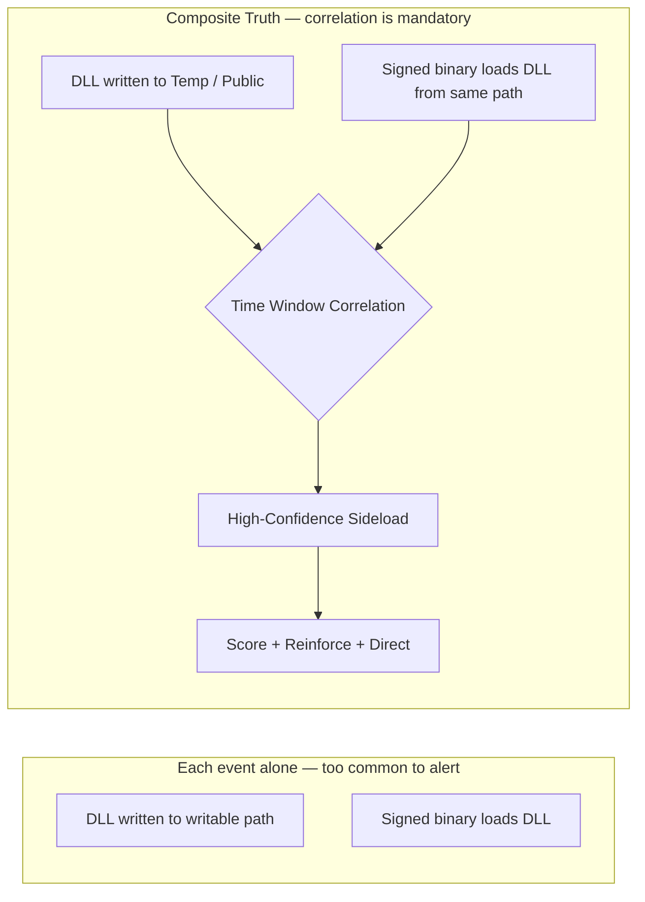
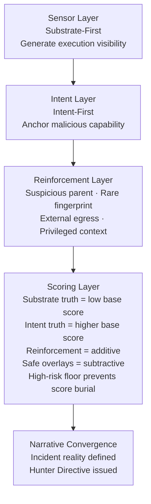
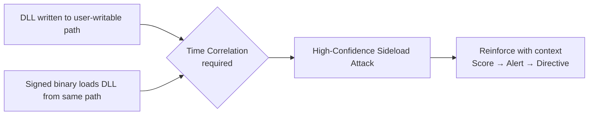

# Minimum Truth Detection Framework
### *Adversary-Informed Detection Engineering from First Principles*

**Author:** Ala Dabat | [github.com/azdabat](https://github.com/azdabat)
**License:** [CC BY-NC-SA 4.0](https://creativecommons.org/licenses/by-nc-sa/4.0/legalcode)
**Validated Against:** ADX-Docker · Empire C2 Telemetry · Atomic Red Team

---

> *"Start with the minimum truth required for the attack to exist.*
> *Everything else is reinforcement — not dependency.*
> *If the baseline truth is not met, the attack is not real."*

---

```
┌─────────────────────────────────────────────────────────────────────────────┐
│                                                                             │
│   Minimum Truth  →  Reinforcement  →  Scoring  →  Hunter Directive         │
│                                                                             │
│   The rule is the sensor.   The incident is the narrative.                 │
│                                                                             │
└─────────────────────────────────────────────────────────────────────────────┘
```

---

## Table of Contents

- [Operational Calibration & Testing](#operational-calibration--testing)
- [Engineering Notes — Common Implementation Errors](#engineering-notes--common-implementation-errors)
- [Detection Engineering Lifecycle](#detection-engineering-lifecycle)
- [ATT&CK Substrate Adjacency](#attck-substrate-adjacency--detection-coverage-beyond-technique-taxonomy)
- [Why This Repository Exists](#why-this-repository-exists)
- [Detection Maturity Model](#detection-maturity-model)
- [Substrate-First vs Intent-First Minimum Truth](#substrate-first-vs-intent-first-minimum-truth)
- [Substrate-First Examples — The Full Spectrum](#substrate-first-examples--the-full-spectrum)
- [Intent-First Examples — LOLBin & Primitive Catalogue](#intent-first-examples--lolbin--primitive-catalogue)
- [OAuth Consent Abuse — Applying Both Anchoring Strategies](#oauth-consent-abuse--applying-both-anchoring-strategies)
- [Noise Model & Suppression Strategy](#noise-model--suppression-strategy)
- [Rarity & Organisational Prevalence](#rarity--organisational-prevalence)
- [Correlation vs Ghost Chains](#correlation-vs-ghost-chains)
- [Primitive Stitching & Incident Narrative Architecture](#primitive-stitching--incident-narrative-architecture)
- [Composite Threat Hunt Portfolio](#composite-threat-hunt-portfolio)
- [Architecture Doctrine — The Minimum Truth Funnel at Scale](#architecture-doctrine--the-minimum-truth-funnel-at-scale)
- [Composite Rule Template](#composite-rule-template)
- [Hunter Directives](#hunter-directives)
- [The Rule Factory Checklist](#the-rule-factory-checklist)
- [Architectural Strategy — Split vs Composite](#architectural-strategy--split-vs-composite)
- [Cousin Rules & Attack Ecosystem Coverage](#cousin-rules--attack-ecosystem-coverage)
- [Router Rules — Rules That Sit Outside Ecosystems](#router-rules--rules-that-sit-outside-ecosystems)
- [Production Deployment](#production-deployment)
- [The ATLAS](#the-attack-ecosystem-atlas)

---

## Operational Calibration & Testing

> [!NOTE]
> These detection rules are architected for **logical correctness** and **high-fidelity signal extraction**. Validation was performed in an isolated **ADX-Docker** environment to ensure attack-truth and logic integrity using Empire threat telemetry & Atomic Red Team.
>
> - **Baselines:** Final noise tuning and allow-listing require specific tenant telemetry and administrative context.
> - **Syntax:** Minor syntax variances (e.g., path escaping) may exist due to the difference between Docker-hosted Kusto and live Cloud schemas.

> [!IMPORTANT]
> **Operational Readiness & Integrity**
>
> - **Not "Plug-and-Play":** This is not a copy-paste production repository. Every rule here is considered **untested** unless accompanied by "receipts" — specifically ADX-Docker Empire telemetry results and dedicated documentation.
> - **Engineering vs. Scripting:** This is a record of engineering work, not a basic KQL collection. It represents the iterative process of testing, tuning, and refining logic from scratch.
> - **The Evolution:** While legacy POC repositories contain the "brittle monoliths" of early-career detection, this composite section represents the philosophy of true detection engineering.
> - **Originality:** Nothing in this repository is copied; nothing has been borrowed. This documentation is designed to teach a way of thinking.
> - **The Goal:** As anyone who has been in the trenches knows: engineering freedom is only found when architecture becomes simple, reductive, and easy to understand.
>
> **This is Detection-As-Code in its purest form.** *(Fully automated CI/CD pipeline section currently under development)*

---

## Engineering Notes — Common Implementation Errors

During validation of the Minimum Truth Detection Framework composite rule set, several recurring implementation pitfalls were identified while stress-testing multiple KQL detections.

These issues do **not affect the detection doctrine itself** (*Minimum Truth → Reinforcement → Scoring → Hunter Directive*), but arise from common **KQL engineering edge cases**, including:

- Prevalence window overlap
- Incorrect `leftouter` join handling
- SHA256 rarity edge cases
- Non-deterministic `any()` summarization
- Negative composite score behaviour

To ensure these problems are not repeated, the findings were documented in a dedicated engineering reference and lint guide:

**[KQL Detection Engineering — Common Implementation Errors](https://github.com/azdabat/Minimum-Truth-Detection-Framework-ADX-Validated-Composite-Rules/blob/main/KQL%20Detection%20Engineering%20%E2%80%94%20Common%20Implementation%20Errors.md)**

This document captures the bug classes discovered during composite rule validation. Its purpose is to ensure the framework remains **deterministic, reliable, and production-safe** as additional detection logic is developed.

---

## Detection Engineering Lifecycle

> [!IMPORTANT]
> This framework is complemented by a dedicated **Detection Engineering Lifecycle model**, which defines how composite detections are **validated, tuned, scored, and governed in real SOC environments**.
>
> While the core doctrine establishes *how detections should be architected*, this lifecycle formalises **how they survive production reality** — including telemetry constraints, noise modelling, performance trade-offs, and continuous refinement.
>
> It captures the transition from **theoretical correctness → operational reliability**, ensuring every rule is not only logically sound, but **measurably effective and SOC-safe over time**.
>
> **Read the full lifecycle model here:**
> https://github.com/azdabat/Minimum-Truth-Detection-Framework-ADX-Validated-Composite-Rules/blob/main/Detection_Engineering_Lifecycle.md

---

## ATT&CK Substrate Adjacency — Detection Coverage Beyond Technique Taxonomy

**[ATT&CK Substrate Adjacency — Full Document](https://github.com/azdabat/Minimum-Truth-Detection-Framework-ADX-Validated-Composite-Rules/blob/main/ATT%26CK_Substrate_Adjacency.md)**

MITRE ATT&CK provides a taxonomy of adversary techniques, describing **what attackers do** during an intrusion. However, ATT&CK primarily models techniques as independent units with vertical depth (technique → sub-technique). What it does not model is **substrate adjacency** — the reality that many ATT&CK techniques represent the same adversary intent executed across different operating system substrates.

For example, lateral movement techniques such as **SMB (T1021.002)**, **DCOM (T1021.003)**, and **WinRM (T1021.006)** are often operationally interchangeable. An adversary may pivot dynamically between them depending on firewall restrictions, privileges, or endpoint controls. Treating these techniques as independent creates a **false sense of detection coverage**.

The Minimum Truth Detection Framework introduces a **Cousin Technique Doctrine** — modelling adjacent techniques as part of a shared attack ecosystem. This layer sits on top of ATT&CK and enables detection strategies that target **adversary intent** rather than isolated technique identifiers.

---

## Why This Repository Exists

Most SOCs struggle with threat hunting not because they lack tools, but because:

- Detections are **over-engineered** — monolithic queries that collapse under production load
- Behavioural chains are **forced where they are not required** — ghost chains producing false certainty
- Analysts are overwhelmed by **noise disguised as intelligence**
- Rules are written without regard for **SOC operating reality**

This repository documents a **deliberate, operationally grounded methodology** for threat hunting that:

- Scales to real SOC teams under real enterprise load
- Preserves signal fidelity without brittle allowlists
- Reduces analyst fatigue through contextual scoring
- Applies behavioural correlation **only when the attack structurally requires it**
- Remains adversary-informed, not tool-dependent

**Focus:** Practical, adversary-informed threat hunting for real SOC environments
**Audience:** L2 / L2.5 Threat Hunters, Detection Engineers, Security Leads

---

## Detection Maturity Model

### Reductive Baseline — Truth First

Every attack technique has a **minimum condition that must be true**. If that condition is not met, the detection should not exist.

| Technique | Minimum Truth Requirement |
|-----------|--------------------------|
| LSASS credential theft | LSASS must be accessed by a process |
| Kerberoasting | Service tickets must be requested using weak encryption |
| OAuth abuse | A cloud app must request high-risk permission scopes |
| WMI persistence | scrcons.exe must load a script engine DLL |
| DLL sideloading | A signed binary must load a DLL from a writable path |
| Shadow copy deletion | vssadmin or wmic must invoke delete on shadow copies |

This prevents speculative or assumption-driven hunting.

### Composite L2 / L2.5 Hunts

Most attacks do **not** require full behavioural chains. This repository focuses on Composite Hunts that:

- Group **related high-signal indicators** around a single truth anchor
- Prefer **single telemetry sources** where possible
- Use minimal joins only when unavoidable

This is where **most effective threat hunting lives**.

### Reinforcement — Confidence, Not Dependency

Once baseline truth is met, confidence is increased using:

- Parent / child execution context
- Suspicious paths or arguments
- Network proximity
- Rarity / prevalence

Reinforcement improves fidelity. Reinforcement reduces noise. **Reinforcement never defines the attack.**

### Behavioural Chains — Used Sparingly

Correlation is used **only when the attack cannot exist without multiple linked events**.

**DLL sideloading** is the canonical example:



---

## Substrate-First vs Intent-First Minimum Truth

### Why This Distinction Is Architecturally Critical

The Minimum Truth defines the non-negotiable event that must exist for malicious behaviour to be possible. There are two structurally different ways to anchor this truth, and choosing the wrong one is a primary cause of detection failure.

```
┌─────────────────────────────────┬──────────────────────────────────────────┐
│  SUBSTRATE-FIRST                │  INTENT-FIRST                            │
│  "Did the execution surface     │  "Did this substrate perform an action   │
│   exist?"                       │   that implies attacker capability?"     │
├─────────────────────────────────┼──────────────────────────────────────────┤
│  Anchor: execution surface      │  Anchor: malicious primitive             │
│  Noise: Higher                  │  Noise: Lower                            │
│  Reinforcement dependency: High │  Reinforcement dependency: Moderate      │
│  Coverage: Broad                │  Coverage: Focused                       │
│  Tier: L1 / Sensor              │  Tier: L2 / Composite                    │
│  Use when: no visible intent    │  Use when: substrate is common but       │
│  (WMI, BYOVD, injection)        │  primitive implies capability            │
└─────────────────────────────────┴──────────────────────────────────────────┘
```

### The Layered Composite Model



> **Substrate enables execution.**
> **Intent reveals capability.**
> **Reinforcement confirms context.**
> **Scoring determines priority.**
> **Narrative convergence defines incident reality.**

---

## Substrate-First Examples — The Full Spectrum

Substrate-first is the **only correct anchoring strategy** when the execution infrastructure itself is the observable truth — when there is no command-line argument to inspect, no file path to evaluate, no attacker-controlled intent visible at the telemetry layer.

### Example 1 — WMI Fileless Execution (The Prime Case)

WMI fileless execution is the canonical substrate-first case. In a WMI Permanent Event Subscription attack, an adversary registers a malicious `ActiveScriptEventConsumer` or `CommandLineEventConsumer`. When triggered, **Windows Script Host (`scrcons.exe`) loads a script engine DLL** — `vbscript.dll`, `jscript.dll`, or `scrobj.dll` — directly into its process memory.

There is no child process. There is no command-line argument. There is no file written to disk. The payload executes as a DLL loaded into a trusted Windows process.

**Why intent-first fails here:** there is no attacker-controlled command-line visible at the DLL load layer. Attempting to anchor on intent before the substrate is confirmed produces either a ghost chain or a missed detection entirely.

The only observable truth is:

```kql
// Minimum Truth — WMI Fileless Substrate
DeviceImageLoadEvents
| where InitiatingProcessFileName =~ "scrcons.exe"
| where FileName in~ ("vbscript.dll", "jscript.dll", "scrobj.dll")
```

`scrcons.exe` loading a script engine DLL is the irreducible minimum. You cannot go further left in the kill chain.

**Substrate first. Reinforcement second. Always.**

Reinforcement then adds confidence:

```kql
// Reinforcement 1: Near-time network egress from scrcons.exe
DeviceNetworkEvents
| where InitiatingProcessFileName =~ "scrcons.exe"
| where RemotePort in (80, 443)
| where RemoteIPType == "Public"

// Reinforcement 2: DLL loaded from non-system path
DeviceImageLoadEvents
| where InitiatingProcessFileName =~ "scrcons.exe"
| where not(FolderPath has_any (@"c:\windows\system32", @"c:\windows\syswow64"))

// Reinforcement 3: First-time behaviour on this device (prevalence)
// DeviceSeenDays <= 1 on 30-day lookback = rare on device
```

---

### Example 2 — BYOVD Driver Staging (Temporal Substrate-First)

Bring Your Own Vulnerable Driver (BYOVD) attacks deliberately split across multiple sessions. A vulnerable `.sys` driver is dropped quietly on Day 0. The service is created days later. The substrate — the driver drop to a writable path — is the only observable primitive when it occurs.

```kql
// Minimum Truth — BYOVD Driver Staging
DeviceFileEvents
| where FileName endswith ".sys"
| where FolderPath matches regex @"(?i)\\(AppData|Temp|Public|ProgramData|Users)\\"
| where InitiatingProcessSignatureStatus != "Signed"
   or (InitiatingProcessSignatureStatus == "Signed"
       and InitiatingProcessFolderPath matches regex @"(?i)\\(AppData|Temp|Public)\\"
   )
```

A `.sys` file dropped to a user-writable path by an untrusted or anomalously located signed binary is the substrate truth. Intent cannot be confirmed at this stage — the driver is passive. The substrate IS the signal.

Reinforcement on Day 3 when activation occurs:

```kql
// Reinforcement — Service creation pointing to staged .sys
DeviceRegistryEvents
| where RegistryKey has @"CurrentControlSet\Services"
| where RegistryValueName =~ "ImagePath"
| where RegistryValueData matches regex @"(?i)\\(AppData|Temp|Public|ProgramData)\\"
| where RegistryValueData endswith ".sys"
```

> The 30-day atomic primitive index connects the Day 0 staging to the Day 3 activation.
> Without the atomic layer, the composite fires with no historical context.
> Without the composite, the atomic primitive is noise.
> Together they produce: *"Driver staged 3 days prior to BYOVD activation — patient APT confirmed."*

---

### Example 3 — In-Memory Execution via VirtualAlloc (Injection Surface)

PowerShell script block logging surfaces a `VirtualAlloc` call — the substrate of in-memory execution preparation. At this point the payload may be encoded, obfuscated, or not yet pulled from the network. Intent is not yet visible. The execution surface is.

```kql
// Minimum Truth — In-Memory Execution Substrate
DeviceEvents
| where ActionType == "PowerShellScriptBlock"
| where AdditionalFields has "VirtualAlloc"
```

`VirtualAlloc` inside a PowerShell script block is the minimum truth that in-memory execution capability is being prepared. This is substrate-first — the execution surface is the anchor.

Reinforcement adds confidence:

```kql
// Reinforcement — dangerous parent context
| where InitiatingProcessFileName in~ (
    "winword.exe", "excel.exe", "outlook.exe",
    "mshta.exe", "wscript.exe", "cscript.exe"
)
```

---

### Example 4 — Named Pipe C2 (Infrastructure Substrate)

Named pipes are a legitimate Windows IPC mechanism. Malware implant families (Cobalt Strike, Metasploit, Sliver) create named pipes with characteristic patterns as part of their default configuration. The pipe creation itself — before any communication — is the substrate truth.

```kql
// Minimum Truth — Named Pipe C2 Substrate
DeviceEvents
| where ActionType == "NamedPipeEvent"
| where AdditionalFields has_any (
    "\\pipe\\msagent_",   // Cobalt Strike default
    "\\pipe\\status_",    // Cobalt Strike variant
    "\\pipe\\mojo.",      // Chrome-like pipe names used by implants
    "\\pipe\\postex_"     // Cobalt Strike post-exploitation
)
```

The pipe name matching a known implant family pattern is the substrate truth. No command execution has occurred yet. The infrastructure surface exists.

---

## Intent-First Examples — LOLBin & Primitive Catalogue

Intent-first anchoring is correct when the execution substrate is common (virtually every enterprise environment runs PowerShell and uses signed Windows binaries) but specific **actions on that substrate imply attacker capability**. The primitive is the anchor, not the binary.

### Example 1 — PowerShell Intent Primitives

```kql
// Minimum Truth — PowerShell Intent-First
DeviceProcessEvents
| where FileName in~ ("powershell.exe", "pwsh.exe")
| where ProcessCommandLine has_any (
    "Invoke-WebRequest",     // Remote retrieval
    "DownloadString",        // Remote retrieval
    "FromBase64String",      // Payload decoding
    "IEX",                   // In-memory execution
    "Invoke-Expression",     // In-memory execution
    "Add-Type",              // .NET type loading
    "-EncodedCommand",       // Obfuscated execution
    "VirtualAlloc",          // Memory allocation primitive
    "OpenProcess"            // Process handle for injection
)
```

PowerShell execution is common. PowerShell performing any of these operations is not common in legitimate enterprise workflows. The primitive implies capability — raising base confidence before any reinforcement.

---

### Example 2 — mshta.exe (HTA Engine Abuse)

`mshta.exe` is a legitimate Microsoft HTML Application host. Attackers abuse it to execute VBScript or JScript payloads from remote URLs — bypassing script execution policies because mshta operates outside Windows Script Host restrictions.

```kql
// Minimum Truth — mshta.exe Intent-First
DeviceProcessEvents
| where FileName =~ "mshta.exe"
| where ProcessCommandLine has_any (
    "http://",              // Remote HTA retrieval
    "https://",             // Remote HTA retrieval
    "javascript:",          // Inline JS execution
    "vbscript:",            // Inline VBS execution
    "\\AppData\\",          // Execution from writable user path
    "\\Temp\\"              // Execution from temp path
)
```

`mshta.exe` running from `C:\Windows\System32` with no URL is administrative or legitimate.
`mshta.exe` calling a remote URL or executing inline script is attacker capability — the primitive is the intent anchor.

**Reinforcement:**

```kql
// Suspicious parent spawning mshta
| where InitiatingProcessFileName in~ (
    "winword.exe", "excel.exe", "outlook.exe",
    "powershell.exe", "cmd.exe", "wscript.exe"
)
```

---

### Example 3 — certutil.exe (LOLBin Decode / Download)

`certutil.exe` is a legitimate Windows certificate utility. It is heavily abused for base64 decoding and file download — a classic LOLBin technique because it is signed, trusted, and universally present.

```kql
// Minimum Truth — certutil.exe Intent-First
DeviceProcessEvents
| where FileName =~ "certutil.exe"
| where ProcessCommandLine has_any (
    "-decode",              // Base64 decode payload
    "-encode",              // Encode (staging)
    "-urlcache",            // File download
    "-verifyctl",           // Download variant
    "http://",              // Explicit URL
    "https://"              // Explicit URL
)
```

`certutil.exe` managing certificates is legitimate. `certutil.exe` decoding a base64 blob or downloading from a URL is an attacker primitive. The command-line is the intent anchor.

**Reinforcement:**

```kql
// Output to writable path — staging signal
| where ProcessCommandLine matches regex @"(?i)\\(AppData|Temp|Public|ProgramData)\\"
```

---

### Example 4 — regsvr32.exe / Squiblydoo (Proxy Execution)

`regsvr32.exe` is a legitimate DLL registration utility. The "Squiblydoo" technique abuses its `/s /n /u /i:` syntax to execute a COM scriptlet from a remote URL — completely bypassing AppLocker and application whitelisting because regsvr32 is a signed Windows binary.

```kql
// Minimum Truth — regsvr32.exe Squiblydoo Intent-First
DeviceProcessEvents
| where FileName =~ "regsvr32.exe"
| where ProcessCommandLine has_any (
    "/i:http",              // Remote COM scriptlet
    "/i:https",             // Remote COM scriptlet
    "scrobj.dll",           // Script object execution
    "/u /i:",               // Squiblydoo pattern
    "\\AppData\\",          // Local staging variant
    "\\Temp\\"              // Local staging variant
)
```

`regsvr32.exe` registering a DLL from `C:\Windows\System32` is normal. `regsvr32.exe` fetching and executing a remote COM scriptlet is Squiblydoo — the primitive is unambiguous intent.

---

### Example 5 — rundll32.exe (Process Injection / LOLBin Payload)

`rundll32.exe` is among the most abused LOLBins in active campaigns. It executes DLL exports and is used to proxy execution of malicious payloads while inheriting the trust of a signed Windows binary.

```kql
// Minimum Truth — rundll32.exe Intent-First
DeviceProcessEvents
| where FileName =~ "rundll32.exe"
| where ProcessCommandLine has_any (
    "javascript:",          // JS execution via rundll32
    "http://",              // Remote resource loading
    "https://",             // Remote resource loading
    "\\AppData\\",          // Writable path payload
    "\\Temp\\",             // Temp path payload
    ",#",                   // Ordinal export execution (uncommon legitimate use)
    "shell32.dll,ShellExec" // ShellExecute abuse pattern
)
// Exclude known safe invocations
| where not(ProcessCommandLine has_any (
    "C:\\Windows\\System32\\",
    "C:\\Program Files\\"
) and InitiatingProcessFileName in~ ("explorer.exe", "svchost.exe"))
```

---

### Intent vs Substrate — Decision Summary

```
Ask: Is the execution surface itself rare or dangerous enough to anchor on?
  YES → Substrate-First  (WMI scrcons, BYOVD .sys drop, Named Pipe implant pattern)
  NO  → Ask: Does this substrate perform an action that implies capability?
    YES → Intent-First   (PowerShell -enc, certutil -decode, mshta http:)
    NO  → Reinforcement only — do not alert on substrate alone
```

---

## OAuth Consent Abuse — Applying Both Anchoring Strategies

Unlike endpoint execution, OAuth abuse is identity-driven and user-mediated. The distinction between substrate-first and intent-first becomes operationally necessary here.

### OAuth Substrate-First

A successful OAuth consent grant occurred — a trust boundary changed, an application received permissions, a new execution surface was created. This does not imply malicious intent. It is substrate truth.

```kql
// Substrate Truth — OAuth Consent Grant
AuditLogs
| where OperationName in~ (
    "Consent to application",
    "Add delegated permission grant",
    "Add app role assignment grant to service principal"
)
| where Result =~ "success"
```

Substrate-first OAuth is appropriate for: tenant visibility, baseline modelling, consent velocity anomaly detection.

### OAuth Intent-First

Intent-first in OAuth is not "consent happened." It is: **high-risk permission capability was granted to the application.**

```kql
// Intent Truth — High-Risk OAuth Scope Granted
AuditLogs
| where OperationName in~ (
    "Consent to application",
    "Add delegated permission grant",
    "Add app role assignment grant to service principal"
)
| where Result =~ "success"
| mv-expand TargetResources[0].modifiedProperties
| where tostring(TargetResources[0].modifiedProperties.newValue) has_any (
    "Mail.ReadWrite",
    "Directory.ReadWrite.All",
    "AppRoleAssignment.ReadWrite.All",
    "RoleManagement.ReadWrite.Directory",
    "Files.ReadWrite.All",
    "Sites.FullControl.All"
)
```

Now the anchor is capability: mail access, directory modification, role assignment, file read/write. This is attacker intent expressed through a permission grant.

### OAuth Composite Integration

```
Sensor Layer  (Substrate-First) → Visibility · telemetry measurement · baseline modelling
Intent Layer  (Intent-First)    → Anchor: high-risk scope capability granted
Reinforcement Layer             → Admin consent (OnBehalfOfAll == true)
                                  Suspicious User-Agent string
                                  FirstSeen AppId in tenant
                                  Rare AppId across org
                                  Privileged user performing consent
Scoring                         → Substrate consent = low base score
                                  High-risk permission = primary weight
                                  Admin consent = escalator
                                  Rarity/newness = anomaly boost
                                  Known-good AppId = discount (never bypass)
                                  High-risk floor prevents score burial
```

### Why OAuth Must Use Intent Anchoring

Consent events are common. Many are completely legitimate. Without intent-first anchoring (the specific high-risk scope), the rule requires endless tuning against thousands of legitimate application consent events. The scope grant is the primitive that implies capability — it is the intent anchor that makes the detection stable.

---

## Noise Model & Suppression Strategy

### Core Principle

Noise is not removed through blind exclusions. Noise is **measured, profiled, and down-scored** through contextual weighting.

```kql
// ❌ Never do this — creates structural blind spots
| where InitiatingProcessFileName != "ccmexec.exe"

// ✅ Soft-allow scoring model instead
let Penalty_ManagedLineage = -25;
let Penalty_InternalNet    = -10;
let Penalty_HighBurst      = -20;
```

Management automation reduces risk — it does not eliminate telemetry visibility.

### Empirical Noise Baseline — Pre-Tuning Requirement

Before suppression logic is applied, extract dominant operational patterns:

```kql
DeviceProcessEvents
| where FileName =~ "powershell.exe"
| summarize
    Count   = count(),
    Devices = dcount(DeviceId)
  by InitiatingProcessFileName,
     InitiatingProcessAccountName,
     bin(Timestamp, 1h)
| order by Count desc
```

Identify: dominant parent processes, recurring service accounts, patch-window bursts, common automation fragments, recurring execution paths.

> **Noise suppression begins with measurement — not assumptions.**

### Soft-Allow Scoring Model

```kql
let Score_EncodedPrimitive = 40;
let Score_SuspiciousParent = 30;
let Score_WritablePath     = 20;
let Score_ExternalNetwork  = 25;
let Score_RareExecution    = 15;

let Penalty_ManagedLineage = -25;
let Penalty_InternalNet    = -10;
let Penalty_HighBurst      = -20;
```

### Managed Execution Context Modelling

Instead of static allowlists, detect behavioural automation traits:

```kql
DeviceProcessEvents
| where FileName =~ "powershell.exe"
| summarize count() by InitiatingProcessFileName
| order by count_ desc
```

Management parents are not excluded — they are **down-scored**.

For tenant-portable suppression, use configuration tables rather than hardcoded values:

```kql
let TrustedAutomationParents =
datatable(ProcessName:string)
[
    "ccmexec.exe",
    "intunemanagementextension.exe",
    "taniumclient.exe"
];
```

### Burst Modelling

```kql
DeviceProcessEvents
| where FileName =~ "powershell.exe"
| summarize BurstCount = dcount(DeviceId)
  by bin(Timestamp, 10m)
| order by BurstCount desc
```

High-volume simultaneous execution → patch deployment / configuration push → down-score.
Low-volume isolated execution → targeted intrusion / lateral staging → escalate.

Burst patterns reduce score. They do not suppress detection.

### Architectural Noise Summary

| Principle | Implementation |
|-----------|----------------|
| No brittle allowlists | Score reduction instead of exclusion |
| Measure before suppressing | Empirical baseline extraction first |
| Convergence required | Multiple reinforcement layers needed for escalation |
| Prevalence modifies urgency | Never suppresses alerts |
| Burst modelling | Differentiates mass automation from targeted intrusion |
| Config-driven tuning | Avoids hard-coded exclusions across tenants |

> **Detection engineering is not about eliminating noise.**
> **It is about anchoring truth, reinforcing intent, modelling behaviour, scoring convergence, and preserving visibility.**
> **Noise suppression must never create blind spots.**
> **Confidence must emerge from convergence — not exclusion.**

---

## Rarity & Organisational Prevalence

> **Rarity is not a detection trigger. It is a prioritisation and confidence amplifier.**

Detection is driven by attack truth — not by how uncommon an event is. Organisational prevalence is applied **only after** the baseline condition of an attack has been met.

> **If the minimum truth is not satisfied, rarity is irrelevant.**
> **If the minimum truth is satisfied, rarity decides urgency and scope.**

### Three Safe Applications of Prevalence

**Command / Behaviour Prevalence**
How many hosts in this organisation perform this exact behaviour?
- Low prevalence (1–2 hosts) → likely targeted activity → prioritise triage
- High prevalence (many hosts) → possible tooling, deployment, or admin activity

**Parent / Actor Prevalence**
Who normally performs this action in this environment?
- LOLBins launched by unusual parents (Office, WMI, script engines) → anomalous context
- Privileged actions executed by unexpected service accounts → privilege anomaly

**Burst / Radius Prevalence**
How widely and how fast did this appear?
- Single host → targeted persistence or intrusion
- Multiple hosts in minutes → lateral movement or automation abuse
- Domain-wide in under 10 minutes → ransomware precursor

### What Prevalence Is NOT Used For

| Wrong | Right |
|-------|-------|
| Rarity as a standalone alert trigger | Rarity as a reinforcement signal after truth |
| Common = safe | Common = lower urgency, not lower visibility |
| Rare = malicious | Rare = higher priority, not automatic alert |
| Suppress high-volume LSASS access | Surface always, score urgency by context |

> **Rarity decides how fast we respond — not whether we respond.**

### Prevalence Applied — Scheduled Task Persistence Example

```kql
// Minimum Truth established:
RegistryValueData has "powershell"
and RegistryValueData has "\\users\\public\\"
// That is already persistence. The detection exists.

// Prevalence reinforcement applied AFTER truth:
| summarize DeviceCount = dcount(DeviceId) by TaskFingerprint
| extend IsRare = DeviceCount <= 2
// 1 device  → likely intrusion → high urgency
// 300 devices → likely IT deployment → lower urgency
// Detection does not disappear. Response priority changes.
```

**Minimum Truth defines the attack. Reinforcement increases confidence. Prevalence scales triage.**

---

## Correlation vs Ghost Chains

> **Correlation is only valid when the attack cannot exist without multiple linked events.**

### What Is a Ghost Chain?

A ghost chain occurs when a detection query stitches together unrelated activity into false kill-chain certainty:

```kql
// ❌ Ghost chain — forces a false attack narrative
RegistryValueSet
| join NetworkConnection on DeviceId
| join ProcessInjection on DeviceId
| where all events within 10 minutes
```

Why this fails:
- Persistence may be set today, executed tomorrow → time window missed
- Network traffic may be completely unrelated → false positive
- Injection may never occur → null score on legitimate intrusion

The result: high-severity alerts with low analyst trust, broken triage, and real attacks hiding in the noise.

### When Correlation IS Required

Correlation is mandatory **only when no single event proves the technique**.



### The Correct Architecture — Three Independent Sensors

```kql
// Composite Rule 1: Persistence Sensor
// Truth: persistence exists.
DeviceRegistryEvents
| where RegistryKey has "\\Run"
| where RegistryValueData has "powershell"

// Composite Rule 2: Runtime Loader Sensor
// Truth: in-memory execution intent exists.
DeviceEvents
| where ActionType == "PowerShellScriptBlock"
| where AdditionalFields has "VirtualAlloc"

// Composite Rule 3: Silent Task Sensor
// Truth: task persistence exists.
DeviceRegistryEvents
| where RegistryKey has "\\Schedule\\TaskCache"
| where RegistryValueData has "-enc"
```

**Incident-Level Correlation:** Sentinel/MDE correlates same device + same user + same timeframe + multiple truths firing. This builds the attack story correctly — without forcing ghost chains inside individual rules.

### Operational Rules

**Correlate inside a rule only when:**
- The technique cannot exist without both events
- The telemetry sources are stable
- The join reduces ambiguity, not increases complexity

**Split into sibling composites when:**
- The truth surface changes
- The noise domain changes
- The attacker method is optional
- The timing may vary

> **Correlation is not sophistication. Correlation is dependency.**
> **Use it only when the attack truth structurally requires convergence.**

---

## Primitive Stitching & Incident Narrative Architecture

### The Two-Layer Fusion Architecture

The framework operates across two structurally distinct but complementary layers:

```
┌──────────────────────────────────┬─────────────────────────────────────────┐
│  LAYER 1: ATOMIC SENTINEL        │  LAYER 2: BEHAVIOURAL COMPOSITE         │
│  (The Net)                       │  (The Anchor)                           │
├──────────────────────────────────┼─────────────────────────────────────────┤
│  Continuous silent logging       │  High-fidelity minimum truth detection  │
│  No individual alert threshold   │  Fires as Instant Hit Anchor            │
│  30-day rolling entity index     │  Immediate HunterDirective output       │
│  Catches what composites miss    │  Triggers pivot into atomic timeline    │
│  Temporal deception resistant    │  Localized time window (2h–48h)         │
│  Full Atomic Red Team corpus     │  Scored convergence model               │
└──────────────────────────────────┴─────────────────────────────────────────┘
```

A composite alone misses slow-staged APT artefacts — it has no context for what happened before
the trigger window. An atomic layer alone is too noisy to act on without an anchor. Together,
the composite provides the anchor and the atomic layer provides the story around it.

### Defeating Temporal Deception

Sophisticated threat actors deliberately separate attack stages across time to defeat time-windowed detection rules.

**C2 Jitter:** Beacon callbacks randomised between 30–90 seconds. Across 50 compromised hosts, no two produce identical timing signatures. Rules looking for consistent beaconing patterns produce false negatives by design.

**Delayed BYOVD:**

```
Day 0:  Vulnerable .sys driver dropped to AppData — no execution, no alert
        Attacker goes silent

Day 3:  Operator returns, verifies environment
        Service created for vulnerable driver
        BYOVD rootkit activated
        Security product tampered
        Credential harvest begins

Monolithic rule (48h window):
  Day 0 staging → outside window → join fails → detection NULL

Hybrid architecture:
  Day 0 staging → atomic primitive indexed against DeviceName
  Day 3 composite fires → atomic layer surfaces 3-day staging history
  Narrative: "Driver staged 3 days prior to BYOVD activation — patient APT confirmed"
```

### Entity Keys — The Stitching Mechanism

```
DeviceName          →  Host-level stitching
AccountName         →  Identity-level stitching
DeviceId            →  Hardware-level stitching (tamper-resistant)
InitiatingProcessId →  Process-session stitching (use cautiously — PID reuse)
SHA256              →  Artefact-level stitching (file / binary identity)
RemoteIP / ASN      →  Infrastructure-level stitching (C2 attribution)
```

### The KQL Primitive Collector

This pattern executes automatically when a composite anchor fires — reconstructing the entity timeline surrounding the confirmed technique:

```kql
// ATOMIC PRIMITIVE COLLECTOR
// Triggered by composite anchor context — not an alert, a hunting pivot

let EntityKey_Device  = "TARGET-HOST-01";         // Injected from composite
let EntityKey_Account = "compromised-user";        // Injected from composite
let AnchorTime        = datetime(2026-05-20T14:22:00Z);
let LookbackWindow    = 30d;
let ForwardWindow     = 2h;

let P_Execution =
    DeviceProcessEvents
    | where Timestamp between ((AnchorTime - LookbackWindow) .. (AnchorTime + ForwardWindow))
    | where DeviceName =~ EntityKey_Device or AccountName =~ EntityKey_Account
    | where FileName in~ ("powershell.exe","pwsh.exe","cmd.exe","wscript.exe",
                          "cscript.exe","mshta.exe","rundll32.exe","regsvr32.exe","certutil.exe")
    | project Timestamp, Layer="Execution",
              Event = strcat(FileName, " | ", InitiatingProcessFileName, " | ", ProcessCommandLine),
              MITRE = "T1059/T1218";

let P_Persistence =
    DeviceRegistryEvents
    | where Timestamp between ((AnchorTime - LookbackWindow) .. (AnchorTime + ForwardWindow))
    | where DeviceName =~ EntityKey_Device
    | where RegistryKey has_any (@"\Run", @"\RunOnce", @"Schedule\TaskCache", @"CurrentControlSet\Services")
    | project Timestamp, Layer="Persistence",
              Event = strcat("RegWrite: ", RegistryKey, " → ", RegistryValueData),
              MITRE = "T1547/T1053";

let P_DriverStaging =
    DeviceFileEvents
    | where Timestamp between ((AnchorTime - LookbackWindow) .. (AnchorTime + ForwardWindow))
    | where DeviceName =~ EntityKey_Device
    | where FileName endswith ".sys"
    | where FolderPath matches regex @"(?i)\\(AppData|Temp|Public|ProgramData|Users)\\"
    | project Timestamp, Layer="Driver Staging (BYOVD)",
              Event = strcat("Drop: ", FolderPath, "\\", FileName, " by: ", InitiatingProcessFileName),
              MITRE = "T1543.003/T1068";

let P_Network =
    DeviceNetworkEvents
    | where Timestamp between ((AnchorTime - LookbackWindow) .. (AnchorTime + ForwardWindow))
    | where DeviceName =~ EntityKey_Device
    | where RemoteIPType == "Public"
    | where InitiatingProcessFileName in~ ("powershell.exe","pwsh.exe","rundll32.exe","mshta.exe")
    | project Timestamp, Layer="Network",
              Event = strcat(InitiatingProcessFileName, " → ", RemoteIP, ":", RemotePort),
              MITRE = "TA0011";

union P_Execution, P_Persistence, P_DriverStaging, P_Network
| order by Timestamp asc
| project Timestamp, Layer, Event, MITRE
```

---

## Composite Threat Hunt Portfolio

### Tier-1 Baseline Pack — Enterprise Mandatory Ecosystems

**Live MITRE Coverage Matrix:** https://azdabat.github.io/Minimum-Truth-Detection-Framework-ADX-Validated-Composite-Rules/MITRE-MATRIX.html

> Always-on coverage. High-value truths. SOC-safe baselines for any regulated enterprise.

| Ecosystem | Minimum Truth Sensor | Composite Built | Reinforcement Tuned | Atomic Validated | Maturity |
|-----------|----------------------|-----------------|---------------------|------------------|----------|
| **PowerShell Execution & Abuse** | Script execution + encoded/runtime intent | ✅ Yes | ⚠️ Partial | ⚠️ In Progress | MED |
| **Registry Autoruns (Run/RunOnce)** | RegistryValueSet on logon trigger keys | ✅ Yes | ✅ Strong | ✅ Tested | HIGH |
| **Scheduled Tasks (CLI Creation)** | `schtasks.exe /create` process truth | ✅ Yes | ✅ Strong | ✅ Tested | HIGH |
| **Scheduled Tasks (Silent TaskCache)** | TaskCache persistence without schtasks.exe | ✅ Yes | ⚠️ Needs Noise Calibration | ⚠️ In Progress | MED |
| **Service Persistence (ImagePath)** | Service registry ImagePath modification | ⚠️ Partial | ❌ Not Tuned | ❌ Not Yet | LOW |
| **Credential Access (LSASS Surface)** | LSASS access/dump behavioural truth | ✅ Yes | ⚠️ Partial | ⚠️ In Progress | MED |
| **NTDS / SAM Extraction** | Hive/NTDS interaction truth | ✅ Yes | ⚠️ Partial | ❌ Not Yet | MED |
| **LOLBins Proxy Execution Core** | Signed binary misuse surface | ✅ Yes | ⚠️ Needs Baselines | ❌ Not Yet | MED |
| **Cloud Identity Persistence (OAuth Consent)** | High-risk scope grant baseline truth | ✅ Yes | ✅ Strong | ⚠️ Tenant Validation Needed | HIGH |

### Tier-2 Composite Correlation Pack — Senior Threat Hunting Layer

Tier-2 introduces multi-surface joins, prevalence reinforcement, kill-chain convergence, and noise suppression through context.

| Ecosystem | Minimum Truth Anchor | Composite Reinforcement Layer | Status | Maturity |
|-----------|----------------------|-------------------------------|--------|----------|
| **Registry Hijacks (IFEO/COM/AppInit)** | Execution interception registry truth | Writable DLL + rare writer + untrusted signer | ⚠️ Partial | MED |
| **WMI Persistence + Execution** | Subscription + anomalous consumer truth | Parent lineage break + script consumer scoring | ✅ Built | HIGH |
| **Lateral Movement (SMB / PsExec)** | Remote service creation truth | File drop + inbound 445 + rare service binary | ⚠️ Partial | MED |
| **Defense Evasion (Signed LOLBin Chains)** | Trusted parent → LOLBin baseline | Injection + ghost module + beacon reinforcement | ⚠️ POC → Composite | MED |
| **Session / Token Misuse (Post-Consent)** | Token replay baseline truth | ASN+UA divergence + weak auth reinforcement | ✅ Built | HIGH |
| **Ingress Tool Transfer** | Writable staging drop truth | Followed by execution + outbound comms | ⚠️ In Progress | MED |
| **Shadow Copy Destruction (Ransomware Prep)** | vssadmin/wmic delete truth | Multi-tool convergence scoring | ❌ Missing | LOW |
| **Archive Staging + Exfil Prep** | 7z/rar bulk staging truth | Large volume + outbound correlation | ❌ Missing | LOW |

### Tier-3 Research & Novel Threat Ecosystems

These are not always-on detections — they are **attack research sensors** for emerging tradecraft.

| Threat Ecosystem | Research Truth Anchor | Status | Notes |
|-----------------|----------------------|--------|-------|
| **React2Shell / IIS Exploit Chains** | Web process → CLR abuse → injection | ✅ Modelled | Requires telemetry hardening |
| **EtherRAT / Blockchain C2** | RPC beaconing + low-prevalence infra | ✅ Documented | Network correlation expansion needed |
| **SilverFox / ValleyRAT BYOVD** | Signed loader → sideload → driver load truth | ⚠️ Advanced Composite | Needs DriverLoadEvent validation |
| **Pulsar RAT Injection + Tasks** | Trusted parent → LOLBin → memory exec | 🟡 Parked POC | Awaiting confirmed ecosystem truth |
| **Kernel Driver Abuse (BYOVD)** | Driver service creation + load event | ⚠️ Partial | High impact, tuning required |
| **Supply Chain Behaviour Modelling** | Signed update → anomaly divergence | ✅ Threat Modelled | Tier-2 rule ownership pending |

---

## Architecture Doctrine — The Minimum Truth Funnel at Scale

### The Problem at Enterprise Scale

In environments of 100,000+ endpoints, traditional detection engineering fails at the database layer. Standard SIEM rules rely on monolithic queries — massive, multi-table `join` operations executed across raw telemetry. This results in:

- Query timeouts under production load
- Extreme compute costs that scale with alert volume
- Complete detection failure when an attacker delays their timeline by days
- Null scores the moment an attacker pivots between cousin attack surfaces

The Minimum Truth framework solves this at the architectural level — not by patching it with more rules.

### The Three Pillars

**Filter Before You Join.**
Never join two raw tables. Reduce the primary table to its most critical subset — the truth — before asking for any context. A query filtering `DeviceRegistryEvents` to three specific key paths before joining a pre-summarised prevalence table runs in seconds on a 100k estate. The same query joining raw `DeviceProcessEvents` times out.

**Native Enrichment Over Joins.**
Modern EDR schemas carry implicit context. `DeviceRegistryEvents` already contains `InitiatingProcessFileName`, `InitiatingProcessSHA256`, `InitiatingProcessSigner`, and `InitiatingProcessVersionInfoCompanyName`. Mapping these native fields eliminates the need for a `DeviceProcessEvents` join entirely — zero memory pressure, full process context.

**Contextual Scoring, Not Binary Alerts.**
Once truth is established, route surviving data through a convergence matrix. Assign a cumulative risk score. Never alert on a binary threshold. This prevents dangerous truths from being suppressed when a safe signal is present and prevents noise from being elevated when a dangerous signal is absent.

### Case Study — Registry Persistence via TaskCache

Advanced adversaries bypass standard `schtasks.exe` monitoring by interacting directly with the Registry TaskCache via COM/API. Tracking this requires querying `DeviceRegistryEvents` — one of the noisiest tables in any SIEM. A traditional join to find the responsible process would crash the tenant.

**Phase 1 — Establish Minimum Truth (The Funnel)**
Immediately restrict the dataset to specific high-value keys. Define Danger and Safe parameters dynamically.

**Phase 2 — Zero-Join Process Mapping**
Extract `InitiatingProcess*` fields natively present in the optimised schema. This eliminates the heavyweight `DeviceProcessEvents` join entirely — zero memory pressure.

**Phase 3 — The Safe Join (Prevalence)**
The only join permitted is a pre-summarised join. Summarise `DeviceFileEvents` to a tiny `OrgPrevalence` table first, then `leftouter` join it to the already-filtered registry events. **Small table joined to small table.**

**Phase 4 — Convergence Scoring**
Score the remnant data against a contextual matrix and output with a SOC-ready Hunter Directive.

---

## Composite Rule Template

The full production-grade implementation of the TaskCache composite — the framework's canonical case study:

```kusto
// ============================================================================
// COMPOSITE HUNT (L3): Registry_Persistence_Background_Service_TaskCache
// Author: Ala Dabat
// Platform: Microsoft Defender XDR / Sentinel Advanced Hunting
// Truth Domain: DeviceRegistryEvents (Optimised Schema)
// Minimum Truth: RegistryValueSet under Services OR Schedule TaskCache
// MITRE: T1543.003, T1053.005
// ============================================================================

let lookback = 14d;

// --- DYNAMIC LISTS & NOISE SUPPRESSION ---
let TrustedPublishers  = dynamic(["Microsoft Corporation","Microsoft Windows","Google LLC","Mozilla Corporation"]);
let TrustedInitiators  = dynamic(["msiexec.exe","trustedinstaller.exe","sppsvc.exe","intunemanagementextension.exe","updateinstaller.exe"]);

let BackgroundKeys = dynamic([
    @"system\currentcontrolset\services",
    @"software\microsoft\windows nt\currentversion\schedule\taskcache\tree",
    @"software\microsoft\windows nt\currentversion\schedule\taskcache\tasks"
]);

let UserWritableRx  = @"(?i)^[a-z]:\\(users|public|programdata|temp|downloads|appdata)\\";
let Base64ChunkedRx = @"(?:[A-Za-z0-9+/]{20,}={0,2})(?:\s+[A-Za-z0-9+/]{20,}={0,2})+";
let IPv4Rx          = @"\b(?:(?:25[0-5]|2[0-4]\d|1?\d?\d)\.){3}(?:25[0-5]|2[0-4]\d|1?\d?\d)\b";
let DomainRx        = @"\b([a-z0-9][a-z0-9-]{1,62}\.)+[a-z]{2,}\b";
let UrlRx           = @"https?://[^\s'""<>]+";

let DangerTokens = dynamic([
    "powershell","pwsh","cmd.exe","mshta","rundll32","regsvr32","wscript","cscript",
    "certutil","bitsadmin","curl","-enc","-encodedcommand","frombase64string","http:","https:"
]);

let SafePathAnchors    = dynamic([@"c:\program files",@"c:\program files (x86)",@"c:\windows\system32",@"c:\windows\syswow64"]);
let SafeVendorKeywords = dynamic(["windows update","microsoft","google","edge","mozilla","firefox","onedrive","teams","intel","nvidia","amd","realtek","adobe","citrix"]);
let PayloadSizeThreshold = 500;

// --- PHASE 2: PRE-SUMMARISED PREVALENCE TABLE (Safe Join Only) ---
let OrgPrevalence =
    DeviceFileEvents
    | where Timestamp >= ago(30d)
    | summarize WriterDeviceCount = dcount(DeviceId) by SHA256;

// --- PHASE 1: ESTABLISHING MINIMUM TRUTH ---
let Raw =
    DeviceRegistryEvents
    | where Timestamp >= ago(lookback)
    | where ActionType == "RegistryValueSet"
    | extend RK  = tolower(tostring(RegistryKey)),
             RVN = tolower(tostring(RegistryValueName)),
             RVD = tolower(tostring(RegistryValueData))
    | where RK has_any (BackgroundKeys);

// --- PHASE 2: ZERO-JOIN NATIVE ENRICHMENT + SAFE JOIN ---
let Enriched =
    Raw
    | extend
        WriterFile    = tostring(InitiatingProcessFileName),
        WriterCL      = tostring(InitiatingProcessCommandLine),
        WriterSHA     = tostring(InitiatingProcessSHA256),
        WriterSigner  = tostring(InitiatingProcessSigner),
        WriterCompany = tostring(InitiatingProcessVersionInfoCompanyName),
        WriterUser    = tostring(InitiatingProcessAccountName)
    | extend
        WriterFileL            = tolower(coalesce(WriterFile, "")),
        WriterCLL              = tolower(coalesce(WriterCL, "")),
        WriterTrustedPublisher = toint(WriterCompany in (TrustedPublishers) or WriterSigner in (TrustedPublishers)),
        WriterTrustedInitiator = toint(WriterFileL in (TrustedInitiators))
    | join kind=leftouter OrgPrevalence on $left.WriterSHA == $right.SHA256
    | extend
        WriterDeviceCount = coalesce(WriterDeviceCount, 0),
        WriterIsRare      = toint(WriterDeviceCount <= 2);

// --- PHASE 3: CONVERGENCE SCORING & FILTERING ---
Enriched
| extend
    IsService             = toint(RK has "system\\currentcontrolset\\services"),
    IsTaskCache           = toint(RK has "schedule\\taskcache"),
    ServiceImagePathWrite = toint(IsService == 1 and (RVN == "imagepath" or RVN has "imagepath")),
    HasDanger             = toint(RVD has_any (DangerTokens) or WriterCLL has_any (DangerTokens)),
    HasBase64             = toint(RVD matches regex Base64ChunkedRx or WriterCLL matches regex Base64ChunkedRx),
    HasNet                = toint(RVD matches regex UrlRx or RVD matches regex IPv4Rx or RVD matches regex DomainRx),
    PointsWritable        = toint(RVD matches regex UserWritableRx),
    IsLargeBlob           = toint(strlen(RVD) > PayloadSizeThreshold),
    IsSafePath            = toint(RVD has_any (SafePathAnchors)),
    IsSafeVendor          = toint(RVD has_any (SafeVendorKeywords) or RVN has_any (SafeVendorKeywords)),
    UntrustedWriter       = toint(WriterTrustedPublisher == 0)
// Enforce Minimum Truth
| where (IsService == 1 or IsTaskCache == 1)
| where (IsTaskCache == 1) or (ServiceImagePathWrite == 1) or (HasDanger == 1) or (PointsWritable == 1) or (IsLargeBlob == 1)
// Enforce Noise Suppression
| where not(IsSafePath == 1 and IsSafeVendor == 1 and HasDanger == 0 and HasBase64 == 0 and HasNet == 0 and PointsWritable == 0 and IsLargeBlob == 0)
| where not(WriterTrustedInitiator == 1 and (HasDanger + HasBase64 + HasNet + PointsWritable + IsLargeBlob) == 0)
// Calculate Risk Score
| extend
    BaseScore             = 55,
    Score_TaskCache       = 25 * IsTaskCache,
    Score_Service         = 20 * ServiceImagePathWrite,
    Score_Danger          = 25 * HasDanger,
    Score_Base64          = 20 * HasBase64,
    Score_Net             = 10 * HasNet,
    Score_Writable        = 15 * PointsWritable,
    Score_Blob            = 25 * IsLargeBlob,
    Score_UntrustedWriter = 10 * UntrustedWriter,
    Score_RareWriter      = 10 * WriterIsRare,
    RiskScore             = 55 + (25 * IsTaskCache) + (20 * ServiceImagePathWrite)
                              + (25 * HasDanger) + (20 * HasBase64) + (10 * HasNet)
                              + (15 * PointsWritable) + (25 * IsLargeBlob)
                              + (10 * UntrustedWriter) + (10 * WriterIsRare),
    RiskLevel             = case(RiskScore >= 120, "CRITICAL",
                                 RiskScore >= 90,  "HIGH",
                                 RiskScore >= 70,  "MEDIUM", "LOW")
// --- PHASE 4: ACTIONABLE OUTPUT ---
| where RiskLevel in ("MEDIUM", "HIGH", "CRITICAL")
| extend DecodedPayload = base64_decode_string(tostring(extract(@"([A-Za-z0-9+/]{40,})", 1, RegistryValueData)))
| project
    Timestamp, DeviceName, DecodedPayload,
    AccountName      = coalesce(WriterUser, tostring(AccountName)),
    RegistryKey, RegistryValueName, RegistryValueData,
    PersistenceClass = case(IsTaskCache == 1, "TaskCache(SilentTask)",
                            ServiceImagePathWrite == 1, "Service(ImagePath)", "Background(Other)"),
    WriterProcess    = WriterFile, WriterCommandLine = WriterCL,
    WriterCompany, WriterSigner, WriterSHA, WriterDeviceCount,
    RiskScore, RiskLevel
| extend HunterDirective = case(
    RiskLevel == "CRITICAL" and PersistenceClass startswith "TaskCache",
        "CRITICAL: Silent Scheduled Task persistence via TaskCache (API/COM). Pull task definition, isolate if unauthorised.",
    RiskLevel == "CRITICAL" and PersistenceClass startswith "Service",
        "CRITICAL: Service persistence set (ImagePath) with strong indicators. Validate service name + binary path.",
    RiskLevel == "HIGH",
        "HIGH: Background persistence registry artefact. Pivot to writer ancestry.",
        "MEDIUM: Background persistence signal. Validate if approved updater/agent; if not, escalate."
)
| order by RiskScore desc, Timestamp desc
```

---

## Hunter Directives

Every composite hunt produces **guidance alongside results — not after**.

Each rule outputs a `HunterDirective` that answers:

1. **Why** this fired (baseline truth confirmed)
2. **What** reinforces confidence (scoring context)
3. **What** to do next (pivot, scope, escalate)

> *HIGH: LSASS accessed by non-AV process using dump-related command line.*
> *Action: Validate tool legitimacy, scope for lateral movement, escalate to L3.*

Hunter Directives are SOC-ready playbooks embedded in the detection output. Rules are not just detections — they are operational response guides.

---

## The Rule Factory Checklist

Before publishing any composite hunt:

| Requirement | Check |
|-------------|-------|
| Minimum Truth is 1 clear anchor | ✅ |
| Reinforcement signals are optional (2–4 max) | ✅ |
| Convergence window is defined | ✅ |
| Noise suppression is explicit | ✅ |
| Org prevalence is scoring only — never a hard filter | ✅ |
| Severity is cumulative, not binary | ✅ |
| Output is SOC-actionable with Hunter Directive | ✅ |

> **The Golden Rule: If you cannot explain the hunt in 60 seconds, it is too complex.**
> **Composite engineering is clarity, not bloat.**

```
Truth Anchor  =  Sensor
Reinforcement =  Evidence
Cousins       =  Adjacent sensors
Incident      =  Story stitching

Truth defines the rule. Reinforcement strengthens it.
```

---

## Architectural Strategy — Split vs Composite

> We do not group rules by MITRE Tactic ("all Persistence in one query").
> We group rules by **Attack Surface Ecosystem** — the operational domain where the same kind of truth is observable.

> **The detection rule is the sensor.**
> **The incident/case is the narrative that stitches sensors into an attack story.**

### The Four Rules of Detection Architecture

#### Rule 1 — Split When the Minimum Truth Changes

If the non-negotiable baseline event requires a **schema change, telemetry change, or mechanism change** — SPLIT.

| Minimum Truth Shift | Decision |
|--------------------|----------|
| Host process execution → Identity log transaction | ✂️ SPLIT |
| API call telemetry → Artifact registry/file telemetry | ✂️ SPLIT |
| SMB/Service lateral movement → WMI/DCOM lateral movement | ✂️ SPLIT |
| DNS protocol telemetry → HTTP protocol telemetry | ✂️ SPLIT |

**Critical caveat:** Split only when the **anchor mechanism** changes. Reinforcement signals may cross telemetry surfaces as long as they remain optional and do not replace the baseline truth.

```
DO NOT split when reinforcement crosses tables:

  Baseline truth  =  svchost(schedule) spawning suspicious child
  Reinforcement   =  TaskCache registry artefacts       ← optional cross-table evidence
  Reinforcement   =  Task XML drops                     ← optional cross-table evidence
  Reinforcement   =  Org prevalence rarity              ← optional cross-table evidence

The truth anchor remains execution. Registry is supporting evidence, not the trigger.
```

#### Rule 2 — Split When the Noise Domain Changes

If the rule requires a completely different allowlist/baseline strategy — SPLIT.

Example: SCCM automation noise vs developer PowerShell vs DC replication are entirely different noise profiles — each requiring a distinct suppression model.

#### Rule 3 — Split When the Telemetry Surface Changes

`DeviceProcessEvents ≠ DeviceRegistryEvents ≠ SigninLogs ≠ DeviceNetworkEvents`

Different primary tables = different sensors. Never mix truth anchors across tables.

#### Rule 4 — Keep Composite When Refining Context

Classification, scoring, enrichment, and reinforcement belong **inside** the rule when the Minimum Truth stays the same.

- Same process surface: different LOLBins doing the same intent → KEEP
- Same network surface: different URIs to the same destination category → KEEP
- Same persistence surface: create vs change using the same tool → KEEP

### Decision Matrix — Split vs Keep

| Threat Ecosystem | Scenario | Decision | Reason |
|-----------------|----------|----------|--------|
| **Scheduled Tasks** | `schtasks.exe /create` vs `Register-ScheduledTask` (PowerShell) | ✂️ SPLIT | Different truth surface: CLI process vs API/script abstraction |
| **Scheduled Tasks** | `schtasks.exe /create` vs `schtasks.exe /change` | ✅ KEEP | Same truth domain: same binary + schema |
| **Scheduled Tasks** | Task creation vs task execution telemetry | ✂️ SPLIT | Creation truth ≠ Execution truth |
| **Lateral Movement** | SMB service exec vs WMI remote process | ✂️ SPLIT | Different execution mechanism, different noise domain |
| **Credential Access** | LSASS dump vs DCSync vs Kerberoasting | ✂️ SPLIT | Different telemetry surfaces entirely |
| **LOLBin Execution** | rundll32 vs regsvr32 vs mshta (same parent, same intent) | ✅ KEEP | Same process surface, same attacker intent |

---

## Cousin Rules & Attack Ecosystem Coverage

> When a high-fidelity composite is created for one execution surface in an attack ecosystem, its *cousin* is the adjacent execution surface that shares the same adversary goal but lives in a different **noise domain**.
> Cousin rules are **separate but paired** — they do not mix truth anchors with noisy signals.

### Cousin Rule Definition

A cousin rule is the paired counterpart in the same attacker ecosystem that:

- Represents a **different execution or persistence surface**
- Shares the same **attack intent**
- Requires **stricter noise gating** due to different noise characteristics
- Is structured as a **twin detection module**
- Improves **ecosystem coverage** without breaking rule fidelity

### Why Cousin Rules Are Necessary — Adversary Behaviour

Sophisticated threat actors use cousin attack surfaces as **fallback layers**. Automated deployment toolkits contain cousin-surface fallback logic:

```
LockBit deployment sequence:
  Attempt 1: SMB service execution (Port 445)
  If blocked: Pivot to WMI execution (Port 135)
  If blocked: Pivot to WinRM execution (Port 5985)

Monolithic kill-chain rule anchored on SMB:
  → WMI pivot → join condition broken → score NULL → Detection MISSED

Cousin composite architecture:
  → SMB_Service_Lateral fires on Segment A
  → WMI_RemoteExec_Cousin fires independently on Segment B
  → Incident layer stitches on AccountName + timeframe
  → "Adversary pivoted from SMB to WMI — scope full subnet"
```

### Cousin Ecosystem Discovery — Empirical Validation

This framework is not built on theoretical MITRE grouping — it is built on **empirically discovered cousin ecosystems**, validated through:

- ADX-Docker simulation
- Empire-style telemetry
- Repeated convergence testing across persistence and execution surfaces

**Full living discovery journal:**
**Cousin_Discovery_Log.md** → https://github.com/azdabat/Production-READY-Composite-Threat-Hunting-Rules/blob/main/Cousin_Discovery_Log.md

### Ecosystem Table — Composites + Cousins

**Live Roadmap:** https://azdabat.github.io/Minimum-Truth-Detection-Framework-ADX-Validated-Composite-Rules/MITRE-MATRIX.html

| Ecosystem | Primary Composite | MITRE | Cousin Composite | MITRE | Notes |
|-----------|------------------|-------|-----------------|-------|-------|
| **Registry Persistence** | `Registry_Persistence_Background_Service_TaskCache` | T1543.003, T1053.005 | Registry Persistence Alternate Anchors | T1543, T1053 | HKEY_CLUSTER_SERVICE, COM task persistence |
| | `Registry_Persistence_Hijack_Interception` | T1546.* | Registry Hijack Cousins | T1546.* | Winlogon handler, shell open interception |
| | `Registry_Persistence_Userland_Autoruns` | T1547.001/014/004 | Userland Autoruns Cousin | T1547.* | Policies RunOnce, ActiveSetup deep variants |
| **Scheduled Tasks** | TaskCache + Registry pers. | T1053.005 | `ScheduledTask_Execution_TwinRule` | T1053.005 | svchost/taskeng exec (no schtasks.exe) |
| **Service Execution** | `SMB_Service_Execution` | T1021.002 / T1543.003 | `Service_Exec_ScheduleTask_Cousin` | T1053.005 | svchost scheduler execution surface |
| **Lateral Movement** | `SMB_Service_Lateral` | T1021.002 | `WMI_RemoteExec_Cousin` | T1021.006 | Remote process via WMI |
| | | | `WinRM_Exec_Cousin` | T1021.004 | PowerShell/WinRM lateral |
| **Execution (LOLBins)** | `TrustedParent_LOLBin_InMemoryInjection_Chain` | T1218 / T1055 | `TaskExec_LOLBin_Injection_Cousin` | T1218/T1055 | LOLBin from Scheduled Task surface |
| **Credential Access** | LSASS composite | T1003 | `LSASS_Access_Cousin` | T1003.001 | DCSync / NTLM Harvest twin |
| **Identity Abuse** | OAuth consent composite | T1621 / T1078.004 | `Identity_ConsentGrant_Cousin` | T1621 | Token replay vs lateral token misuse |
| **Persistence (Driver)** | POC/Research | T1547 / T1543 | `Driver_Persistence_Cousin` | T1543.008 | KMDF/Driver load surface |

### Framework Logic Behind Cousin Pairing

**Different Noise Domain.** `services.exe` service exec — low noise, can be aggressive. `svchost.exe` scheduled task exec — high noise, needs strict anchors. Both cover lateral movement. Noise profiles differ fundamentally.

**Separate Truth Anchors.** Never mix truth anchors across cousins.

```
Service rule anchor:          services.exe spawning an uncommon child binary
Scheduled Task cousin anchor: explicit task create/exec signals
                              AND/OR Task XML drops / TaskCache registry writes

Logically adjacent. Structurally different anchors.
```

**Composite Isolation.** Coupling them in one rule breaks noise suppression, operational fidelity, and analyst clarity. Keeping them separate maintains precision.

**Ecosystem Continuity.** Every primary composite answers four questions:
1. What is the attack surface?
2. What is the minimum truth anchor?
3. What adjacent surfaces share intent?
4. What cousin composites must exist to cover those surfaces?

### Ecosystem Roadmaps

```
Registry Persistence Ecosystem:
  Primary  →  Background/Service/TaskCache writes
  Cousin 1 →  Registry interception (IFEO/COM/AppInit)
  Cousin 2 →  Extended run keys (Policies/Explorer/ActiveSetup)
  Cousin 3 →  Shell/Handler persistence

Lateral Movement Ecosystem:
  Primary  →  SMB service execution
  Cousin 1 →  Scheduled Task execution
  Cousin 2 →  WMI remote execution
  Cousin 3 →  WinRM remote execution

Execution / Injection Ecosystem:
  Primary  →  Trusted parent → LOLBin → injection
  Cousin 1 →  Task-spawned LOLBin → injection
  Cousin 2 →  PSExec/Impacket injection path

Identity Ecosystem:
  Primary  →  Consent grants (persistence)
  Cousin 1 →  Token replay events
  Cousin 2 →  Conditional Access bypass indicators
```

---

## Router Rules — Rules That Sit Outside Ecosystems

Not every composite hunt belongs inside a single attack ecosystem. In production, there is a second class of rules:

> **Router Rules — Surface Aggregators**
> Wide, low-cost detectors that identify persistence or execution intent across multiple surfaces, then route the analyst into the correct ecosystem composite.

### Two Rule Types

**Type 1 — Ecosystem Truth Rules (Deep Composites)**

Answer: *"Is this specific attack mechanism real?"*
- Anchor to a single ecosystem
- Prove a minimum truth artefact
- High-fidelity, ecosystem-pure

Examples:
- `Scheduled_Task_Abuse` → Task creation + payload execution path
- `Registry_RunKey_Persistence` → Run/RunOnce write + writer context
- `WMI_Permanent_Subscription` → scrcons substrate + consumer/binding artefacts

**Type 2 — Router / Surface Rules**

Answer: *"Is persistence being attempted anywhere, and where do we pivot?"*
- Sit above ecosystems
- Detect broad intent across multiple persistence surfaces
- Directional sensors — not final truth

```
Router Rule fires:
  schtasks.exe /create ... powershell -enc ...
  → Surface: Scheduled Task persistence intent
  → Severity: HIGH
  → Directive: Pivot into ScheduledTask_Abuse composite

Ecosystem Composite confirms:
  → /tr payload path validated
  → rundll32 / script engine abuse
  → Writable directory staging
  → Rarity + reinforcement
  → Persistence truth confirmed
```

### Why Router Rules Exist

- Attackers do not stay in one ecosystem
- Analysts cannot manually run 12 deep composites simultaneously
- Engineering teams need early surface visibility before deep validation

Router rules provide: fast detection, cheap scanning, correct ecosystem routing, consistent Hunter Directives.

```
Router rules detect intent.
Ecosystem rules confirm truth.
Router composites sit outside ecosystems by design.
This prevents monoliths while maintaining full surface coverage.
```

### Correct Deployment Model

**Step 1 — Deploy Router Sensors**

Example: `Persistence_Surface_Router_CorePlus.kql`
- Flag persistence intent early
- Route analysts into the correct cousin ecosystem

**Step 2 — Ecosystem Composites Confirm Truth**

Examples:
- `Scheduled_Task_Abuse.kql`
- `Registry_Persistence_Userland_Autoruns.kql`
- `WMI_Permanent_Subscription_Persistence.kql`

---

## Production Deployment

This repository is not a collection of isolated hunts — it is designed to run as a **Minimum Truth sensor ecosystem** in production.

Each Composite Rule is deployed as an always-on detection sensor:

- **Truth Anchor** defines the technique
- **Reinforcement** increases confidence (not dependency)
- **Cousin Rules** provide adjacent surface parity
- **Attack Ecosystem chaining** creates incidents without monolithic kill-chain queries

### Production Model — Two-Layer Correlation Only

Operational correlation happens **outside** individual rules:

**Cousin Confirmation**
Multiple cousins firing = capability confirmed at higher confidence.
Example: TaskCache persistence + schtasks classifier both fire → persistence ecosystem confirmed.

**Attack Story Chaining**
Multiple attack-stage truths converging = intrusion incident.
Example: Ingress → Execution → Persistence truths all fire on same entity → incident created.

**Full Deployment Specification:**
https://github.com/azdabat/Production-READY-Composite-Threat-Hunting-Rules/blob/main/Operational_Correlation_Deployment.md

This is how Tier-1 composite truths become Tier-2 incidents — **without monoliths, without ghost chains, and without noise collapse.**

### Repository Architecture

| Repository | Role in Framework |
|------------|-------------------|
| `Minimum-Truth-Detection-Framework-ADX-Validated-Composite-Rules` | Tier-1/Tier-2 deployable composites — ADX validated |
| `Production-READY-Composite-Threat-Hunting-Rules` | Production-hardened hunting rules with receipts |
| `Attack-Ecosystems-and-POC` | Tier-3 novel threats + emerging tradecraft |
| `THREAT-MODELLING-SOP-Behavioural-Patch-Resistant-TTPs` | Architectural doctrine + design SOPs |
| `ATLAS-ATTACK-ECOSYSTEM` | Strategic ecosystem map — cousin relationships, coverage gaps |

---

## The Attack Ecosystem ATLAS

While this repository provides the **tactical sensors** (KQL code and logic), understanding how these sensors fit together requires a strategic map. The architectural blueprints, ecosystem mappings, and Cousin Rule relationships live in a dedicated strategic repository: **The ATLAS**.

### Why You Need The ATLAS

The Framework provides the **Micro-View** (Rule Logic):
- *How do I detect Scheduled Task abuse?*
- *What is the Minimum Truth for a Run Key?*
- *Why does scrcons loading vbscript.dll matter?*

The ATLAS provides the **Macro-View** (Ecosystem Strategy):
- *How does the Scheduled Task rule relate to its Cousin in Registry Persistence?*
- *Which rules form the complete Lateral Movement ecosystem?*
- *How do I deploy these composites to cover an entire attack surface without gaps?*

**[Enter The ATLAS — The Strategic Map of Attack Ecosystems](https://github.com/azdabat/ATLAS-ATTACK-ECOSSYSTEM)**

> *Refer to the [Simplified Ecosystem Map](https://github.com/azdabat/ATLAS-ATTACK-ECOSSYSTEM/blob/main/Simplified_ATLAS_Attack_Ecosystems.md) for the high-level architecture.*

**Full Ecosystem Design & Architecture:**
https://github.com/azdabat/Production-READY-Composite-Threat-Hunting-Rules/blob/main/Ecosystem_Deaign_Architecture.md

---

## Final Principle

```
Substrate answers:         Did the execution surface exist?
Intent answers:            Was attacker capability created?
Reinforcement answers:     Is this contextually malicious?
Scoring answers:           How urgent is this?
Narrative convergence:     Is this an incident?
```

```
Minimum Truth  defines the attack.
Reinforcement  increases confidence.
Prevalence     scales triage.
Cousins        cover every adjacent surface.
Primitives     stitch the story across time.
The rule is the sensor.
The incident is the narrative.
```

---

*Copyright (c) 2026 Ala Dabat. All Rights Reserved.*
*Licensed under [CC BY-NC-SA 4.0](https://creativecommons.org/licenses/by-nc-sa/4.0/legalcode)*
*Attribution required · Non-commercial use only · ShareAlike*
