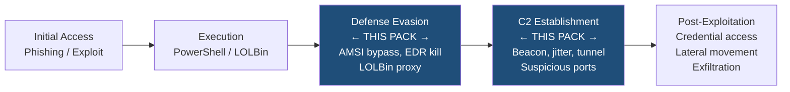
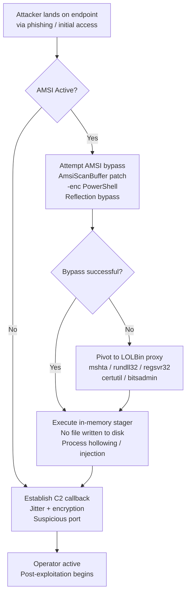
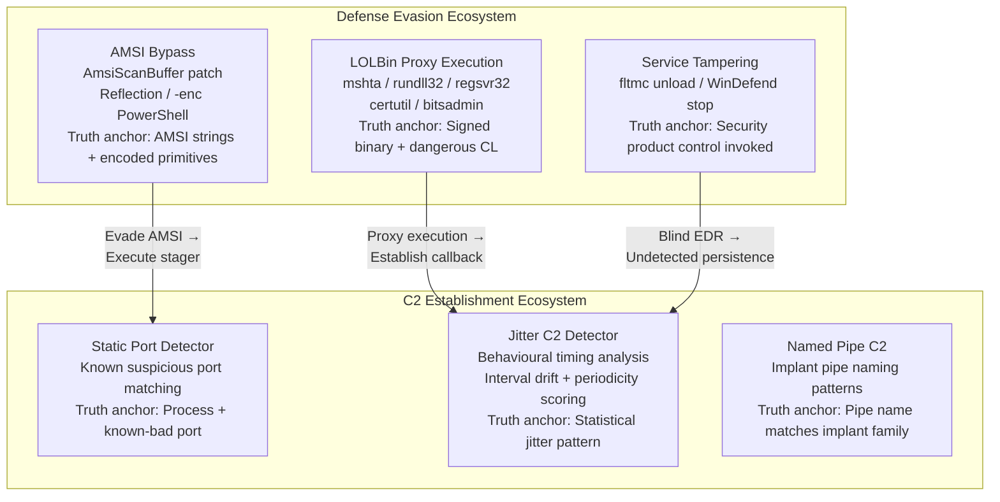
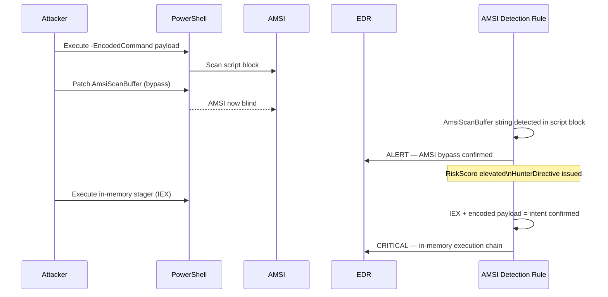
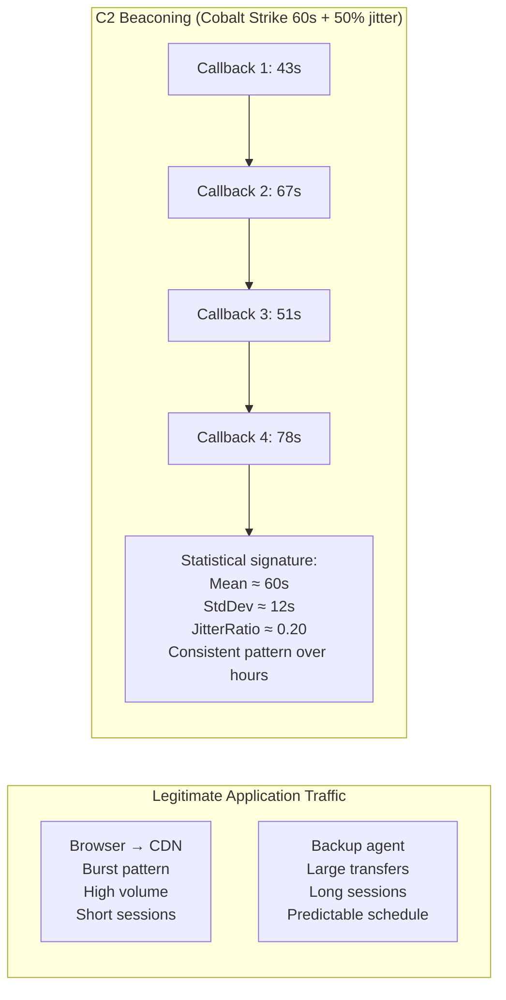
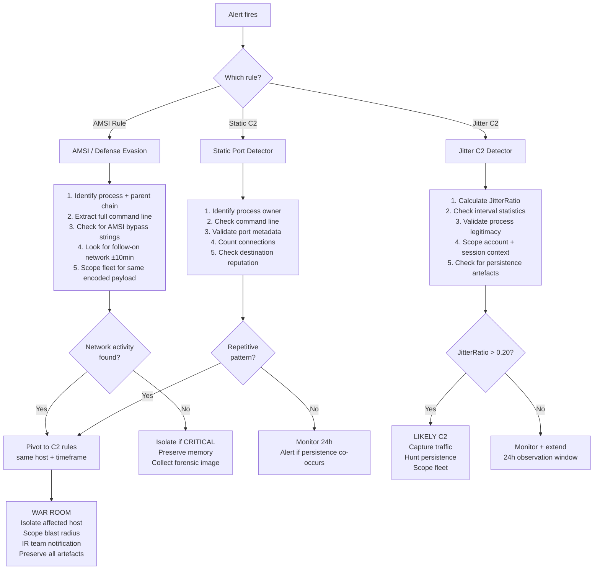

# Advanced Defense Evasion & C2 Detection Pack
### *Minimum Truth Detection Framework — Threat Research & Engineering*

**Author:** Ala Dabat | [github.com/azdabat](https://github.com/azdabat)  
**Version:** 2025-11  
**License:** [CC BY-NC-SA 4.0](https://creativecommons.org/licenses/by-nc-sa/4.0/legalcode)  
**Validated:** ADX-Docker · Empire C2 Telemetry · Atomic Red Team  

---

> *"The attacker does not announce which surface they will use.*  
> *The framework has a sensor on every surface."*

---

## Table of Contents

- [Overview & Threat Context](#overview--threat-context)
- [Attacker Methodology — The Kill Chain This Pack Targets](#attacker-methodology--the-kill-chain-this-pack-targets)
- [Cousin Surface Analysis](#cousin-surface-analysis)
- [Rule 1 — AMSI Bypass & Defense Evasion](#rule-1--amsi-bypass--defense-evasion)
- [Rule 2 — C2 Jitter Hybrid Detector](#rule-2--c2-jitter-hybrid-detector)
- [Rule 3 — Suspicious Ports Static Detector](#rule-3--suspicious-ports-static-detector)
- [Threat Hunting Matrix](#threat-hunting-matrix)
- [MITRE ATT&CK Coverage](#mitre-attck-coverage)
- [Known Threats & CVE Coverage](#known-threats--cve-coverage)
- [Analyst Workflow — Operational Runbook](#analyst-workflow--operational-runbook)
- [Detection Gaps & Roadmap](#detection-gaps--roadmap)

---

## Overview & Threat Context

This rulepack targets two of the most operationally critical intrusion stages:

```
Stage 2: Defense Evasion   →  Blind the defenders before the payload executes
Stage 3: C2 Establishment  →  Establish persistent operator communication
```

These stages are not independent. In real intrusions they overlap — the attacker evades detection
*while* establishing C2, using the same LOLBin infrastructure for both. A detection architecture
that separates them into isolated rule sets will miss the convergence.

This pack is built as an **ecosystem** — three sensors covering adjacent surfaces of the same
attacker goal, designed to fire independently and stitch together at the incident layer.

### Why These Stages Matter



If the attacker successfully completes Stage 2 and Stage 3, every subsequent stage becomes
significantly harder to detect. EDR is blinded. C2 is established. The attacker operates
with near-zero observable footprint. **This pack is the last reliable detection window before
that happens.**

---

## Attacker Methodology — The Kill Chain This Pack Targets

### Phase 1 — Defense Evasion (AMSI Bypass + LOLBin Abuse)

Modern malware does not execute raw payloads directly. Before any meaningful code runs, the
attacker must defeat the defensive layer. The standard approach:



**Key observation:** The attacker will pivot between AMSI bypass and LOLBin proxy depending on
what defensive controls they encounter. This is why the AMSI rule and the C2 rules must operate
as **cousin sensors** — same attacker goal, different execution surfaces, separate truth anchors.

### Phase 2 — C2 Establishment (Jitter + Port Abuse)

Modern C2 frameworks are purpose-built to evade detection. The primary evasion techniques:

**Sleep Jitter:** Rather than beaconing at a fixed interval (easily detectable as periodic network
traffic), frameworks like Cobalt Strike, Sliver, and Havoc apply a random jitter percentage.
A 60-second sleep with 50% jitter produces callbacks between 30–90 seconds. Across 50 implants,
no two produce identical timing signatures.

**Port Selection:** C2 operators deliberately choose ports that blend into legitimate traffic:
443 (HTTPS), 80 (HTTP), 8443 (alt HTTPS), or uncommon high ports that pass perimeter firewall
rules. Some operators tunnel C2 through legitimate services (Teams, Slack, OneDrive) entirely.

**Encryption:** All modern C2 traffic is encrypted. Simple payload inspection is ineffective.
Detection must rely on **behavioural patterns** — timing, volume, process attribution, port
metadata — not content inspection.

---

## Cousin Surface Analysis

This pack covers three cousin surfaces within the Defense Evasion + C2 ecosystem:



| Sensor | Minimum Truth Anchor | Anchoring Strategy | Noise | Tier |
|--------|---------------------|-------------------|-------|------|
| AMSI / LOLBin Rule | AMSI bypass string OR encoded execution primitive | Intent-First | Low-Medium | L2 |
| C2 Jitter Detector | Statistical jitter pattern on suspicious port from attributable process | Substrate-First + Behavioural | Low | L2.5 |
| Static Port Detector | Known suspicious port from attributable process | Intent-First | Medium | L1.5 |
| Named Pipe C2 | Pipe name matching known implant family | Substrate-First | Very Low | L2 |

---

## Rule 1 — AMSI Bypass & Defense Evasion

### Minimum Truth

An AMSI bypass string, encoded execution primitive, memory dumping primitive, or security
product control invocation occurred on a managed endpoint.

**Anchoring Strategy: Intent-First**

The execution surface (PowerShell, cmd, mshta) is common. The specific primitives within
that surface imply attacker capability. The primitive is the anchor, not the binary.

### What It Detects

| Detection Category | Technique | MITRE | Signal |
|-------------------|-----------|-------|--------|
| AMSI bypass | AmsiScanBuffer patch | T1562.001 | Bypass string in command line |
| Encoded PowerShell | Base64 stager | T1059.001 | -enc / -EncodedCommand / FromBase64String |
| LSASS dump | comsvcs.dll MiniDump | T1003.001 | comsvcs.dll + MiniDump in CL |
| LOLBin proxy | mshta / rundll32 / certutil | T1218 | Signed binary + suspicious argument |
| Service tamper | fltmc / WinDefend | T1562.001 | Security product control invoked |
| In-memory stager | IEX / VirtualAlloc | T1055 | Memory execution primitive |

### Attack Flow This Rule Interrupts



### Scoring Logic

```
BaseScore                          =  40
+ AMSI bypass string present       = +30  (AmsiScanBuffer, amsiInitFailed, AMSI.dll)
+ Encoded command primitive        = +25  (-enc, -EncodedCommand, FromBase64String)
+ Memory execution primitive       = +25  (IEX, VirtualAlloc, WriteProcessMemory)
+ LSASS/credential access          = +20  (comsvcs.dll, MiniDump, lsass)
+ LOLBin execution chain           = +20  (mshta, rundll32, certutil, bitsadmin)
+ Service tamper                   = +20  (fltmc, WinDefend, MsMpEng, Sense)
+ Suspicious parent process        = +15  (winword, excel, outlook, wscript)
+ User-writable path               = +10  (AppData, Temp, Public)
─────────────────────────────────────────
CRITICAL threshold                 = 100+
HIGH threshold                     =  75+
MEDIUM threshold                   =  50+
```

### Hunter Directive

When this rule fires:

```
CRITICAL (AMSI bypass + execution chain):
  → Validate whether AMSI is still functional on affected host
  → Pull full PowerShell script block logging for the session
  → Check for follow-on network connections within ±10 minutes
  → Scope fleet for same encoded payload hash
  → Pivot into C2 jitter rule for the same host

HIGH (LOLBin + dangerous argument):
  → Identify parent process and validate legitimacy
  → Check command-line for remote resource references
  → Validate binary signer and path
  → Hunt for file drops in writable paths within ±30 minutes

MEDIUM (Single indicator):
  → Log and monitor
  → Validate if approved automation or admin tooling
  → If not approved: escalate and scope
```

---

## Rule 2 — C2 Jitter Hybrid Detector

### Minimum Truth

A statistical jitter pattern consistent with modern C2 framework behaviour is observed from
an attributable process on a known suspicious port.

**Anchoring Strategy: Substrate-First + Behavioural**

The network connection itself is the substrate. The behavioural pattern (jitter ratio,
interval drift, periodicity) over time is the reinforcement that confirms C2 versus legitimate
application traffic. No single connection is suspicious. The pattern over time is.

### Why Jitter Detection Works

Modern C2 frameworks deliberately randomise beacon intervals to defeat periodic traffic
detection. However, this randomisation itself has a statistical signature:



**Key detection insight:** The jitter ratio — standard deviation divided by mean interval — is
consistent within a C2 framework configuration. Cobalt Strike with 50% jitter produces a
JitterRatio of approximately 0.20. Sliver's adaptive jitter produces a recognisable drift
pattern. Legitimate application traffic does not produce these consistent statistical signatures.

### C2 Framework Profiles

| Framework | Default Sleep | Jitter Range | JitterRatio | Default Ports | Detection Difficulty |
|-----------|--------------|--------------|-------------|---------------|---------------------|
| Cobalt Strike | 60s | 0–80% | 0.0–0.35 | 80, 443, 4444, 50050 | Medium |
| Sliver | Variable | Adaptive | 0.15–0.40 | 8888, 31337, custom | Medium-High |
| Havoc | 5s | Variable | 0.10–0.30 | 40056, 5040, custom | Medium |
| Brute Ratel | Variable | Low | 0.05–0.15 | Random high ports | High |
| Mythic | 10s | Variable | 0.10–0.25 | 7443, custom | Medium |
| Empire | 5s | Variable | 0.15–0.35 | 8080, 8443 | Low-Medium |
| Metasploit | 5s | Minimal | <0.10 | 4444, 8081, 7777 | Low |

### Scoring Logic

```
BaseScore (suspicious port + attributable process)   =  40
+ JitterRatio > 0.10                                 = +20
+ JitterRatio > 0.20                                 = +10 (cumulative)
+ Consistent pattern over 10+ connections            = +15
+ Process is LOLBin or unusual for network           = +15
+ Port matches known C2 framework                    = +10
+ Destination is first-seen ASN                      = +10
+ Destination is rare (<3 hosts in org)              = +10
─────────────────────────────────────────────────────────
CRITICAL: 90+  |  HIGH: 70+  |  MEDIUM: 50+
```

### Hunter Directive

```
JitterRatio > 0.20 (likely active C2):
  → Capture network traffic for affected host immediately
  → Identify parent process and validate legitimacy  
  → Check for persistence (Run keys, TaskCache, services) within ±2h
  → Scope fleet for connections to same destination IP/ASN
  → Pull process memory if EDR supports it

JitterRatio 0.10–0.20 (possible C2):
  → Monitor and extend observation window to 24h
  → Validate process legitimacy
  → Check destination reputation across TI feeds
  → Alert if persistence artefacts co-occur
```

---

## Rule 3 — Suspicious Ports Static Detector

### Minimum Truth

A process with attribution (name, PID, parent) established a network connection on a port
from the curated suspicious port feed.

**Anchoring Strategy: Intent-First**

The port alone is not the anchor — many suspicious ports carry legitimate traffic. The
combination of **port + process attribution** is the minimum truth. A browser connecting on
port 4444 is different from mshta.exe connecting on port 4444.

### Suspicious Port Categories

| Port Range | Category | Associated Threats |
|-----------|----------|--------------------|
| 4444, 8081, 7777 | Metasploit defaults | Meterpreter reverse shells |
| 50050 | Cobalt Strike team server | Operator C2 |
| 8888, 31337 | Sliver defaults | Modern red team C2 |
| 40056, 5040 | Havoc defaults | Havoc C2 framework |
| 1080, 9050 | SOCKS proxy | Proxy pivoting, Tor |
| 1194 | OpenVPN | C2 transport over VPN |
| 5985, 5986 | WinRM | Lateral movement |
| 3389 | RDP | Pivot, credential abuse |
| 2222, 7000+ | Reverse SSH | SSH tunnel C2 |
| 8080, 8443 | Alt HTTP/HTTPS | Empire, generic C2 |

### Rule Comparison — Static vs Jitter

| Capability | Static Port Rule | Jitter C2 Rule |
|-----------|-----------------|----------------|
| External suspicious port list | ✅ | ✅ |
| Process attribution | ✅ | ✅ |
| C2 detection depth | Basic | Advanced |
| Modern framework detection | Weak | Strong |
| Jitter analysis | ❌ | ✅ |
| Behavioural scoring | Limited | Extensive |
| Low-and-slow beacon detection | ❌ | ✅ |
| Fallback channel detection | ❌ | ✅ |
| Encrypted tunnel coverage | Partial | Strong |
| Analyst effort required | Low | Medium |
| False positive rate | Medium | Low |
| Best use case | Fast triage surface | DFIR pivot, APT hunting |

---

## Threat Hunting Matrix

### What These Rules Catch

| Threat Type | AMSI Rule | Static C2 | Jitter C2 | Confidence |
|-------------|-----------|-----------|-----------|------------|
| AMSI bypass (AmsiScanBuffer) | ✅ | ❌ | ❌ | HIGH |
| Encoded PowerShell stager | ✅ | ❌ | ❌ | HIGH |
| LSASS memory dump (comsvcs) | ✅ | ❌ | ❌ | HIGH |
| LOLBin stager (mshta/rundll32) | ✅ | ❌ | ❌ | MEDIUM |
| Ransomware loader download | ✅ | ✅ | ✅ | HIGH |
| Cobalt Strike beaconing | ❌ | Partial | ✅ | HIGH |
| Sliver beaconing | ❌ | Partial | ✅ | HIGH |
| Havoc C2 | ❌ | Partial | ✅ | MEDIUM |
| Brute Ratel | ❌ | ❌ | ✅ | MEDIUM |
| Reverse shells | ❌ | ✅ | ✅ | HIGH |
| Encrypted tunnels | ❌ | Partial | ✅ | MEDIUM |
| Proxy pivots (SOCKS5) | ❌ | ✅ | ✅ | MEDIUM |
| WinRM lateral movement | ❌ | ✅ | Partial | MEDIUM |

### What These Rules Do NOT Catch

| Missed Category | Reason | Mitigation |
|----------------|---------|------------|
| QUIC-based C2 | Port-hiding in QUIC multiplexing | Requires QUIC-aware telemetry |
| DNS-over-HTTPS C2 | Masquerades under HTTPS to trusted resolvers | DNS telemetry + DoH monitoring |
| ICMP-based C2 | No port involved | ICMP anomaly detection (separate rule) |
| Full in-memory implants (no network) | No outbound events | Memory scanning / ETW |
| VM guest-to-host pivoting | Not visible at OS layer | Hypervisor telemetry |
| Browser-based WASM implants | Requires HTTP header analysis | Web proxy / DLP layer |

---

## MITRE ATT&CK Coverage

```
┌────────────────────────┬──────────────────────────────┬──────────────┬────────┐
│  TACTIC                │  TECHNIQUE                   │  ID          │  RULE  │
├────────────────────────┼──────────────────────────────┼──────────────┼────────┤
│  Execution             │  PowerShell                  │  T1059.001   │  AMSI  │
│                        │  Signed Binary Proxy Exec    │  T1218       │  AMSI  │
│                        │  WMI Execution               │  T1047       │  AMSI  │
├────────────────────────┼──────────────────────────────┼──────────────┼────────┤
│  Defense Evasion       │  Disable Security Tools      │  T1562.001   │  AMSI  │
│                        │  Obfuscated/Encoded Commands │  T1027       │  AMSI  │
│                        │  Modify Registry             │  T1112       │  AMSI  │
│                        │  Masquerading                │  T1036       │  AMSI  │
├────────────────────────┼──────────────────────────────┼──────────────┼────────┤
│  Credential Access     │  LSASS Memory Dumping        │  T1003.001   │  AMSI  │
├────────────────────────┼──────────────────────────────┼──────────────┼────────┤
│  Persistence           │  Create/Modify Win Service   │  T1543.003   │  C2    │
│                        │  Boot/Logon Autostart        │  T1547       │  AMSI  │
├────────────────────────┼──────────────────────────────┼──────────────┼────────┤
│  Privilege Escalation  │  Process Injection           │  T1055       │  AMSI  │
├────────────────────────┼──────────────────────────────┼──────────────┼────────┤
│  Lateral Movement      │  WinRM (5985/5986)           │  T1021.006   │  C2    │
├────────────────────────┼──────────────────────────────┼──────────────┼────────┤
│  Command & Control     │  Application Layer Protocol  │  T1071       │  C2    │
│                        │  Encrypted Channel           │  T1573       │  C2    │
│                        │  Proxy / Tunneling           │  T1090       │  C2    │
│                        │  Fallback Channels           │  T1008       │  C2J   │
│                        │  Ingress Tool Transfer       │  T1105       │  C2    │
├────────────────────────┼──────────────────────────────┼──────────────┼────────┤
│  Exfiltration          │  Exfil Over C2 Channel       │  T1041       │  C2J   │
│                        │  Automated Exfiltration      │  T1020       │  C2J   │
├────────────────────────┼──────────────────────────────┼──────────────┼────────┤
│  Impact                │  Service Stop                │  T1489       │  AMSI  │
└────────────────────────┴──────────────────────────────┴──────────────┴────────┘
AMSI = AMSI/LOLBins Defense Evasion Rule
C2   = Suspicious Ports Static Detector
C2J  = Hybrid Jitter C2 Detector
```

---

## Known Threats & CVE Coverage

### Defense Evasion / AMSI Bypass

| Threat / CVE | Description | Rule Coverage |
|-------------|-------------|---------------|
| CVE-2023-21761 | AMSI bypass vector via reflection | AMSI Rule |
| CVE-2022-41076 | PowerShell exposed bypass path | AMSI Rule |
| Cobalt Strike AMSI bypass | AmsiScanBuffer patch in default malleable profile | AMSI Rule |
| QakBot AMSI bypass | Encoded bypass string in PowerShell dropper | AMSI Rule |
| TrickBot AMSI evasion | Multiple AMSI bypass variants in loader | AMSI Rule |

### Memory Dumping / Credential Theft

| Malware Family | Credential Technique | Rule Coverage |
|---------------|---------------------|---------------|
| Emotet | comsvcs.dll MiniDump | AMSI Rule |
| LockBit | LSASS process access | AMSI Rule |
| Hive | comsvcs-based dump | AMSI Rule |
| Conti (leaked tooling) | Multiple credential access methods | AMSI Rule |
| BlackCat / ALPHV | Custom credential harvester | Partial |

### C2 Frameworks

| Framework | Default Port | Jitter Support | Detection Rule |
|-----------|-------------|----------------|----------------|
| Cobalt Strike | 80, 443, 4444, 50050 | Yes | C2J (primary), C2 (secondary) |
| Sliver | 8888, 31337, custom | Yes (adaptive) | C2J |
| Havoc | 40056, 5040 | Yes | C2J |
| Brute Ratel | Random high ports | Low | C2J |
| Mythic | 7443, custom | Yes | C2J |
| Empire | 8080, 8443 | Yes | C2J, C2 |
| Metasploit/Meterpreter | 4444, 8081, 7777 | Minimal | C2 (primary) |

---

## Analyst Workflow — Operational Runbook



---

## Detection Gaps & Roadmap

### Current Coverage Gaps (Prioritised)

| Gap | Impact | Priority | Planned Approach |
|-----|--------|----------|-----------------|
| DNS tunnelling C2 (iodine, dnscat2) | HIGH | P1 | DNS query volume + entropy analysis |
| ICMP C2 (icmpsh, PingTunnel) | HIGH | P1 | ICMP payload anomaly detection |
| QUIC-based C2 | MEDIUM | P2 | QUIC connection metadata analysis |
| Browser-based implants (WASM) | MEDIUM | P2 | HTTP header + JS execution anomaly |
| VM guest-to-host pivoting | LOW | P3 | Hypervisor telemetry integration |
| Bluetooth/WiFi side-channel | LOW | P3 | Out of current telemetry scope |

### Cousin Rules Not Yet Built

| Cousin Surface | Minimum Truth Anchor | Status |
|---------------|---------------------|--------|
| Named Pipe C2 (Cobalt Strike default pipes) | Pipe creation matching implant naming pattern | 🔴 Planned |
| DNS Tunnelling Detector | Unusual DNS query volume + high entropy subdomains | 🔴 Planned |
| ICMP C2 Detector | ICMP payload size anomaly from non-ping process | 🔴 Planned |
| Process Hollow Detection | Remote thread creation into legitimate process | 🟡 POC |
| Encrypted Channel Baseline | TLS fingerprint (JA3) anomaly from LOLBin | 🟡 POC |

---

> [!NOTE]
> These rules are architected for logical correctness and high-fidelity signal extraction.
> Validation performed in ADX-Docker against Empire C2 telemetry and Atomic Red Team.
> Baselines, noise tuning, and allow-listing require tenant-specific telemetry context.

> [!IMPORTANT]
> Not plug-and-play. Every rule is untested without ADX-Docker validation receipts.
> This is detection engineering — not a script collection.

---

*Part of the Minimum Truth Detection Framework*  
*Author: Ala Dabat | [github.com/azdabat](https://github.com/azdabat)*  
*Licensed under [CC BY-NC-SA 4.0](https://creativecommons.org/licenses/by-nc-sa/4.0/legalcode)*
