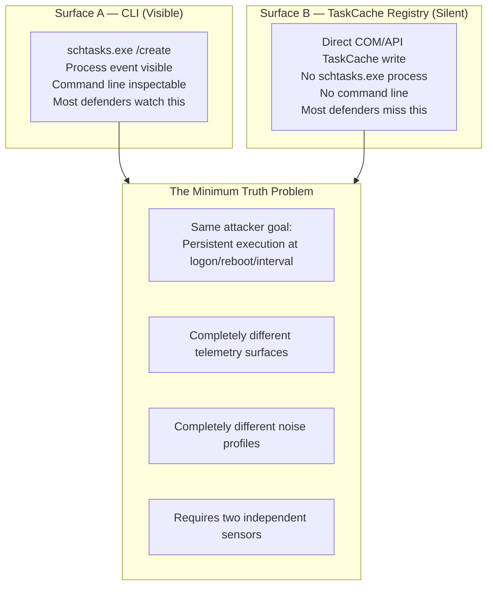
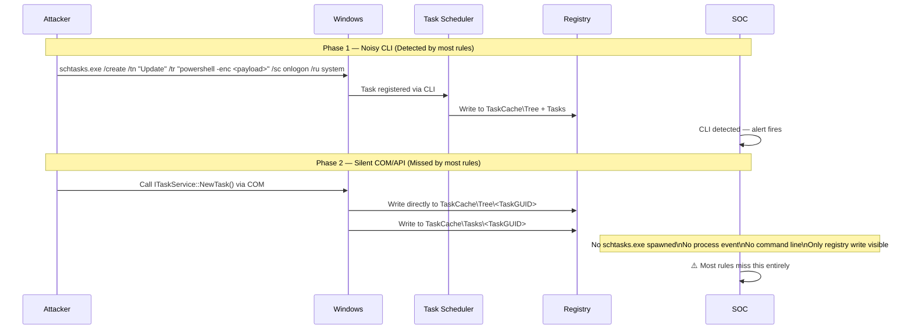
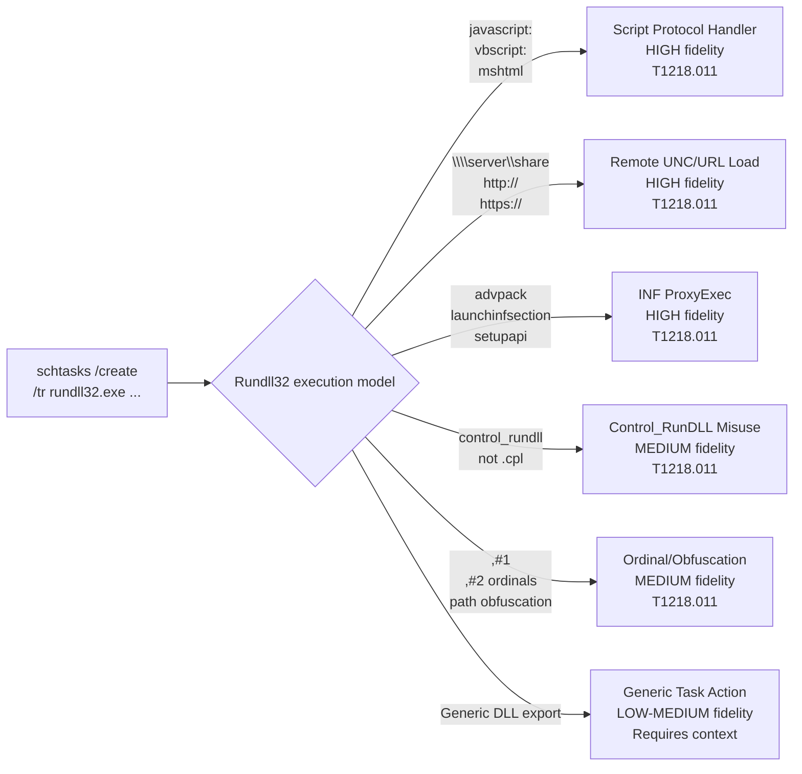
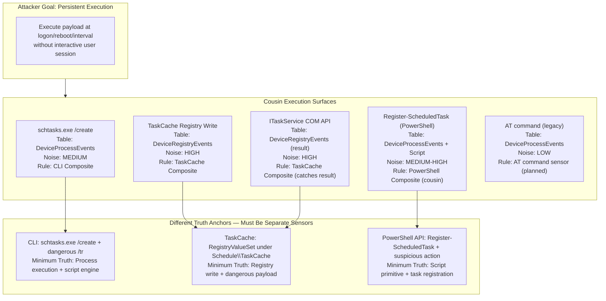
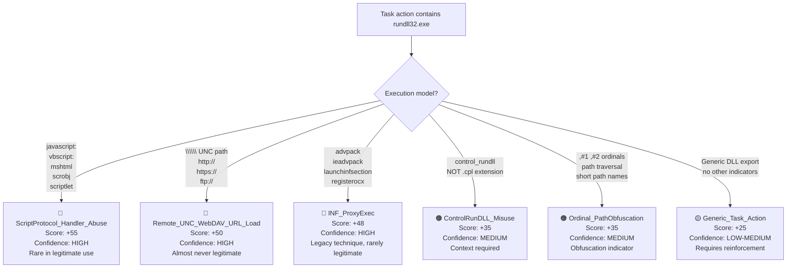
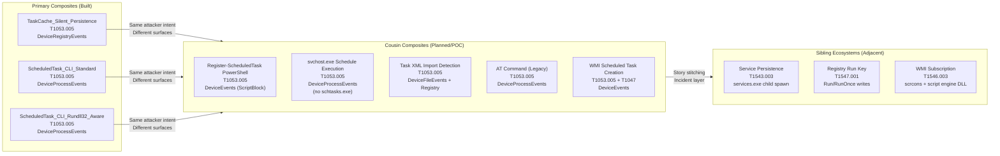
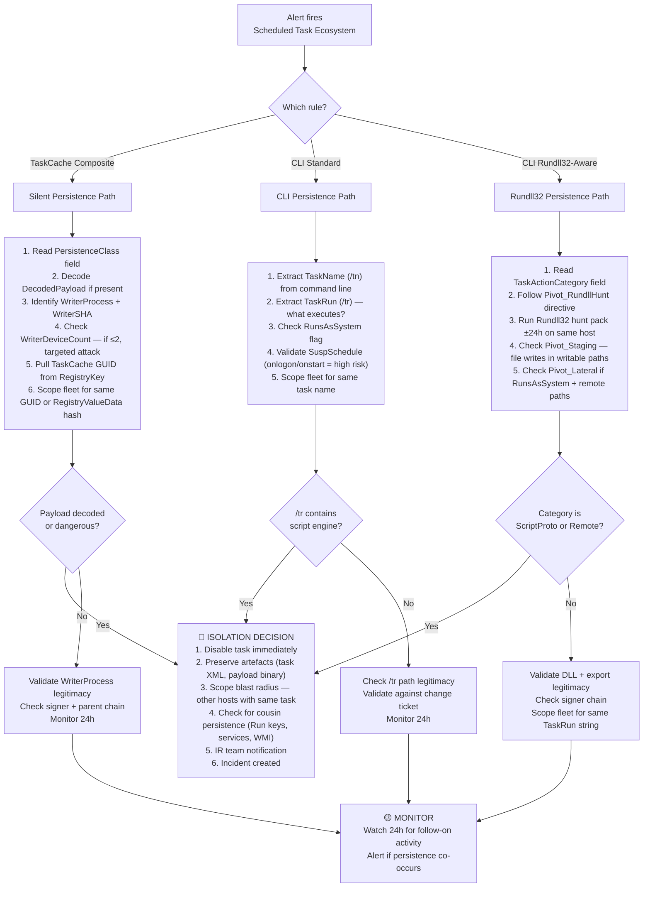
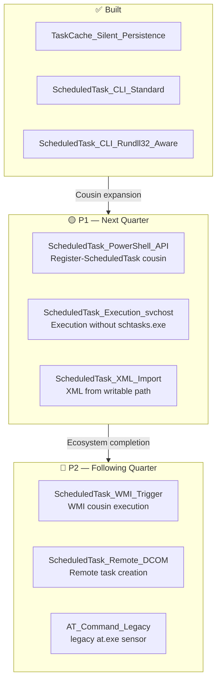

# Scheduled Task Ecosystem — Detection Pack
### *Minimum Truth Detection Framework — Threat Research & Engineering*

**Author:** Ala Dabat | [github.com/azdabat](https://github.com/azdabat)  
**Version:** 2026-01  
**License:** [CC BY-NC-SA 4.0](https://creativecommons.org/licenses/by-nc-sa/4.0/legalcode)  
**Validated:** ADX-Docker · Empire C2 Telemetry · Atomic Red Team  

---

> *"The attacker does not use schtasks.exe because they have to.*  
> *They use it because the defenders are watching the wrong surface."*

---

## Table of Contents

- [Overview & Threat Context](#overview--threat-context)
- [Attacker Methodology — How Scheduled Tasks Are Abused](#attacker-methodology--how-scheduled-tasks-are-abused)
- [The Cousin Surface Problem](#the-cousin-surface-problem)
- [Rule 1 — Registry TaskCache Silent Persistence](#rule-1--registry-taskcache-silent-persistence)
- [Rule 2 — Scheduled Task CLI Abuse (Standard)](#rule-2--scheduled-task-cli-abuse-standard)
- [Rule 3 — Scheduled Task CLI Abuse — Rundll32-Aware (Hardened)](#rule-3--scheduled-task-cli-abuse--rundll32-aware-hardened)
- [Cousin Ecosystem Map](#cousin-ecosystem-map)
- [Threat Hunting Matrix](#threat-hunting-matrix)
- [Real-World Threat Actor Attribution](#real-world-threat-actor-attribution)
- [MITRE ATT&CK Coverage](#mitre-attck-coverage)
- [Analyst Workflow — Operational Runbook](#analyst-workflow--operational-runbook)
- [Detection Gaps & Roadmap](#detection-gaps--roadmap)

---

## Overview & Threat Context

Scheduled tasks are one of the most persistent and consistently abused persistence mechanisms
in Windows environments. They have been weaponised by ransomware operators, nation-state APT
groups, commodity malware, and red teams for over a decade — and they remain effective because:

- They survive reboots without requiring service installation
- They can run as SYSTEM without privilege escalation at execution time
- They are legitimate Windows functionality — removing them from the environment is not possible
- Detection historically focused on `schtasks.exe` CLI, which sophisticated actors bypass entirely

This rulepack covers the **full scheduled task persistence ecosystem** — from the visible CLI
surface through to the completely silent TaskCache registry manipulation that bypasses all
`schtasks.exe`-based monitoring.

### The Two-Surface Problem



Sophisticated actors — Hafnium, GootLoader, LockBit, and others — deliberately use the silent
TaskCache surface precisely because enterprise SOC detection is anchored on `schtasks.exe`.
The CLI surface is a decoy. The registry surface is the real persistence.

---

## Attacker Methodology — How Scheduled Tasks Are Abused

### The Standard Attack Flow



### Why Rundll32 Integration Matters

The `schtasks.exe /tr` parameter (task run action) is where sophisticated actors embed their
execution chain. Rundll32.exe is particularly dangerous as a task action because:

1. It is a signed, trusted Windows binary — bypasses application allowlisting
2. It can execute arbitrary DLL exports, JavaScript, VBScript, and COM scriptlets
3. It can load payloads from remote UNC paths and URLs
4. Each execution model has a different noise profile requiring distinct detection



---

## The Cousin Surface Problem

This is the core architectural challenge for scheduled task detection. The same attacker goal
(persistent execution) manifests across multiple execution surfaces, each with different:
- Telemetry tables
- Noise profiles
- Truth anchors
- Allowlist strategies



**Why they cannot be merged into one rule:**

- `schtasks.exe` has SCCM/Intune/Windows Update noise requiring aggressive parent suppression
- TaskCache registry has OS maintenance noise requiring sensitivity-based gating
- Each requires a fundamentally different allowlist strategy
- Merging them produces a rule that is either too noisy to use or too restrictive to catch real attacks

---

## Rule 1 — Registry TaskCache Silent Persistence

### Minimum Truth

A registry write occurred under `Schedule\TaskCache\Tree` or `Schedule\TaskCache\Tasks`,
written by an untrusted or anomalous process, containing indicators of a dangerous payload.

**Anchoring Strategy: Substrate-First**

The TaskCache registry key is the substrate. Its existence as a write target is the minimum
truth that a scheduled task is being registered. The danger indicators (payload content,
writer identity, rarity) are reinforcement.

**Why this is substrate-first:** There is no command line to inspect. The COM API writes
directly to the registry. The only observable is the registry event itself — the substrate IS
the signal.

### The Zero-Join Architecture

This rule demonstrates the framework's core performance optimisation at scale:

```
Traditional approach (fails at enterprise scale):
  DeviceRegistryEvents
  | join DeviceProcessEvents on InitiatingProcessId  ← EXPENSIVE JOIN
  → Query timeout on 100k+ endpoint estate

Minimum Truth approach (runs in seconds):
  DeviceRegistryEvents
  | extend WriterFile = InitiatingProcessFileName    ← NATIVE FIELD, NO JOIN
  | extend WriterSHA  = InitiatingProcessSHA256      ← NATIVE FIELD, NO JOIN
  | join kind=leftouter (pre-summarised OrgPrevalence) ← SMALL TABLE JOIN ONLY
  → Full process context, zero memory pressure
```

### Scoring Matrix

| Signal | Score | Reasoning |
|--------|-------|-----------|
| Base (TaskCache write) | +55 | Registry write to TaskCache keys confirmed |
| IsTaskCache | +25 | Direct TaskCache tree/tasks key write |
| ServiceImagePathWrite | +20 | Service ImagePath manipulation |
| HasDanger (token match) | +25 | Dangerous execution primitive in payload |
| HasBase64 | +20 | Base64 encoded payload (obfuscation) |
| HasNet (URL/IP/domain) | +10 | Network indicator in payload |
| PointsWritable (writable path) | +15 | Payload path in user-writable location |
| IsLargeBlob (>500 chars) | +25 | Oversized payload (binary or script embedded) |
| UntrustedWriter | +10 | Writer not in trusted publisher list |
| WriterIsRare (≤2 devices) | +10 | Writer binary seen on ≤2 hosts in org |

```
CRITICAL: ≥120  |  HIGH: ≥90  |  MEDIUM: ≥70
```

### Engineering Fixes Applied

| Fix | Severity | Problem | Solution |
|-----|----------|---------|----------|
| FIX-1 | HIGH | Prevalence window overlap — active attack files during lookback inflated WriterDeviceCount, suppressing WriterIsRare | OrgPrevalence window ends at `ago(lookback)` |
| FIX-2 | HIGH | Null SHA256 guard — system processes with missing SHA256 scored 10 free rarity points | `isnotempty(WriterSHA)` guard added before IsRare check |
| FIX-3 | MEDIUM | base64_decode_string not guarded — invalid padding caused decode errors | `isnotempty` guard + `={0,2}` padding anchor in regex |
| FIX-4 | LOW | HunterDirective defined after project, absent from output | Moved before project, added to explicit column list |

### Hunter Directive Output

```
CRITICAL (TaskCache + dangerous payload):
  → Pull task definition via TaskCache GUID/Tree key
  → Decode payload if base64 detected (DecodedPayload field)
  → Scope fleet for same TaskCache GUID or RegistryValueData hash
  → Isolate if payload confirmed malicious
  → Check writer ancestry for initial access vector

CRITICAL (Service ImagePath + indicators):
  → Validate service name and binary path legitimacy
  → Check binary signer and hash reputation
  → Scope other hosts for same ImagePath
  → Collect binary for malware analysis

HIGH (Background persistence artefact):
  → Pivot to writer process ancestry
  → Check recent file drops at referenced path
  → Hunt fleet for same WriterSHA

MEDIUM:
  → Validate if approved updater or agent
  → If unapproved: escalate and scope
```

---

## Rule 2 — Scheduled Task CLI Abuse (Standard)

### Minimum Truth

`schtasks.exe` executed with `/create` or `/change` where the task action (`/tr`) references
a script engine or user-writable path.

**Anchoring Strategy: Intent-First**

`schtasks.exe /create` is common — SCCM, Intune, Windows Update, and legitimate software all
create scheduled tasks. The primitive is the danger in the `/tr` argument — a script engine
or writable path in the task action implies attacker capability.

### Engineering Fixes Applied

| Fix | Severity | Problem | Solution |
|-----|----------|---------|----------|
| FIX-1 | MEDIUM | Score floor gap — single signal (ScriptEngine or WritablePath alone) scored 35, below ≥40 threshold | BaseScore=10 added so gate conditions always produce ≥45 |
| FIX-2 | MEDIUM | `/f` (force flag) in HiddenTaskHints added 10 points to virtually all automated task creation including legitimate tooling | Removed `/f` — not a suspicion indicator. Retained `/rl highest`, `/it`, `/z` |
| FIX-3 | LOW | `/mo` (modifier) in SuspSchedule too broad — present in majority of legitimate task definitions | Removed standalone `/mo`. Retained specific patterns: onlogon, onstart, minute, hourly |

### Scoring Logic

```
Base (schtasks /create)              = +10
+ /tr present (HasTR)                = +15
+ Script engine in /tr               = +35
+ Writable path in /tr               = +35
+ RunsAsSystem (/ru system)          = +20
+ Suspicious schedule (onlogon etc.) = +15
+ Hidden hints (/rl highest, /it)    = +10
──────────────────────────────────────────
CRITICAL: ≥95  |  HIGH: ≥75  |  MEDIUM: ≥40
```

---

## Rule 3 — Scheduled Task CLI Abuse — Rundll32-Aware (Hardened)

### Why This Exists As A Separate Rule

The standard CLI rule catches script engines and writable paths. But `rundll32.exe` as a task
action is a distinct threat surface with five different execution models, each requiring
different detection logic and carrying different confidence levels.

A task action of `rundll32.exe javascript:...` is fundamentally different from
`rundll32.exe legit.dll,EntryPoint` — both use the same binary but the threat model is
completely different. Collapsing them into a single `rundll32 == bad` check either produces
massive false positives or misses genuine attacks.

### Rundll32 Execution Model Classification



### Hardened Detection — The Program Files Blindspot Fix

Previous versions of this rule suppressed all task actions referencing `\Program Files\` to
reduce false positives from legitimate software. This created a critical blindspot:

```
// VULNERABLE (misses Program Files attacks):
| where not(Cmd has "\\program files\\")

// HARDENED (only suppresses if NOT also script engine or rundll):
| where not(Cmd has "\\program files\\" and UsesScriptEngine == 0 and TR_IsRundll == 0)
```

An attacker who places a malicious rundll32 payload in Program Files (via prior write access
or DLL sideloading setup) would previously evade detection entirely. The hardened version
correctly surfaces this scenario.

### Hunter Directive — Structured Pivot Pack

The rule produces a structured `HunterDirective` array with explicit pivot instructions:

```
[MIN_TRUTH]  schtasks.exe /create|/change executed — task created/modified
[TASK]       TaskName | RunAs | Schedule | Modifier (extracted from command line)
[ACTION]     Category | XML | WritablePath | ScriptEngine | SYSTEM | SuspSchedule
[SCORE]      RiskScore | Severity | Base | Category | Context breakdown
[TR]         First 260 chars of task run action (truncated for readability)
[PARENT]     Initiating process + command line (truncated)
[PIVOT-1]    Rundll32 hunt pack pivot instructions (if rundll category)
[PIVOT-2]    Persistence ecosystem pivot (services, WMI, Run keys, startup)
[PIVOT-3]    Staging pivot (file writes in Temp/Public/ProgramData)
[PIVOT-4]    Lateral movement pivot (if SYSTEM + remote paths)
[NEXT]       Validation and isolation instructions
```

---

## Cousin Ecosystem Map



### Coverage by Surface

| Surface | Rule | Status | Noise Level | Priority |
|---------|------|--------|-------------|----------|
| TaskCache registry write (COM/API) | TaskCache Composite | ✅ Built | HIGH | P0 — Core |
| schtasks.exe /create (script engine) | CLI Standard | ✅ Built | MEDIUM | P0 — Core |
| schtasks.exe /create (rundll32) | CLI Rundll32-Aware | ✅ Built | MEDIUM | P0 — Core |
| Register-ScheduledTask (PowerShell) | PowerShell API Cousin | 🟡 Planned | MEDIUM-HIGH | P1 |
| svchost.exe (Schedule) child spawn | Execution cousin | 🟡 Planned | HIGH | P1 |
| Task XML import from writable path | XML Import sensor | 🔴 Planned | LOW | P2 |
| AT command (legacy) | AT sensor | 🔴 Planned | LOW | P3 |
| WMI-triggered task execution | WMI cousin | 🟡 POC | MEDIUM | P2 |

---

## Threat Hunting Matrix

### What This Ecosystem Catches

| Attack Scenario | TaskCache Rule | CLI Standard | CLI Rundll32 | Confidence |
|----------------|---------------|--------------|--------------|------------|
| Silent API task (Hafnium-style) | ✅ | ❌ | ❌ | HIGH |
| PowerShell -enc as task action | ✅ | ✅ | ❌ | HIGH |
| mshta as task action | ✅ | ✅ | ❌ | HIGH |
| rundll32 javascript: task | ✅ | Partial | ✅ | HIGH |
| rundll32 remote UNC task | ✅ | Partial | ✅ | HIGH |
| rundll32 INFProxy task | ✅ | Partial | ✅ | HIGH |
| Task running from Temp/Public | ✅ | ✅ | ✅ | HIGH |
| SYSTEM privilege task creation | ✅ | ✅ | ✅ | MEDIUM-HIGH |
| Onlogon/onstart persistence | Partial | ✅ | ✅ | MEDIUM |
| Encoded blob in TaskCache | ✅ | ❌ | ❌ | HIGH |
| Task with C2 URL in payload | ✅ | ✅ | ✅ | HIGH |
| GootLoader style persistence | ✅ | Partial | ✅ | HIGH |

### What This Ecosystem Does NOT Catch

| Gap | Reason | Planned Fix |
|-----|---------|-------------|
| Register-ScheduledTask (PowerShell API) | Different telemetry surface — no schtasks.exe | PowerShell cousin rule |
| Task registered by COM object (no registry trace) | Possible in some scenarios | ETW-based detection |
| Task modification via DCOM/RPC from remote host | Different event source | Remote task creation sensor |
| Legitimate task with later payload swap | Static analysis only | File hash monitoring on task paths |

---

## Real-World Threat Actor Attribution

### Hafnium (Nation-State APT)

**Technique:** Direct registry TaskCache manipulation for silent persistence on Exchange servers.  
**Why it works:** Exchange environments have heavy legitimate task creation. Hafnium used the
COM API to write TaskCache entries directly, leaving no `schtasks.exe` process event.  
**Detection:** TaskCache composite — `RegistryValueSet` under `Schedule\TaskCache` written by
an anomalous process with Exchange server context.

### GootLoader

**Technique:** Registry key modification for hidden execution surfaces combined with native
scheduled tasks for secondary script block triggering.  
**Pattern:** Often uses both surfaces simultaneously — silent TaskCache for primary persistence,
CLI task for backup trigger mechanism.  
**Detection:** Both TaskCache composite AND CLI composite may fire on the same entity.
Incident layer stitches on `DeviceName + AccountName` to confirm dual-surface persistence.

### LockBit (Automated Deployment)

**Technique:** Automated deployment scripts create scheduled tasks for payload execution
across the fleet before encryption begins.  
**Pattern:** Mass task creation via `schtasks.exe` with SYSTEM privilege and onstart schedule.
The volume and velocity across the fleet is a secondary signal — the task action itself is
the minimum truth.  
**Detection:** CLI Standard composite fires. Burst/radius prevalence check confirms fleet-wide
scope. Hunter Directive: scope immediately, this is ransomware preparation.

### Cobalt Strike Operators

**Technique:** Post-exploitation operators use task creation for persistence after initial
access, typically via Beacon's built-in task creation capability which wraps the COM API.  
**Pattern:** Usually creates tasks with obfuscated names, runs as SYSTEM, onlogon trigger,
with `rundll32.exe` or PowerShell as the task action.  
**Detection:** Both TaskCache composite (COM API result) and CLI Rundll32-Aware composite
may fire depending on the specific Beacon configuration and OS version.

---

## MITRE ATT&CK Coverage

```
┌────────────────────────┬──────────────────────────────────┬──────────────┬────────────────┐
│  TACTIC                │  TECHNIQUE                       │  ID          │  RULE          │
├────────────────────────┼──────────────────────────────────┼──────────────┼────────────────┤
│  Execution             │  Scheduled Task/Job              │  T1053.005   │  All three     │
│                        │  Signed Binary Proxy (rundll32)  │  T1218.011   │  CLI Rundll32  │
│                        │  PowerShell                      │  T1059.001   │  CLI Standard  │
│                        │  Windows Script Host             │  T1059.005   │  CLI Standard  │
├────────────────────────┼──────────────────────────────────┼──────────────┼────────────────┤
│  Persistence           │  Scheduled Task/Job              │  T1053.005   │  All three     │
│                        │  Boot/Logon Autostart            │  T1547       │  CLI Standard  │
├────────────────────────┼──────────────────────────────────┼──────────────┼────────────────┤
│  Privilege Escalation  │  Scheduled Task/Job              │  T1053.005   │  All three     │
│                        │  Abuse Elevation Control         │  T1548       │  CLI Standard  │
├────────────────────────┼──────────────────────────────────┼──────────────┼────────────────┤
│  Defense Evasion       │  Masquerading                    │  T1036       │  TaskCache     │
│                        │  Obfuscated Files/Info           │  T1027       │  TaskCache     │
│                        │  Signed Binary Proxy             │  T1218.011   │  CLI Rundll32  │
│                        │  INF ProxyExec                   │  T1218.011   │  CLI Rundll32  │
├────────────────────────┼──────────────────────────────────┼──────────────┼────────────────┤
│  Lateral Movement      │  Remote Scheduled Tasks          │  T1053.005   │  CLI Standard  │
└────────────────────────┴──────────────────────────────────┴──────────────┴────────────────┘
```

---

## Analyst Workflow — Operational Runbook



---

## Detection Gaps & Roadmap

### Immediate Priority Gaps

| Gap | Impact | Priority | Planned Rule |
|-----|--------|----------|-------------|
| Register-ScheduledTask via PowerShell API | HIGH | P1 | PowerShell ScriptBlock + task registration pivot |
| svchost.exe (Schedule) spawning suspicious child | HIGH | P1 | Execution cousin — no schtasks.exe required |
| Task XML import from writable path | HIGH | P1 | DeviceFileEvents + Registry correlation |
| WMI-triggered task execution | MEDIUM | P2 | WMI cousin — WmiPrvSE spawning task binary |
| Remote task creation via DCOM/RPC | MEDIUM | P2 | Network + process telemetry correlation |
| AT command (legacy environments) | LOW | P3 | at.exe child process + arguments |

### Cousin Ecosystem Expansion Roadmap



---

> [!NOTE]
> These rules are architected for logical correctness and high-fidelity signal extraction.
> Validation performed in ADX-Docker against Empire C2 telemetry and Atomic Red Team.
> Baselines, noise tuning, and allow-listing require tenant-specific telemetry context.

> [!IMPORTANT]
> **Engineering integrity:** All fixes are documented with severity ratings (HIGH/MEDIUM/LOW)
> and full explanations of the original bug and the applied solution. This is a record of
> engineering work — not a static rule collection. Every fix represents a real detection gap
> that was discovered during ADX-Docker validation.

---

*Part of the Minimum Truth Detection Framework*  
*Author: Ala Dabat | [github.com/azdabat](https://github.com/azdabat)*  
*Licensed under [CC BY-NC-SA 4.0](https://creativecommons.org/licenses/by-nc-sa/4.0/legalcode)*
