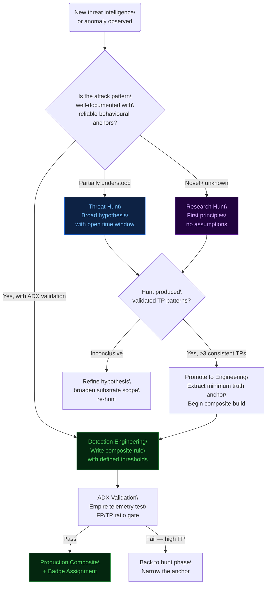
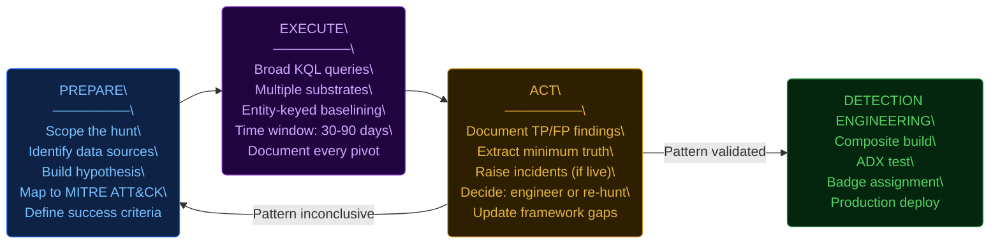
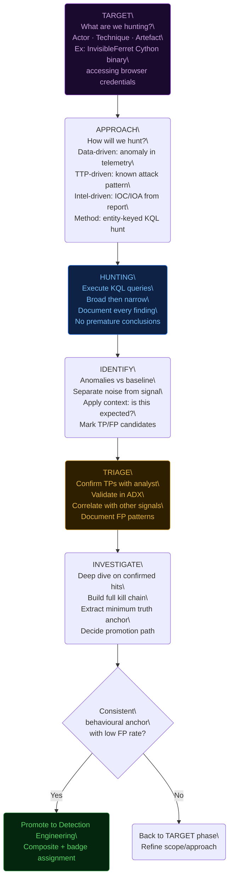
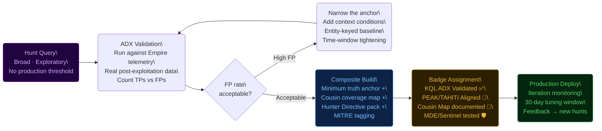
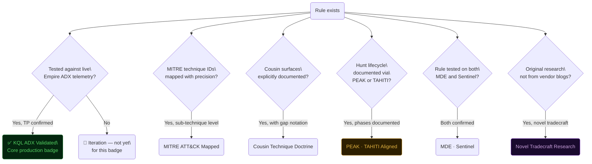
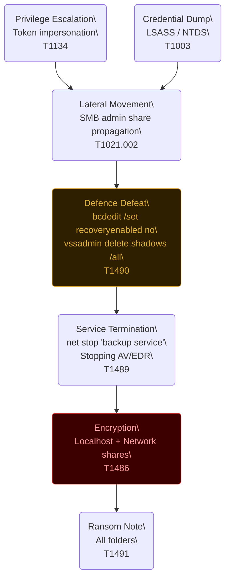
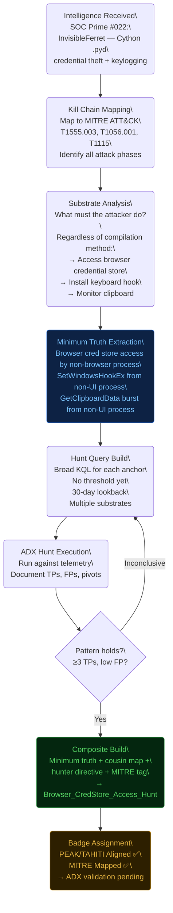
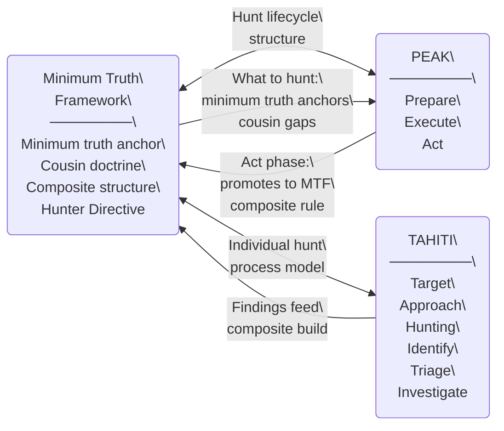
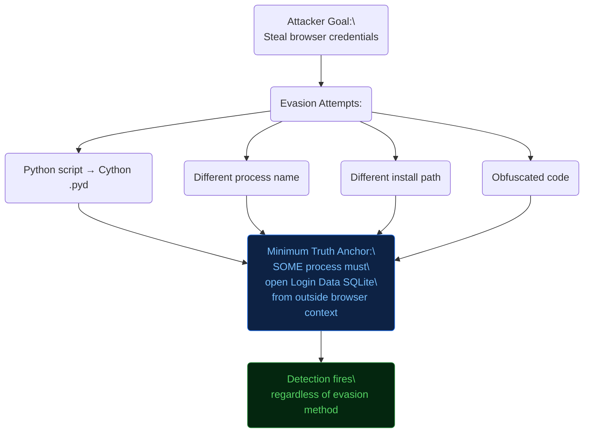

# Threat Hunting vs Detection Engineering
## A Methodological Framework — PEAK · TAHITI · Minimum Truth Integration
### Ala Dabat | azdabat | Minimum Truth Detection Framework

---

> *"A hunt is a question. A rule is a settled answer. Know which you're writing before you open your editor."*

---

## 01 · The Core Distinction

These are two fundamentally different disciplines that feed each other. Conflating them produces rules that are too broad to be useful in production, and hunts that are too narrow to find anything new.

| Dimension | Threat Hunting | Detection Engineering |
|---|---|---|
| **Mode** | Exploratory, hypothesis-driven | Codified, alert-generating |
| **Output** | Findings, pivot leads, validated patterns | Deployed rules with tuned thresholds |
| **Time window** | Broad — days, weeks, months | Continuous — real-time |
| **False positive tolerance** | High — analyst triages manually | Low — every alert costs analyst time |
| **Who runs it** | Analyst with domain expertise | Automated SIEM/XDR pipeline |
| **What it produces** | Hypotheses → validated IOAs | Composites → production alerts |
| **Tuning loop** | Fast iteration, pivot freely | Structured gate before promotion |
| **Framework role** | Discovers minimum truth | Codifies minimum truth |

The pipeline flows in one direction:

```
HUNT → VALIDATE → ENGINEER → COMPOSITE → PRODUCTION → HUNT (feedback)
```

The feedback loop closes when production rules surface new anomalies that inspire new hunt hypotheses. Neither discipline exists in isolation.

---

## 02 · When to Hunt vs When to Engineer

The decision is not about rule complexity — it is about **confidence in the pattern**.



### The three entry points:

**1. Known threat, documented technique** → Write the rule. You know what you're looking for. Start with the minimum truth anchor and build the composite. Hunt phase is already implicit in the prior research.

**2. Observed anomaly, unclear pattern** → Hunt first. Broad KQL, wide time window, manual triage. Extract the consistent behavioural anchor from confirmed TPs. Then engineer.

**3. Novel/emerging threat** → Research hunt. No prior behavioural model. Build the kill chain hypothesis from first principles (actor TTPs, malware analysis, vendor reporting). Validate in ADX. Then engineer if pattern holds.

---

## 03 · PEAK Methodology Applied to MTF

PEAK (**P**repare, **E**xecute, **A**ct) is the structural lifecycle for organised threat hunting. Applied to MTF:



### PEAK applied to a real scenario — hunting for WantToCry-style network share encryption:

**PREPARE:**
- Hypothesis: *"An attacker may be encrypting files via SMB writes from a single remote host, evading local process monitoring"*
- Data source: `DeviceNetworkEvents`, `FileEvents` where remote write origin is logged
- MITRE: T1486, T1570
- Success criteria: Identify 3+ hosts showing mass SMB write velocity with uniform extension change from a single source IP

**EXECUTE:**
```kql
// Broad hunt — look for mass file rename via network path
DeviceFileEvents
| where Timestamp > ago(90d)
| where ActionType in ("FileRenamed","FileCreated")
| where FolderPath startswith "\\\\"  // network path
| summarize FileCount = count(), 
            Extensions = make_set(tolower(tostring(split(FileName,".")[-1])))
  by DeviceName, InitiatingProcessRemoteIP, bin(Timestamp, 1h)
| where FileCount > 500
| where array_length(Extensions) < 3  // uniformity check
```

**ACT:**
- If confirmed: extract the minimum truth anchor (SMB write velocity + extension uniformity from remote IP)
- Raise incident if live
- Promote to `SMB_NetworkShare_EncryptionVelocity` composite

---

## 04 · TAHITI Process Applied to MTF

TAHITI (**T**arget, **A**pproach, **H**unting, **I**dentify, **T**riage, **I**nvestigate) is the structured process model for individual hunt execution.



### TAHITI applied — hunting InvisibleFerret (Void Dokkaebi):

| Phase | Applied Action |
|---|---|
| **Target** | Cython-compiled Python malware accessing browser credential stores; credential theft without Python script artefacts |
| **Approach** | Intel-driven: SOC Prime #022 + Void Dokkaebi research; anchor on credential store file access from non-browser processes |
| **Hunting** | KQL: DeviceFileEvents where FileName == "Login Data" AND InitiatingProcessFileName not in ("chrome.exe","msedge.exe","firefox.exe","brave.exe") |
| **Identify** | Flag processes accessing Login Data outside browser context; cross-reference with SetWindowsHookEx API calls (T1056.001) |
| **Triage** | Confirm: is this a backup tool, AV scan, or legitimate? Use process tree context, parent-child chain |
| **Investigate** | Confirmed non-browser access: extract process name, parent chain, network connections, loaded modules |

---

## 05 · The Hunt-to-Composite Pipeline

This is the formal gate system for promoting a hunt finding into a production composite rule. The MTF requires each rule to clear this pipeline before receiving a validated badge.



### Promotion criteria:

| Criterion | Requirement |
|---|---|
| Minimum truth isolation | The anchor is the behaviour that must occur regardless of evasion method |
| ADX TP confirmation | ≥3 confirmed TPs on distinct attack scenarios |
| FP characterisation | Known FP patterns documented and filtered |
| Cousin map | Adjacent substrates mapped; gaps explicitly noted |
| Hunter Directive | Triage steps, pivot queries, and IR escalation path included |
| Dual platform | KQL tested against both MDE and Sentinel schemas |

---

## 06 · Badge Criteria — What Goes Where and Why

The six badges on the framework represent production quality gates. Here is the decision logic for each:



### Badge assignment in practice:

**Most novel threats start at: `PEAK · TAHITI Aligned` + `MITRE ATT&CK Mapped`**

The reasoning:
- You've done the TAHITI process (Target, Approach, Hunt, Identify, Triage, Investigate)
- You've mapped to MITRE ATT&CK during the Target phase
- The rule is not yet ADX-validated (requires Empire telemetry test)
- The rule may not yet be dual-platform

Once the ADX test passes: add `✅ KQL ADX Validated`.
Once both MDE and Sentinel schemas are confirmed: add `MDE · Sentinel`.
Once cousin map is documented: add `Cousin Technique Doctrine`.
If original research: add `Novel Tradecraft Research`.

**The full badge set means the rule is production-grade.**

---

## 07 · Practical Hunt Playbooks

### Hunt 01 — LockBit Indicators Hunt

**Context:** LockBit uses a well-documented pre-encryption playbook. The hunt looks for the convergence of its preparation behaviours rather than any single IOC.

**TAHITI Target:** Pre-encryption preparation — privilege escalation, VSS deletion, service termination, and self-propagation via admin shares.



**KQL Hunt — Pre-Encryption Convergence:**
```kql
let lookback = 30d;
let CandidateDevices =
    // Signal 1: VSS deletion attempt
    DeviceProcessEvents
    | where Timestamp > ago(lookback)
    | where ProcessCommandLine has_any ("delete shadows", "shadowcopy delete", "vssadmin delete")
    | project DeviceName, VSSTime = Timestamp;

let ServiceKillDevices =
    // Signal 2: Backup/AV service termination
    DeviceProcessEvents
    | where Timestamp > ago(lookback)
    | where ProcessCommandLine has_any ("net stop", "sc stop")
       and ProcessCommandLine has_any ("vss","backup","sql","Exchange","DefWatch","ccEvtMgr","SavRoam","sqlserv","sqlagent","sqladhlp","Culserver","RTVscan","RANSOMWARE_DECOY")
    | project DeviceName, KillTime = Timestamp;

let BCDEditDevices =
    // Signal 3: Recovery disabled
    DeviceProcessEvents
    | where Timestamp > ago(lookback)
    | where ProcessCommandLine has_all ("bcdedit","/set") and ProcessCommandLine has "off"
    | project DeviceName, BCDTime = Timestamp;

// Convergence: devices showing all three signals within 24h
CandidateDevices
| join kind=inner ServiceKillDevices on DeviceName
| join kind=inner BCDEditDevices on DeviceName
| where abs(datetime_diff('hour', VSSTime, KillTime)) < 24
| where abs(datetime_diff('hour', VSSTime, BCDTime)) < 24
| project DeviceName, VSSTime, KillTime, BCDTime
| extend Alert = "⚠ PRE-ENCRYPTION CONVERGENCE — LockBit pattern"
```

**What this catches:** The pre-encryption preparation phase — the window before files are actually encrypted. This is the maximum-value detection point: the attacker has compromised the host but not yet destroyed data.

---

### Hunt 02 — Permission Exposure Hunt

**Context:** Overly permissive ACLs on sensitive paths are a pre-attack condition. This is an exposure hunt, not an active attack hunt — but it identifies the attack surface before it is exploited.

**TAHITI Target:** File system objects with Everyone/Authenticated Users write access in sensitive paths (system directories, credential stores, service binary paths).

```kql
// Hunt for writeable sensitive paths — permission exposure
// Note: Requires DeviceFileEvents + file permission data (Defender for Endpoint ATP)
let SensitivePaths = dynamic([
    "C:\\Windows\\System32",
    "C:\\Program Files",
    "C:\\ProgramData\\Microsoft",
    "C:\\Windows\\SysWOW64"
]);

// Approach: look for file modifications in sensitive paths by non-elevated processes
DeviceFileEvents
| where Timestamp > ago(30d)
| where ActionType in ("FileCreated", "FileModified")
| where FolderPath has_any (SensitivePaths)
| where InitiatingProcessIntegrityLevel !in ("High", "System")  // non-elevated write
| where InitiatingProcessFileName !in ("MsMpEng.exe","svchost.exe","TiWorker.exe","wuauclt.exe")
| summarize WriteCount = count(), 
            Processes = make_set(InitiatingProcessFileName),
            SamplePaths = make_set(FolderPath, 5)
  by DeviceName, InitiatingProcessAccountName
| where WriteCount > 5
| extend Alert = "⚠ Non-elevated write to sensitive path"
| order by WriteCount desc
```

**Operational note:** This hunt complements but is distinct from the UAC bypass rule. The UAC bypass rule looks for registry manipulation to gain elevation; this hunt looks for the permission condition that would make a UAC bypass unnecessary.

---

### Hunt 03 — File Share Exposure Hunt

**Context:** Network shares with excessive access permissions are a lateral movement and data exfiltration pre-condition. This is the attack surface that WantToCry-style ransomware exploits.

**TAHITI Target:** Network shares accessible by Everyone, Domain Users, or Authenticated Users — particularly shares containing sensitive content.

```kql
// Hunt for anomalous access to network shares — potential exposure
// Covers both enumeration and high-volume access patterns
let lookback = 14d;

DeviceNetworkEvents
| where Timestamp > ago(lookback)
| where RemotePort == 445  // SMB
| summarize
    ShareAccessCount = count(),
    UniqueRemoteIPs = dcount(RemoteIP),
    UniqueLocalPorts = dcount(LocalPort)
  by DeviceName, LocalIP
| where UniqueRemoteIPs > 20 or ShareAccessCount > 5000
| extend Alert = "⚠ Anomalous SMB share access volume — potential enumeration or exfil precursor"
| order by ShareAccessCount desc
```

**Hunting companion — find sensitive data in shares:**
```kql
// Look for access to files with sensitive naming patterns on network paths
DeviceFileEvents
| where Timestamp > ago(30d)
| where FolderPath startswith "\\\\"  // network path
| where FileName has_any (
    "password","passwd","credentials","creds","secret","private_key",
    "backup","database","salary","payroll","confidential"
)
| extend Extension = tostring(split(FileName,".")[-1])
| summarize FileCount = count(), 
            SensitiveFiles = make_set(FileName, 10),
            AccessingProcesses = make_set(InitiatingProcessFileName)
  by DeviceName, FolderPath
| order by FileCount desc
```

---

### Hunt 04 — Password File Exposure Hunt (password.xls and friends)

**Context:** Users storing passwords in plaintext files is a persistent credential exposure condition. Attackers with any foothold will hunt for these. This is a proactive hunt to find them first.

**TAHITI Target:** Files with names indicative of stored credentials — password.xls, credentials.txt, creds.csv, etc. — in user profile paths and shared directories.

```kql
// Hunt for password/credential files created or accessed
// Catches both the creation (misconfiguration) and the access (attacker hunting)
let lookback = 30d;

// Hunt 1: Find the files themselves
DeviceFileEvents
| where Timestamp > ago(lookback)
| where ActionType in ("FileCreated","FileModified","FileRenamed")
| where FileName matches regex @"(?i)(password|passwd|creds?|credentials?|secret|login|vault|keystore|private[\-_]?key).*\.(xlsx?|csv|txt|doc[x]?|pdf|json|xml|ini|cfg|conf|kdbx)"
| project Timestamp, DeviceName, FileName, FolderPath, InitiatingProcessFileName, 
          InitiatingProcessAccountName, InitiatingProcessCommandLine
| extend Alert = "⚠ Credential file created/modified — exposure risk"
| order by Timestamp desc

// Hunt 2: Find processes accessing these files (attacker hunting for them)
// Run as separate query
DeviceFileEvents
| where Timestamp > ago(lookback)
| where ActionType in ("FileRead","FileAccessed")
| where FileName matches regex @"(?i)(password|passwd|cred|secret|login|vault).*\.(xlsx?|csv|txt|docx?)"
| where InitiatingProcessFileName !in ("EXCEL.EXE","WINWORD.EXE","notepad.exe","Code.exe","explorer.exe")
| project Timestamp, DeviceName, FileName, FolderPath, InitiatingProcessFileName,
          InitiatingProcessCommandLine, InitiatingProcessAccountName
| extend Alert = "⚠ Credential file accessed by non-standard process — potential harvesting"
| order by Timestamp desc
```

**What makes this a hunt (not a rule):** The file names are too variable for a reliable production rule with low FP. Hunt mode allows broad regex matching with manual triage. Once the environment's legitimate patterns are understood (backup scripts that open credentials.txt, etc.), a narrower production rule can be scoped.

**Promotion path:** After hunting and documenting FP patterns, `Credential_Keyword_Hunt` becomes the scoped production rule with documented FP exceptions.

---

### Hunt 05 — Novel Threat Onboarding (InvisibleFerret Pattern)

**Context:** When a novel threat emerges from intelligence reporting (e.g., SOC Prime newsletter, vendor blog, CERT-UA advisory), this is the standard onboarding workflow.



**Onboarding checklist for any novel threat:**

- [ ] Map attack phases to MITRE ATT&CK at sub-technique level
- [ ] Identify minimum truth anchor(s) — what must occur regardless of evasion
- [ ] Identify cousin substrates — same intent, different execution
- [ ] Write TAHITI documentation (Target → Investigate)
- [ ] Write broad hunt query (no threshold, 30-day lookback)
- [ ] Execute against ADX telemetry; document findings
- [ ] If ≥3 TPs: promote to composite with hunter directive
- [ ] Assign initial badges: MITRE Mapped + PEAK/TAHITI Aligned
- [ ] ADX validation: add KQL ADX Validated badge on pass
- [ ] Dual platform: add MDE · Sentinel badge on confirmation

---

## 08 · How the MTF Relates to PEAK and TAHITI



**The relationship in plain terms:**

- **PEAK** governs the *lifecycle* of a hunting engagement — the project-level view. Did we prepare properly? Did we execute with rigour? Did we act on findings?
- **TAHITI** governs the *process* of individual hunt execution — the analyst-level view. Do we have a clear target? Are we approaching it correctly? Have we investigated thoroughly?
- **MTF** governs the *content* of what gets produced — the engineering output. What is the minimum truth? What are the cousin surfaces? What is the composite structure?

You need all three. PEAK and TAHITI without MTF produce well-organised hunts that generate ad-hoc rules with no doctrine. MTF without PEAK/TAHITI produces well-structured rules with no systematic discovery process.

**The core of everything** is the minimum truth anchor. PEAK and TAHITI are the operational methodology for finding it. MTF is the doctrine for codifying and scaling it.

---

## 09 · The Minimum Truth Doctrine — Core of Everything

The framework's architectural insight is that **every detection must be anchored on behaviour that is invariant to evasion**. Not file hashes, not process names, not command-line strings that can be obfuscated — but the *action* that must occur.



### The three questions for every rule:

1. **What is the minimum truth?** The single action that cannot be avoided. If the attacker doesn't do this, the attack doesn't work. This is your rule anchor.

2. **What are the cousin substrates?** The same attack intent executed on different surfaces. Map these explicitly. Every unmapped cousin is a free pivot for the attacker.

3. **What is the hunter directive?** When this rule fires, what does the analyst do? Where do they pivot? What confirms a TP vs FP? The rule is not complete without this.

---

## 10 · Rule Quality Rubric

Use this rubric before promoting any rule to production:

| Quality Check | Question | Pass Criteria |
|---|---|---|
| **Anchor clarity** | Can you state the minimum truth in one sentence? | Yes, clearly |
| **Evasion resistance** | Does the anchor hold if process name/hash/path is changed? | Yes — behaviour-first |
| **FP characterisation** | Do you know what legitimate activity looks like? | Documented FP exceptions |
| **Cousin coverage** | Are adjacent substrates mapped and gaps noted? | Cousin map present |
| **Dual-platform** | Does the KQL work in both MDE and Sentinel schemas? | Tested on both |
| **Hunter Directive** | Does the rule tell the analyst what to do next? | Steps documented |
| **ADX validation** | Has the rule fired on real adversary telemetry? | Empire test confirmed |
| **Temporal defeat** | If the attacker delays for 30 days, does the rule still fire? | Entity-keyed baseline |

---

*The framework is your doctrine. PEAK is your project lifecycle. TAHITI is your hunt process. The rules are the settled science — until the next threat forces a new hunt.*

---

**Repository:** github.com/azdabat | **Framework:** Minimum Truth Detection Framework  
**Author:** Ala Dabat | **Methodology alignment:** PEAK · TAHITI · MITRE ATT&CK  
**License:** CC BY-NC-SA 4.0
